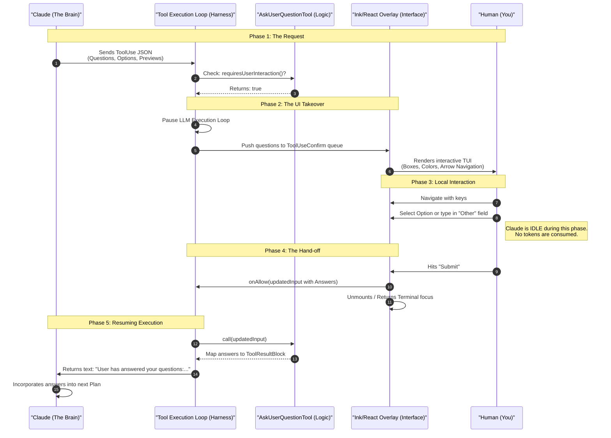
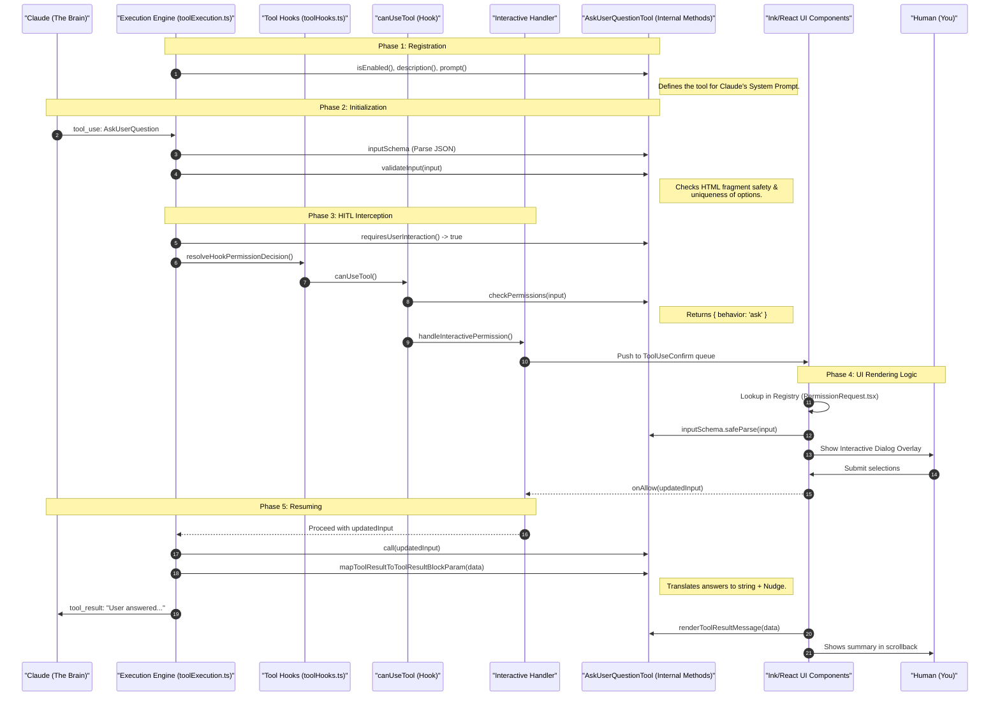

Human-in-the-Loop (HITL) is the specialized orchestration layer that enables Claude Code to transition seamlessly from autonomous execution to collaborative decision-making. Rather than operating as a "black box," Claude Code is designed to pause its execution loop and consult the user whenever it encounters technical ambiguity, high-risk operations, or significant architectural choices.

### The User Experience: Interactive Decision Points
When Claude Code requires input, the terminal interface shifts from a scrolling log to an interactive **Terminal UI (TUI) overlay**. Users are presented with structured dialogs, multiple-choice menus, and side-by-side code previews. This experience is designed to be frictionless: you can navigate options with arrow keys, select choices with a single stroke, or provide custom "Other" feedback to guide the agent's reasoning. Once you submit your choice, the TUI unmounts, and the agent immediately resumes its task with the new context integrated into its mental model.

### When to Expect an Interaction
A user can expect Claude Code to "tap them on the shoulder" in three primary scenarios:
1.  **Ambiguity & Requirements:** When the initial instruction is underspecified or when a research step reveals multiple conflicting implementation paths (e.g., "Which database library should I use?").
2.  **Safety & High Blast Radius:** Before taking actions that are hard to reverse or affect shared systems, such as pushing code to a remote repository, deleting branches, or modifying sensitive environment configurations.
3.  **Collaborative Judgment:** When the agent spots a better alternative to a user's request or identifies a bug adjacent to its current task, it will pause to offer its judgment as a senior peer engineer.

This document provides a comprehensive technical analysis of the underlying mechanics—from prompt nudges to state persistence—that make this collaborative experience possible.

## 1. Architectural Philosophy: The "Boss & Secretary" Model

The system follows a strict separation of **Logic (LLM)** and **Interface (System Harness)** to ensure cost efficiency, security, and a clean user experience.

*   **The Boss (Claude/LLM):** 
    *   **Role:** Acts as the high-level orchestrator and decision-maker. It decides *what* to ask and *when* to ask it based on its current plan or ambiguity in the task.
    *   **Perception:** It operates purely on JSON. It never "sees" the UI, colors, or terminal boxes. 
    *   **State:** It is completely idle and consumes no tokens while the user is interacting with the TUI. It only "wakes up" when the system harness provides the final tool result.
*   **The Secretary (System Harness):** 
    *   **Role:** Intercepts the LLM's request, manages the interactive terminal UI (TUI), and handles user input locally.
    *   **Security:** It validates the LLM's input (e.g., checking HTML fragments for safety) before presenting it to the user.
    *   **Translation:** It "translates" the final user interaction back into a concise JSON string (often with an added "nudge" to keep the LLM on track) that the Boss can consume.

## 2. Interactive Tools (requiresUserInteraction = true)

In the current codebase, only a few tools are permitted to break the autonomous execution loop by returning `true` for `requiresUserInteraction()`. These are high-stakes "gatekeeper" tools:

1.  **`AskUserQuestionTool`**: The primary tool for gathering requirements, resolving ambiguity, and offering choices.
2.  **`ExitPlanModeV2Tool`**: Used to present a finalized plan to the user for approval before execution begins.
3.  **`ReviewArtifactTool`**: (Note: Architecturally defined but currently disabled/handled via generic bridge flows in the latest version).

Tools like `BashTool` or `FileWriteTool` do **not** have `requiresUserInteraction` set to `true` by default. Instead, their execution is guarded by the **Permission Hook** system (`canUseTool`), which may choose to trigger a HITL dialog based on the user's `permissionMode` (e.g., `ask` mode).

### Invocation Rights for Interactive Tools
In the Claude Code architecture, **only the Head Agent (the main LLM you are conversing with) can invoke these interactive tools.** 
*   **Worker Agents / Sub-agents:** In multi-agent or swarm scenarios (e.g., `batch` or `remote` tasks), worker agents are explicitly forbidden from calling `AskUserQuestion`. If a worker agent needs clarification, it must report the issue back to the Head Agent, which then decides whether to consult the human. This prevents UI race conditions and ensures the human always has a single, coherent point of contact.

## 3. High-Level Execution Lifecycle

The following diagram illustrates the end-to-end flow from the initial LLM decision to the resumption of execution.



## 4. Nudges and Triggers: How the Agent Decides to Pause

The Head Agent's decision to involve a human is governed by a set of sophisticated "nudges" embedded in its core system instructions. These define the boundaries of its autonomy and the thresholds for escalation.

### A. The "Ambiguity" Threshold
The agent is instructed to be a proactive problem-solver, but it is explicitly nudged to pause when instructions are generic or unclear. It should try to "investigate" (read files, search code) to resolve ambiguity itself, and only call the human when the investigation fails to produce a clear path.

Referenced from `src/constants/prompts.ts`:
```typescript
`If an approach fails, diagnose why before switching tactics—read the error, check your assumptions, try a focused fix. Don't retry the identical action blindly, but don't abandon a viable approach after a single failure either. Escalate to the user with ${ASK_USER_QUESTION_TOOL_NAME} only when you're genuinely stuck after investigation, not as a first response to friction.`
```

### B. The "Risk & Blast Radius" Protocol
The agent evaluates the reversibility and impact of its actions. High-stakes actions trigger a mandatory HITL pause.

Referenced from `src/constants/prompts.ts`:
```typescript
Carefully consider the reversibility and blast radius of actions. Generally you can freely take local, reversible actions like editing files or running tests. But for actions that are hard to reverse, affect shared systems beyond your local environment, or could otherwise be risky or destructive, check with the user before proceeding...
```

**Specific Triggers include:**
*   **Destructive:** Deleting files/branches, `rm -rf`, killing processes, overwriting uncommitted changes.
*   **Hard-to-Reverse:** `git push`, `git reset --hard`, force-pushing, modifying CI/CD pipelines, downgrading dependencies.
*   **Visible/Shared:** Sending Slack messages, creating/commenting on PRs, posting to external services (Gists, Pastebins).

### C. The "Permission Denied" Recovery
If a tool call is rejected by the user, the agent is nudged to seek the reason rather than retrying blindly. This prevents infinite retry loops and forces a collaborative resolution to permission blockers.

Referenced from `src/constants/prompts.ts`:
```typescript
const items = [
  hasAskUserQuestionTool
    ? `If you do not understand why the user has denied a tool call, use the ${ASK_USER_QUESTION_TOOL_NAME} to ask them.`
    : null,
  getIsNonInteractiveSession()
```

### D. Collaborative Judgment (The "Partner" Nudge)
The agent is instructed to act as a senior peer/collaborator, not just an executor. This nudges the agent to use `AskUserQuestion` to offer better alternatives or correct a user's potentially harmful implementation choice.

Referenced from `src/constants/prompts.ts`:
```typescript
// @[MODEL LAUNCH]: capy v8 assertiveness counterweight (PR #24302) — un-gate once validated on external via A/B
...(process.env.USER_TYPE === 'ant'
  ? [
      `If you notice the user's request is based on a misconception, or spot a bug adjacent to what they asked about, say so. You're a collaborator, not just an executor—users benefit from your judgment, not just your compliance.`,
    ]
  : []),
```

### Summary of Triggers

| Category | Trigger | Agent Behavior |
| :--- | :--- | :--- |
| **Safety** | High Blast Radius / Irreversible | Pauses for confirmation (HITL). |
| **Clarity** | Ambiguous Goal / Stuck | Uses `AskUserQuestion` to gather requirements. |
| **Correction** | Misconception / Better Path | Suggests alternatives via `AskUserQuestion`. |
| **Conflict** | Tool Call Denied | Asks for the reason behind the denial. |

## 5. AskUserQuestionTool Parameter Schema

The tool enforces a strict structure via Zod to ensure the UI can reliably render the questions.

### Root Parameters
*   **`questions`** (Array of `Question Objects`, 1-4 items): A list of question objects to ask in a single dialog.
*   **`answers`** (Optional Record): Internally used to store the user's responses after the interaction.
*   **`metadata`** (Optional): Used for tracking the source of the question (e.g., `/remember` command).

### Object Schema for `Question` (nested inside `questions`)

| Parameter | Type | Description |
| :--- | :--- | :--- |
| **`question`** | `string` | The full question text (e.g., "Which port should the server use?"). |
| **`header`** | `string` | A short label (max 12 chars) for the UI chip (e.g., "Port"). |
| **`multiSelect`** | `boolean` | If `true`, the user can select multiple options. |
| **`options`** | `Array` | A list of 2–4 predefined choices for the user to select from. |

### Object Schema for `Option` (nested inside `question.options`)

| Parameter | Type | Description |
| :--- | :--- | :--- |
| **`label`** | `string` | Concise display text (1–5 words). |
| **`description`** | `string` | Explanation of the choice and its implications. |
| **`preview`** | `string` (Optional) | Markdown or HTML fragment showing a code snippet or mockup. |

## 6. Internal Method Call Chain

This diagram traces the specific internal methods invoked within `AskUserQuestionTool` and how they interact with the broader system.



### Internal Method Breakdown

| Method | Role | Primary Caller |
| :--- | :--- | :--- |
| **`isEnabled()`** | Disables tool in non-interactive environments (Telegram/Discord). | System Bootstrap |
| **`validateInput()`** | Validates HTML fragment safety (no `<script>` tags) and uniqueness. | `toolExecution.ts` |
| **`requiresUserInteraction()`** | Signals that the system must pause for a UI overlay. | `toolExecution.ts` |
| **`checkPermissions()`** | Returns `behavior: 'ask'` to trigger the HITL flow. | `useCanUseTool.tsx` |
| **`call()`** | Passthrough for the final user-provided answers data. | `toolExecution.ts` |
| **`mapToolResult...Param()`** | Formats answers into a text string + Nudge for the LLM (AI View). | `toolExecution.ts` |
| **`renderToolResultMessage()`** | Creates the **visual React component** for terminal history (User View). | Transcript UI |

### The Technical "Magic" of the UI Overlay

The seamless transition from an autonomous execution loop to an interactive TUI overlay relies on a "blind" hand-off pattern. By decoupling the execution engine from the UI components, the system maintains extreme flexibility.

#### Event-Driven Suspension (Not a Thread Block)
The phrase "Pause LLM Execution Loop" in the diagrams is a conceptual abstraction. Because Node.js is single-threaded, physically blocking the thread (e.g., using a synchronous sleep or `while(true)`) would freeze the entire application, preventing the terminal from rendering the UI or listening for keyboard inputs. 
Instead, the "pause" is achieved through **Asynchronous Promise Suspension (`async/await`)**:
1. **The Await Boundary:** In `toolExecution.ts`, the code calls `await resolveHookPermissionDecision(...)`. This suspends the execution of that specific function and yields control back to the Node.js Event Loop.
2. **The Unresolved Promise:** Deep inside `useCanUseTool.tsx`, a Promise is created `new Promise((resolve) => { handleInteractivePermission(..., resolve); })`. The `resolve` function is passed down but not called yet.
3. **The Event Loop Takes Over:** The main thread is now free to run the React/Ink render cycle to draw the interactive UI and listen to `stdin` for keystrokes.
4. **Waking Up:** When the user hits "Submit", the `onAllow` callback is triggered, which eventually invokes the original `resolve()` function. The Promise completes, the `await` finishes, and the execution engine immediately resumes the next step.

#### The "Dumb" Handler (`InteractiveHandler`)
The `InteractiveHandler` is intentionally tool-agnostic. As seen in **Step 10**, it does not "know" that it is handling a question dialog or a bash confirmation. It simply receives a request from the permission hook and pushes the raw tool `input` JSON into the global `ToolUseConfirm` queue (**Step 11**). This "dumb" hand-off ensures that the core execution loop remains isolated from the complexities of React and Ink rendering.

#### The Registry & Dispatcher (`PermissionRequest.tsx`)
The UI layer acts as a reactive dispatcher. When the TUI layer detects a new item in the confirmation queue, it performs a lookup in the `PermissionRequest` registry (**Step 12**). If the tool name matches `AskUserQuestionTool`, it dynamically mounts the specialized `AskUserQuestionPermissionRequest` component. This allows the system to support radically different UIs for different tools without changing the underlying execution engine.

#### Rendering via Schema Consistency
To ensure the UI is always a faithful representation of the LLM's intent, the mounted component imports the tool's own `inputSchema` to parse the JSON received from the handler (**Step 13**). This ensures that if the LLM adds a new parameter or changes the structure of an option, the UI component automatically adapts or fails safely during the parse phase, rather than displaying corrupted data.

#### Input Injection: The Core Resumption Secret
The most critical "magic" occurs during the hand-off back to the engine. When the user clicks "Submit" (**Step 15**), the UI component invokes the `onAllow(updatedInput)` callback. This method is provided to the UI as a prop and originates from the **`interactiveHandler`** (which in turn wraps the `PermissionContext`'s core logic).

This invocation **injects the user's answers directly into the tool's input schema**. By the time the execution engine resumes at **Step 16**, it is no longer looking at the original "empty" question request. It sees a "complete" JSON object where the `answers` field is fully populated. To the `tool.call()` method at **Step 17**, it appears as though the tool was simply called with the correct data from the start. This pattern allows the agent to "skip" the need for a separate processing turn and immediately generate its next plan based on the injected answers (**Step 21**).

## 7. Persistence and State: What happens when you exit?

A critical feature of the Human-in-the-Loop design is its resilience to session interruptions. If a user exits the terminal while an interaction is pending, the "waiting" state is preserved through **implicit persistence** and robust session storage mechanics.

### A. The "Implicit" Waiting State
Claude Code does not use a single "isWaiting" database flag for Head Agent interactions. Instead, the state is managed through the **Execution Loop and Threading**:
- **Main Loop Suspension:** The execution loop in `toolExecution.ts` is physically awaited on a promise from the permission hook (`resolveHookPermissionDecision`).
- **Confirm Queue:** In-memory, the interaction request is queued in a `ToolUseConfirm` object. This is an ephemeral, React-state managed queue used by the Ink TUI to render the overlay.

### B. Session Storage Mechanics
The system ensures that the state of the conversation is never lost, even mid-turn:
- **JSONL Transcripts:** Every message (User, Assistant, System, and **Tool Use**) is immediately appended to a `.jsonl` file located at `~/.claude/projects/<project-name>/<sessionId>.jsonl`.
- **Atomic Writes:** The `insertMessageChain` method in `src/utils/sessionStorage.ts` ensures that even if you exit the terminal mid-turn (e.g., via Ctrl+C), all messages emitted by the LLM *up to that point* are safely persisted to disk.

### C. The Restore Process (The "Gap" Logic)
If you exit the terminal while a question is pending and then restore the session later (using `claude --resume` or `-c`), the following happens:
1.  **Reconstruction:** Claude Code reads the `.jsonl` file and reconstructs the full message history in memory.
2.  **Unresolved Tool Use:** The system detects that the final entry in the transcript is an Assistant message containing a `tool_use` (e.g., `AskUserQuestion`) that has **no corresponding `tool_result`**.
3.  **Automatic Re-triggering:** Because the execution engine is driven by the state of the transcript, it effectively "resumes" from the point where the result is missing.
4.  **UI Restoration:** The TUI detects the unresolved tool use and **re-renders the interactive dialog** (the same question and options) exactly where you left off.

### D. Worker Agent (Teammate) Tracking
Unlike the Head Agent, worker agents in a swarm have an **explicit** state flag because their approval process is asynchronous and may span multiple sessions or different lead agents.

*   **Flag:** `awaitingPlanApproval: boolean`
*   **Location:** Stored in the `TeammateTask` state within the `AppState` (`src/tasks/InProcessTeammateTask/types.ts`).
*   **Persistence:** This flag is saved to disk as part of the task state. If the session is restored, the worker remains in the "Awaiting Approval" state (showing a spinner) until the Lead Agent approves it via the mailbox system.

### Summary of Restore Behavior

| Scenario | Waiting Status Tracking | Restore Behavior |
| :--- | :--- | :--- |
| **Head Agent (HITL)** | Awaited Promise + missing `tool_result` in transcript. | **Re-renders the interactive UI overlay** immediately exactly as it was. |
| **Worker Agent** | `awaitingPlanApproval: true` flag in Task State. | **Shows "Awaiting Approval" status** (spinner) in the task list. |

## 8. Edge Case Handling & Resilience

*   **"Other" Option:** Managed via `textInputValue` in `use-multiple-choice-state.ts`. It ensures the user can always provide custom context that the LLM didn't anticipate.
*   **Respond to Claude:** An escape hatch that allows the user to reject the tool call and provide feedback. This triggers an `onReject` with feedback, informing the LLM that its questions were unhelpful or that the user needs something else.
*   **Image Support:** Users can paste images into the terminal. These are cached in `imageStore` and converted into `image_block` parameters in the final tool result.
*   **Non-Interactive Resilience:** Tools marked as `requiresUserInteraction` return `isEnabled() === false` if the system detects it's running as a headless bot, preventing the agent from hanging.

## 9. Reflection: Why a Tool and not a Chat Message?

One might wonder: *Why doesn't Claude just ask the question as a normal AI message and get the response as a user message?* 

The choice to use a **Tool Call** for human interaction is a fundamental design decision that moves the system from a "Chatbot" to an "Agent." Here is a detailed breakdown of why this approach was chosen:

### A. Synchronicity and "Blocking" Execution
In a standard chat, the relationship is asynchronous: Claude sends a message and then "ends" its turn. In Claude Code, the agent is often in the middle of a complex, multi-step execution loop (e.g., `Read File` -> `Grep` -> `Refactor`). 
*   **The Problem with Chat:** If Claude simply "chatted" a question, the execution harness wouldn't know it should stop. Claude might attempt to call the next tool before you've even read the question.
*   **The Tool Solution:** By making it a tool call, the execution loop is **forced to pause**. The system waits for the `tool_result` before it allows Claude to take the next step. This ensures the user's input is integrated *at the exact right moment* in the sequence of actions.

### B. Constraints and Reduced Hallucination
Free-form chat is high-entropy. If Claude asks a question in plain text, the user might give an ambiguous or irrelevant answer, which can lead to the LLM hallucinating a path forward.
*   **The Tool Solution:** `AskUserQuestionTool` forces the LLM to define **structured options** (`options` array) via a strict Zod schema. This constrains the "search space." By forcing Claude to think about the possible answers *before* asking, the system ensures the resulting data is clean, valid, and exactly what the LLM needs to proceed.

### C. Rich TUI Capabilities
A standard message is just text. A tool call is a **System Event**.
*   **The Tool Solution:** Because it's a tool call, the system harness can trigger specialized UI components (Ink/React). This allows for:
    *   **Side-by-side previews:** Comparing two code snippets or HTML mockups.
    *   **Keyboard-driven selection:** Rapidly picking an option with arrow keys instead of typing "Option A."
    *   **Input validation:** Ensuring the user actually provides a valid selection before the agent resumes.

### D. Contextual Separation (Task vs. Meta-Talk)
Claude Code distinguishes between "Doing the work" and "Talking about the work."
*   **The Problem with Chat:** Mixing administrative questions (e.g., "Which port?") with task output (e.g., code diffs) clutters the conversation history.
*   **The Tool Solution:** Framing interaction as a tool call signals to the LLM's internal logic that this was an **Information Gathering Action**, not just a conversational pleasantry. It keeps the LLM's "mental model" focused on the tool-use loop, which is where it is most effective at coding tasks.

### E. Deterministic State Recovery
If the terminal crashes or the session is interrupted while you are answering:
*   **The Tool Solution:** The system knows exactly where it was because the state is saved as: `Blocked on Tool: AskUserQuestion`. It is much easier to resume an agent that is "waiting for a tool" than one that is "somewhere in a chat conversation."

### Summary Comparison

| Feature | Standard Message (Chat) | Tool Call (`AskUserQuestion`) |
| :--- | :--- | :--- |
| **Execution Flow** | Asynchronous / Non-blocking | **Synchronous / Blocking** |
| **Input Type** | Unstructured Text | **Structured JSON / Predefined Options** |
| **UI Experience** | Plain Text Stream | **Interactive UI (Menu, Previews, etc.)** |
| **Reliability** | High Hallucination Risk | **Low Hallucination (Strict Schema)** |
| **Logic Mode** | Conversational | **Operational / Task-Oriented** |

## 10. Reflection: Why is Question Generation Centralized?

An alternative architectural approach to the current design would be to separate the generation of questions from the Head Agent's core logic. In such a model, the Head Agent would express a vague intent (e.g., "I need to know the user's database choice"), and a specialized "Question Generator" tool would be responsible for formulating the structured JSON for the `AskUserQuestionTool`.

### The Rationale for Centralization
Claude Code chooses to keep question generation within the Head Agent primarily to maintain **Context-Logic Alignment**. Because the Head Agent is the primary orchestrator of the task, it possesses the most granular understanding of why a clarification is needed. By formulating the questions and options itself, the agent can ensure that the user's responses map directly to the specific technical variables it needs for its next planned execution step. A separated generator would require a significant context dump from the Head Agent to avoid producing generic or irrelevant choices, effectively adding an extra conversational turn and increasing token overhead. This design prioritizes efficiency and ensures that the "Interview" feels like a single conversation with a senior engineer rather than a series of disconnected forms.

### The "Swarm" Exception: A Hybrid Model
The codebase reveals that a separated generation model is actually employed in the **Worker Agent (Swarm)** architecture, but for reasons of safety and UX orchestration rather than technical specialization. Worker agents are explicitly forbidden from invoking the `AskUserQuestionTool` directly to prevent uncoordinated TUI race conditions. Instead, they must report their roadblocks back to the Lead Agent. In this scenario, the Lead Agent acts as the "Separated Generator"—it receives technical context from the worker, processes it, and generates the human-facing dialog. This hybrid approach ensures that while worker agents provide the technical "intent," the user only ever interacts with a single, coherent "interviewer" who manages the terminal real estate.

### Risks of Separated Generation
Moving to a fully separated model for the Head Agent would introduce significant risks of **Intent Decay**. A specialized "UI Tool" might optimize for user friendliness at the expense of technical precision, potentially stripping the nuanced engineering trade-offs that the Head Agent intended to surface. Furthermore, the resumption logic in the `toolExecution.ts` loop relies on a clean mapping between the generated question and the returned answer. A separate tool would introduce a potential point of failure where labels or keys could drift, leading to LLM hallucinations upon resuming execution. By centralizing generation, Claude Code ensures that the entity that "asks" is the same entity that "knows" what to do with the answer.

## 11. Reflection: Adapting HITL for Web Architectures

Adapting the "pause-and-wait" Human-in-the-Loop pattern from a local CLI (like Claude Code) to a distributed Web Application (Server + Client UI) requires a shift in how you manage state and suspension. 

In a local CLI, the UI and the execution engine share the same Node.js process, meaning you can simply pass a `resolve()` callback to the UI component. In a web app, the UI is in the browser and the execution engine is in a server container. You cannot pass a JavaScript Promise across an HTTP boundary.

Here is how you achieve the "pause-and-wait" effect in a modern web architecture:

### The Architecture: Asynchronous Suspend & Resume

Instead of an in-memory `await` holding a Promise open indefinitely, you must decouple the execution into two separate server requests and rely on **Database Persistence** and **WebSockets (or Polling)**.

#### 1. The Suspension Phase (Server Side)
When your agent's LLM decides it needs to ask a question (e.g., emits an `AskUserQuestion` tool call):
1.  **Halt Execution:** The execution loop stops processing the current plan.
2.  **Save State:** Persist the *entire conversation history* (including the unresolved tool call JSON) and the *current agent state* to your database (e.g., PostgreSQL, Redis, or a JSON file if using a simple file store).
3.  **Emit Event:** The server emits an event (via WebSockets/Server-Sent Events) or updates a database flag (e.g., `status: "waiting_for_user"`) associated with that specific chat session.

#### 2. Stateless Yielding (Not Process Termination)
In a web architecture, when the agent needs human input, the system performs a **Stateless Yield**. 
1. **The Request Ends:** The server responds to the client's current HTTP/WebSocket request (e.g., `200 OK` with the `tool_use` payload). That specific request lifecycle is complete.
2. **The Container Remains Alive:** The server process (e.g., the Express or FastAPI server) continues running perfectly fine, ready to handle requests from other users or other sessions.
3. **Freedom to Terminate/Scale:** Because the state of the "pause" has been persisted to a database or cache, the container is now **free to be terminated** by your orchestrator (like Kubernetes or AWS ECS) if it needs to scale down, restart, or deploy a new version. 

#### 3. The UI Takeover (Client Side)
1.  **Listen & Render:** The web frontend (React/Vue/etc.) receives the WebSocket event or polls the API and sees the session is `waiting_for_user`.
2.  **Mount Component:** The frontend reads the `tool_use` JSON payload (the questions and options) from the API. Just like the CLI registry, it mounts a specific React component (e.g., an `AskUserQuestionModal`).
3.  **Local Interaction:** The user interacts with the web UI (clicks dropdowns, types text). The server is completely uninvolved during this time.

#### 4. The Resumption Phase (Client -> Server)
1.  **Submit Payload:** When the user clicks "Submit", the frontend sends an HTTP POST request to the endpoint.
2.  **Input Injection:** The payload of this request contains the original tool call ID and the user's answers.
3.  **Server Wake-Up:** The server receives the POST request. It fetches the session state and the conversation history from the database.
4.  **Format Tool Result:** The server takes the user's answers, formats them into a `tool_result` block, and appends it to the conversation history.
5.  **Resume Loop:** The server then sends this updated, complete history back to the LLM API to generate the next step.

### Key Architectural Differences to Note:

| Feature | Local CLI (Claude Code) | Web Application (Containerized) |
| :--- | :--- | :--- |
| **"The Pause"** | An unresolved `async/await` Promise holding the local thread open. | A database state indicating `status: pending_tool_use`. The server thread ends. |
| **Communication** | Direct memory access (passing a `resolve` callback to the UI queue). | Asynchronous network boundary (WebSockets out, HTTP POST in). |
| **State Persistence** | Implicitly handled by memory + atomic JSONL file appends. | Explicitly handled by saving and reloading the full chat array from a Database/Cache. |
| **Timeout Risk** | Low (local scripts can run forever). | High (HTTP connections drop after 30-60s). This is why the server process must yield and "wake up" later. |

### Why this is better for Web:

By persisting the state to a database and ending the request lifecycle, you decouple the user's "pause" from the server's memory. When the user eventually submits their answer (even if it's three days later), **any** available container in your cluster can receive that incoming `POST` request, read the state from the database, and seamlessly resume the agent's execution loop. 

### The Unified Endpoint Strategy

When designing the API for this resumption phase, a common architectural question is whether to use a separate endpoint for tool submissions (e.g., `POST /api/tools/submit`) or the standard chat endpoint (e.g., `POST /api/messages`).

#### Approach A: The Unified Endpoint (Recommended)
You use the exact same endpoint (e.g., `POST /api/sessions/{id}/messages`) for both normal chat messages and human-in-the-loop tool responses. 

**How it works:**
Your frontend sends a payload that includes a `type` or `role` discriminator.
*   **Normal Message Payload:**
    ```json
    {
      "type": "text",
      "content": "Can you check my database configuration?"
    }
    ```
*   **Tool Response Payload:**
    ```json
    {
      "type": "tool_result",
      "tool_use_id": "toolu_01A09q90qw90lq917835lq9",
      "content": "PostgreSQL" 
    }
    ```

**Why this is better:**
This mirrors exactly how underlying LLM APIs (like Anthropic's Messages API or OpenAI's Chat Completions) actually work. To an LLM, a user's typed message and a user's submitted form response are both just objects appended to the "Conversation History" array. Your backend simply receives the payload, appends the correct block type to the database transcript, and triggers the agent loop to resume.

#### Approach B: Separate Endpoints
You use `POST /api/messages` for chat and `POST /api/tools/{tool_id}/submit` for HITL interactions.

**How it works:**
The frontend hits the specific tool endpoint. The backend knows implicitly that this request is a tool resolution. It looks up the pending tool in the database, formats the result, appends it to the history, and resumes the loop.

**Why you might choose this:**
1.  **Strict Validation:** It allows you to write very strict backend validation routes for specific tools (e.g., ensuring the response to a `DatabaseSelectTool` is exactly an enum of `postgres | mysql`).
2.  **State Machine Safety:** Your backend can immediately reject requests to `/api/tools/submit` if the session database flag is not currently set to `waiting_for_user`. 

#### The Claude Code Inspiration (Why Approach A is better)
If we look at how Claude Code handles this under the hood, it strongly inspires **Approach A (The Unified Endpoint)**. It treats your tool responses just like regular messages. When you click "Submit" in the terminal UI, the `AskUserQuestionTool` uses `mapToolResultToToolResultBlockParam()` to format your answers into a standard `tool_result` message block. That block is then appended to the exact same JSONL transcript array that holds your normal typed chat messages. 

Because Claude Code treats both standard messages and tool interactions as structurally identical blocks appended to a single sequential array, it advocates for a single unified endpoint where the backend simply receives a payload, appends the correct block type to the database transcript, and resumes the execution loop. For a web app, **Approach A** is highly recommended as it keeps your API surface small, treats the conversation history as a single source of truth, and aligns perfectly with how the LLM expects to receive the data anyway.

## 12. Code Citations
- `src/tools/AskUserQuestionTool/AskUserQuestionTool.tsx`: Core tool logic, validation, and AI/Human result formatting.
- `src/services/tools/toolExecution.ts`: The main orchestrator of the tool lifecycle.
- `src/services/tools/toolHooks.ts`: Handles the resolution of permission decisions.
- `src/hooks/useCanUseTool.tsx`: The hook that coordinates permissions and triggers handlers.
- `src/hooks/toolPermission/handlers/interactiveHandler.ts`: The bridge between the execution loop and the TUI.
- `src/components/permissions/AskUserQuestionPermissionRequest/AskUserQuestionPermissionRequest.tsx`: The primary Ink-based UI component.
