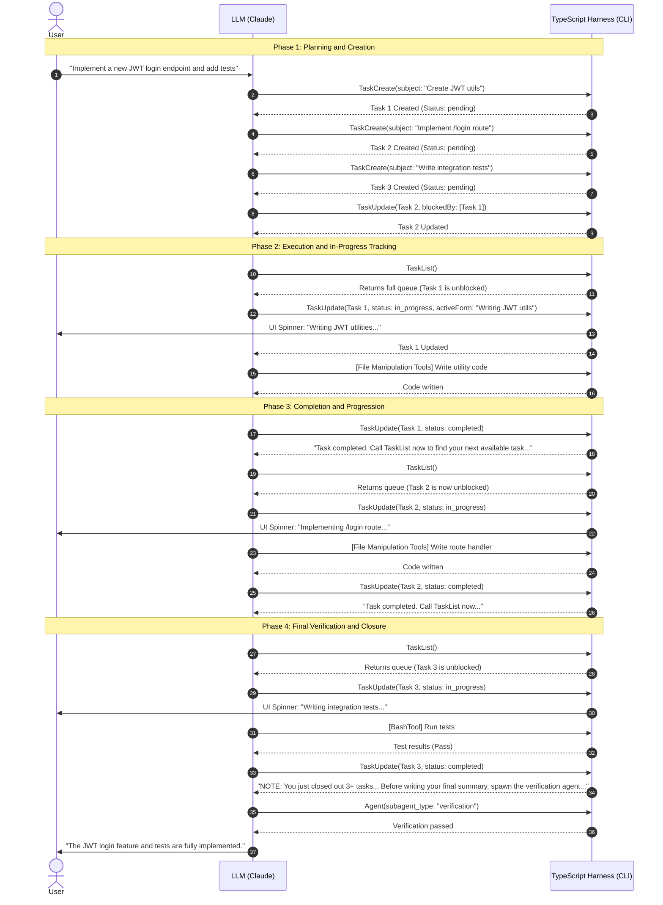

This document provides a comprehensive technical deep dive into the design and implementation of the Task List feature (TodoV2) within the Claude Code CLI, based on the system's source code and prompts.

---

## 1. User Experience

### What the User Sees

The task list is rendered inline in the terminal via an Ink (React for CLI) component (`src/components/TaskListV2.tsx`). Each task is displayed with a status icon, color, and text style:

| Status        | Icon | Color | Text Style                |
| ------------- | ---- | ----- | ------------------------- |
| `pending`     | □    | none  | normal                    |
| `in_progress` | ■    | cyan  | **bold**                  |
| `completed`   | ✓    | green | ~~strikethrough~~, dimmed |

A typical rendering looks like:

```
✓ Setup project configuration
■ Running tests
□ Deploy to staging
  ➜ blocked by #2

3 tasks (1 done, 1 in progress, 1 open)
```

Additional visual details:
* **Blocked tasks** show a pointer: `➜ blocked by #2, #5` (dimmed).
* **Multi-agent tasks** show the owner: `(@researcher)` and a live activity line (e.g., `Summarizing results…`).
* **Completed tasks fade out** after a 30-second TTL (`RECENT_COMPLETED_TTL_MS = 30_000`).
* The entire list **auto-hides 5 seconds** after all tasks are completed.
* When space is limited (more than ~10 tasks), lower-priority tasks are truncated with a summary: `"… +2 pending, 1 completed"`.

### User Interaction: Read-Only

The task list is **entirely LLM-managed**. Users cannot directly add, remove, reorder, or mark tasks through any keyboard shortcut, slash command, or clickable UI element. The only user interactions are:

* **Ctrl+T** — Toggle task list visibility (display only).
* **Natural language** — The user can ask Claude to modify the task list (e.g., "remove that last task" or "add a step for linting"), and Claude translates the request into the appropriate `TaskCreate` / `TaskUpdate` tool calls.

There is no special routing for these requests. They work through standard LLM tool-calling: the task tools are in Claude's tool set, prior task creation results (including task IDs) are in the conversation transcript, and the LLM maps the user's natural language intent to the correct tool invocation — no differently than interpreting "delete that file" as a file-delete tool call.

If the user interrupts mid-execution (see Section 7), the queued message is processed on the next turn and Claude adjusts the task list accordingly.

---

## 2. When Is a Task List Created?

A task list is not generated for every request. There are three paths that lead to task list creation:

### Path 1: LLM Autonomous Decision

The system prompt always includes a general instruction to use task tools for tracking work:
* **File:** `src/constants/prompts.ts`

```typescript
taskToolName
  ? `Break down and manage your work with the ${taskToolName} tool. These tools are helpful for planning your work and helping the user track your progress.`
  : null,
```

The `TaskCreateTool` prompt then defines when the LLM should and should not use it:
* **File:** `src/tools/TaskCreateTool/prompt.ts`

```markdown
## When to Use This Tool

- Complex multi-step tasks - When a task requires 3 or more distinct steps or actions
- Non-trivial and complex tasks - Tasks that require careful planning or multiple operations
- User explicitly requests todo list - When the user directly asks you to use the todo list
- User provides multiple tasks - When users provide a list of things to be done

## When NOT to Use This Tool

- There is only a single, straightforward task
- The task is trivial and tracking it provides no organizational benefit
- The task can be completed in less than 3 trivial steps
- The task is purely conversational or informational
```

### Path 2: Post-Plan Nudge

When the user approves a plan via `ExitPlanMode`, the Harness injects a nudge to create tasks for execution. See [Plan/Act Mode]() for full details on how plans work.
* **File:** `src/tools/ExitPlanModeTool/ExitPlanModeV2Tool.ts`

```typescript
content: `User has approved your plan. You can now start coding. Start with updating your todo list if applicable`
```

### Path 3: Team Creation (Architectural)

When multi-agent swarms are used, the task list is not "encouraged" by a prompt — it is created as a side effect of team creation. Teams and task lists have a 1:1 correspondence: `TeamCreate` automatically provisions a shared task list directory at `~/.claude/tasks/{team-name}/`. You cannot have a swarm without a task list.
* **File:** `src/tools/TeamCreateTool/prompt.ts`

```markdown
Teams have a 1:1 correspondence with task lists (Team = TaskList).
```

### The Counterweight: Bias Toward Immediate Action

For everything that doesn't meet the above criteria, the LLM is instructed to skip the task list overhead and just do the work directly.
* **File:** `src/constants/prompts.ts`

```markdown
## Bias toward action

Act on your best judgment rather than asking for confirmation.
- Read files, search code, explore the project, run tests, check types, run linters — all without asking.
- Make code changes. Commit when you reach a good stopping point.
```

---

## 3. Format, Schema, and Storage

### The Schema
Claude Code enforces a strict JSON schema for structured tasks using Zod.
* **File:** `src/utils/tasks.ts`
* **Context:**
```typescript
export const TaskSchema = z.object({
  id: z.string(),
  subject: z.string(),
  description: z.string(),
  activeForm: z.string().optional(),
  owner: z.string().optional(),
  status: z.enum(['pending', 'in_progress', 'completed', 'deleted']),
  blocks: z.array(z.string()),
  blockedBy: z.array(z.string()),
  metadata: z.record(z.string(), z.unknown()).optional(),
})
```

### Storage Strategy (Multi-Tier)
*   **Primary Storage (Disk)**: Tasks are persisted as individual JSON files on the local filesystem at `~/.claude/tasks/{taskListId}/{taskId}.json`.
*   **Secondary Storage (Transcript Snapshots)**: For remote sessions (CCR), snapshots of the task list are periodically written into the conversation transcript as `file_snapshot` system messages, allowing state recovery if the remote environment restarts.

---

## 4. Available Task-Related Tools

The LLM is exposed to a suite of tools to interact with the task list. 

*(See **Appendix: Tool Schemas** for the detailed input parameter schemas of these tools).*

**Structured Task Management (TodoV2):**
*   **`TaskCreate`**: Creates a single pending task.
*   **`TaskUpdate`**: Modifies task status, dependencies, and metadata.
*   **`TaskList`**: Retrieves the current state of the entire task queue.
*   **`TaskGet`**: Retrieves full details for a specific task.
*   **`TodoWrite`**: (Legacy/V1) Overwrites a flat array of tasks.

**Planning and Delegation:**
*   **`EnterPlanMode`**: Switches to plan mode.
*   **`ExitPlanMode`**: Manages the drafting and user approval of Markdown architectural plans.
*   **`TeamCreate`**: Creates a team/swarm corresponding to a task list.
*   **`Agent`**: Spawns background sub-agents to execute tasks.

---

## 5. The Task Lifecycle

Below is an example of the full task lifecycle for the request: *"Implement a new JWT login endpoint and add tests for it."*



### 5.1 Two-Step Dependency Linking
There is no single tool call to write an entire graph of tasks at once. 
1. `TaskCreate` only accepts one task per call and does not accept `blockedBy` arguments.
2. The LLM makes parallel calls to `TaskCreate` to generate the tasks.
3. Once the Harness returns the dynamic `taskId`s, the LLM issues `TaskUpdate` calls to wire the dependencies (`blockedBy`).

**Reference:**
* **File:** `src/tools/TaskCreateTool/prompt.ts`
* **Context:**

```markdown
## Tips
- Create tasks with clear, specific subjects that describe the outcome
- After creating tasks, use TaskUpdate to set up dependencies (blocks/blockedBy) if needed
```

---

## 6. Execution, Looping, and Efficiency

### The "Natural Workflow Bridge" (Phase 1 → 2)
After the LLM creates the tasks and wires their dependencies, no dynamic nudge tells it to start working. Instead, the LLM transitions to execution autonomously via a "Natural Workflow Bridge" created by intersecting system prompts:

1. **Bias Toward Action:**
   * **File:** `src/constants/prompts.ts`
   * **Context:** `Keep your text output brief and direct. Lead with the answer or action, not the reasoning. Skip filler words, preamble, and unnecessary transitions. Do not restate what the user said — just do it.`
2. **In-Progress Rule:**
   * **File:** `src/tools/TaskCreateTool/prompt.ts`
   * **Context:** `- When you start working on a task - Mark it as in_progress BEFORE beginning work`
3. **Task Discovery:**
   * **File:** `src/tools/TaskListTool/prompt.ts`
   * **Context:** `- To see what tasks are available to work on (status: 'pending', no owner, not blocked)`

The LLM deduces: "I am told to do the work. I must mark a task `in_progress` before doing it. I must call `TaskList` to see which task is unblocked so I can mark it."

### Dynamic Nudging and the Execution Loop (Phase 3)
Once the loop begins, the Harness dynamically steers the LLM. 
When the LLM calls `TaskUpdate(status: "completed")`, the Harness dynamically appends a string to the `tool_result`.
* **File:** `src/tools/TaskUpdateTool/TaskUpdateTool.ts`
* **Context:**
```typescript
    if (
      statusChange?.to === 'completed' &&
      getAgentId() &&
      isAgentSwarmsEnabled()
    ) {
      resultContent +=
        '\n\nTask completed. Call TaskList now to find your next available task or see if your work unblocked others.'
    }
```

This creates a highly efficient state-machine loop: **Complete Task → Nudge triggers → Check TaskList → Mark Next In-Progress → Work.**

### Turn Efficiency & Compression: Detailed Example (Phase 3)
While the loop seems turn-heavy, Claude compresses it. The call to `TaskList()` must be sequential because the LLM needs the returned data. However, `TaskUpdate(in_progress)` and the file manipulation are executed in **parallel in a single turn**.

Here are the specific tool calls and parameters per turn during "Phase 3: Completion and Progression":

**Turn 1: Completing Task 1**
* **LLM Call:**

```xml
<invoke name="TaskUpdate">
{"taskId": "1", "status": "completed"}
</invoke>
```
* **Why it's isolated:** The LLM cannot bundle `completed` with the code-writing tool. `src/tools/TaskUpdateTool/prompt.ts` forbids marking a task complete before verifying it worked: `ONLY mark a task as completed when you have FULLY accomplished it... Never mark a task as completed if you encountered unresolved errors.`
* **Harness Response:** `Updated task #1 status. Task completed. Call TaskList now to find your next available task or see if your work unblocked others.`

**Turn 2: Checking the Queue**
* **LLM Call:**

```xml
<invoke name="TaskList">
{}
</invoke>
```
* **Why it's isolated:** The LLM must read the newly unblocked dependency graph to know Task 2 is available.
* **Harness Response:** Returns the task queue showing Task 2 is unblocked.

**Turn 3: Starting and Executing Task 2 (Parallelized)**
* **LLM Call:**

```xml
<invoke name="TaskUpdate">
{"taskId": "2", "status": "in_progress", "activeForm": "Implementing /login route"}
</invoke>

<invoke name="FileWriteTool">
{"file_path": "src/routes/login.ts", "content": "..."}
</invoke>
```
* **Why it's parallelized:** The prompt in `src/constants/prompts.ts` mandates: `Maximize use of parallel tool calls where possible to increase efficiency.` Since updating status doesn't return data needed by `FileWriteTool`, they run concurrently. `TaskUpdateTool.ts` enables this via `isConcurrencySafe: () => true`.
* **Harness Response:** Returns success for both the status update and the file write.

**Turn 4: Completing Task 2**
* **LLM Call:**

```xml
<invoke name="TaskUpdate">
{"taskId": "2", "status": "completed"}
</invoke>
```
* **Why it happens here:** The file was written successfully. `prompts.ts` enforces: `Mark each task as completed as soon as you are done with the task. Do not batch up multiple tasks before marking them as completed.`

---

## 7. Handling User Interruptions Mid-Execution

A critical part of the task list execution loop is how the system handles the user suddenly typing a new request or hitting `Ctrl+C` while the LLM is busy (e.g., "Wait, stop that, use OAuth instead of JWT"). 

Claude Code handles these interruptions gracefully using a combination of queueing and synthetic transcript injection:

1. **Input Interception and Queuing (`src/utils/handlePromptSubmit.ts`)**
   When the user submits a new prompt while the main loop is actively processing a turn (`queryGuard.isActive`), the Harness intercepts the input. It immediately pushes the new user request onto a pending message queue (`enqueue()`) rather than corrupting the current execution state.

2. **Aborting Interruptible Tools**
   Also in `handlePromptSubmit.ts`, if the LLM is currently running a background process or long-running shell command that is marked as interruptible, the Harness will explicitly trigger an abort signal:
   ```typescript
   if (params.hasInterruptibleToolInProgress) {
     params.abortController?.abort('interrupt')
   }
   ```

3. **Synthetic Interruption Messages (`src/query.ts` & `src/utils/messages.ts`)**
   When an active turn is aborted by the user, the Harness does not just silently fail. Instead, it yields a `createUserInterruptionMessage()`. This injects a specific synthetic block into the LLM's transcript:
   `[Request interrupted by user]` or `[Tool use interrupted by user]`
   This is critical because it tells the LLM exactly *why* its previous action failed, preventing it from hallucinating a bug in its code.

4. **Task List Re-alignment**
   Once the interruption is handled, the pending user message from the queue is appended to the conversation history, and the LLM is invoked again. 
   Because the task list resides securely on disk (via TodoV2) and not just in the LLM's short-term memory, the LLM reads the user's new request ("Use OAuth instead"), processes the `[Request interrupted]` context, and knows it must pivot. 
   Based on its general instructions, the LLM will autonomously use `TaskUpdate` to mark the obsolete tasks as `deleted` or `pending` and use `TaskCreate` to append the new requirements before resuming the execution loop.

---

## 8. Multi-Agent Swarms & Team Creation

The LLM is nudged to invoke Multi-Agent swarms dynamically. When the LLM exits Plan Mode and the user approves a complex plan, the Harness dynamically injects a hint.
* **File:** `src/components/permissions/ExitPlanModePermissionRequest/ExitPlanModePermissionRequest.tsx`
* **Context:**
```typescript
const teamHint = isAgentSwarmsEnabled() 
  ? `\n\nIf this plan can be broken down into multiple independent tasks, consider using the ${TEAM_CREATE_TOOL_NAME} tool to create a team and parallelize the work.` 
  : '';
```

The `TeamCreate` prompt then guides the LLM to spawn agents.
* **File:** `src/tools/TeamCreateTool/prompt.ts`
* **Context:**

```markdown
When spawning teammates via the Agent tool, choose the `subagent_type` based on what tools the agent needs for its task. Each agent type has a different set of available tools — match the agent to the work:
- **Read-only agents** (e.g., Explore, Plan)
- **Full-capability agents** (e.g., general-purpose)
```
Teams share the same task list directory (`~/.claude/tasks/{team-name}/`), allowing multiple agents to independently query `TaskList` and claim pending tasks concurrently.

---

## 9. The Verification Contract

At the end of a non-trivial task sequence, the Harness enforces an independent verification step.

### The Dynamic Verification Nudge
If the LLM completes 3+ tasks, and none of them were labeled as a verification step, the Harness dynamically intercepts the final `TaskUpdate` tool result.
* **File:** `src/tools/TaskUpdateTool/TaskUpdateTool.ts`
* **Context:**
```typescript
    if (verificationNudgeNeeded) {
      resultContent += `\n\nNOTE: You just closed out 3+ tasks and none of them was a verification step. Before writing your final summary, spawn the verification agent (subagent_type="${VERIFICATION_AGENT_TYPE}"). You cannot self-assign PARTIAL by listing caveats in your summary — only the verifier issues a verdict.`
    }
```

### Handling a FAIL Verdict
If the spawned `verification` agent finds a bug and returns a `FAIL` verdict, the main LLM follows the strict adversarial contract defined in the system prompt.
* **File:** `src/constants/prompts.ts`
* **Context:**
```markdown
On FAIL: fix, resume the verifier with its findings plus your fix, repeat until PASS. On PASS: spot-check it...
```

**What happens to the completed Task List?**
Because the dynamic verification nudge is only triggered *after* all tasks are marked as `completed`, the task list sits in a fully `completed` state when the verifier returns a `FAIL`.

The Harness **does not** automatically reopen tasks or inject "fix steps." Because there is no rigid system prompt forcing the LLM to update the task list for these fixes, the LLM handles it autonomously. Based on its general instructions, the LLM determines its path based on the complexity of the required fix:

1. **Direct Execution (Most Common / Fast Path):**
   Because the explicit directive is simply to "fix" and "repeat", and the main task list is already marked complete, the LLM will usually bypass the task list overhead entirely. It enters a tight loop where it directly calls file manipulation tools (e.g., `FileEditTool`) to apply the fix, and then immediately calls the `AgentTool` again to resume the verifier. 

2. **Task Extension (For Complex Fixes):**
   If the verifier uncovers a massive architectural flaw that requires multi-step refactoring, the LLM may fall back to its foundational instruction from `src/tools/TaskCreateTool/prompt.ts`:
   > *"Use this tool to create a structured task list for your current coding session. This helps you track progress, organize complex tasks..."*
   
   In this scenario, the LLM autonomously decides the fix is too complex to track mentally. It calls `TaskCreate` to append new tasks (e.g., *"Fix JWT token expiration bug found by verifier"*) to the end of the existing list, works through them by marking them `in_progress` → `completed`, and *then* resumes the verifier.

---

## Appendix: Tool Schemas

Below are the detailed Zod input parameter schemas for the tools discussed in this document.

**1. `TaskCreate`**
* **File:** `src/tools/TaskCreateTool/TaskCreateTool.ts`

```typescript
{
  subject: string, // A brief title for the task
  description: string, // What needs to be done
  activeForm?: string, // Present continuous form (e.g., "Writing tests...")
  metadata?: Record<string, unknown>
}
```

**2. `TaskUpdate`**
* **File:** `src/tools/TaskUpdateTool/TaskUpdateTool.ts`

```typescript
{
  taskId: string, // The ID of the task to update
  subject?: string,
  description?: string,
  activeForm?: string,
  status?: "pending" | "in_progress" | "completed" | "deleted",
  addBlocks?: string[], // Task IDs that this task blocks
  addBlockedBy?: string[], // Task IDs that block this task
  owner?: string, // Agent ID claiming the task
  metadata?: Record<string, unknown> // Set a key to null to delete
}
```

**3. `TaskList`**
* **File:** `src/tools/TaskListTool/TaskListTool.ts`

```typescript
{} // No parameters needed
```

**4. `TaskGet`**
* **File:** `src/tools/TaskGetTool/TaskGetTool.ts`

```typescript
{
  taskId: string // The ID of the task to retrieve
}
```

**5. `TodoWrite`** (Legacy/V1)
* **File:** `src/tools/TodoWriteTool/TodoWriteTool.ts`

```typescript
{
  todos: {
    content: string,
    activeForm?: string,
    status: "pending" | "in_progress" | "completed"
  }[] 
}
```

**6. `EnterPlanMode`**
* **File:** `src/tools/EnterPlanModeTool/EnterPlanModeTool.ts`

```typescript
{} // No parameters needed
```

**7. `ExitPlanMode`**
* **File:** `src/tools/ExitPlanModeTool/ExitPlanModeV2Tool.ts`

```typescript
{
  allowedPrompts?: { tool: "Bash", prompt: string }[] 
}
```

**8. `TeamCreate`**
* **File:** `src/tools/TeamCreateTool/TeamCreateTool.ts`

```typescript
{
  team_name: string, // Name for the new team
  description?: string, // Team purpose
  agent_type?: string // Role of the team lead
}
```

**9. `Agent`**
* **File:** `src/tools/AgentTool/AgentTool.tsx`

```typescript
{
  description: string, // Short description of the task
  prompt: string, // The exact instruction for the agent
  subagent_type?: string, // e.g., "verification", "explore", "general-purpose"
  model?: "sonnet" | "opus" | "haiku",
  run_in_background?: boolean,
  name?: string, // Used for inter-agent messaging
  team_name?: string,
  isolation?: "worktree" | "remote", // Execute in a safe branch/environment
  cwd?: string
}
```

---

## Appendix: Key UI Files

* **File:** `src/components/TaskListV2.tsx` — Main task list rendering
* **File:** `src/hooks/useTasksV2.ts` — File watcher and state management (watches `~/.claude/tasks/{taskListId}/` directory)
* **File:** `src/components/Spinner.tsx` — `activeForm` rendering in collapsed view
