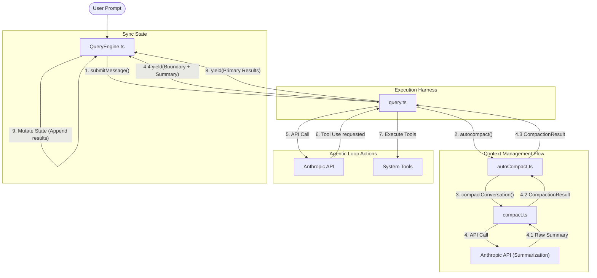
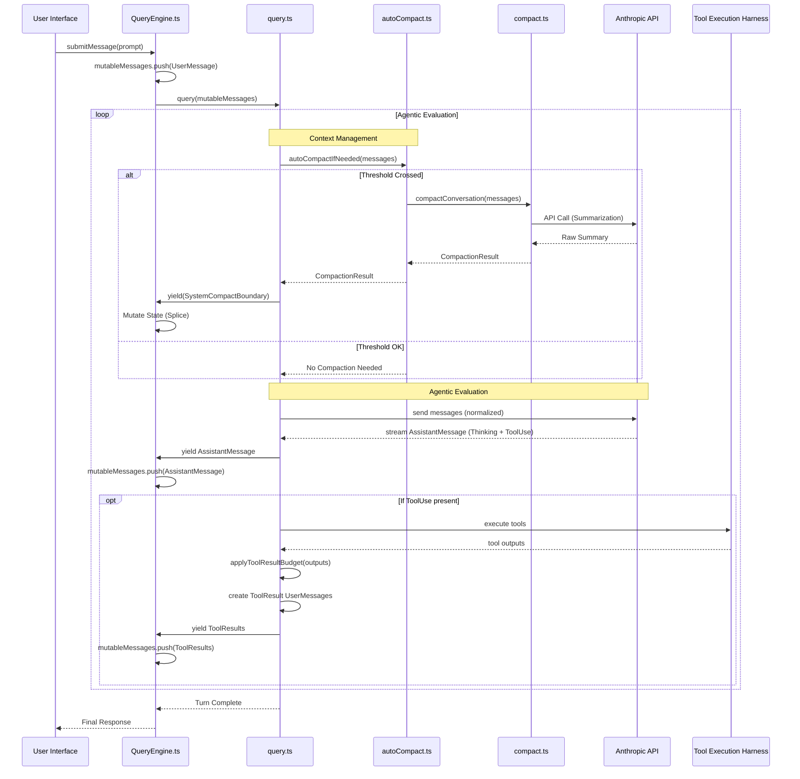
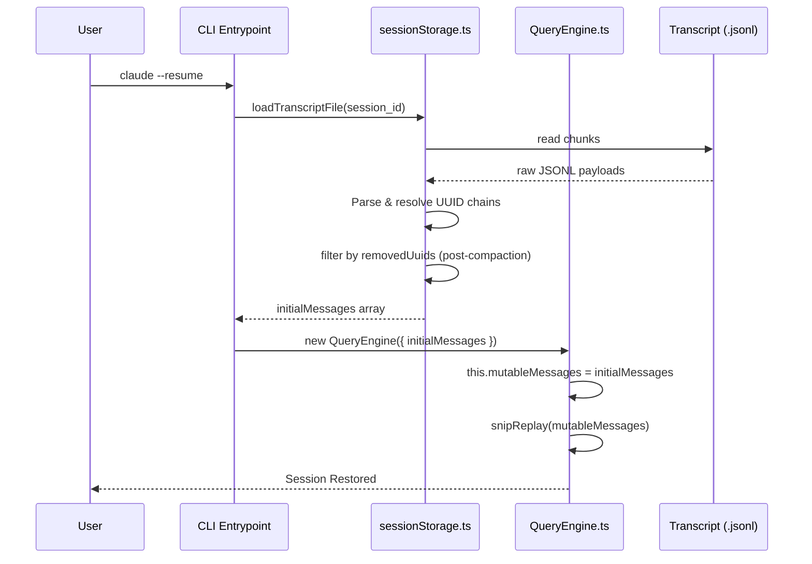

This document details how Claude Code manages the "messages" part of its LLM context. It breaks down data structures, the lifecycle of messages during active turns, specialized handling of thinking tokens and tool results, and the mechanisms for session restoration. 

All findings are grounded in empirical codebase evidence, primarily tracing the interactions between `src/types/message.ts`, `src/QueryEngine.ts`, `src/query.ts`, and `src/utils/sessionStorage.ts`.

---

## 1. Core Message Data Structures

The system treats the conversation not as a simple array of strings, but as a strictly typed, immutable-first ledger governed by Anthropic’s API schemas. The conversation is defined as a discriminated union type `Message` in `src/types/message.ts`. This structure ensures that every entry in the session history carries the necessary metadata for both UI rendering and API consumption.

*   **`UserMessage`**: Represents the user’s side of the conversation. Critically, it serves a dual purpose: it contains raw user prompts and acts as the container for `tool_result` blocks. In the "physics" of the loop, tool results are effectively user responses to the assistant’s previous requests.
*   **`AssistantMessage`**: The model's contribution to the trajectory. It is composed of multiple content blocks, including `text`, `tool_use`, and `thinking`. 
*   **`SystemMessage`**: Internal signal messages used for session management. These include `SystemCompactBoundaryMessage` (which marks where history was truncated) and `SystemInformationalMessage` (for UI-level telemetry). These messages are typically filtered out by `normalizeMessagesForAPI()` (defined in `src/utils/messages.ts`) before being sent to the LLM.
*   **`AttachmentMessage`**: A specialized structure used to inject non-conversational context—such as local files, environment variables, or the `MEMORY.md` file—directly into the message stream.

---

## 2. Structural Architecture

Claude Code employs a decoupled architecture that separates conversation state from behavioral execution. This design forms a hierarchical "Loop-within-a-Loop" structure where a stateful outer container manages the lifecycle of a mechanical execution engine.

### QueryEngine.ts
Acting as the **SessionManager**, this file is the system's stateful orchestrator and the primary repository for the entire session. It owns the `mutableMessages` array, which functions as the definitive source of truth for every user prompt, assistant response, and system event. When a user submits a prompt, `QueryEngine.ts` wraps the input in a standard message format and initiates the execution cycle by invoking `query.ts`. Throughout the turn, it functions as a stateful receiver, listening to the generator stream yielded by the engine and managing final state mutations—either appending primary results or splicing in summarized content produced by `compact.ts`.

### query.ts
This file serves as the **Execution Harness** and mechanical core of the system, hosting the `queryLoop()` state machine. While `QueryEngine.ts` tracks the data, `query.ts` determines the behavior. It is the worker responsible for the low-level orchestration of communicating with the Anthropic API, interpreting responses, and executing local system tools. In every iteration of its loop, `query.ts` consults `autoCompact.ts` to perform a context safety check. If a context overflow is identified, `query.ts` pauses the turn to allow `compact.ts` to prune the history before any subsequent request is dispatched to the model.

### autoCompact.ts
Serving as the **Decision Maker**, this file acts as the proactive gatekeeper that governs context viability. It contains the analytical logic required to evaluate the current "fullness" of the message history owned by `QueryEngine.ts` against the model's specific limits. By calculating token counts and remaining headroom, `autoCompact.ts` makes the high-level ruling on *when* to trigger a reduction in history. If a safety threshold is crossed, it notifies `query.ts` to interrupt the standard flow and initiate a compaction sub-routine via `compact.ts`.

### compact.ts
Known as **The Heavy Lifter**, this file provides the specialized summarization services required to keep long-running sessions alive. Once `autoCompact.ts` identifies a need for more space, `compact.ts` executes the actual compression logic. It processes the oldest segments of the history, forks a dedicated summarization agent to condense them, and generates the boundary markers and summary blocks used by `QueryEngine.ts` to replace the bulky original messages. This service ensures that `query.ts` can continue operating within a viable context window without losing the narrative thread of the conversation.

---

## 3. The Execution Lifecycle: The Agentic Loop

The relationship between the core files forms a hierarchical "Loop-within-a-Loop" structure. To understand this lifecycle, we examine it through two distinct lenses: the **Structural Topology** (how files are wired) and the **Execution Timeline** (how messages flow over time).

### 3.1 Visual Mapping: Topology vs. Timeline

#### Structural Topology (The "Wiring" View)
The following diagram illustrates how state mutations are triggered and how the various components are linked together to manage context.

#### Execution Timeline (The "Sequence" View)
While the topology shows the wiring, the timeline below tracks the temporal lifecycle of a prompt, specifically highlighting the blocking nature of the compaction gatekeeper.

### 3.2 Unified Walkthrough

The Call Chain and Sequence diagrams illustrate a four-phase execution flow that ensures every turn is context-safe and persistent.

#### Phase 1: Initiation
`QueryEngine.ts` receives the user's prompt and pushes it into the session's definitive ledger. It then initiates the turn by invoking `query.ts`, passing the current state as the baseline for the agentic loop.

#### Phase 2: Context Management (The Pre-API Gatekeeper)
Before any communication with the primary LLM, `query.ts` performs a strictly blocking call to `autoCompact.ts`. This file evaluates the current history against model limits. If a threshold is crossed, `compact.ts` is triggered to generate a summary via a summarization API call. This result flows back through `autoCompact.ts` to `query.ts`, which **yields** a compaction boundary to `QueryEngine.ts`. This triggers a **Mutate State (Splice)** operation to truncate the old history before the primary turn proceeds.

#### Phase 3: Agentic Evaluation
Once the context is verified, `query.ts` begins the evaluation loop with the Anthropic API. As the model streams back thinking tokens and tool usage requests, `query.ts` yields these as **AssistantMessages**. If tools are requested, they are executed locally, and the results are yielded as **UserMessages** (tool results) to be recorded in the state.

#### Phase 4: Turn Completion & Sync
As `query.ts` yields primary results, `QueryEngine.ts` executes a **Mutate State (Append)** operation, pushing these messages to the permanent ledger. This ensures that the session state remains synchronized with the assistant's trajectory in real-time.

---

## 4. Operational Dynamics of QueryEngine.ts

`QueryEngine.ts` acts as the system's stateful orchestrator and the primary enforcer of the ledger's integrity. While other components generate or transform data, this file manages the permanence and identity of the conversation history.

### Chronological Strictness
The message array is a strictly sequential history. Every operation—whether a user prompt or a compaction splice—must preserve the causal link between a `tool_use` and its subsequent `tool_result`. While `query.ts` is responsible for generating this causal sequence, `QueryEngine.ts` orchestrates its permanence by managing the definitive chronological ledger and refusing to accept out-of-order results.

### UUID Chaining
Every message is assigned a stable UUID by `QueryEngine.ts` as it is admitted into the ledger. This identity management is the bedrock of session restoration; it allows `sessionStorage.ts` to reconstruct the timeline even if the transcript is loaded out of order or across multiple application restarts.

### Surgical Ledger Mutation
Context management relies on **Surgical Ledger Mutation** to ensure the session's definitive record remains valid. Compaction is implemented not as a temporary UI filter but as a destructive state change. When `QueryEngine.ts` receives a compaction result, it performs a permanent splice on the message history, ensuring that the persisted session records and the active context window remain in perfect synchronization. This "Sync State" ensures that subsequent agentic turns operate on a definitive, reduced history that is consistent across restarts and network requests.

---

## 5. Operational Dynamics of query.ts

`query.ts` serves as the core state machine, governing the movement of information between the user, the model, and the local system. Its implementation prioritizes architectural safety and context integrity through the following operational principles.

### Strategic Timing: The Safety-First Approach
The system performs a context check at the beginning of every iteration of the agentic loop. This "Safety-First" timing ensures that the context window is evaluated before any data is sent to the API, catching potential overflows from two primary directions. First, it handles massive user inputs by compacting the existing history before the new prompt is even processed. Second, it manages high-volume tool outputs—such as results from a recursive directory listing or a large file read—by identifying the growth in the next iteration and shrinking the history before those results are submitted back to the model. By anchoring the check at the start of the loop, the system guarantees that the LLM always receives a history that fits within its constraints.

### Strict Sequential Blocking
To maintain the integrity of the conversation ledger, `query.ts` adheres to a rigid **Compaction → API Call → Tool Execution** sequence. The call to `autoCompact.ts` is strictly blocking; the harness uses `await` to ensure that any necessary summarization completes and the state is fully mutated before the primary API request begins. This sequential dependency is critical for two reasons. Architecturally, the system cannot construct a valid prompt until it knows the final, possibly rewritten state of the message history. Operationally, it serves as a fail-safe for token limits. If the check were non-blocking, the harness might inadvertently send a prompt that exceeds the API's maximum capacity while a background compaction process is still running, leading to immediate request failure.

### Thinking Trajectory Integrity
The system guarantees **Thinking Trajectory Integrity** by treating Anthropic's reasoning tokens as immutable and model-bound. This is primarily enforced within the agentic turns of `query.ts` and the `normalizeMessagesForAPI()` utility (defined in `src/utils/messages.ts`), where thinking blocks are rigorously preserved according to three strict rules:
1. **Activation Requirement**: `thinking` blocks must be part of a query where `max_thinking_length > 0`.
2. **Placement Constraint**: A thinking block may not be the last message in a block.
3. **Trajectory Preservation**: Thinking must be preserved throughout the entire assistant trajectory (bridging the `tool_use` and the subsequent `tool_result`).

Any modification or omission during the merge or truncation process would invalidate the model's internal consistency and trigger immediate API errors.

### Tool Result Management
Beyond static data constraints, `query.ts` actively manages the influx of tool execution results. The system accumulates these results in a local `toolResults: (UserMessage | AttachmentMessage)[]` array during the active turn. To prevent immediate context exhaustion from massive outputs—such as recursive file listings or binary dumps—`query.ts` aggressively employs a "Tool Result Budget" (`applyToolResultBudget`) that truncates results to stay within a manageable limit before they are pushed to the permanent ledger.

### API Normalization (The Wire Format)
The internal `mutableMessages` ledger is more permissive than the Anthropic API. Before transmission, `query.ts` orchestrates a mandatory transformation via `normalizeMessagesForAPI()` (defined in `src/utils/messages.ts`), merging contiguous same-role messages and stripping system-only metadata to ensure wire compatibility.

---

## 6. Compaction Logic

`autoCompact.ts` serves as the proactive "gatekeeper" of the system. It executes a rigorous sequence of checks to determine if the history should be summarized before the next API request.

### 1. Recursive Protection & Deadlock Avoidance
Before performing any token calculations, `autoCompact.ts` executes a "Who is asking?" check by inspecting the `querySource` of the current turn. This check serves as the primary guard against recursive deadlocks. Compaction works by "forking" a temporary, smaller agent—the Summarizer—which is injected with the entire bulky message history so it can read and condense it. Because this agent begins its life with a full context by definition, it would immediately trigger a threshold violation if it were subjected to the same decision-making logic. Without this guard, the Summarizer would try to compact itself, forking another Summarizer in an infinite recursive loop of "cleanup crews" trying to clean up after each other. To prevent this, if the `querySource` is identified as `'compact'` or `'session_memory'`, `autoCompact.ts` returns immediately and skips all further checks.

### 2. Circuit Breaker Protection
To protect the system from wasting resources on sessions that are irrecoverably over the limit, `autoCompact.ts` employs a circuit breaker mechanism. If the system experiences a series of consecutive failures during compaction attempts, it increments a failure counter tracked across the session. Once this counter reaches the `MAX_CONSECUTIVE_AUTOCOMPACT_FAILURES` threshold (typically 3), `autoCompact.ts` concludes that the context is in a terminal state—likely due to a prompt that is fundamentally too long for the model to process even with summarization. At this point, the circuit breaker trips, and `autoCompact.ts` skips all future compaction attempts for that session to prevent hammering the API with doomed requests on every subsequent turn.

### 3. Threshold Calculation & Token Estimation
If the initial safety guards pass, the system begins a mathematical evaluation of the context window to derive a safe operating threshold. It first calculates an "Effective Context Window" by subtracting `MAX_OUTPUT_TOKENS_FOR_SUMMARY` (20,000 tokens) from the model's total capacity, ensuring there is sufficient "headroom" for the LLM to actually write the summary. It then applies a further `AUTOCOMPACT_BUFFER_TOKENS` safety margin of 13,000 tokens. `autoCompact.ts` then estimates the current state of the ledger using `tokenCountWithEstimation(messages)`. If this estimated count exceeds the calculated threshold—which typically occurs when the history reaches approximately 90-93% of the effective window—the system proceeds to the execution phase.

### 4. Execution Sequence: Session Memory vs. Legacy
When the threshold is crossed and compaction is deemed necessary, the system follows a hierarchical "First-Responders" strategy. It first attempts to use `trySessionMemoryCompaction()`, an experimental and more efficient method that prunes the conversation history using session-level memory. If this specialized session memory compaction fails, is unavailable, or is not applicable to the current state, `autoCompact.ts` falls back to the robust `compact.ts`. This legacy service performs the standard summarization by sending the bulky history to the Anthropic API to generate a condensed narrative that will replace the oldest segments of the context.

---

## 7. Persistence: State Recovery & Restoration

The survival of a conversation across application restarts or system failures is managed through a robust persistence layer that bridges the gap between active memory and cold storage. Claude Code ensures that the context ledger remains durable by employing a strategy of continuous, incremental logging paired with a rigorous timeline reconstruction process.

### Real-Time Transcription
The journey from memory to disk begins in `QueryEngine.ts`. As the stateful orchestrator receives new messages—whether they are user prompts, assistant responses, or system signals—it immediately invokes `recordTranscript(messages)` via the `src/utils/sessionStorage.ts` utility. This operation does not perform a bulky overwrite of the entire history; instead, it appends entries to a local JSONL (JSON Lines) transcript file. By treating the disk record as an incremental log of events, the system ensures that even if the process is abruptly terminated, the most recent turn is preserved and can be recovered with minimal data loss.

### Timeline Reconstruction and Session Replay
Restoring a session is not a simple matter of reading a list of strings; it requires reconstructing the causal and structural integrity of the entire conversation. When a user resumes a session (e.g., via `claude --resume`), the system initiates a three-step restoration sequence:

1. **UUID Resolution**: `loadTranscriptFile()` traverses the JSONL log to resolve the complex web of UUID chains. Because compaction operations involve removing old messages and replacing them with summaries, the restorer must filter out any messages marked as `removedUuids` to ensure the active context does not contain redundant or conflicting history.
2. **State Injection**: The resulting `initialMessages` array is used to hydrate a new instance of `QueryEngine.ts`. This transitions the data from the utility layer back into the system's primary stateful repository, setting the `mutableMessages` ledger as the new source of truth.
3. **Snip Replay and Boundary Markers**: Finally, `QueryEngine.ts` executes `snipReplay()`. This process ensures that any historical "snips" (the points where history was truncated or merged) are correctly re-rendered in the UI and respected by the underlying context window. 

This recovery mechanism ensures that when the user returns to their terminal, the "physics" of the conversation—its chronology, its summarized boundaries, and its reasoning trajectories—are restored to exactly where they were left.

