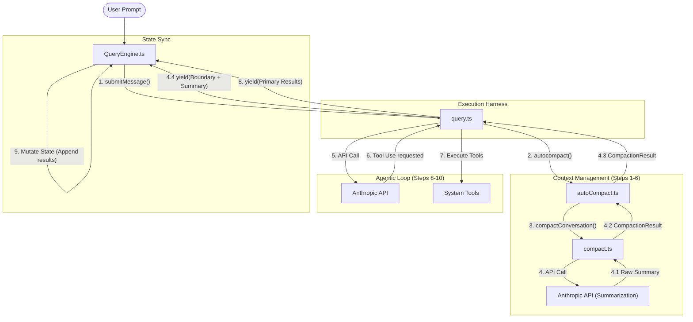
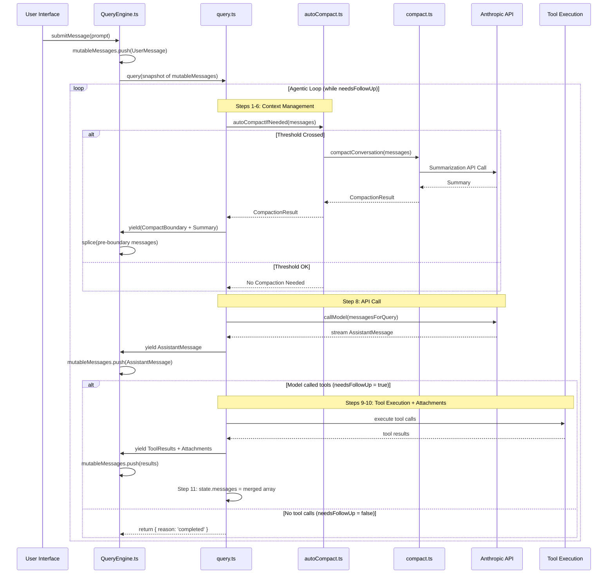
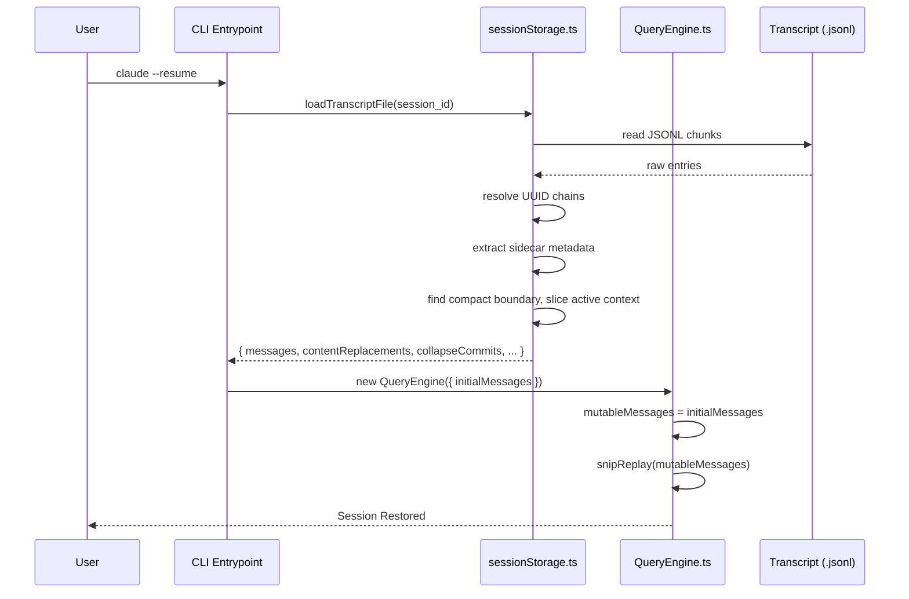

This post explores how Claude Code orchestrates a session — how `QueryEngine.ts` manages conversation state, dispatches work to `query.ts`, receives results via async generators, and persists everything for cross-turn continuity and session resume. We trace the interaction between the stateful session owner and the stateless execution engine, covering how the loop runs, terminates, continues on error, and how messages flow between components.

For the detailed per-step message pipeline, see the companion post [Managing Message Context](). For how the API call is constructed, see [Calling the Model]().

---

## 1. Architecture: The Stateful/Stateless Split

Claude Code employs a decoupled architecture that separates conversation state from behavioral execution. The design forms a hierarchical structure where a stateful outer container manages the lifecycle of a stateless execution engine.

### QueryEngine.ts — The Session Manager

`QueryEngine.ts` is the system's stateful orchestrator. It owns the `mutableMessages` array, which serves as the definitive source of truth for the entire session — every user prompt, assistant response, tool result, and system event lives here. When a user submits a prompt, `QueryEngine` wraps the input, pushes it to the ledger, takes a snapshot, and invokes `query()`. Throughout the turn, it listens to the generator stream yielded by the engine, pushing each message to `mutableMessages` for persistence.

Crucially, `QueryEngine` is **stateful across user turns**. The same `mutableMessages` array persists for the lifetime of the session, growing with each turn.

### query.ts — The Execution Harness

`query.ts` is the mechanical core of the system, hosting the `queryLoop()` state machine. It receives a snapshot of the conversation, runs its `while(true)` loop, yields results back to `QueryEngine`, and exits. Its internal `state.messages` is local to that call and dies when `query()` returns.

This means `query.ts` is **stateless across user turns** — each user message triggers a fresh `query()` call. But it is **stateful within a turn**, maintaining `state.messages` across loop iterations as the model calls tools and observes results.

```
QueryEngine (stateful across turns)
    |
    |  mutableMessages = [...all messages ever...]
    |
    |  Turn 1: query(snapshot) -> yields messages -> mutableMessages grows
    |  Turn 2: query(snapshot) -> yields messages -> mutableMessages grows
    |  Turn 3: query(snapshot) -> yields messages -> mutableMessages grows
    |
    v
query.ts (stateless across turns, stateful within a turn)
    |
    |  Receives a snapshot, runs while(true), yields results, exits.
    |  state.messages is local to this call -- dies when query() returns.
```

---

## 2. Message Types

Four message types flow through the system: `UserMessage` (user prompts and tool results), `AssistantMessage` (model responses with text, tool_use, and thinking blocks), `SystemMessage` (internal signals like compact boundaries, filtered before reaching the API), and `AttachmentMessage` (context injections — file contents, memories, notifications — converted to `UserMessage`s at API time). For the full taxonomy and how each type is transformed, see [Managing Message Context]().

---

## 3. The Loop at a Glance

### Structural Topology

The following diagram shows how components are wired together — how a user prompt flows from `QueryEngine` into `query.ts`, triggers context management and API calls, and how results flow back via yield for state mutation.



### Execution Timeline

The sequence diagram tracks the temporal lifecycle of a prompt, highlighting the blocking nature of context management before the API call and the `needsFollowUp` branching that determines whether the loop continues or exits.



### Inside queryLoop(): The 11 Steps

Zooming into what happens inside `query.ts` on each iteration, the loop runs 11 steps. Steps 1-6 prepare the messages (slicing, budgeting, compacting). Step 7 is a safety check. Step 8 calls the model. Steps 9-10 execute tools and gather context. Step 11 merges everything for the next iteration.

```
+=====================================================+
|  EACH ITERATION (one "turn" of the agentic loop):   |
|                                                      |
|  1. SLICE         getMessagesAfterCompactBoundary()  |
|  2. BUDGET        applyToolResultBudget()            |
|  3. SNIP          snipCompactIfNeeded()              |
|  4. MICROCOMPACT  deps.microcompact()                |
|  5. COLLAPSE      contextCollapse.applyCollapses()   |
|  6. AUTOCOMPACT   deps.autocompact()                 |
|  7. BLOCKING CHK  calculateTokenWarningState()  EXIT |
|  8. API CALL      deps.callModel()              EXIT |
|  9. TOOL EXEC     runTools() / StreamingToolExec     |
|                                                 EXIT |
| 10. ATTACHMENTS   getAttachmentMessages()            |
| 11. STATE UPDATE  state = { messages: [...] }   EXIT |
+=====================================================+
```

Steps 1-6 form the **message pipeline** — a layered compression system that progressively reduces context before the API call. Each step operates on the output of the previous one, from lightweight filtering (slice, budget) to heavyweight summarization (autocompact). For the detailed mechanics of each step, see [Managing Message Context]().

---

## 4. Inside Step 8: Calling the Model

Step 8's `deps.callModel()` delegates to `queryModelWithStreaming()` in `claude.ts`. Between receiving `messagesForQuery` and dispatching the HTTP request, `claude.ts` performs significant work:

1. **Message normalization** — `normalizeMessagesForAPI()` strips system messages, merges consecutive user messages, converts attachments to user content, and ensures strict user/assistant alternation.
2. **Tool schema building** — converts the tool registry to API format, handles deferred/dynamic tool loading based on what's been discovered in the conversation.
3. **System prompt assembly** — combines the main prompt with attribution headers, CLI markers, and feature-specific instructions.
4. **Prompt caching** — adds `cache_control` breakpoints and `cache_edits` blocks for server-side cache management.
5. **Retry and streaming** — wraps the request in `withRetry()` with exponential backoff, falls back to non-streaming on connection failures.

The model's response streams back as `AssistantMessage`s containing text, `tool_use`, and thinking blocks. Certain error responses (prompt-too-long, max-output-tokens) are withheld from the caller so the loop can attempt recovery before surfacing the error.

For the complete transformation pipeline, see [Calling the Model]().

---

## 5. Loop Termination

The loop exits when the model responds **without any `tool_use` blocks**. After Step 8 (API streaming) completes, the code checks whether `needsFollowUp` is true. If the model's response contained no tool calls, `needsFollowUp` remains false and the loop returns immediately — **Steps 9, 10, and 11 are skipped entirely**. The model decided the task is done by simply not requesting any tools.

A typical conversation pattern:

```
Iteration 1: Model says "I'll read the file" + tool_use(Read)  -> continues
Iteration 2: Model says "Found the bug" + tool_use(Edit)       -> continues
Iteration 3: Model says "Done. Fixed the null check."          -> exits
```

### All Exit Reasons

| Step | Reason | Description |
|------|--------|-------------|
| 7 | `blocking_limit` | Context exceeds the hard limit and auto-compact is disabled. |
| 8 | `completed` | **Normal exit.** Model responded with no tool_use blocks. |
| 8 | `model_error` | API threw an unexpected error during streaming. |
| 8 | `image_error` | Unrecoverable image or media size error. |
| 8 | `aborted_streaming` | User pressed Ctrl+C during model streaming. |
| 8 | `prompt_too_long` | 413 error and all recovery attempts (collapse drain, reactive compact) failed. |
| 8 | `stop_hook_prevented` | A stop hook evaluated the response and blocked continuation. |
| 9 | `aborted_tools` | User pressed Ctrl+C during tool execution. |
| 9 | `hook_stopped` | A tool hook prevented the loop from continuing. |
| 11 | `max_turns` | Reached the configured `maxTurns` limit before the model stopped naturally. |

In day-to-day use, the vast majority of exits are `completed`.

---

## 6. Loop Continuation

When the model does call tools (`needsFollowUp = true`), the loop executes Steps 9-11 and continues to the next iteration. At Step 11, the full `State` object is rebuilt:

```typescript
state = {
  messages: [...messagesForQuery, ...assistantMessages, ...toolResults],
  toolUseContext,
  autoCompactTracking: tracking,
  turnCount: nextTurnCount,
  maxOutputTokensRecoveryCount: 0,
  hasAttemptedReactiveCompact: false,
  pendingToolUseSummary: nextPendingToolUseSummary,
  maxOutputTokensOverride: undefined,
  stopHookActive,
  transition: { reason: 'next_turn' },
}
```

The merged `messages` array contains the conversation history that was sent to the API, plus the model's response, plus the tool results and attachments. This becomes the input for the next iteration, where Step 1 runs again on this merged result.

### Recovery Continuations

Beyond the normal `next_turn` path, query.ts has 6 additional `continue` paths that re-enter the loop for error recovery:

| Continuation | Trigger | What changes |
|---|---|---|
| `collapse_drain_retry` | 413 received, staged collapses available | Messages replaced with drained collapses |
| `reactive_compact_retry` | 413 received, reactive compact succeeded | Messages replaced with compact result |
| `max_output_tokens_escalate` | Output hit 8K cap | Same messages, retry at 64K |
| `max_output_tokens_recovery` | Output still truncated at 64K | Append "resume directly" meta-message |
| `stop_hook_blocking` | Stop hook reported errors | Append blocking errors for model to address |
| `token_budget_continuation` | Budget remaining, model stopped early | Append "keep going" nudge message |

Each recovery path rebuilds `state` with the appropriate modifications and continues the `while(true)` loop. The `transition.reason` field records which path fired, allowing downstream logic (like the collapse drain guard) to avoid infinite retry cycles.

---

## 7. Cross-Turn Continuity

### How Messages Flow Between query.ts and QueryEngine

As `query()` runs its loop, it yields messages back to `QueryEngine` via the async generator protocol. `QueryEngine`'s for-await loop receives each message and dispatches it by type:

```
QueryEngine.submitMessage(prompt)
    |
    +-- mutableMessages.push(messagesFromUserInput)
    +-- messages = [...mutableMessages]              <-- snapshot
    |
    +-- for await (message of query(messages, ...)):
          |
          +-- case 'assistant':  mutableMessages.push(message)
          +-- case 'user':       mutableMessages.push(message)
          +-- case 'progress':   mutableMessages.push(message)
          +-- case 'attachment': mutableMessages.push(message)
          +-- case 'system':
          |     mutableMessages.push(message)
          |     if compact_boundary:
          |       mutableMessages.splice(0, boundaryIdx)  <-- GC pre-compact
          |       messages.splice(0, boundaryIdx)
          |
          +-- case 'tombstone':  (skip -- removal signal for UI)
```

Every message type gets pushed to `mutableMessages` for persistence — this is how the session grows turn by turn. The one special case is `compact_boundary`: when QueryEngine receives it, it splices everything before the boundary from both `mutableMessages` and the local `messages` snapshot to release memory (see "Memory Management on Compaction" below). Tombstone messages are pure removal signals — they tell the UI to delete an orphaned message but don't enter the ledger.

### How the Final Message Reaches the Next Turn

When the loop exits normally (`needsFollowUp = false`), Step 11 is skipped — the assistant message is never merged into `state.messages`. But this doesn't matter because it was already yielded to `QueryEngine` during Step 8's streaming:

```
query.ts (final iteration)           QueryEngine
----------------------------         -----------

Step 8: streaming
  for await (msg of callModel()) {
    yield message  -----------------> mutableMessages.push(message)
  }

needsFollowUp = false
return { reason: 'completed' }        query() generator closes

                                      mutableMessages now contains:
                                      [...everything before, final assistantMessage]
```

When the user types again, `QueryEngine` takes a fresh snapshot of `mutableMessages` (which includes the last assistant message) and passes it to a new `query()` call. The two propagation mechanisms serve different scopes:

- **Within a turn**: Step 11's state merge feeds the next iteration (`state.messages = [...messagesForQuery, ...assistantMessages, ...]`).
- **Across turns**: The `yield` during Step 8 pushes each message to `QueryEngine.mutableMessages`, which persists for the session lifetime.

### Memory Management on Compaction

When `QueryEngine` receives a compact boundary message, it splices everything before the boundary from `mutableMessages` to release memory:

```typescript
const mutableBoundaryIdx = this.mutableMessages.length - 1
if (mutableBoundaryIdx > 0) {
  this.mutableMessages.splice(0, mutableBoundaryIdx)
}
```

This is safe because `query.ts` already uses `getMessagesAfterCompactBoundary()` internally — only post-boundary messages are needed going forward. The pre-boundary messages remain in the append-only JSONL transcript on disk for session resume.

---

## 8. Persistence: From the Loop to Disk and Back

Persistence is tightly coupled to the agentic loop — the loop yields messages specifically for persistence, and the loop's input on the next turn comes from persisted state. Understanding how messages survive between turns (and across restarts) is essential to understanding the loop itself.

### The Two-Layer Architecture

Claude Code maintains two representations of the conversation simultaneously:

```
+---------------------------------------------------------------+
|  DISK: ~/.claude/projects/<cwd>/<session-id>.jsonl             |
|                                                                |
|  APPEND-ONLY. Every message ever produced. Never mutated.      |
|  Survives compaction, restarts, crashes.                       |
|  Used for: --resume, UI scrollback, debugging.                 |
+---------------------------------------------------------------+
          |
          |  on resume: loadTranscriptFile() -> rebuild chain
          v
+---------------------------------------------------------------+
|  MEMORY: QueryEngine.mutableMessages / state.messages          |
|                                                                |
|  MUTABLE. Gets sliced, snipped, microcompacted, compacted.     |
|  This is what the model sees on each API call.                 |
|  Compaction REPLACES this with [boundary + summary + context]. |
+---------------------------------------------------------------+
```

The **disk layer** is an append-only JSONL file. Every message is written as it streams in — during Step 8's streaming, before any compaction can touch it. When compaction fires, the boundary marker and summary are appended as new lines; previously written lines are never modified or deleted. This means the full original conversation is always recoverable from disk, even though the model only sees the post-compact summary.

The **memory layer** has two scopes. `QueryEngine.mutableMessages` persists for the session lifetime and grows via `push()` as the loop yields messages. `state.messages` inside the query loop is rebuilt on each iteration and gets progressively compressed by the message pipeline (Steps 1-6). On compaction, `QueryEngine` splices pre-boundary messages from `mutableMessages` to release memory — the disk retains them.

### Real-Time Transcription

The journey from memory to disk begins in `QueryEngine.submitMessage()`. As the loop yields each message, `QueryEngine` calls `recordTranscript(messages)` via `sessionStorage.ts`. This operation does not overwrite the entire history — it appends only new entries to the JSONL, using a UUID-based deduplication check (`messageSet.has(uuid)`) to avoid re-writing messages already on disk.

Each entry is stamped with metadata beyond the message content:

```typescript
const transcriptMessage = {
  parentUuid,        // chain link to the previous message
  isSidechain,       // true for subagent conversations
  agentId,           // which agent produced this message
  ...message,        // the full original message content
  sessionId,
  cwd,
  version,
  gitBranch,
}
```

The `parentUuid` chain is what makes timeline reconstruction possible — it forms a linked list that preserves causal ordering even when entries arrive out of order or across compaction boundaries.

### What the JSONL Looks Like

```jsonl
{ "type": "user", "uuid": "aaa", "parentUuid": null, "message": {...} }
{ "type": "assistant", "uuid": "bbb", "parentUuid": "aaa", "message": {...} }
{ "type": "user", "uuid": "ccc", "parentUuid": "bbb", "message": {...} }
{ "type": "assistant", "uuid": "ddd", "parentUuid": "ccc", "message": {...} }
--- compaction fires ---
{ "type": "system", "subtype": "compact_boundary", "uuid": "eee", "parentUuid": null, "logicalParentUuid": "ddd" }
{ "type": "user", "uuid": "fff", "parentUuid": "eee", "isCompactSummary": true, "message": {"content": "Summary: ..."} }
{ "type": "attachment", "uuid": "ggg", "parentUuid": "fff", "attachment": {"type": "file", ...} }
```

Lines `aaa` through `ddd` are never deleted. The compact boundary uses `parentUuid: null` (it starts a new chain segment) but carries `logicalParentUuid` pointing to the last pre-compact message, enabling the restore logic to stitch the timeline back together.

### Sidecar Metadata

Beyond conversation messages, the JSONL contains metadata entries that don't participate in the message chain but are needed for full state reconstruction:

- **`content-replacement`** — records which tool results were budget-replaced (see the message pipeline's Step 2). Ensures byte-identical replacements on resume for prompt cache stability.
- **`marble-origami-commit`** — context collapse commit records. Replayed by `projectView()` to reconstruct the collapsed view.
- **`marble-origami-snapshot`** — staged collapse queue state. Restores the staging pipeline where it left off.
- **`file-history-snapshot`** — file state snapshots for undo/rollback features.
- **`custom-title`**, **`tag`**, **`mode`** — session metadata (user-set name, tags, permission mode) re-appended periodically so they stay within the 16KB tail window that `--resume` reads for display.

### Session Restoration

When a user resumes a session (`claude --resume`), the system performs a multi-step reconstruction:

1. **Load and parse** — `loadTranscriptFile()` reads the JSONL, parsing each line and resolving the `parentUuid` chains into a timeline.
2. **Boundary resolution** — the loader finds the last compact boundary and uses it to determine where the active context starts. Messages before the boundary provide UI scrollback history; messages after it become the active conversation.
3. **Metadata reconstruction** — sidecar entries (`content-replacement`, collapse commits, file snapshots) are extracted and used to rebuild the runtime state that the loop depends on.
4. **Hydration** — the resulting message array is passed as `initialMessages` to a fresh `QueryEngine`, which sets `mutableMessages` and is ready to accept the next user prompt.
5. **Snip replay** — if the session had snipped messages, the snip boundaries are replayed to restore the correct view.



This mechanism ensures that when the user returns to their terminal, the conversation's chronology, summarized boundaries, and runtime state are restored to exactly where they were left off — and the next `query()` call receives a complete, consistent snapshot to work with.
