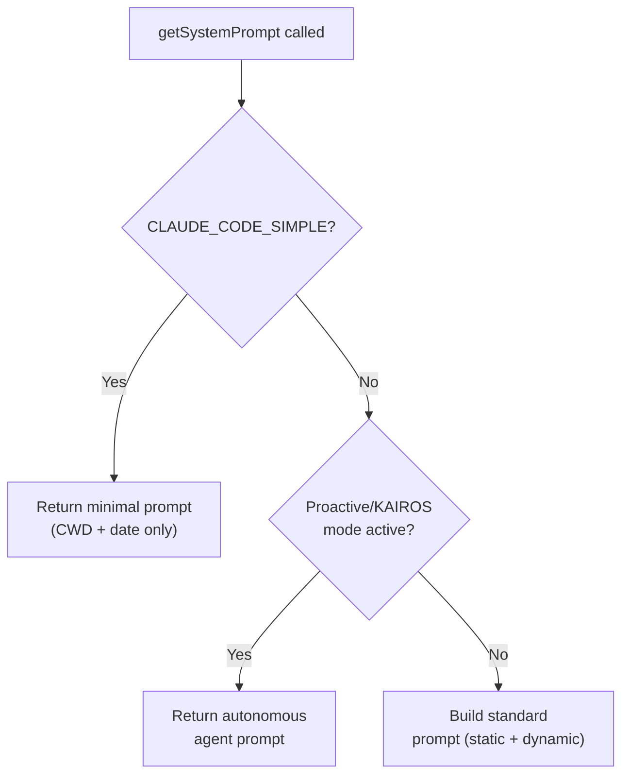
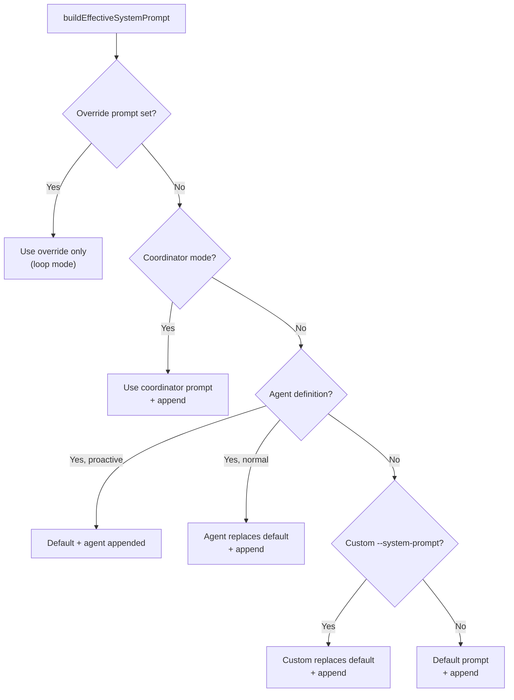

This post details how `claude.ts` transforms messages, builds the API request, and streams the response back to the query loop. This is what happens inside Step 8 (API CALL) of the message pipeline (Managing Message Context), and is referenced from Session Orchestration section 4.

---

## 1. Entry Point

`query.ts` calls `deps.callModel()` at line 659, which delegates to `queryModelWithStreaming()` in `claude.ts`:

```typescript
// query.ts:659
for await (const message of deps.callModel({
  messages: prependUserContext(messagesForQuery, userContext),
  systemPrompt: fullSystemPrompt,
  thinkingConfig: toolUseContext.options.thinkingConfig,
  tools: toolUseContext.options.tools,
  signal: toolUseContext.abortController.signal,
  options: { model, querySource, fallbackModel, ... },
}))
```

Note that `prependUserContext` runs in `query.ts` before passing messages in — it prepends a single synthetic `UserMessage` containing a `<system-reminder>` with session-level context:

```xml
<system-reminder>
As you answer the user's questions, you can use the following context:
# claudeMd
[contents of CLAUDE.md files]
# currentDate
Today's date is 2026-05-05.

      IMPORTANT: this context may or may not be relevant to your tasks.
</system-reminder>
```

The model sees this as the first user message in the conversation. Everything else happens inside `claude.ts`.

The `systemPrompt` argument arrives already assembled — `getSystemPrompt()` builds the default content, then `buildEffectiveSystemPrompt()` decides whether to use it or substitute an override/agent/custom prompt. This upstream assembly is covered in [Appendix A](#appendix-a-upstream-system-prompt-assembly). For what the prompt contains, see [The System Prompt]().

---

## 2. The Full Message Transformation Pipeline

Before messages reach the Anthropic API, they pass through `queryModel()` in `claude.ts`, which prepares three independent pieces for the request: messages, system prompt, and tools.

Inside `queryModel()`, three parallel paths run:

1. **System prompt path** — The pre-built `systemPrompt` string array is wrapped with an attribution header and CLI prefix, then `buildSystemPromptBlocks()` splits it at the cache boundary marker and assigns cache scopes (`global` for the static prefix, session-scoped for the rest).

2. **Tools path** — Each enabled tool's async `prompt()` method is called to generate its description, then the tool's Zod schema is converted to JSON Schema. Deferred tools get `defer_loading: true` instead of a full schema.

3. **Messages path** — The internal message array (6+ types including attachments, progress, system) is normalized into the strict `user`/`assistant` alternation the API requires. Attachments are reordered, orphaned tool calls are repaired, excess media is stripped, and finally `addCacheBreakpoints()` converts everything to `MessageParam[]` with cache markers.

All three converge into the final `params` object passed to `anthropic.beta.messages.stream()`.

```
messagesForQuery (from query.ts, after Steps 1-6)
    |
    v
prependUserContext(messages, userContext)         -- query.ts:660
  Prepends a synthetic UserMessage containing
  <system-reminder> with key-value context
  (claudeMd, gitStatus, currentDate, etc.)
    |
    v
queryModelWithStreaming()                        -- claude.ts:752
  |
  v
queryModel()                                     -- claude.ts:1017
  |
  |  ┌─── SYSTEM PROMPT PATH ──────────────────────────────────────┐
  +--+-- Wrap with attribution header + CLI prefix   -- claude.ts:1358
  |  |     Append advisor/chrome instructions
  |  |
  |  +-- buildSystemPromptBlocks(systemPrompt, ...)  -- claude.ts:1376
  |  |     Splits at SYSTEM_PROMPT_DYNAMIC_BOUNDARY
  |  |     Assigns cache scopes (global vs session)
  |  |     -> TextBlockParam[] with cache_control
  |  └─────────────────────────────────────────────────────────────┘
  |
  |  ┌─── TOOLS PATH ─────────────────────────────────────────────┐
  +--+-- toolToAPISchema() for each tool             -- claude.ts:1235
  |  |     Calls tool.prompt() for descriptions
  |  |     Sets defer_loading for deferred tools
  |  |     -> BetaToolUnion[]
  |  └─────────────────────────────────────────────────────────────┘
  |
  |  ┌─── MESSAGES PATH ───────────────────────────────────────────┐
  |  |                                                              |
  +--+-- normalizeMessagesForAPI(messages, tools)    -- claude.ts:1266
  |  |     Strips system/progress/attachment msgs
  |  |     Merges consecutive user messages
  |  |     Converts attachments to user content
  |  |     Strips stale tool_reference blocks
  |  |     Strips errored media blocks
  |  |     -> (UserMessage | AssistantMessage)[]
  |  |
  |  +-- ensureToolResultPairing(messagesForAPI)     -- claude.ts:1301
  |  |     Inserts synthetic error tool_results
  |  |     for orphaned tool_uses
  |  |     Strips orphaned tool_results
  |  |     (fixes resume/teleport gaps)
  |  |
  |  +-- stripAdvisorBlocks(messagesForAPI)          -- claude.ts:1305
  |  |     (only if advisor beta header not present)
  |  |
  |  +-- stripExcessMediaItems(messagesForAPI, 100)  -- claude.ts:1312
  |  |     Drops oldest images/docs if >100 media
  |  |     items (API rejects with confusing error)
  |  |
  |  +-- [optional] prepend deferred tool list       -- claude.ts:1337
  |  |     Adds <available-deferred-tools> message
  |  |     (only if tool search on + delta disabled)
  |  |
  |  +-- addCacheBreakpoints(messagesForAPI, ...)    -- claude.ts:1701
  |  |     Converts to MessageParam[] (API format)
  |  |     Adds cache_control markers
  |  |     Inserts cache_edits blocks (cached MC)
  |  |     -> MessageParam[] (ready for HTTP)
  |  └─────────────────────────────────────────────────────────────┘
  |
  v
anthropic.beta.messages.stream(params)           -- the actual API call
  params = { messages, system, tools, ... }
```

---

## 3. System Prompt Serialization

The effective system prompt arrives as a pre-built `string[]` from `query.ts` (see [Appendix A](#appendix-a-upstream-system-prompt-assembly) for how it's assembled upstream — it contains static sections, a boundary marker, and dynamic sections). `claude.ts` prepends headers and appends optional instructions (line 1358-1368), then `buildSystemPromptBlocks()` (line 3213) calls `splitSysPromptPrefix()` to split the combined array into blocks with cache scopes:

```
Attribution header            → cacheScope: null    (per-request fingerprint, never cached)
CLI prefix                    → cacheScope: null    (varies by session type)
Static sections               → cacheScope: 'global'  (shared fleet-wide)
─── BOUNDARY MARKER ───
Dynamic sections              → cacheScope: null    (session-specific)
Advisor instructions          → cacheScope: null    (appended after boundary, if enabled)
Chrome tool search instr.     → cacheScope: null    (appended after boundary, if enabled)
```

`splitSysPromptPrefix()` recognizes the attribution header and CLI prefix by content (string prefix matching), then uses `SYSTEM_PROMPT_DYNAMIC_BOUNDARY` to split the rest into static and dynamic. Advisor and chrome instructions land in the uncached tail because they're appended after the boundary — they don't break the global cache for the static prefix.

This is the **normal path**. There's also a fallback path when non-deferred MCP tools are present (`skipGlobalCacheForSystemPrompt = true`): MCP tool schemas are per-user, so the tool section can't be globally cached. In this case, the boundary is ignored and everything gets `cacheScope: 'org'` instead — shared within an organization but not fleet-wide.

| Condition | Static sections | Dynamic sections |
|-----------|----------------|-----------------|
| Normal (no MCP tools in schema) | `global` | `null` |
| MCP tools present (not deferred) | `org` | `org` |
| Global cache feature off | no scope | no scope |

See [The System Prompt]() for what the static and dynamic sections contain.

---

## 4. Tool Schema Building

Before the API call, `claude.ts` builds the tool schemas (line 1235-1246):

```
All registered tools (built-in + MCP)
    |
    +-- Filter: if tool search enabled, only include
    |   non-deferred + already-discovered deferred tools
    |   (ToolSearchTool always included)
    |
    +-- Filter: if tool search disabled, remove ToolSearchTool
    |
    +-- toolToAPISchema() for each tool
    |   Converts Tool -> BetaToolUnion (API format)
    |   Sets defer_loading: true for deferred tools
    |
    +-- Append advisor server tool (if enabled)
    |
    v
allTools: BetaToolUnion[]  --> sent as `tools` param
```

The dynamic tool loading system means not all tools are sent on every request. Deferred tools only appear in the schema after the model has discovered them via `ToolSearchTool` — their `tool_use_id`s are tracked in the message history, and `extractDiscoveredToolNames()` scans for them to decide which deferred tools to include.

---

## 5. normalizeMessagesForAPI (messages.ts:1989)

```typescript
function normalizeMessagesForAPI(
  messages: Message[],
  tools: Tools = [],
): (UserMessage | AssistantMessage)[]
```

This is the biggest transformation. It converts the internal message format (6+ types) into what the Anthropic API accepts (strictly `user` and `assistant` roles only). The function performs the following operations in order:

1. **Reorders attachments** — bubbles attachment messages up until they hit a tool result or assistant message.
2. **Strips virtual messages** — display-only messages (e.g., REPL inner tool calls) that should never reach the API.
3. **Filters non-API types** — removes `progress`, `system` (except `local_command`), and synthetic API error messages.
4. **Converts `local_command` system messages** — turns them into `UserMessage`s so the model can reference previous command output.
5. **Strips tool_reference blocks** — removed entirely if tool search is off; removed for unavailable tools (e.g., disconnected MCP server) if tool search is on.
6. **Strips errored media** — removes document/image blocks that previously caused PDF-too-large or image-too-large errors.
7. **Merges consecutive user messages** — Bedrock requires strict user/assistant alternation; even the first-party API merges them server-side, so this ensures consistency.
8. **Folds attachment content into user messages** — attachment messages become part of the adjacent user message's content.

The result is a clean `(UserMessage | AssistantMessage)[]` alternating sequence.

### Where it's called

| Call site | Purpose |
|---|---|
| `claude.ts:1266` | Main API call — normalize the full conversation. |
| `query.ts:855` | Normalize streaming tool results mid-stream. |
| `query.ts:1396` | Normalize tool results after execution. |
| `compact.ts:1293` | Normalize messages for the compaction API call. |

---

## 6. Cache Breakpoints and Message Conversion

`addCacheBreakpoints()` (line 3063) is the final step — it converts the normalized `(UserMessage | AssistantMessage)[]` into the SDK's `MessageParam[]`:

```typescript
function addCacheBreakpoints(
  messages: (UserMessage | AssistantMessage)[],
  enablePromptCaching: boolean,
  querySource?: QuerySource,
  useCachedMC?: boolean,
  newCacheEdits?: CachedMCEditsBlock | null,
  pinnedEdits?: CachedMCPinnedEdits[],
  skipCacheWrite?: boolean,
): MessageParam[]
```

For each message, the function calls `userMessageToMessageParam()` or `assistantMessageToMessageParam()` to produce the final `{ role: 'user' | 'assistant', content: [...] }` format the SDK expects.

It adds a `cache_control` marker to exactly **one** message — the last one in normal requests, or the second-to-last for fire-and-forget forks (like compaction, which shouldn't leave its own tail in the server cache).

For cached microcompact, it also inserts `cache_edits` blocks into user messages. These instruct the server to delete stale tool result content from the cached prefix without invalidating the rest of the cache.

---

## 7. The Final API Parameters

`paramsFromContext()` (line 1538) assembles the complete request object sent to the Anthropic SDK:

```typescript
{
  model: "claude-sonnet-4-6-20250514",
  messages: MessageParam[],              // from addCacheBreakpoints
  system: TextBlockParam[],              // from buildSystemPromptBlocks
  tools: BetaToolUnion[],                // tool schemas
  tool_choice: undefined,                // usually auto
  betas: ["..."],                        // feature beta headers
  metadata: { user_id: "..." },
  max_tokens: 8192,                      // or escalated 64K
  thinking: { type: "adaptive" },        // or { type: "enabled", budget_tokens: N }
  temperature: undefined,                // only set when thinking disabled
  context_management: { ... },           // if enabled
  output_config: {                       // effort, task_budget, structured output
    effort: "high",
    task_budget: { total: 500000, remaining: 350000 },
  },
  speed: "fast",                         // if fast mode active
}
```

Several of these parameters use **sticky latching** for beta headers: once a header is first sent (e.g., fast mode, cache editing, AFK mode), it keeps being sent for the rest of the session even if the feature is toggled off. This prevents mid-session cache key changes that would bust the prompt cache.

---

## 8. Retry and Streaming

The actual API call is wrapped in `withRetry()` (line 1778):

```
withRetry(getAnthropicClient, async (anthropic, attempt, context) => {
    |
    +-- anthropic.beta.messages.stream(params).withResponse()
    |
    +-- Iterate stream events:
    |     message_start    -> capture usage, headers, request ID
    |     content_block_start -> start content block
    |     content_block_delta -> accumulate text/thinking/tool_input
    |     content_block_stop  -> finalize block, yield AssistantMessage
    |     message_delta    -> capture final usage, stop_reason
    |     message_stop     -> cleanup
    |
    +-- On stream failure:
    |     +-- If retryable (429, 529, 5xx) -> retry with backoff
    |     +-- If streaming broke mid-response -> fall back to non-streaming
    |     +-- If prompt too long -> yield synthetic error AssistantMessage
    |     +-- If auth error -> re-create client and retry
    |
    v
yields: StreamEvent | AssistantMessage | SystemAPIErrorMessage
  back to query.ts Step 8
```

### Non-streaming fallback

When streaming fails mid-response (connection drop, timeout), `claude.ts` falls back to `executeNonStreamingRequest()` which makes a regular (non-streaming) API call with `anthropic.beta.messages.create()` and a per-attempt timeout (120s for remote sessions, 300s for local). This ensures the model's response is not lost even when the streaming connection is unreliable.

---

## 9. What query.ts Sees

From `query.ts`'s perspective, all of the above is invisible. It simply iterates the async generator stream:

```typescript
for await (const message of deps.callModel({ messages, ... })) {
  if (message.type === 'assistant') {
    assistantMessages.push(message)
    // check for tool_use blocks
  }
  if (message.type === 'stream_event') {
    // usage tracking, stream progress
  }
  // yield to QueryEngine for persistence
}
```

The `AssistantMessage` yielded back contains:
- `message.content` — text blocks, tool_use blocks, thinking blocks.
- `message.message.usage` — token counts (input, output, cache read/creation).
- `message.message.stop_reason` — `end_turn`, `tool_use`, or `max_tokens`.
- `message.apiError` — set if this is a synthetic error message (prompt_too_long, max_output_tokens).

---

## 10. Summary: What claude.ts Owns

| Responsibility | Details |
|---|---|
| **Message normalization** | `normalizeMessagesForAPI`, `ensureToolResultPairing`, `stripAdvisorBlocks`, `stripExcessMediaItems` |
| **Message conversion** | `userMessageToMessageParam`, `assistantMessageToMessageParam`, `addCacheBreakpoints` |
| **System prompt** | Assembly from parts, `buildSystemPromptBlocks` with cache markers |
| **Tool schemas** | `toolToAPISchema`, deferred/dynamic tool filtering |
| **Thinking config** | Adaptive vs budget, model capability checks |
| **Beta headers** | Tool search, prompt caching, cache editing, structured outputs, advisor, fast mode, AFK mode — with sticky latching |
| **Prompt caching** | `cache_control` breakpoints, global vs per-request scope, cache edits |
| **Model resolution** | Bedrock inference profiles, fallback models, fast mode |
| **Effort/budget** | `output_config.effort`, `output_config.task_budget` |
| **Retry** | `withRetry` with backoff, non-streaming fallback, auth retry |
| **Streaming** | SDK stream iteration, content block assembly, `AssistantMessage` construction |
| **Telemetry** | API timing, request IDs, cache hit rates, fingerprinting, tracing spans |

---

## Appendix A: Upstream System Prompt Assembly

The `systemPrompt` argument that `claude.ts` receives is built upstream in two steps before `query.ts` passes it to `deps.callModel()`.

### Content Generation (`getSystemPrompt`)

`fetchSystemPromptParts()` in `queryContext.ts` calls `getSystemPrompt()` (`prompts.ts:444`) to build the default prompt content:



The standard path returns a `string[]` of static sections (identity, behavioral guidelines, tool usage, tone) followed by a cache boundary marker, followed by dynamic sections (session guidance, auto-memory, environment info, MCP instructions). See [The System Prompt]() for full details on what each section contains.

### Priority Resolution (`buildEffectiveSystemPrompt`)

`REPL.tsx` passes the default prompt into `buildEffectiveSystemPrompt()` (`systemPrompt.ts:41`), which decides whether to use it or substitute an alternative:



Priority order (highest to lowest):
1. **Override** — Set by loop mode; completely replaces everything
2. **Coordinator** — When `CLAUDE_CODE_COORDINATOR_MODE` is active
3. **Agent** — `mainThreadAgentDefinition` (appended in proactive mode, replaces otherwise)
4. **Custom** — User-provided via `--system-prompt` flag
5. **Default** — The standard Claude Code prompt built by `getSystemPrompt()`

The `appendSystemPrompt` (from `--append-system-prompt`) is always added at the end regardless of which source wins (except for overrides).

The result is stored on `toolUseContext.renderedSystemPrompt` and passed as `systemPrompt` into `query()`. Inside `query.ts`, it's wrapped with `appendSystemContext()` to become `fullSystemPrompt`, then passed to `deps.callModel()`.
