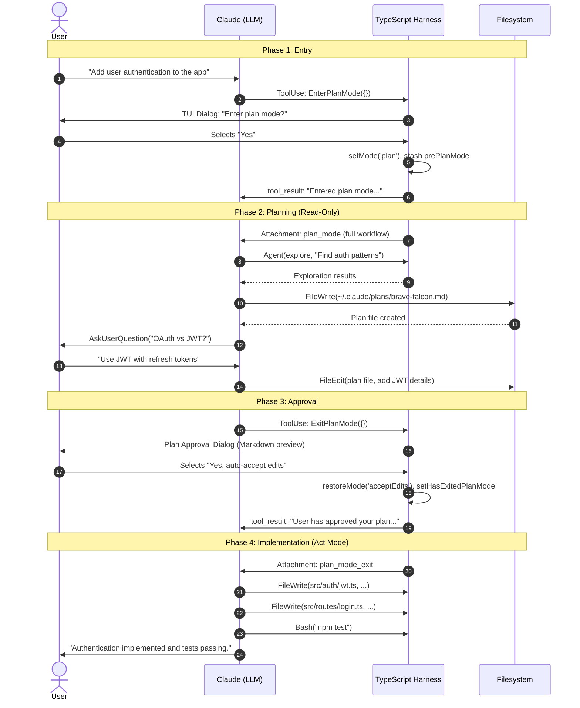
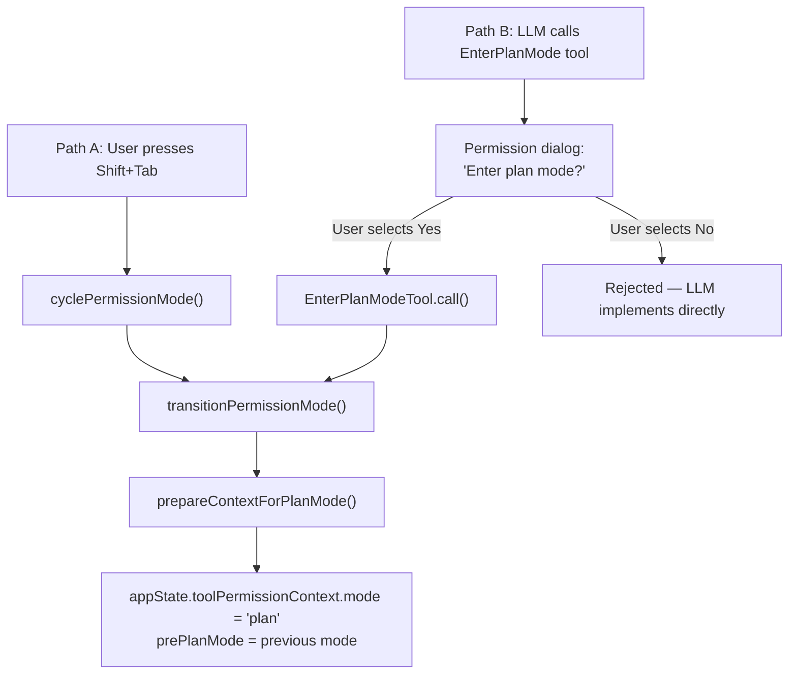
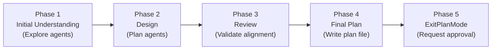
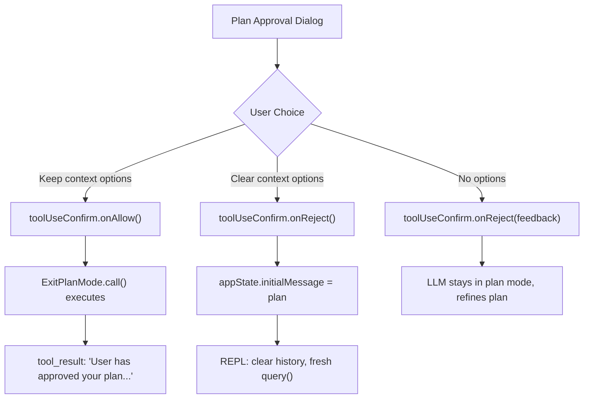
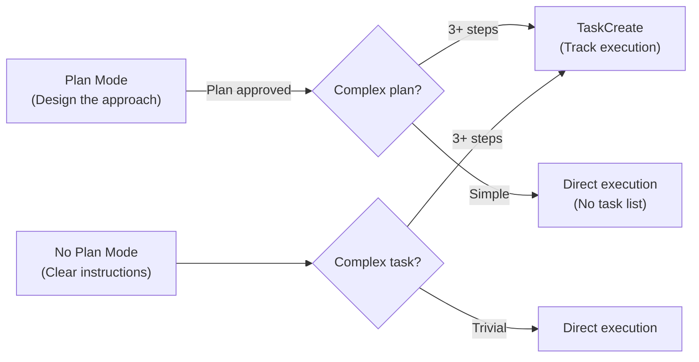

This post provides a comprehensive technical deep dive into the Plan/Act Mode feature in Claude Code. Plan mode is a permission-level behavioral override that constrains the LLM to read-only exploration and plan authoring. The user reviews and approves the plan before the system transitions back to "act mode" (normal execution), where full tool access is restored. We trace every component involved — from the user experience through state management, system prompt injection, plan file persistence, and the multi-option approval dialog.

For context on how tools are executed and permissions checked, see [Human-in-the-Loop](). For how attachments are injected into the message pipeline, see [Managing Message Context]().

---

## 1. The User Experience

Below is what you actually see in the terminal during each phase of plan mode.

### Entry

Plan mode can be entered in two ways:

**Path A: User-Initiated via Shift+Tab** — You press `Shift+Tab` to cycle the mode indicator until it shows "Plan":

```
default ──Shift+Tab──→ acceptEdits ──Shift+Tab──→ plan
```

The prompt border changes color immediately. No confirmation dialog appears because *you* set the mode. You then type your request and hit Enter.

**Path B: LLM-Initiated via EnterPlanMode Tool (Most Common)** — You type a request and Claude decides it needs to plan before coding:

```
You: Add user authentication with JWT and refresh tokens

┌─ Enter plan mode? ─────────────────────────────────────┐
│                                                          │
│  Claude wants to enter plan mode to explore and design   │
│  an implementation approach.                             │
│                                                          │
│  In plan mode, Claude will:                              │
│   · Explore the codebase thoroughly                      │
│   · Identify existing patterns                           │
│   · Design an implementation strategy                    │
│   · Present a plan for your approval                     │
│                                                          │
│  No code changes will be made until you approve the      │
│  plan.                                                   │
│                                                          │
│  > Yes, enter plan mode                                  │
│    No, start implementing now                            │
└──────────────────────────────────────────────────────────┘
```

If you select "Yes", Claude enters plan mode. If "No", Claude skips planning and implements directly.

### Planning

Once in plan mode (regardless of entry path), Claude explores the codebase in read-only mode, may ask you clarifying questions via interactive dialogs, and writes a Markdown plan file to disk. You see Claude reading files, spawning explore agents, and iteratively building the plan — but no code is written.

### Approval

When Claude finishes the plan, it presents the approval dialog:

```
┌─ Plan ─────────────────────────────────────────────────┐
│                                                          │
│  ## Context                                              │
│  Adding JWT auth with refresh token rotation...          │
│                                                          │
│  ## Changes                                              │
│  - src/auth/jwt.ts — new token utilities                 │
│  - src/routes/login.ts — login endpoint                  │
│  - src/middleware/auth.ts — verification middleware       │
│                                                          │
│  ## Verification                                         │
│  npm test                                                │
│                                                          │
│  ─────────────────────────────────────────────────────   │
│  Would you like to proceed?                              │
│                                                          │
│  > Yes, auto-accept edits                                │
│    Yes, manually approve edits                           │
│    No (type feedback to refine the plan)                 │
│                                                          │
│  ctrl-g to edit in VS Code · ~/.claude/plans/bold-fox.md │
└──────────────────────────────────────────────────────────┘
```

On approval, the prompt border color changes (indicating the new permission mode), and Claude begins implementing — writing files, running tests, executing commands.

If you select "No" and type feedback (e.g., "Also handle token revocation"), Claude stays in plan mode, refines the plan, and presents it again.

**Keyboard shortcuts during approval:**

- **Shift+Tab:** Immediately selects "auto-accept edits" (fast approval without scrolling through options).
- **Ctrl+G:** Opens the plan file in your `$EDITOR` (e.g., VS Code) for manual editing before approving. Changes are saved back to disk and the dialog reflects the edit.

### Implementation

After approval, the prompt border color changes (indicating the new permission mode) and Claude begins executing the plan — writing files, running commands, and running tests. The read-only constraint is gone; Claude now has full tool access governed by whichever mode you selected (accept edits, bypass permissions, etc.).

During implementation, you can:
- **Watch passively** — Claude works through the plan autonomously.
- **Interrupt with Ctrl+C** and type a new message to redirect (e.g., "skip the tests for now").
- **Press Shift+Tab** to cycle back to plan mode if you want to revise the plan before Claude finishes.
- **Provide feedback** when permission prompts appear (if in `default` or `acceptEdits` mode).

The plan file remains on disk at `~/.claude/plans/{slug}.md` — Claude can reference it at any time, and you can read it externally to track what was agreed upon.

---

## 2. End-to-End Lifecycle

The following diagram traces the full lifecycle for Path B (LLM-initiated) — from the user's initial request through planning, approval, and implementation. For Path A (Shift+Tab), the flow is identical starting from Phase 2 — the entry phase is replaced by the user's direct mode change via keypress.



---

## 3. Plan Mode State Model

The planning feature is supported by four pieces of state that work together — a permission mode flag, a plan file on disk, lifecycle transition flags, and injected prompt attachments. This section details each one.

### A. Permission Mode (`appState.toolPermissionContext.mode`)

This is the **global switch**. Plan mode is a value of `appState.toolPermissionContext.mode`. The full set of modes is defined as a TypeScript union:

* **File:** `src/types/permissions.ts`

```typescript
export const EXTERNAL_PERMISSION_MODES = [
  'acceptEdits',
  'bypassPermissions',
  'default',
  'dontAsk',       // Defined but not exposed in the UI cycle (Shift+Tab)
  'plan',
] as const

export type ExternalPermissionMode = (typeof EXTERNAL_PERMISSION_MODES)[number]

// Exhaustive mode union for typechecking.
// 'auto' uses a transcript classifier to approve/deny tools (Anthropic-internal only, gated behind TRANSCRIPT_CLASSIFIER)
export type InternalPermissionMode = ExternalPermissionMode | 'auto' | 'bubble'
export type PermissionMode = InternalPermissionMode
```

When this value is set to `'plan'`, it activates effects across the system:

| Aspect                    | Effect                                                                                                                                                                                 |
| :------------------------ | :------------------------------------------------------------------------------------------------------------------------------------------------------------------------------------- |
| **System Prompt**         | A `plan_mode` attachment is injected into the message context every N turns, instructing the LLM that it "MUST NOT make any edits" except the plan file.                               |
| **Permission Evaluation** | The permission system still prompts the user if the LLM attempts non-read-only tools, providing a hard backstop for the soft prompt constraint.                                        |
| **Tool Availability**     | Two plan-specific tools (`EnterPlanMode`, `ExitPlanMode`) become relevant for lifecycle management. The LLM is guided to end its turn with either `AskUserQuestion` or `ExitPlanMode`. |
| **Plan File**             | A Markdown file is created at `~/.claude/plans/{slug}.md` — the one file the LLM *is* allowed to write during plan mode.                                                               |
| **UI Indicator**          | The prompt border changes to the `planMode` color (distinct from other modes), signaling to the user that the system is in a read-only state.                                          |
| **State Stashing**        | The previous mode is saved as `prePlanMode` so it can be restored on exit.                                                                                                             |

### B. The Plan File (Disk Persistence)

The plan is persisted as a Markdown file on disk — the one file the LLM *is* allowed to write during plan mode.

* **File:** `src/utils/plans.ts`

```typescript
export function getPlanFilePath(agentId?: AgentId): string {
  const planSlug = getPlanSlug(getSessionId())
  if (!agentId) {
    return join(getPlansDirectory(), `${planSlug}.md`)
  }
  return join(getPlansDirectory(), `${planSlug}-agent-${agentId}.md`)
}
```

- Default location: `~/.claude/plans/{word-slug}.md`
- Configurable via `settings.json`: `plansDirectory` (relative to project root, validated against path traversal).
- The slug is a randomly generated word pair (e.g., `brave-falcon.md`), unique per session.
- Sub-agents get suffixed filenames: `brave-falcon-agent-{agentId}.md`.

#### Plan File Structure A/B Testing

The system runs an experiment (`tengu_pewter_ledger`) on the Phase 4 instructions controlling plan verbosity:

| Variant   | Key Instruction                                                                                           |
| :-------- | :-------------------------------------------------------------------------------------------------------- |
| `control` | "Ensure that the plan file is concise enough to scan quickly, but detailed enough to execute effectively" |
| `trim`    | "One-line Context: what is being changed and why"                                                         |
| `cut`     | "Do NOT write a Context or Background section. Prose is a sign you are padding."                          |
| `cap`     | "**Hard limit: 40 lines.** If the plan is longer, delete prose — not file paths."                         |

### C. Transition Flags (`prePlanMode` and Lifecycle State)

Plan mode entry stashes the user's previous permission mode so it can be restored on exit.

* **File:** `src/utils/permissions/permissionSetup.ts` (line 1462)

```typescript
export function prepareContextForPlanMode(
  context: ToolPermissionContext,
): ToolPermissionContext {
  const currentMode = context.mode
  if (currentMode === 'plan') return context
  // ...auto mode handling...
  return { ...context, prePlanMode: currentMode }
}
```

Three flags in `src/bootstrap/state.ts` track the plan lifecycle:

| Flag                          | Purpose                                                       |
| :---------------------------- | :------------------------------------------------------------ |
| `hasExitedPlanMode`           | Signals re-entry guidance (plan_mode_reentry attachment)      |
| `needsPlanModeExitAttachment` | One-time flag to inject a "you have exited plan mode" message |
| `needsAutoModeExitAttachment` | One-time flag if auto mode was deactivated during plan exit   |

The `handlePlanModeTransition(fromMode, toMode)` helper manages these flags:
```typescript
if (toMode === 'plan') {
  STATE.needsPlanModeExitAttachment = false  // Clear pending exit
}
if (fromMode === 'plan') {
  STATE.needsPlanModeExitAttachment = true   // Trigger exit notification
}
```

These flags are consumed during Phase 3 (Section 6) and Phase 4 (Section 7).

### D. Attachments (Injected System Prompt Messages)

Once in plan mode, the system injects `plan_mode` attachments into the message context. These are not static — they follow a **full/sparse cycle** to avoid overwhelming the context window with repeated instructions.

* **File:** `src/utils/attachments.ts` (line 1186)

The injection logic:
1. **First attachment:** Always `full` (the complete 5-phase workflow or interview instructions).
2. **Subsequent:** Every Nth attachment (configurable) is `full`; others are `sparse` (a 1-2 line reminder).
3. **Throttled:** Attachments only fire every N human turns, not on every tool loop iteration.

#### The Core Constraint

Both `full` and `sparse` variants begin with the same critical instruction:

```markdown
Plan mode is active. The user indicated that they do not want you to execute yet -- you MUST NOT make any
edits (with the exception of the plan file mentioned below), run any non-readonly tools (including
changing configs or making commits), or otherwise make any changes to the system. This supercedes any
other instructions you have received.
```

This is a **soft constraint** — it is enforced by the system prompt, not by a hard tool-blocking mechanism. The LLM is told it cannot write, and the plan file is named as the sole exception. However, the permission system (subsection A) provides a backstop: file write operations during plan mode will still trigger the standard permission dialog, providing a hard stop for any LLM misbehavior.

The full workflow instructions injected by these attachments are detailed in Section 5 (Phase 2: Planning).

### Summary

When `appState.toolPermissionContext.mode` is set to `'plan'`, these four mechanisms activate simultaneously:

| Mechanism                | Role                                                                              |
| :----------------------- | :-------------------------------------------------------------------------------- |
| **Permission Mode** (A)  | Hard backstop — prompts user on non-read-only tool calls                          |
| **Plan File** (B)        | Durable artifact — survives compaction, editable externally                       |
| **Transition Flags** (C) | Lifecycle management — enables restore, re-entry guidance, exit notifications     |
| **Attachments** (D)      | Soft constraint — instructs LLM to stay read-only, provides workflow instructions |

When the user approves the plan, the system exits plan mode and transitions to an elevated permission mode of the user's choosing (accept edits, bypass permissions, or auto mode for Anthropic-internal users) — this is "act mode."

---

## 4. Phase 1: Entry (Two Paths, Same Result)

This section details the implementation of **Phase 1: Entry** from the lifecycle diagram in Section 2. Both entry paths converge to the same outcome: `appState.toolPermissionContext.mode` is set to `'plan'`. They differ only in who initiates the transition and whether a confirmation dialog is shown.



### Path A: Shift+Tab Carousel (User-Initiated)

The user presses `Shift+Tab` (or `Meta+M` on older Windows terminals) to cycle through permission modes. The full carousel order for external users:

```
Shift+Tab    Shift+Tab    Shift+Tab         Shift+Tab
default ──→ acceptEdits ──→ plan ──→ bypassPermissions ──→ default
```

| Mode                | Behavior                                                            |
| :------------------ | :------------------------------------------------------------------ |
| `default`           | Every tool call prompts the user for permission                     |
| `acceptEdits`       | File writes auto-approved; Bash/MCP still prompt                    |
| `plan`              | LLM constrained to read-only; plan file is the only writable target |
| `bypassPermissions` | Everything auto-approved (no prompts)                               |

Note: `bypassPermissions` is only available if `isBypassPermissionsModeAvailable` is set in the user's config — otherwise the cycle skips it (`plan → default`). Ant users get a different cycle entirely: `default → bypassPermissions → auto → default`.

When the user presses Shift+Tab, the `handleCycleMode` callback in `PromptInput.tsx` executes the following sequence:

* **File:** `src/components/PromptInput/PromptInput.tsx` (lines 1448–1547)

```typescript
// Step 1: Compute the next mode
const nextMode = getNextPermissionMode(toolPermissionContext, teamContext);

// Step 2: Call cyclePermissionMode to apply side effects
// (internally calls transitionPermissionMode() → prepareContextForPlanMode())
const { context: preparedContext } = cyclePermissionMode(toolPermissionContext, teamContext);

// Step 3: Track plan mode usage
if (nextMode === 'plan') {
  saveGlobalConfig(current => ({
    ...current,
    lastPlanModeUse: Date.now()
  }));
}

// Step 4: Apply the mode change to app state
setAppState(prev => ({
  ...prev,
  toolPermissionContext: {
    ...preparedContext,
    mode: nextMode
  }
}));
```

No tool call is involved. No confirmation dialog is shown. No LLM involvement. The mode is applied immediately as a direct state mutation. The LLM only learns it's in plan mode on its **next turn**, when the `plan_mode` attachment is injected into its context.

### Path B: EnterPlanMode Tool (LLM-Initiated)

The LLM autonomously decides to enter plan mode by calling the `EnterPlanMode` tool. This is the more common path. The decision is entirely **prompt-driven** — the tool prompt (`src/tools/EnterPlanModeTool/prompt.ts`) tells the LLM when to use it, and the guidance differs by user type:

**External users** — Biased toward planning:
> "Use this tool proactively when you're about to start a non-trivial implementation task."
> Conditions: new features, multiple valid approaches, multi-file changes, unclear requirements, architectural decisions.

**Ant users** — Biased toward action:
> "Use this tool when a task has genuine ambiguity about the right approach."
> Skip planning when: "The user says something like 'can we work on X' or 'let's do X' — just get started."

Both prompts define explicit "When NOT to Use" sections:
- Single-line fixes, typos, obvious bugs
- Tasks with very specific instructions from the user
- Pure research/exploration tasks

Once the LLM decides to plan, the flow is:

1. **LLM emits** `tool_use: EnterPlanMode({})` (no parameters).
2. **Permission check** — `toolExecution.ts` runs the tool through `canUseTool()` (see [Human-in-the-Loop](), Section 6), which returns `{ behavior: 'ask' }`. This pushes the tool call onto the `ToolUseConfirm` queue, suspending the execution loop.
3. **Dialog renders** — `PermissionRequest.tsx` looks up the tool in its registry and mounts `EnterPlanModePermissionRequest`, rendering the "Enter plan mode?" overlay (illustrated in Section 1, Path B).

    * **File:** `src/components/permissions/PermissionRequest.tsx` (line 65)
    ```typescript
    case EnterPlanModeTool:
      return EnterPlanModePermissionRequest;
    ```

4. **User decides:**
   - **"Yes"** → the component calls `toolUseConfirm.onAllow({}, [{ type: 'setMode', mode: 'plan', destination: 'session' }])`, which applies the mode change. Then `call()` executes.
   - **"No"** → the component calls `toolUseConfirm.onReject()`. The LLM receives a rejection message and proceeds with direct implementation. `call()` never runs.
5. **`call()` executes** (only on approval) — applies the same state change defensively (handles cases where the permission flow didn't set the mode):

    * **File:** `src/tools/EnterPlanModeTool/EnterPlanModeTool.ts`

    ```typescript
    async call(_input, context) {
      if (context.agentId) {
        throw new Error('EnterPlanMode tool cannot be used in agent contexts')
      }
      const appState = context.getAppState()
      handlePlanModeTransition(appState.toolPermissionContext.mode, 'plan')
      context.setAppState(prev => ({
        ...prev,
        toolPermissionContext: applyPermissionUpdate(
          prepareContextForPlanMode(prev.toolPermissionContext),
          { type: 'setMode', mode: 'plan', destination: 'session' },
        ),
      }))
      return { data: { message: 'Entered plan mode...' } }
    }
    ```

Key constraints:
- Only the **Head Agent** can enter plan mode. Sub-agents are explicitly blocked (`if (context.agentId) throw`).
- The tool is **disabled** when `--channels` is active (Telegram/Discord mode), because the approval dialog requires the terminal TUI.

### Key Differences Between Paths

|                     | Path A: Shift+Tab                                | Path B: EnterPlanMode Tool  |
| :------------------ | :----------------------------------------------- | :-------------------------- |
| Initiated by        | User keypress                                    | LLM tool call               |
| Confirmation dialog | None                                             | "Enter plan mode?" Yes/No   |
| LLM awareness       | Learns on next turn (via `plan_mode` attachment) | Immediate (via tool_result) |
| Can be declined     | No (user chose it)                               | Yes (user can select "No")  |

---

## 5. Phase 2: Planning (The 5-Phase Workflow)

For external users without the interview phase enabled, the system instructs the LLM to follow a structured 5-phase workflow:

* **File:** `src/utils/messages.ts` (line 3207)



| Phase                    | Goal                          | Agents                                         |
| :----------------------- | :---------------------------- | :--------------------------------------------- |
| 1. Initial Understanding | Explore codebase              | Up to 3 `explore` agents in parallel           |
| 2. Design                | Design implementation         | Up to 3 `plan` agents (subscription-dependent) |
| 3. Review                | Validate against requirements | Main agent reads critical files                |
| 4. Final Plan            | Write plan to file            | Main agent uses FileWrite/FileEdit             |
| 5. ExitPlanMode          | Present for approval          | Main agent calls `ExitPlanMode` tool           |

**Agent count is subscription-gated:**
* **File:** `src/utils/planModeV2.ts`

```typescript
export function getPlanModeV2AgentCount(): number {
  if (subscriptionType === 'max' && rateLimitTier === 'default_claude_max_20x') return 3
  if (subscriptionType === 'enterprise' || subscriptionType === 'team') return 3
  return 1
}
```

### The Interview Phase (Alternative Workflow)

When enabled (always for Ant users, gate-controlled for external), the 5-phase workflow is replaced with an **iterative pair-planning loop**:

```
┌────────────────────────────────────────────┐
│  Explore → Update plan file → Ask user     │
│       ↑                            │       │
│       └────────────────────────────┘       │
│                                            │
│  Exit when plan is complete                │
└────────────────────────────────────────────┘
```

Key difference: instead of front-loading exploration, the LLM iteratively builds the plan by alternating between reading code, writing findings to the plan file, and asking the user clarifying questions via `AskUserQuestion`. The plan file starts as a rough skeleton and grows incrementally.

---

## 6. Phase 3: Approval

When the LLM finishes writing the plan, it calls `ExitPlanMode`. This tool has `requiresUserInteraction: true` (for non-teammates), which triggers the full HITL flow described in [Human-in-the-Loop]().

### Validation Gate

Before the dialog appears, `validateInput` checks:
```typescript
const mode = getAppState().toolPermissionContext.mode
if (mode !== 'plan') {
  return {
    result: false,
    message: 'You are not in plan mode. This tool is only for exiting plan mode after writing a plan.'
  }
}
```

### The Multi-Option Approval Dialog

The user sees the plan content rendered as Markdown, with a multi-option selector at the bottom.

* **File:** `src/components/permissions/ExitPlanModePermissionRequest/ExitPlanModePermissionRequest.tsx`

The options presented depend on the user's configuration. For a **typical external user**, the baseline options are:

| Option                                  | Action                                             | `ExitPlanMode.call()` runs? |
| :-------------------------------------- | :------------------------------------------------- | :-------------------------- |
| **Yes, auto-accept edits**              | Keep context, set mode to `acceptEdits`, `onAllow` | **Yes**                     |
| **Yes, manually approve edits**         | Keep context, set mode to `default`, `onAllow`     | **Yes**                     |
| **No, keep planning** (with text input) | Reject, send feedback back to LLM                  | No                          |

Additional options appear based on configuration flags:

| Flag                               | Condition                                       | Extra Option                                         | `call()` runs?                 |
| :--------------------------------- | :---------------------------------------------- | :--------------------------------------------------- | :----------------------------- |
| `showClearContext`                 | `settings.showClearContextOnPlanAccept`         | "Yes, clear context (X% used) and auto-accept edits" | **No** (rejects, REPL handles) |
| `isBypassPermissionsModeAvailable` | User config                                     | "Yes, and bypass permissions" (replaces auto-accept) | **Yes**                        |
| `isAutoModeAvailable`              | `TRANSCRIPT_CLASSIFIER` feature flag (Ant-only) | "Yes, and use auto mode"                             | **Yes**                        |
| `showUltraplan`                    | `ULTRAPLAN` feature flag                        | "No, refine with Ultraplan on the web"               | No                             |

The key architectural insight: **"clear context" options reject the tool call** — `ExitPlanMode.call()` never executes. Instead, the dialog sets `appState.initialMessage` and the REPL (`src/screens/REPL.tsx`) handles the transition. **"Keep context" options call `onAllow`** — `ExitPlanMode.call()` executes and the tool result flows back to the LLM in the same conversation.



### Why "Clear Context" Rejects

When the user selects a "clear context" option:

1. The dialog **rejects** the tool use (unblocking the query loop).
2. It sets `appState.initialMessage` with the plan text as a fresh user message.
3. The REPL detects `initialMessage`, regenerates the session ID, and starts a fresh `query()` call.
4. The LLM sees: `"Implement the following plan:\n\n{plan content}"` — it has no memory of the planning phase.

This prevents the planning context (explore agent results, code snippets, intermediate reasoning) from consuming the context window during implementation. `ExitPlanMode.call()` is unnecessary because the entire session is being replaced.

### Why "Keep Context" Allows

When the user selects a "keep context" option:
1. The dialog calls `toolUseConfirm.onAllow(updatedInput, permissionUpdates)`.
2. `ExitPlanMode.call()` executes — restores the mode, sets transition flags.
3. The tool result is injected into the existing conversation: `"User has approved your plan. You can now start coding."`.
4. The LLM retains full memory of its exploration and reasoning.

### The Post-Approval Transition

When `ExitPlanMode.call()` executes after approval, it performs the mode restoration:

* **File:** `src/tools/ExitPlanModeTool/ExitPlanModeV2Tool.ts` (line 357)

```typescript
context.setAppState(prev => {
  if (prev.toolPermissionContext.mode !== 'plan') return prev
  setHasExitedPlanMode(true)
  setNeedsPlanModeExitAttachment(true)
  let restoreMode = prev.toolPermissionContext.prePlanMode ?? 'default'
  // ...auto mode gate checks...
  return {
    ...prev,
    toolPermissionContext: {
      ...baseContext,
      mode: restoreMode,
      prePlanMode: undefined,
    },
  }
})
```

The tool result message tells the LLM what to do next:

```typescript
content: `User has approved your plan. You can now start coding. Start with updating your todo list if applicable

Your plan has been saved to: ${filePath}
You can refer back to it if needed during implementation.${teamHint}

## Approved Plan:
${plan}`
```

If multi-agent swarms are enabled, the `teamHint` nudges toward parallel execution:
> "If this plan can be broken down into multiple independent tasks, consider using the TeamCreate tool to create a team and parallelize the work."

---

## 7. Phase 4: Implementation

After the user approves the plan, the system transitions to "act mode" — full tool access is restored and the LLM begins executing the plan. This section describes what happens on the first iteration after approval.

### The Plan Mode Exit Attachment

Within the same agentic loop iteration where `ExitPlanMode` executes (Step 9), the attachment system at Step 10 (`getAttachmentMessages()`) detects that `needsPlanModeExitAttachment` is `true` and generates a one-time `plan_mode_exit` attachment. The LLM sees it on the next API call (Step 8 of the following iteration). See [Managing Message Context](), Section 1 for the full step numbering.

* **File:** `src/utils/messages.ts` (line 3848)

```markdown
## Exited Plan Mode

You have exited plan mode. You can now make edits, run tools, and take actions.
The plan file is located at {planFilePath} if you need to reference it.
```

This is a critical one-shot notification. Without it, the LLM might continue behaving as if read-only constraints apply — especially after compaction removes the approval dialog from context.

### What the LLM Does Next

With full tool access restored, the LLM's next action depends on the tool result it received from `ExitPlanMode.call()`:

```
"User has approved your plan. You can now start coding. Start with updating your todo list if applicable"
```

Based on this nudge and its general instructions, the LLM typically:
1. Creates a task list (via `TaskCreate`) if the plan has 3+ steps — see Section 10 for this relationship.
2. Or begins implementing directly if the plan is simple enough.

The plan file remains on disk at `~/.claude/plans/{slug}.md` and can be referenced at any time via `Read`.

---

The following sections cover edge cases and extensions beyond the standard plan/act lifecycle.

---

## 8. Plan Mode Re-entry

If the user re-enters plan mode after having previously exited (e.g., cycling with Shift+Tab again), the system injects a `plan_mode_reentry` attachment:

```markdown
## Re-entering Plan Mode

You are returning to plan mode after having previously exited it. A plan file exists at {planFilePath}
from your previous planning session.

Before proceeding with any new planning, you should:
1. Read the existing plan file to understand what was previously planned
2. Evaluate the user's current request against that plan
3. Decide how to proceed:
   - Different task: start fresh by overwriting the existing plan
   - Same task, continuing: modify the existing plan while cleaning up outdated sections
```

---

## 9. Plan Mode in Multi-Agent Swarms (Teammates)

For worker agents (teammates) that have `isPlanModeRequired()`, the ExitPlanMode flow diverges:

1. The teammate writes its plan to disk.
2. On calling `ExitPlanMode`, instead of showing a local TUI dialog, the tool **sends a `plan_approval_request` to the team leader's mailbox**.
3. The teammate enters `awaitingPlanApproval` state (shows a spinner in the task list).
4. The team leader reads the mailbox, reviews the plan, and sends an approval/rejection via `SendMessage`.
5. On approval, the teammate exits plan mode and begins implementation.

```typescript
const approvalRequest = {
  type: 'plan_approval_request',
  from: agentName,
  timestamp: new Date().toISOString(),
  planFilePath: filePath,
  planContent: plan,
  requestId,
}
await writeToMailbox('team-lead', { from: agentName, text: jsonStringify(approvalRequest) }, teamName)
```

This prevents multiple agents from simultaneously presenting approval dialogs in the terminal.

---

## 10. Reflection: Relationship Between Plan Mode and the Task List

Plan mode and the Task List (TodoV2) are **sequential but independent** features (see [Task List]() for full details on the task system). They are connected by a single soft nudge, but neither requires the other.

An important distinction: plan mode produces a **plan file** — a Markdown document describing the implementation approach (what to change, which files, how to verify). This is not a task list. The task list is a separate JSON-backed graph of executable steps with status tracking (`pending` → `in_progress` → `completed`). The plan describes *what to do*; the task list tracks *doing it*.

### The Connection Point

The only explicit link between the two is in the `ExitPlanMode` tool result message:

* **File:** `src/tools/ExitPlanModeTool/ExitPlanModeV2Tool.ts` (line 483)

```typescript
content: `User has approved your plan. You can now start coding. Start with updating your todo list if applicable
...`
```

The phrase "if applicable" makes this a **soft nudge**, not a requirement. The LLM decides autonomously whether the approved plan warrants a task list based on the `TaskCreate` tool's own "When NOT to Use" logic (trivial tasks, fewer than 3 steps, etc.).

### Intended Sequencing



### The Trigger Overlap Problem

Both tools share overlapping triggering conditions in their prompts:

| Condition          | EnterPlanMode Prompt    | TaskCreate Prompt            |
| :----------------- | :---------------------- | :--------------------------- |
| Non-trivial task   | Primary gate            | Primary gate                 |
| Multi-file changes | Explicit condition (#5) | Implied (complex multi-step) |
| New feature        | Explicit condition (#1) | Suitable (complex task)      |

**How the LLM disambiguates:**

The key differentiator is **uncertainty about the approach**:

- **EnterPlanMode** = "I don't know the right approach yet. I need to explore, gather context, and get user buy-in before writing code."
- **TaskCreate** = "I know the approach. The work is multi-step and I need to track progress during execution."

The EnterPlanMode prompt makes this explicit:
> "Getting user sign-off on your approach **before writing code** prevents wasted effort and ensures alignment."

While TaskCreate's prompt says:
> "Use this tool to create a structured task list for your **current coding session**."

One operates *before* code is written (design phase); the other operates *during* code writing (execution phase).

### The Gap: No Explicit Disambiguation Rule

The system does **not** include a single prompt that says "If you're unsure whether to plan or create tasks, here's how to decide." The disambiguation relies on the LLM inferring from the separate tool prompts that:

1. `EnterPlanMode` requires user approval (`requiresUserInteraction: true`) and blocks all writes — it's for alignment.
2. `TaskCreate` is autonomous (no approval needed) and doesn't restrict tools — it's for organization.

In practice, for ambiguous cases like "Add a new API endpoint with tests":
- If the LLM has little context about the codebase → it enters plan mode first, then creates tasks after approval.
- If the LLM already understands the conventions (from earlier exploration or CLAUDE.md) → it skips planning and goes straight to `TaskCreate`.

### When Both Are Used Together

The most common combined flow:

1. **Plan mode:** LLM explores, writes plan, user approves.
2. **Post-approval nudge:** `"Start with updating your todo list if applicable"`
3. **Task creation:** LLM calls `TaskCreate` for each major step from the plan.
4. **Execution loop:** LLM works through tasks (`in_progress` → `completed`) using the full tool suite.

When swarms are enabled, the `teamHint` in the tool result pushes toward `TeamCreate` instead, which implicitly creates a shared task list for the team:
> "If this plan can be broken down into multiple independent tasks, consider using the TeamCreate tool to create a team and parallelize the work."

For a full deep dive into how teams are created, how teammates coordinate via the shared task list, and how `planModeRequired` constrains teammates to plan before implementing, see [Agent Team]().

---

## 11. Reflection: Why Plan Mode is a Permission Mode, Not a Separate Agent

An alternative design would implement plan mode as a separate "planning agent" with its own system prompt and tool set. Claude Code instead integrates planning into the existing permission system. Note: plan mode does spawn `explore`/`plan` sub-agents for research and design (Section 5), but the orchestration remains with the main agent — plan mode itself is not delegated to a separate agent.

The design rationale:

### A. Mode Persistence Across Interrupts

A separate agent would need its own lifecycle management, state recovery, and handoff protocol. By making plan mode a field on `ToolPermissionContext` (persisted to the session transcript), it survives `Ctrl+C`, terminal crashes, and session resumption for free — the same infrastructure that recovers any other mode also recovers plan mode.

### B. Seamless Context Continuity

A separate agent would require an expensive context transfer (or a summarization step that loses detail) when transitioning to implementation. Because plan mode is just a mode change on the same conversation, the "keep context" approval path is a zero-cost transition — same message history, same LLM state.

### C. Zero New Infrastructure for Read-Only Enforcement

A separate agent would need a custom tool registry or blocklist to enforce read-only behavior. By reusing the existing permission stack (Section 3A), plan mode gets read-only enforcement through the combination of a soft prompt constraint and the same `canUseTool` → permission dialog flow that already exists for every other mode. No special tool-blocking code was needed.

### D. The Plan File Outlives the Planning Phase

Because the plan is a file on disk (Section 3B) rather than locked inside a planning agent's context, it remains accessible throughout the entire session — implementation agents can `Read` it, the user can edit it externally, it survives compaction, and re-entry reuses the same file without any cross-agent coordination.

---

## 12. Code Citations

| Component                   | File                                                                  |
| :-------------------------- | :-------------------------------------------------------------------- |
| EnterPlanMode tool          | `src/tools/EnterPlanModeTool/EnterPlanModeTool.ts`                    |
| EnterPlanMode prompt        | `src/tools/EnterPlanModeTool/prompt.ts`                               |
| EnterPlanMode UI            | `src/tools/EnterPlanModeTool/UI.tsx`                                  |
| ExitPlanMode tool           | `src/tools/ExitPlanModeTool/ExitPlanModeV2Tool.ts`                    |
| ExitPlanMode prompt         | `src/tools/ExitPlanModeTool/prompt.ts`                                |
| Entry permission dialog     | `src/components/permissions/EnterPlanModePermissionRequest/`          |
| Approval dialog             | `src/components/permissions/ExitPlanModePermissionRequest/`           |
| Permission mode definitions | `src/utils/permissions/PermissionMode.ts`                             |
| Mode cycling logic          | `src/utils/permissions/getNextPermissionMode.ts`                      |
| Plan mode configuration     | `src/utils/planModeV2.ts`                                             |
| Plan file management        | `src/utils/plans.ts`                                                  |
| Plan mode attachments       | `src/utils/attachments.ts` (lines 1186–1273)                          |
| Plan mode instructions      | `src/utils/messages.ts` (lines 3136–3417)                             |
| State flags                 | `src/bootstrap/state.ts` (lines 156–161, 1333–1370)                   |
| Mode transition logic       | `src/utils/permissions/permissionSetup.ts` (lines 598–646, 1458–1493) |
| Shift+Tab handler           | `src/components/PromptInput/PromptInput.tsx` (lines 1409–1556)        |
| Keybinding definition       | `src/keybindings/defaultBindings.ts` (line 69)                        |
