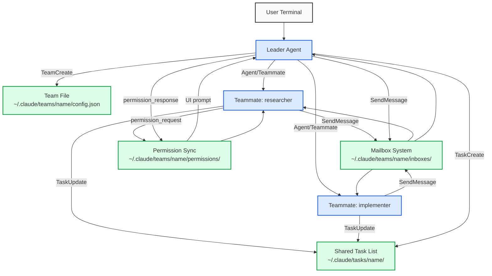
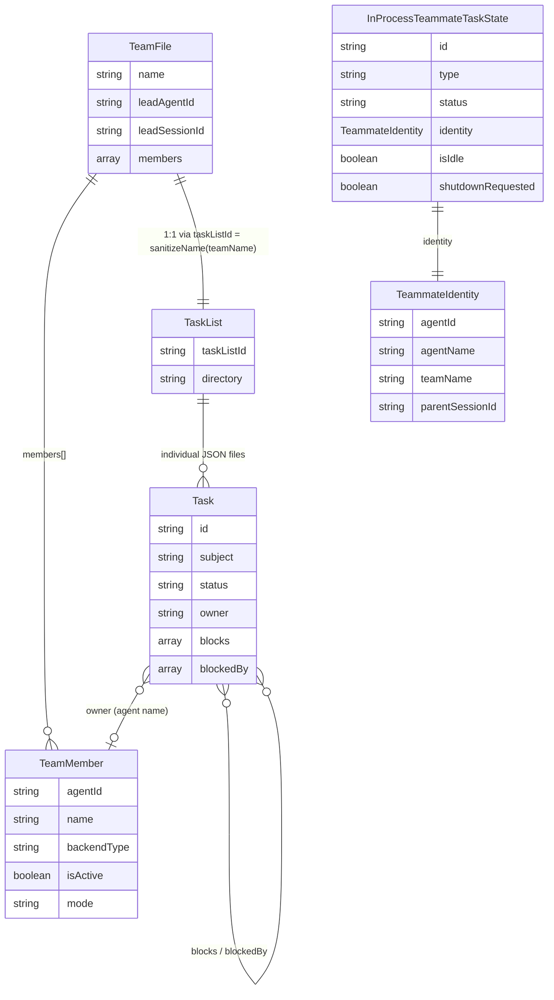
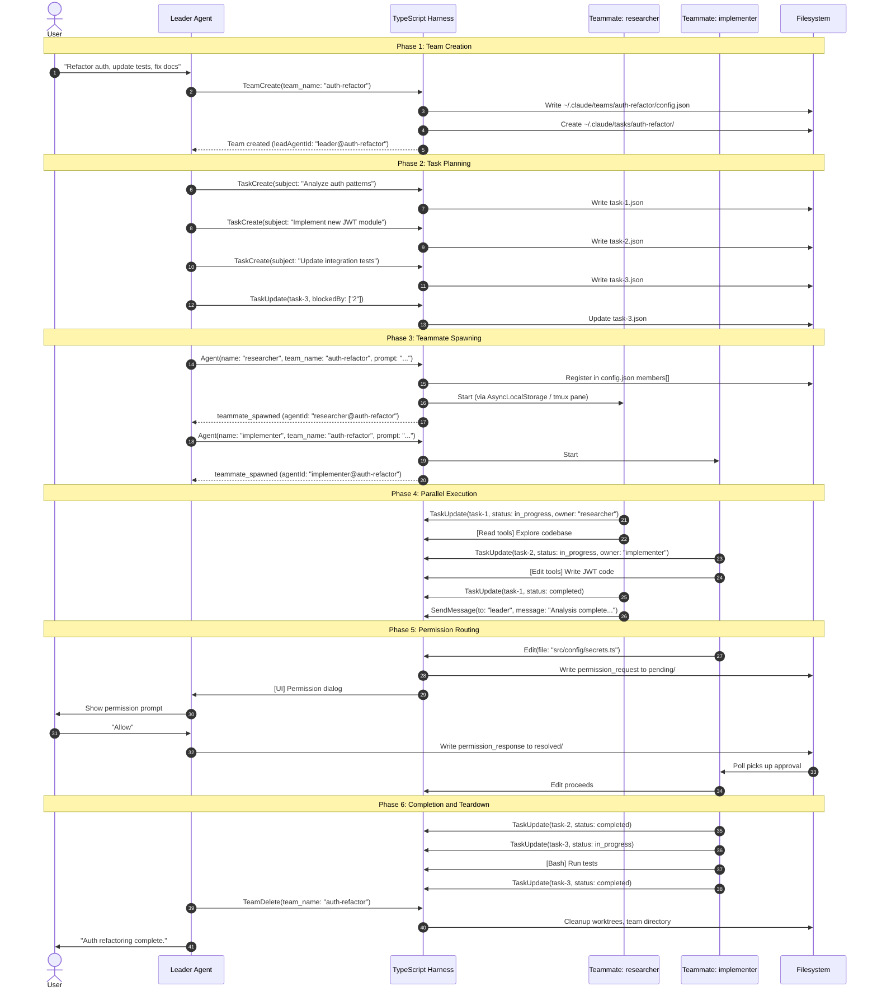
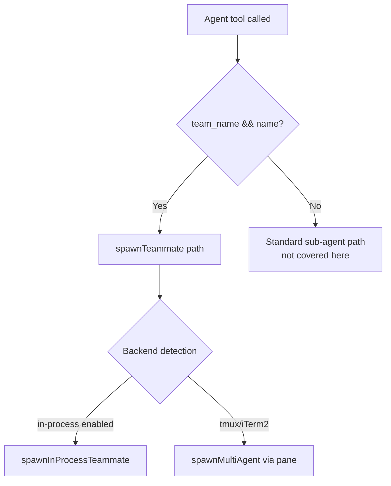
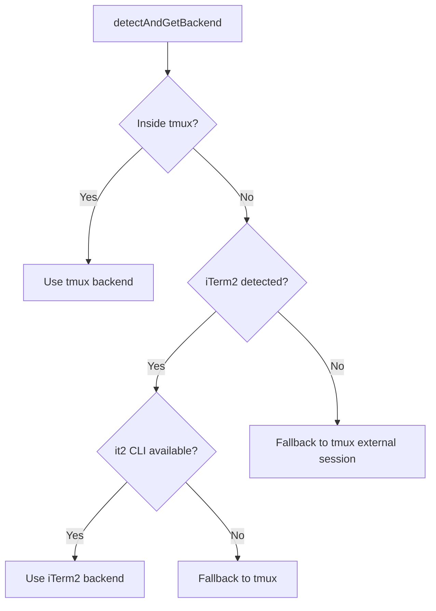

This post provides a comprehensive technical deep dive into the Agent Team (also referred to as "agent swarm") feature in Claude Code. An agent team is a coordinated group of autonomous LLM agents — spawned as in-process teammates or external tmux panes — that collaborate via a shared task list and mailbox-based messaging, all orchestrated by a single leader agent. We trace the full lifecycle from team creation through task delegation, permission routing, inter-agent communication, and teardown.

### How Plan Mode, Task List, and Agent Team Relate

These three features represent increasing levels of coordination complexity in Claude Code:

| Concept | Agents involved | Purpose |
|---------|----------------|---------|
| **[Plan Mode]()** | Single (the leader) | Constrain the LLM to read-only exploration, produce a plan, get user approval, then execute |
| **[Task List]()** | Single or multiple | Track structured work items with dependencies, ownership, and status |
| **Agent Team** (this post) | Multiple (leader + teammates) | Parallel execution of tasks coordinated via a shared task list and mailbox messaging |

They compose together in a natural pipeline:

1. **Plan Mode feeds into Task List** — After the user approves a plan via `ExitPlanMode`, the harness nudges the LLM: `"User has approved your plan. Start with updating your todo list if applicable."` The approved plan becomes the basis for task creation.

2. **Task List is required by Agent Team** — Teams and task lists have a strict 1:1 relationship. `TeamCreate` automatically provisions a shared task list directory. You cannot have a team without a task list — it is the coordination substrate that teammates use to claim work, track progress, and respect dependencies.

3. **Plan Mode can constrain Teammates** — The `planModeRequired` flag on a team member forces that teammate to plan before implementing, with the leader approving the teammate's plan via the `plan_approval_response` protocol message.

A typical complex flow chains all three:

The **common case** skips plan mode — when the task decomposition is straightforward, the leader creates a team and tasks directly:

```
User request → Leader creates Team + Task List
→ Teammates execute tasks in parallel
→ Team deleted, results reported to user
```

The **maximal case** chains all three — for complex, ambiguous requests where the leader needs to explore before knowing how to decompose the work:

```
User request → Leader enters Plan Mode → User approves plan
→ Leader creates Team + Task List from plan
→ Teammates execute tasks in parallel
→ Team deleted, results reported to user
```

The system prompt's "bias toward action" instruction encourages the LLM to skip plan mode overhead when the path is clear. Plan mode is only triggered for genuinely ambiguous or large-scope requests.

These features are also independently useful — a single agent can use a task list without a team (tracking its own multi-step work), or use plan mode without either (just exploring before coding). The agent team feature builds on both but does not require plan mode as a prerequisite.

---

## 1. The User Experience

### Team Creation

When Claude determines a task benefits from parallelism, it creates a team. The user sees this in the terminal:

```
You: Refactor the auth module, update all tests, and fix the docs

Claude is creating a team...

┌─ Team Created: auth-refactor ─────────────────────────────┐
│                                                            │
│  Lead: leader@auth-refactor                                │
│  Task list provisioned at ~/.claude/tasks/auth-refactor/   │
│                                                            │
└────────────────────────────────────────────────────────────┘
```

### Teammate Spawning

Once a team exists, Claude spawns teammates. Depending on the execution backend, this manifests as:

**In-Process Mode** (default): Teammates run as concurrent async loops within the same Node.js process. The user sees a unified terminal with colored status lines:

```
■ researcher (blue)    Reading src/auth/middleware.ts...
■ implementer (green)  Writing src/auth/jwt.ts...
□ reviewer (yellow)    Waiting for tasks...

Tasks:
✓ Analyze existing auth patterns         (@researcher)
■ Implement new JWT utilities             (@implementer)
□ Update integration tests                (unassigned)
  ➜ blocked by #2
```

**Tmux/iTerm2 Mode** (external panes): Each teammate gets a dedicated terminal pane in a tmux split or iTerm2 tab. The user can observe each agent's full conversation independently.

### Permission Routing

When a teammate needs permission (e.g., to edit a file outside the allowed set), the request routes to the leader's UI:

```
┌─ Permission Request (from: implementer) ──────────────────┐
│                                                            │
│  Tool: Edit                                                │
│  File: src/config/secrets.ts                               │
│                                                            │
│  > Allow                                                   │
│    Deny                                                    │
│    Allow for all teammates                                 │
└────────────────────────────────────────────────────────────┘
```

### Task Completion

When a teammate finishes a task, the user sees the task list update in real time — the status icon changes from `■` (in progress) to `✓` (completed), and previously blocked tasks may become unblocked:

```
✓ Analyze existing auth patterns         (@researcher)
■ Implement new JWT utilities             (@implementer)
■ Update integration tests                (@researcher)   ← was blocked, now started
```

Behind the scenes, the teammate sends an idle notification to the leader agent (not visible to the user), and the leader either assigns new work or lets the teammate self-select from the available task list.

---

## 2. Architectural Overview

The agent team system is composed of six subsystems:

| Subsystem | Responsibility | Key Files |
|-----------|---------------|-----------|
| **Agent Spawning** | Lifecycle of individual agents | `src/tools/AgentTool/AgentTool.tsx`, `runAgent.ts` |
| **Team Management** | Team creation, membership, cleanup | `src/utils/swarm/teamHelpers.ts`, `TeamCreateTool.ts`, `TeamDeleteTool.ts` |
| **Task Coordination** | Shared task list with locking | `src/utils/tasks.ts`, `TaskCreateTool.ts`, `TaskListTool.ts`, `TaskUpdateTool.ts`, `TaskGetTool.ts` |
| **Communication** | Inter-agent messaging via mailbox | `src/tools/SendMessageTool/`, `permissionSync.ts` |
| **Task Monitoring & User Reporting** | Background task inspection, proactive user updates | `src/tools/TaskOutputTool/`, `src/tools/BriefTool/` |
| **Execution Backends** | Process isolation strategies | `src/utils/swarm/backends/`, `inProcessRunner.ts` |



Legend: <span style="color:#2563eb">■</span> Agent (in-memory process) · <span style="color:#16a34a">■</span> File (disk-persisted)

### Agent Roles

A team has exactly two roles: one **leader** and one or more **teammates**.

**Leader (the user's existing session)**

The leader is not a spawned agent — it is the original Claude Code CLI session the user has been talking to. When a team is created, this session registers itself as leader (deterministic ID: `leader@{team-name}`) and gains orchestration responsibilities while retaining full user-facing capabilities. `isTeammate()` returns `false` for the leader.

| Phase | Responsibility | Mechanism |
|-------|---------------|-----------|
| **Creation** | Provision team and shared task list | `TeamCreate` tool |
| **Planning** | Break work into tasks, wire dependencies | `TaskCreate` + `TaskUpdate(blockedBy)` |
| **Spawning** | Bring teammates online with directives | `Agent(name, team_name, prompt)` |
| **Permission arbitration** | Surface teammate permission requests to the user | UI bridge / mailbox polling |
| **Work assignment** | Direct idle teammates to new work | `SendMessage(to: "name")` |
| **Progress monitoring** | Track task completion, inspect background output | `TaskList`, `TaskOutputTool` |
| **Coordination** | Receive idle notifications, re-balance workload | Mailbox-based idle callbacks |
| **User communication** | Report progress and results to the user | Direct text output or `BriefTool` |
| **Shutdown** | Gracefully terminate teammates | `SendMessage` with `shutdown_request` |
| **Teardown** | Clean up worktrees, team directories | `TeamDelete` tool |

Critically, the leader is the **only** agent with access to the user's terminal input. All human-in-the-loop decisions (permission approvals, plan mode approvals, clarifying questions) must flow through the leader.

**Teammates (spawned agents)**

Teammates are headless agents with no direct user interaction. They operate autonomously within their assigned scope, communicating only through tools. `isTeammate()` returns `true` for all teammates.

| Responsibility | Mechanism |
|---------------|-----------|
| **Claim work** | `TaskUpdate(status: in_progress)` on unblocked tasks |
| **Execute tasks** | Read, Edit, Bash, and other code tools |
| **Report progress** | `TaskUpdate(status: completed)` + idle notification to leader |
| **Communicate with team** | `SendMessage(to: "leader")` or `SendMessage(to: "peer-name")` |
| **Request permissions** | Automatic via `canUseTool` → routed to leader's UI |
| **Wait for work** | Idle loop polling mailbox for new messages or shutdown |
| **Respond to shutdown** | `shutdown_response` with approve/reject |

Teammates **cannot**: create teams, spawn other teammates, show interactive dialogs to the user, or terminate unilaterally without leader approval.

---

## 3. Data Models

The agent team system uses five interconnected data models, split across two storage layers:

| Model | Storage | Location | Survives Crash? |
|-------|---------|----------|-----------------|
| **TeamFile** | Disk | `~/.claude/teams/{name}/config.json` | Yes |
| **TeamMember** | Both | Disk: `TeamFile.members[]`; RAM: `AppState.teamContext.teammates` | Disk copy survives |
| **Task** (shared task list items) | Disk | `~/.claude/tasks/{taskListId}/{taskId}.json` | Yes |
| **InProcessTeammateTaskState** | Memory | `AppState.tasks[taskId]` (RAM) | No |
| **TeammateIdentity** | Memory | AsyncLocalStorage context (RAM) | No |

The disk layer enables cross-process coordination (external tmux teammates read/write the same files) and crash recovery. The memory layer provides fast runtime access for the in-process execution engine and UI rendering.

**Key relationships (persistent, disk-backed):**

- **TeamFile contains TeamMembers**: The team file's `members[]` array is the registry of all agents (leader + teammates). Each member's `agentId` follows the format `{name}@{team-name}`.
- **TeamFile pairs 1:1 with TaskList**: At team creation, the harness derives `taskListId = sanitizeName(teamName)` (replaces non-alphanumeric characters with hyphens, lowercases). This `taskListId` becomes the subdirectory name under `~/.claude/tasks/`. For example, team `"Auth Refactor"` produces task directory `~/.claude/tasks/auth-refactor/`. The two are always provisioned together — you cannot have a team without a task list.
- **Task references TeamMember via `owner`**: A task's `owner` field is the agent name string (e.g., `"researcher"`), linking it to the corresponding team member. Auto-assigned when a teammate marks a task `in_progress`.
- **Tasks reference each other via `blocks`/`blockedBy`**: Tasks form a DAG. A task with non-empty `blockedBy` cannot be claimed until all blockers are resolved.

**Key relationships (runtime, memory-only):**

- **InProcessTeammateTaskState embeds TeammateIdentity**: When a teammate is spawned in-process, its runtime task state contains a `TeammateIdentity` struct as a nested field. This identity holds the same data that appears in the TeamFile's member entry, but structured for AsyncLocalStorage access.
- **TeamMember is mirrored from disk to memory**: At spawn time, a subset of TeamMember fields is copied into `AppState.teamContext.teammates[agentId]` (containing `name`, `agentType`, `color`, `tmuxPaneId`, `cwd`, `spawnedAt`). The disk copy (`TeamFile.members[]`) is the source of truth and is updated on events like permission mode changes (`setMemberMode`) or idle transitions (`setMemberActive`). The RAM copy is a denormalized mirror used for fast UI rendering — it is never persisted back to disk and is lost on process exit.



For full type definitions, see the source files listed in Appendix B. The ER diagram above and the code citations at `src/utils/swarm/teamHelpers.ts` (TeamFile, TeamMember), `src/tasks/InProcessTeammateTask/types.ts` (TeammateIdentity, InProcessTeammateTaskState), and `src/utils/tasks.ts` (Task schema) provide the complete field-level detail.

---

## 4. End-to-End Lifecycle



---

## 5. Team Creation (Phase 1)

* **File:** `src/tools/TeamCreateTool/TeamCreateTool.ts`

Team creation is triggered when the LLM determines that a user request benefits from parallel execution — typically multi-part tasks with independent workstreams. The leader (the user's existing session) calls the `TeamCreate` tool with a team name and optional description.

1. **Validate** — The tool first validates that this session is not already leading another team — a leader can only manage one team at a time. If the chosen name collides with an existing team directory, a word-slug suffix is appended to ensure uniqueness.
2. **Register leader** — The tool then registers the current session as the leader by computing a deterministic ID via `formatAgentId("leader", teamName)`, producing an ID like `"leader@auth-refactor"`. Critically, the tool does **not** set the `CLAUDE_CODE_AGENT_ID` environment variable for the leader — `isTeammate()` continues to return `false`, ensuring the leader retains full user-facing capabilities (permission dialogs, plan mode, interactive prompts) while teammates operate in a constrained, headless mode.
3. **Provision filesystem** — Next, the tool provisions two filesystem structures simultaneously: the team configuration file at `~/.claude/teams/{name}/config.json` (containing the `TeamFile` with the leader as its first member), and the shared task list directory at `~/.claude/tasks/{sanitized-name}/`. These two are always created together — every `TaskCreate`/`TaskUpdate` call from any teammate writes to this same shared directory, protected by file locking (exponential backoff, 30 retries, 5–100ms timeout) to handle concurrent writes from 10+ agents.
4. **Update runtime state** — Finally, the tool updates `AppState.teamContext` with the team metadata and registers a cleanup handler that will destroy worktrees and team directories when the session exits.

---

## 6. Task Planning (Phase 2)

Once the team is created, the leader breaks the user's request into discrete tasks and wires their dependencies. This uses the same `TaskCreate` and `TaskUpdate` tools described in [Task List](), but writing to the team's shared task list directory (`~/.claude/tasks/{team-name}/`).

The leader typically:

1. Calls `TaskCreate` for each unit of work (one task per call — there is no batch-create API).
2. Calls `TaskUpdate` to wire `blockedBy` relationships between tasks, forming a dependency DAG.
3. Optionally sets initial `owner` fields if it already knows which teammate should handle which task.

At this point no teammates exist yet — the task list is a plan waiting for workers. The leader proceeds to Phase 3 to bring teammates online.

---

## 7. Teammate Spawning (Phase 3)

With the team created and tasks planned, the leader spawns teammates to execute work in parallel. The leader calls the `Agent` tool with both a `name` and `team_name` parameter — this combination signals the system to route to the teammate spawning path rather than the standard one-shot sub-agent path. Each teammate receives a directive prompt describing its role and scope. The leader can optionally specify a `subagent_type` to use a pre-defined agent definition (a markdown file with YAML frontmatter) that determines the teammate's available tools, model, permission mode, and system prompt — see [Spawned Agents]() for details. The system then decides how to execute the teammate based on backend availability: either as a concurrent async loop within the same Node.js process (in-process mode) or as a separate CLI instance in a tmux/iTerm2 pane (external mode).

### 7.1 Spawn Decision Tree

When the leader calls the Agent tool with `name` and `team_name` parameters, the system routes to teammate spawning rather than the standard sub-agent path:



In the agent team context, `team_name` and `name` are always provided together, so the flow always takes the "Yes" path. The "No" branch covers non-team sub-agents (one-shot agents like Explore or Plan) which are outside the scope of this post.

### 7.2 Backend Detection

* **Files:** `src/utils/swarm/backends/registry.ts`, `src/utils/swarm/backends/types.ts`

When the leader spawns the first teammate, `spawnMultiAgent.ts` calls `detectAndGetBackend()` to decide which execution mode to use. The choice affects process isolation, resource overhead, and how permission requests reach the user.

| Backend | How it works | When chosen |
|---------|-------------|-------------|
| **In-process** | Teammate runs as a concurrent async loop in the leader's Node.js process, isolated via `AsyncLocalStorage` | Default when the feature is enabled |
| **tmux** | Teammate runs as a separate Claude Code CLI process in a tmux split pane | When inside tmux, or as fallback when iTerm2 CLI isn't available |
| **iTerm2** | Teammate runs as a separate CLI process in an iTerm2 tab/pane | When iTerm2 is detected and its `it2` CLI tool is available |

The `detectAndGetBackend()` function in `registry.ts` runs the following priority logic:



The result is cached for the entire session — all subsequent teammates use the same backend without re-detection. Both backends implement a common `TeammateExecutor` interface, so the spawn logic in `spawnMultiAgent.ts` is backend-agnostic — it calls `executor.spawn(config)` regardless of whether the result is an AsyncLocalStorage context or a tmux pane:

```typescript
type TeammateExecutor = {
  spawn(config: TeammateSpawnConfig): Promise<TeammateSpawnResult>
  kill(agentId: string): Promise<void>
  sendMessage(agentId: string, message: string): Promise<void>
}
```

### 7.3 In-Process Spawning

* **File:** `src/utils/swarm/spawnInProcess.ts`

In-process mode avoids the overhead of spawning separate OS processes. The leader's Node.js process runs all teammates concurrently on the same event loop, isolated via `AsyncLocalStorage`. This is fast but introduces unique constraints:

- **Isolation** — Each teammate's identity and state is isolated via `AsyncLocalStorage`. Without this, concurrent teammates would corrupt each other's agent ID, team name, and permission mode.
- **Permission routing** — Since teammates share the leader's process, permission requests route directly through the leader's UI bridge (no file-based polling needed).
- **Memory pressure** — At 500+ turns, each teammate's UI transcript can reach 125MB. The system caps the transcript at 50 messages (`TEAMMATE_MESSAGES_UI_CAP = 50`) to bound memory while the agent's actual conversation context (managed by compaction) can be longer.

**Execution steps:**

1. **Generate deterministic agent ID** — `formatAgentId(name, teamName)` → `"researcher@auth-refactor"`
2. **Create AbortController** — Used to kill the teammate on demand.
3. **Create TeammateContext** — AsyncLocalStorage context providing isolated identity.
4. **Register in Perfetto trace** — Enables hierarchy visualization in performance traces.
5. **Create task state** — `createTaskStateBase(id, 'in_process_teammate', description)`.
6. **Register cleanup handler** — Runs on session exit.
7. **Register task in AppState** — Makes the teammate visible to the UI and leader.
8. **Register in team file** — Adds member entry with `backendType: 'in-process'`, `tmuxPaneId: 'in-process'`, and `cwd`.

### 7.4 External Spawning (tmux/iTerm2)

* **File:** `src/tools/shared/spawnMultiAgent.ts`

In external mode, each teammate is a fully independent Claude Code CLI process running in its own terminal pane. The `spawnMultiAgent.ts` module builds the CLI command with inherited flags and sends it to the pane via the `PaneBackend` interface.

**Execution steps:**

1. **Creates pane** — Calls `createTeammatePaneInSwarmView(name, color)` to split a new terminal pane.
2. **Builds CLI command** — Inherits permission mode, model, settings path, inline plugins, and chrome flags via `buildInheritedCliFlags()`.
3. **Sends command to pane** — The teammate starts as a fresh Claude Code CLI process with `--team-name`, `--agent-id`, and `--agent-name` flags.
4. **Registers in team file** — Adds member entry with `tmuxPaneId`, `cwd`, `backendType`.

The `PaneBackend` interface (`types.ts`) provides the operations the spawn and lifecycle code uses:

| Who calls it | Method | What happens |
|-------------|--------|--------------|
| `spawnMultiAgent` | `createTeammatePaneInSwarmView(name, color)` | Creates a new terminal pane for the teammate |
| `spawnMultiAgent` | `sendCommandToPane(paneId, command)` | Starts the teammate CLI process in the pane |
| `spawnMultiAgent` | `setPaneBorderColor(paneId, color)` | Sets visual color for differentiation |
| Leader (via lifecycle) | `killPane(paneId)` | Terminates the teammate's pane on shutdown |
| Leader (via lifecycle) | `hidePane(paneId)` / `showPane(paneId)` | Manages pane visibility |

---

## 8. Parallel Execution (Phase 4)

Once teammates are spawned, they execute work concurrently. This section covers how each teammate runs its own LLM loop, how teammates communicate with each other and the leader, and how the leader monitors progress.

### 8.1 How a Teammate Runs

* **Files:** `src/tools/AgentTool/runAgent.ts`, `src/utils/swarm/inProcessRunner.ts`

Every teammate ultimately runs through the same `runAgent` async generator that powers all agents in Claude Code. The difference is that teammates are wrapped by `runInProcessTeammate()` (for in-process mode) or started as an independent CLI process (for tmux mode), which adds team-specific behaviors on top of the core loop.

**The core agent loop (`runAgent`) proceeds through these stages:**

1. **Context preparation** — Load user context (CLAUDE.md), system context. Optionally omit git status and CLAUDE.md for lightweight agents.
2. **Permission mode resolution** — The teammate's own `permissionMode` applies unless the leader is in `bypassPermissions`, `acceptEdits`, or `auto` mode (those override downward).
3. **Tool resolution** — Intersects the agent definition's `tools`/`disallowedTools` with available tools.
4. **System prompt construction** — Combines the agent definition's system prompt with the teammate addendum (which instructs it to use SendMessage for communication).
5. **MCP server initialization** — Merges agent-specific MCP servers with the leader's, deduplicates by name.
6. **Main query loop** — Iterates the `query()` generator, calling the LLM and executing tool calls in a loop until the task is done or max turns are reached.
7. **Cleanup** — MCP servers, hooks, cache tracking, file state, Perfetto trace, orphaned background tasks.

**The in-process runner (`runInProcessTeammate`) adds these team-specific behaviors:**

1. **AsyncLocalStorage isolation** — All work runs inside `runWithTeammateContext()`, so multiple teammates sharing the same Node.js process don't corrupt each other's identity or state.
2. **Permission routing** — Creates a custom `canUseTool` function that intercepts permission-required tool calls and routes them to the leader's UI (via bridge or file-based mailbox) instead of prompting locally.
3. **Continuous lifecycle with idle loop** — Unlike one-shot agents that terminate after a single prompt, teammates loop indefinitely. After completing a turn, the teammate enters an idle state and polls its mailbox for new messages or shutdown requests.
4. **Idle notification** — When a turn completes, sends a structured notification to the leader reporting what was accomplished and that the teammate is available for new work.

### 8.2 How Teammates Communicate

* **Files:** `src/tools/SendMessageTool/prompt.ts`, `src/utils/teammateMailbox.ts`

Teammates cannot communicate through normal text responses — their text output is not visible to anyone. They **must** use the `SendMessage` tool, which writes to the recipient's file-based inbox at `~/.claude/teams/{team_name}/inboxes/{agent_name}.json`. The recipient polls for unread messages every 1000ms.

**Addressing modes:**

| Format | Behavior |
|--------|----------|
| `to: "researcher"` | Direct message to named teammate |
| `to: "*"` | Broadcast to all teammates |
| `to: "uds:/path/to.sock"` | Cross-session via Unix Domain Socket |
| `to: "bridge:session_..."` | Cross-machine bridge peer |

**Protocol messages** — Beyond free-form text, the messaging system supports structured protocol exchanges:
- **`shutdown_response`** — Approve/reject a shutdown request (must echo `request_id`).
- **`plan_approval_response`** — Approve/reject a plan revision from a teammate in plan mode.

**Concurrency** — Concurrent writes are protected by file locking (10 retries, 5–100ms backoff) to prevent corruption when multiple agents message the same recipient simultaneously.

```typescript
type TeammateMessage = {
  from: string
  text: string
  timestamp: string
  read: boolean
  color?: string
  summary?: string
}
```

### 8.3 How the Leader Monitors Progress

The leader has two mechanisms to observe what teammates are doing:

**TaskOutputTool** (`src/tools/TaskOutputTool/TaskOutputTool.tsx`) — Retrieves output from background tasks with blocking or non-blocking semantics. The leader can call `TaskOutput(task_id, block: true, timeout: 30000)` to wait for a specific teammate's result, or `block: false` to check status without waiting.

**BriefTool / SendUserMessage** (`src/tools/BriefTool/BriefTool.ts`) — The channel for agents to proactively message the user. In team scenarios, the leader uses this to surface progress updates to the user while teammates work in the background. The `status` field distinguishes replies (`'normal'`) from unsolicited updates (`'proactive'`). Feature-gated via `--brief` CLI flag or the KAIROS assistant mode.

### 8.4 Plan-Before-Implement Constraint (`planModeRequired`)

* **Files:** `src/tools/ExitPlanModeTool/ExitPlanModeV2Tool.ts`, `src/hooks/useInboxPoller.ts`

When the leader spawns a teammate with `planModeRequired: true`, that teammate starts in plan mode (`permissionMode: 'plan'`). It can read files and explore but cannot edit or execute until its plan is approved. This enforces a "think before acting" discipline for teammates working on sensitive or complex tasks.

**The flow:**

1. **Spawn** — The leader passes `planModeRequired: true` in the spawn config. The teammate's task state initializes with `permissionMode: 'plan'`.
2. **Plan** — The teammate explores the codebase in read-only mode and writes a plan file (just like single-agent plan mode described in [Plan/Act Mode]()).
3. **Request approval** — The teammate calls `ExitPlanMode`. Because `isPlanModeRequired()` returns true, the tool does not exit plan mode directly. Instead, it sends a `plan_approval_request` message to the leader's mailbox containing the plan content and file path. The teammate enters `awaitingPlanApproval: true` state and waits.
4. **Leader approves** — The leader's inbox poller (`useInboxPoller.ts`) detects the `plan_approval_request` and sends back a `plan_approval_response` with `approved: true` and the leader's current permission mode.
5. **Teammate proceeds** — The teammate's inbox poller receives the response, verifies it came from `'team-lead'` (security check to prevent teammates from forging approvals), transitions out of plan mode, and begins implementing.

**Current behavior:** The leader auto-approves plan requests without showing a dialog to the user. This means `planModeRequired` currently functions as a "plan-first discipline" constraint (forcing the teammate to think before coding) rather than a true human-review gate. The plan content is still passed through to the leader's conversation as a regular message, so the leader LLM has context about what the teammate intends to do.

---

## 9. Permission Synchronization

For background on how Claude Code checks permissions for individual tool calls (the `canUseTool` function, permission modes, and the approval UI), see [Human-in-the-Loop](). This section covers the additional routing layer needed when **teammates** require permission approval.

### 9.1 The Problem

In-process teammates share a Node.js process but cannot share a permission UI. Only the leader has access to the user's terminal input. When a teammate needs permission for a tool call, the request must be routed to the leader without blocking other teammates.

### 9.2 The Solution: Two-Path Permission Routing

* **File:** `src/utils/swarm/permissionSync.ts`

**Path A: UI Bridge (preferred, fast)** — When a direct bridge to the leader's UI exists:
1. Teammate calls tool requiring permission.
2. Custom `canUseTool` function detects the need for approval.
3. Request is forwarded to leader's `ToolUseConfirm` UI component.
4. User approves/denies in the leader's terminal.
5. Response returns directly to teammate.

**Path B: File-Based Mailbox (fallback, 500ms polling)** — When no direct bridge exists:
1. Teammate writes `permission_request` JSON to `~/.claude/teams/{name}/permissions/pending/`.
2. Leader polls the pending directory and surfaces the request in its UI.
3. User approves/denies.
4. Leader writes `permission_response` to `~/.claude/teams/{name}/permissions/resolved/`.
5. Teammate polls the resolved directory (every 500ms) and picks up the response.

### 9.3 Permission Request Schema

* **File:** `src/utils/swarm/permissionSync.ts`

```typescript
SwarmPermissionRequestSchema = z.object({
  id: z.string(),
  workerId: z.string(),
  workerName: z.string(),
  teamName: z.string(),
  toolName: z.string(),
  toolUseId: z.string(),
  status: z.enum(['pending', 'approved', 'rejected']),
  resolvedBy: z.enum(['worker', 'leader']).optional(),
  resolvedAt: z.number().optional(),
  feedback: z.string().optional(),
  updatedInput: z.unknown().optional(),
})
```

### 9.4 Team-Wide Path Allowlists

To reduce permission friction, the team file supports `teamAllowedPaths`:

```typescript
export type TeamAllowedPath = {
  path: string        // Directory path (absolute)
  toolName: string    // e.g., "Edit", "Write"
  addedBy: string     // Agent name who added this rule
  addedAt: number     // Timestamp
}
```

Once a path is added to the allowlist (by the leader granting blanket access), all teammates can operate on that path without further permission requests.

---

## 10. Task Coordination in Swarms

When multiple teammates work in parallel, they need to avoid duplicating effort, respect dependency ordering, and know when new work becomes available. The shared task list (Section 6) provides the data structure, but coordination requires specific protocols around how teammates pick up work, signal completion, and hand off to each other.

### 10.1 Preventing Duplicate Work

* **File:** `src/utils/tasks.ts`

**Problem:** Two teammates both see an unblocked task and try to start it simultaneously.

**Solution:** The `claimTask()` function in `tasks.ts` provides atomic claim semantics. When a teammate calls `TaskUpdate(taskId, status: "in_progress")`, the `TaskUpdateTool` acquires a file lock on the task list directory before reading and writing. If another teammate already claimed the task, the call returns a rejection:

```typescript
type ClaimTaskResult = {
  success: boolean
  reason?: 'task_not_found' | 'already_claimed' | 'already_resolved' | 'blocked' | 'agent_busy'
}
```

The file lock uses exponential backoff (30 retries, 5–100ms timeout) to handle contention when 10+ agents write concurrently. Each task is stored as an individual JSON file (`~/.claude/tasks/{team-name}/{taskId}.json`), and a high water mark file prevents ID reuse after deletions.

### 10.2 Assigning Ownership

* **File:** `src/tools/TaskUpdateTool/TaskUpdateTool.ts`

**Problem:** The leader creates tasks but doesn't always pre-assign owners. Teammates need to self-organize.

**Solution:** When a teammate calls `TaskUpdate(taskId, status: "in_progress")`, the `TaskUpdateTool` automatically sets the `owner` field to that teammate's agent name (if not already assigned). This provides natural work attribution visible in the task list UI (e.g., `"■ Implement JWT module (@implementer)"`).

When the leader explicitly assigns a task to a teammate via `TaskUpdate(taskId, owner: "researcher")`, the `TaskUpdateTool` sends a mailbox message to the new owner's inbox, prompting them to begin work on that task.

### 10.3 Respecting Dependencies

**Problem:** A teammate might try to start a task whose prerequisites aren't finished yet.

**Solution:** The `claimTask()` function checks the `blockedBy` array before allowing a claim. If any blocking task has a status other than `completed`, the claim is rejected with reason `'blocked'`. Teammates call `TaskList` to discover which tasks are currently unblocked and available.

When a teammate calls `TaskUpdate(taskId, status: "completed")`, the `TaskUpdateTool` returns a nudge in its response: `"Task completed. Call TaskList now to find your next available task..."` — prompting the teammate to check whether any previously-blocked tasks have become unblocked.

### 10.4 Verification Nudge

* **File:** `src/tools/TaskUpdateTool/TaskUpdateTool.ts`

**Problem:** Teammates might complete all tasks without anyone verifying the overall result.

**Solution:** After a teammate marks 3+ tasks as completed without a verification step, the `TaskUpdateTool` appends a suggestion to its response:

```
NOTE: You just closed out 3+ tasks... Before writing your final summary,
spawn the verification agent to double-check your work.
```

This nudges the leader to spawn a `verification` agent that reviews the combined output before reporting to the user.

---

## 11. Teammate Lifecycle Management

Unlike one-shot sub-agents that terminate after returning a result, teammates are long-lived. They cycle between working and waiting, can be re-activated with new directives, and require explicit negotiation to shut down. This section covers how teammates persist across multiple tasks and how the team eventually winds down.

### 11.1 The Work–Idle Cycle

After a teammate finishes its current task, it does not exit. Instead, the in-process runner (`inProcessRunner.ts`) transitions the teammate into an idle state and sends a structured notification to the leader via `sendIdleNotification()`:

```typescript
await sendIdleNotification(agentName, color, teamName, {
  idleReason: 'available',
  summary: 'Completed task #2: JWT utilities implemented',
  completedTaskId: '2',
  completedStatus: 'resolved',
})
```

The teammate then enters a polling loop, checking its mailbox every 1000ms for new messages. When the leader sends a new directive via `SendMessage(to: "researcher", message: "Now work on task #4")`, the teammate picks it up from its inbox file and begins a new turn.

This cycle repeats indefinitely — work, notify idle, wait, receive new work — until the leader initiates shutdown.

### 11.2 Shutdown Protocol

Teammates cannot unilaterally terminate. The leader controls when each teammate exits, ensuring no work is lost mid-execution.

1. The leader sends a `shutdown_request` message via `SendMessage(to: "researcher")`.
2. The teammate receives the request during its mailbox polling loop.
3. The teammate responds with a `shutdown_response` protocol message (setting `approve: true` or `approve: false`, echoing the `request_id`).
4. If approved, the teammate's `AbortController` fires. For in-process teammates, `killInProcessTeammate()` in `spawnInProcess.ts` aborts the controller, removes the member from `AppState.teamContext.teammates`, and removes the entry from the team file. For external teammates, the leader kills the tmux/iTerm2 pane.
5. The task status transitions to `completed` or `killed`.

### 11.3 Team Deletion

* **File:** `src/tools/TeamDeleteTool/TeamDeleteTool.ts`

When all work is done, the leader calls `TeamDelete` to wind down the entire team. The `TeamDeleteTool` orchestrates a graceful teardown:

1. **Shutdown all teammates** — Sends `shutdown_request` to each active teammate and waits for their `shutdown_response`.
2. **Destroy worktrees** — If any teammates used `isolation: worktree`, their git worktrees are removed.
3. **Remove team directory** — Deletes `~/.claude/teams/{team-name}/` (including inbox files and permission directories).
4. **Preserve task list** — The task list at `~/.claude/tasks/{team-name}/` is intentionally **not** deleted, preserving the work history.

### 11.4 Orphan Cleanup

If the leader's session exits unexpectedly (e.g., the user closes the terminal), teammates would be left running with no coordinator. To prevent this, `TeamCreateTool` registers a cleanup handler at team creation time that runs on session exit. This handler:

1. **Aborts in-process teammates** — Fires each teammate's `AbortController`, immediately stopping their LLM loops.
2. **Kills external panes** — Calls `killPane(paneId)` for each tmux/iTerm2 teammate.
3. **Destroys worktrees** — Removes any git worktrees created for the session.

---

## 12. Reflection: Design Decisions

### Coordination: Files vs. IPC

**Decision:** All inter-agent coordination (team config, task list, mailbox, permissions) uses filesystem JSON files with file locking — not WebSockets, Unix domain sockets, or shared memory.

**Alternative considered:** An IPC-based protocol (e.g., WebSocket server in the leader process) would eliminate polling latency and reduce disk I/O.

**Why files were chosen:**
- **Backend agnosticism** — The same coordination protocol works whether teammates are in-process (sharing a Node.js event loop) or external (separate tmux processes that can only communicate via filesystem). An IPC approach would require two implementations.
- **Crash recovery** — If a teammate crashes, its last task update and inbox messages survive on disk. An in-memory bus loses everything.
- **Debuggability** — Engineers can `cat ~/.claude/teams/auth-refactor/config.json` or inspect `~/.claude/tasks/auth-refactor/2.json` directly during debugging. No protocol decoder needed.

**Tradeoff accepted:** Polling latency (1000ms for mailbox, 500ms for permissions) and disk I/O overhead. This is acceptable because the bottleneck in agent teams is LLM inference time (seconds per turn) and human decision-making (permission approvals), not inter-agent message delivery.

### Authority: Single Leader, No Democracy

**Decision:** One leader per team. The leader is the only agent that can create teams, spawn teammates, approve permissions, and initiate shutdown. Teammates cannot spawn other teammates.

**Alternative considered:** A peer-to-peer model where any agent can spawn others, creating hierarchical sub-teams.

**Why single-leader was chosen:**
- **Permission UI ownership** — Only one process has access to the user's terminal input. Routing permission requests through multiple intermediaries would create ambiguity about who shows the dialog.
- **Top-down shutdown** — Graceful teardown requires a single coordinator that knows all members and can wait for each to acknowledge. Distributed shutdown introduces consensus problems.
- **Predictability** — Users can reason about one leader making decisions, not emergent behavior from peer coordination.

**Tradeoff accepted:** The leader becomes a bottleneck for task planning and work assignment. If the leader's LLM loop is slow, idle teammates wait even if there's available work.

### Identity: Deterministic IDs vs. Random UUIDs

**Decision:** Agent IDs follow the format `{name}@{team-name}` (e.g., `researcher@auth-refactor`), computed deterministically from the spawn parameters.

**Alternative considered:** Random UUIDs (like session IDs elsewhere in the system).

**Why deterministic was chosen:**
- **Addressability** — Any agent can send a message to `"researcher"` without a lookup table mapping names to IDs.
- **Derivability** — The leader can compute its own ID (`leader@{team-name}`) without persisting it. This enables the design where `CLAUDE_CODE_AGENT_ID` is intentionally not set for the leader.
- **Human readability** — Task ownership shows `(@researcher)` in the UI, not a UUID.

**Tradeoff accepted:** Names must be unique within a team. The system enforces this via `generateUniqueTeammateName()` which appends numeric suffixes on collision.

### Lifecycle: Teammates Can't Self-Terminate

**Decision:** Teammates cannot unilaterally exit. They must receive a `shutdown_request` from the leader and respond with approval.

**Alternative considered:** Teammates auto-terminate when they run out of tasks.

**Why negotiated shutdown was chosen:**
- **Work preservation** — A teammate might be mid-write when the leader wants to reassign its work. The shutdown negotiation gives the teammate a chance to finish or save state.
- **Leader awareness** — The leader needs to know exactly when a teammate is gone (to update the team file, remove from AppState, clean up worktrees). Unilateral exit would require the leader to poll for liveness.
- **Re-activation** — An idle teammate is cheap to keep alive (no LLM calls, just polling). Keeping it alive allows instant re-activation without the overhead of re-spawning.

**Tradeoff accepted:** If a teammate's LLM loop hangs, the leader cannot force-kill it gracefully — it must use the `AbortController` as a hard kill, potentially losing in-flight work.

### Resources: Message Cap at 50

**Decision:** The UI transcript for each in-process teammate is capped at 50 messages (`TEAMMATE_MESSAGES_UI_CAP = 50`). Older messages are evicted.

**Alternative considered:** Unlimited transcript, or streaming only the latest message.

**Why 50 was chosen:**
- **Memory bound** — At 500+ turns, each teammate's message array can reach 125MB. With 5–10 concurrent teammates, this exhausts available RAM. The cap bounds memory at ~12.5MB per teammate regardless of lifetime.
- **UI usefulness** — 50 messages provides enough recent context for the user to understand what a teammate is doing, without overwhelming the terminal with history.
- **Conversation context is separate** — The cap only affects the UI display. The teammate's actual LLM conversation context (managed by compaction) can be much longer and is not affected by this limit.

**Tradeoff accepted:** If the user scrolls back to check what a long-running teammate did 100 turns ago, that information is gone from the UI (though it exists in the conversation transcript on disk).

---

## Appendix A: Tool Schemas

### TeamCreate

| Parameter | Type | Required | Description |
|-----------|------|----------|-------------|
| `team_name` | string | Yes | Name for the team |
| `description` | string | No | Description of team purpose |
| `agent_type` | string | No | Agent type for the leader |

### Agent (teammate spawn mode)

| Parameter | Type | Required | Description |
|-----------|------|----------|-------------|
| `description` | string | Yes | Short (3-5 word) task description |
| `prompt` | string | Yes | Task for the agent to perform |
| `name` | string | Yes* | Name for spawned teammate |
| `team_name` | string | Yes* | Team to join |
| `mode` | PermissionMode | No | Permission mode override |
| `subagent_type` | string | No | Specialized agent type |
| `model` | enum | No | Model override (sonnet/opus/haiku) |
| `isolation` | enum | No | worktree or remote |
| `run_in_background` | boolean | No | Run as background task |

*Required for teammate spawn path (both must be present).

### SendMessage

| Parameter | Type | Required | Description |
|-----------|------|----------|-------------|
| `to` | string | Yes | Recipient name, `"*"`, UDS path, or bridge ID |
| `message` | string | Yes | Message content |

### TaskCreate / TaskUpdate

See [Task List]() for full schemas of these tools.

---

## Appendix B: Code Citations

| File | Purpose |
|------|---------|
| `src/tools/AgentTool/AgentTool.tsx` | Agent tool entry point, spawn routing |
| `src/tools/AgentTool/runAgent.ts` | Core agent execution loop |
| `src/tools/TeamCreateTool/TeamCreateTool.ts` | Team creation logic |
| `src/tools/TeamDeleteTool/TeamDeleteTool.ts` | Team deletion and cleanup |
| `src/tools/SendMessageTool/prompt.ts` | Inter-agent messaging protocol |
| `src/tools/TaskCreateTool/TaskCreateTool.ts` | Task creation tool |
| `src/tools/TaskUpdateTool/TaskUpdateTool.ts` | Task update with auto-owner, verification nudge |
| `src/tools/TaskOutputTool/TaskOutputTool.tsx` | Background task output retrieval |
| `src/tools/BriefTool/BriefTool.ts` | Agent-to-user proactive reporting (SendUserMessage) |
| `src/tools/shared/spawnMultiAgent.ts` | Multi-agent spawn with CLI flag inheritance |
| `src/Task.ts` | Task types, status enum, ID generation |
| `src/tasks/InProcessTeammateTask/InProcessTeammateTask.tsx` | In-process teammate task lifecycle |
| `src/tasks/InProcessTeammateTask/types.ts` | TeammateIdentity, InProcessTeammateTaskState |
| `src/utils/swarm/teamHelpers.ts` | TeamFile schema, team CRUD operations |
| `src/utils/swarm/inProcessRunner.ts` | In-process teammate execution engine |
| `src/utils/swarm/spawnInProcess.ts` | Teammate spawning logic |
| `src/utils/swarm/permissionSync.ts` | Permission request/response protocol |
| `src/utils/swarm/backends/registry.ts` | Backend detection and caching |
| `src/utils/swarm/backends/types.ts` | BackendType, PaneBackend, TeammateExecutor |
| `src/utils/swarm/teammatePromptAddendum.ts` | System prompt injected into teammates |
| `src/utils/teammate.ts` | Identity resolution (AsyncLocalStorage > CLI args) |
| `src/utils/teammateMailbox.ts` | File-based mailbox read/write with locking |
| `src/utils/tasks.ts` | Task schema, file storage, concurrent locking |
