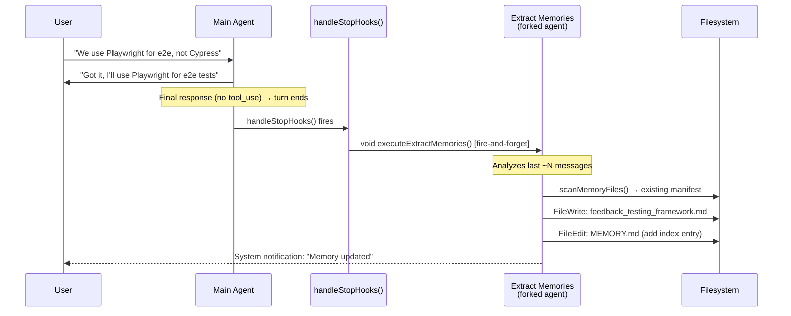
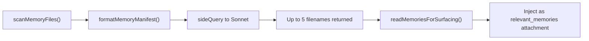
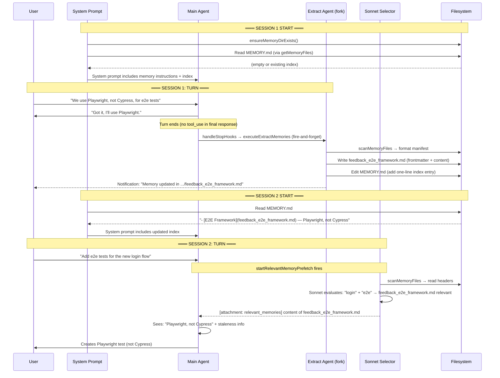
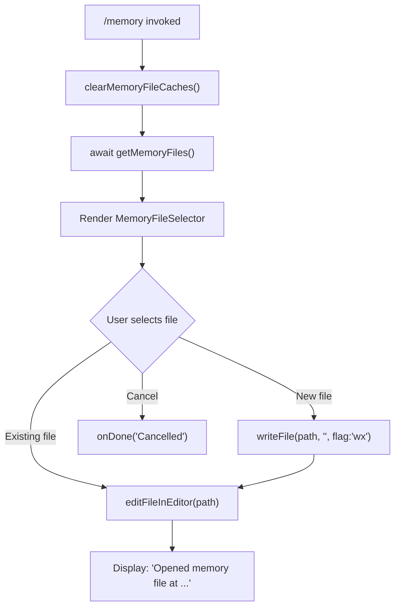
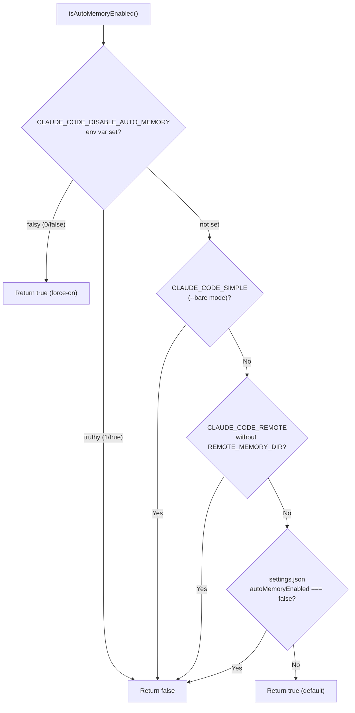

This post provides a comprehensive technical deep dive into how Claude Code remembers things across conversations. We trace the full lifecycle of a memory — from the moment a user says "remember this" or the system silently detects something worth saving, through storage on disk, to recall in a future session. We cover the storage format, the four-type taxonomy, the background extraction agent that automatically captures insights, the Sonnet-based relevance selector that retrieves them, and the prompt-engineering and security decisions that hold the system together.

For how memory instructions enter the system prompt, see [The System Prompt](). For how attachments flow through the query loop, see [Managing Message Context]().

---

## 1. User Experience

From the user's perspective, Claude Code's memory manifests in three observable behaviors.

**Explicit save.** The user says "remember that I prefer tabs over spaces" and Claude writes a file to disk. A system notification appears confirming the save: `Memory updated in ~/.claude/projects/.../memory/feedback_formatting.md · /memory to edit`.

**Automatic save.** The user never asks Claude to remember anything, but in the next session, Claude applies their testing preferences without being told again — because a background extraction agent saved them to disk after the previous turn ended, and the harness re-injected them into context at session start. The user learns this happened via a notification that appears shortly after the turn ends: `Memory updated in ~/.claude/.../feedback_testing.md · /memory to edit`.

**Contextual recall.** The user starts a new session and asks about deployment. The model already has MEMORY.md in its context — one-line summaries of every saved memory — so it knows a deploy freeze memory exists. Concurrently, a Sonnet side-query identifies that memory as relevant to the query, reads the full topic file, and injects it into the message context as a `<system-reminder>` block so it can be picked up by the next model call. The model incorporates the full detail into its answer without the user ever re-stating the context.

The user can also run `/memory` to open an interactive file selector that lists all memory files across all scopes. It opens the selected file in the system editor (`$VISUAL` or `$EDITOR`). This is the manual escape hatch: users can read, edit, or delete any memory directly.

---

## 2. Architecture Overview

The core design tension: Claude Code wants to give the model a complete picture of what it knows about the user without flooding the context window or breaking the prompt cache. The memory system resolves this by splitting storage into a lightweight index (MEMORY.md) that is always present, and heavyweight topic files that are surfaced on-demand only when relevant.

**Storage.** Memories live as plain Markdown files in a per-project directory on disk (`~/.claude/projects/<sanitized-git-root>/memory/`). Each memory is a separate file with YAML frontmatter declaring its type and a one-line description. A single `MEMORY.md` file serves as the table of contents — one-line entries pointing to topic files. See [Section 3](#3-directory-structure-and-path-resolution) for path resolution and [Section 4](#4-the-data-model) for the file format.

**Writing.** Memories reach disk through two channels. The main agent can write them directly as part of its tool-use loop (consuming a turn). A background extraction agent — a forked copy of the main conversation — runs after each turn ends and catches anything the main agent didn't save. The two are mutually exclusive per turn: if the main agent wrote, the extractor skips. See [Section 5](#5-the-write-path-how-memories-reach-disk) for the full write path.

**Reading.** MEMORY.md is loaded into the model's context at session start via the CLAUDE.md hierarchy, giving it awareness of all memories. On each user turn, a Sonnet side-query runs concurrently, scanning memory file headers and selecting up to 5 relevant topic files to inject as `<system-reminder>` attachments for the next model call. See [Section 6](#6-the-read-path-how-memories-get-recalled) for the full read path.

**Behavioral instructions.** The system prompt tells the model *how* to use the memory system: a four-type taxonomy (user, feedback, project, reference), what NOT to save, how to format files, when to recall, and how to verify before recommending stale information. See [Section 9](#9-the-system-prompt-behavioral-instructions) for the prompt structure.

**Extensions.** Beyond the core auto-memory, the system supports team memory (shared across collaborators, [Section 11](#11-team-memory)), agent memory (per-spawned-agent persistence, [Section 12](#12-agent-memory)), and KAIROS mode (append-only daily logs for long-lived sessions, [Section 13](#13-kairos-mode-the-daily-log-pattern)).

---

## 3. Directory Structure and Path Resolution

Auto-memory is always **project-scoped** — there is no global `~/.claude/memory/` directory that spans all projects. (For cross-project persistence, users have `~/.claude/CLAUDE.md`, but that is part of the CLAUDE.md instructions hierarchy, not the auto-memory system.)

The memory path resolves through a three-level priority chain in `src/memdir/paths.ts`:

| Priority | Source | Use Case |
|----------|--------|----------|
| 1 | `CLAUDE_COWORK_MEMORY_PATH_OVERRIDE` env var | Cowork/SDK: space-scoped mount where per-session CWD varies |
| 2 | `autoMemoryDirectory` in settings.json | User-chosen custom path (policy/local/user sources only) |
| 3 | `<memoryBase>/projects/<sanitized-git-root>/memory/` | Default per-project directory |

The `memoryBase` defaults to `~/.claude/` but can be overridden by `CLAUDE_CODE_REMOTE_MEMORY_DIR` for remote execution environments that need a persistent mount. In the default case, a typical resolved directory looks like:

```
~/.claude/projects/<sanitized-git-root>/memory/
├── MEMORY.md              (index — one-line entries, always loaded)
├── user_role.md           (topic file with frontmatter)
├── feedback_testing.md    (topic file with frontmatter)
├── project_freeze.md      (topic file with frontmatter)
└── team/                  (team memory, if enabled)
    ├── MEMORY.md
    └── reference_linear.md
```

The path is derived from the canonical git root (not the working directory), so all worktrees of the same repository share one memory directory.

---

## 4. The Data Model

### Four-Type Taxonomy

Every memory file belongs to one of four types, defined in `src/memdir/memoryTypes.ts`:

```typescript
// memoryTypes.ts:14
export const MEMORY_TYPES = ['user', 'feedback', 'project', 'reference'] as const
```

| Type | What It Captures | When to Save | Body Structure |
|------|-----------------|--------------|----------------|
| `user` | Role, goals, expertise, knowledge | Any detail about the user's background | Free-form description |
| `feedback` | Corrections and confirmations | "Don't do X" or "yes, keep doing Y" | Rule → **Why:** → **How to apply:** |
| `project` | Work context not derivable from code | Deadlines, decisions, incidents | Fact → **Why:** → **How to apply:** |
| `reference` | Pointers to external systems | Learning about dashboards, trackers, channels | Pointer + purpose |

The taxonomy is deliberately constrained. The following are explicitly **excluded** from memory:

- Code patterns, conventions, architecture, file paths — derivable from reading the project
- Git history, recent changes, who-changed-what — `git log` / `git blame` are authoritative
- Debugging solutions or fix recipes — the fix is in the code, the commit message has the context
- Anything already in CLAUDE.md files
- Ephemeral task details or current conversation state

This exclusion list is enforced in the prompt (the model is told not to save these) and includes a notable "even if asked" clause: if the user says "save this week's PR list," the model is instructed to ask what was surprising or non-obvious about it — that's the part worth keeping, not the raw log.

### Frontmatter Format

Each topic file uses YAML frontmatter with three required fields:

```markdown
---
name: testing preferences
description: user prefers real database connections over mocks in integration tests
type: feedback
---

Integration tests must hit a real database, not mocks.

**Why:** Prior incident where mock/prod divergence masked a broken migration.
**How to apply:** Any test file touching the database layer should use the test-db container, not jest mocks.
```

The `description` field is the most important for recall — it is the only thing the Sonnet relevance selector sees when deciding which files to surface. The model is instructed to make descriptions specific enough that a one-line scan can determine relevance without reading the full file.

### The MEMORY.md Index

`MEMORY.md` is a lightweight table of contents that sits always-loaded in the model's context. Each entry is one line, under ~150 characters:

```markdown
- [Testing Preferences](feedback_testing.md) — real DB, no mocks in integration tests
- [User Role](user_role.md) — senior backend engineer, new to React frontend
- [Deploy Freeze](project_freeze.md) — merge freeze 2026-03-05 for mobile release
```

The index is capped at two hard limits:

| Limit | Value | Purpose |
|-------|-------|---------|
| Lines | 200 | Prevent unbounded growth |
| Bytes | 25,000 | Catch long-line indexes that slip past line cap (p100 observed: 197KB under 200 lines) |

When either cap fires, a warning is appended to the loaded content:

```
> WARNING: MEMORY.md is 247 lines (limit: 200). Only part of it was loaded.
> Keep index entries to one line under ~200 chars; move detail into topic files.
```

The truncation logic in `truncateEntrypointContent()` line-truncates first (at a natural boundary), then byte-truncates at the last newline before the cap to avoid cutting mid-line.

---

## 5. The Write Path: How Memories Reach Disk

Memories arrive on disk through two channels. Both have the full save instructions — the main agent's system prompt includes the complete memory taxonomy and `<when_to_save>` triggers regardless of whether the extraction agent is enabled. Channel B acts as a **safety net**: it runs after the turn ends and catches anything Channel A didn't save. The two are mutually exclusive per turn — if the main agent wrote memories, the background agent skips that range.

### Channel A: Direct Write by the Main Agent

The main agent can write memories at any point during its turn — whether the user explicitly says "remember this" or the model autonomously detects something worth saving (guided by the `<when_to_save>` prompts described in [Section 9](#9-the-system-prompt-behavioral-instructions)). It uses `FileWriteTool` to create a topic file and `FileEditTool` to update `MEMORY.md`. These are synchronous tool calls within the main agent's agentic loop — they consume tool-call iterations just like any other file operation, so the memory write happens inline with the model's response to the user. The system prompt provides detailed two-step instructions for this process.

The filesystem permission system has a carve-out that allows this without asking the user for approval:

```typescript
// filesystem.ts:1572
if (!hasAutoMemPathOverride() && isAutoMemPath(normalizedPath)) {
  return {
    behavior: 'allow',
    updatedInput: input,
    decisionReason: { type: 'other', reason: 'auto memory files are allowed for writing' },
  }
}
```

This carve-out is necessary because the default memory path lives under `~/.claude/`, which is normally in the `DANGEROUS_DIRECTORIES` set. Without it, every memory write would trigger a permission prompt. The carve-out does NOT apply when `CLAUDE_COWORK_MEMORY_PATH_OVERRIDE` is set — SDK callers who want silent memory must pass an explicit allow rule.

### Channel B: Background Extraction Agent

The more sophisticated channel is the **forked extraction agent**, implemented in `src/services/extractMemories/extractMemories.ts`. It runs as a perfect fork of the main conversation — same system prompt, same message prefix — which means it shares the parent's prompt cache (typically achieving >90% cache hit rates).



#### Trigger Conditions

The extraction agent is triggered from `handleStopHooks()` in `src/query/stopHooks.ts` when all conditions are met:

```typescript
// stopHooks.ts:141
if (
  feature('EXTRACT_MEMORIES') &&
  !toolUseContext.agentId &&
  isExtractModeActive()
) {
  void extractMemoriesModule!.executeExtractMemories(
    stopHookContext,
    toolUseContext.appendSystemMessage,
  )
}
```

The full gate chain:

1. `feature('EXTRACT_MEMORIES')` — compile-time tree-shaking gate
2. `!toolUseContext.agentId` — main agent only, not subagents
3. `isExtractModeActive()` — GrowthBook flag `tengu_passport_quail` is true AND (interactive session OR `tengu_slate_thimble` for non-interactive)
4. `isAutoMemoryEnabled()` — not `--bare`, not remote-without-mount, not disabled in settings
5. `!getIsRemoteMode()` — skipped in remote mode (checked inside the extractor)
6. `!isBareMode()` — checked by the outer `if` in stopHooks

#### Overlap Prevention and Coalescing

If a new turn ends while an extraction is still in progress from a previous turn, the system **stashes** the new context rather than spawning a second parallel extraction:

```typescript
// extractMemories.ts:557
if (inProgress) {
  pendingContext = { context, appendSystemMessage }
  return  // stash, don't start a second run
}
```

After the current extraction finishes, a single **trailing extraction** fires with the stashed context. This trailing run computes its message count relative to the just-advanced cursor, so it only processes messages that accumulated during the overlap period.

#### Turn Throttling

The extraction agent does not necessarily fire on every eligible turn. A GrowthBook flag (`tengu_bramble_lintel`, default 1) controls the cadence:

```typescript
// extractMemories.ts:378
turnsSinceLastExtraction++
if (turnsSinceLastExtraction < (getFeatureValue_CACHED_MAY_BE_STALE('tengu_bramble_lintel', null) ?? 1)) {
  return
}
turnsSinceLastExtraction = 0
```

Trailing extractions (from stashed contexts) skip this throttle, since they process already-committed work that should not be delayed further.

#### Tool Permissions for the Extraction Agent

The forked agent operates under a strict sandbox enforced by `createAutoMemCanUseTool()`:

| Tool | Permission | Rationale |
|------|-----------|-----------|
| FileRead, Grep, Glob | Unrestricted | Inherently read-only |
| Bash | Read-only commands only | `ls`, `find`, `cat`, `stat`, `wc`, `head`, `tail` |
| FileEdit, FileWrite | Memory directory only | `isAutoMemPath(filePath)` must be true |
| REPL | Allowed (delegates to inner checks) | REPL's VM calls createToolWrapper which re-invokes canUseTool |
| All others (MCP, Agent, etc.) | Denied | "Only read-only shell commands are permitted" |

#### The Extraction Prompt

The extraction agent receives a specialized prompt built by `buildExtractAutoOnlyPrompt()` in `src/services/extractMemories/prompts.ts`:

```typescript
// prompts.ts:29
function opener(newMessageCount: number, existingMemories: string): string {
  return [
    `You are now acting as the memory extraction subagent. Analyze the most recent ~${newMessageCount} messages above...`,
    `Available tools: FileRead, Grep, Glob, read-only Bash, and FileEdit/FileWrite for paths inside the memory directory only.`,
    `You have a limited turn budget. FileEdit requires a prior FileRead... the efficient strategy is: turn 1 — issue all FileRead calls in parallel; turn 2 — issue all FileWrite/FileEdit calls in parallel.`,
    `You MUST only use content from the last ~${newMessageCount} messages... Do not waste any turns attempting to investigate or verify that content further.`,
  ].join('\n')
}
```

Key design choices in this prompt:

- **One-pass strategy**: parallel reads in turn 1, parallel writes in turn 2. This minimizes turns.
- **No verification**: the agent is forbidden from grepping source files or running git commands. It writes what it observes in the conversation, trusting the main agent's statements.
- **Hard cap of 5 turns**: prevents verification rabbit-holes from burning resources.
- **Pre-injected manifest**: the existing memory listing is included in the prompt so the agent doesn't spend a turn on `ls`.

#### Notification to the User

When the extraction agent writes memory files, it emits a system message via `createMemorySavedMessage()`:

```typescript
// messages.ts:4460
export function createMemorySavedMessage(writtenPaths: string[]): SystemMemorySavedMessage {
  return {
    type: 'system',
    subtype: 'memory_saved',
    writtenPaths,
    timestamp: new Date().toISOString(),
    uuid: randomUUID(),
    isMeta: false,
  }
}
```

This message is rendered by `MemoryUpdateNotification` as: `Memory updated in ~/.claude/projects/.../memory/feedback_testing.md · /memory to edit`. The `getRelativeMemoryPath()` helper picks the shortest display form between `~/...` and `./...`.

### Mutual Exclusion: Main Agent vs. Extraction Agent

A key invariant prevents duplicate saves. Before running, the extraction agent checks whether the main agent already wrote to memory during the just-completed turn:

```typescript
// extractMemories.ts:121
function hasMemoryWritesSince(messages: Message[], sinceUuid: string | undefined): boolean {
  // Scans assistant messages for FileEdit/FileWrite tool_use blocks
  // where the file_path is within the auto-memory directory
}
```

If the main agent wrote memories, the extraction agent advances its cursor past those messages and returns without doing any work. The next extraction considers only messages after the main agent's write. This makes Channel B a safety net: it only runs when Channel A didn't write anything, catching whatever the main agent chose not to save on that turn.

---

## 6. The Read Path: How Memories Get Recalled

When a new session starts or a new user message arrives, the model needs access to previously saved memories. Both mechanisms read from the same memory directory, but handle different files at different times. MEMORY.md (the one-line-per-entry table of contents) is always present in the model's context, giving it awareness of what memories exist. Individual topic files (e.g., `feedback_testing.md`) are surfaced on-demand by a Sonnet side-query that selects the most relevant ones for the current query.

### Always-Present: MEMORY.md

The MEMORY.md index enters the model's context through the CLAUDE.md hierarchy, not the system prompt. The system prompt carries only the behavioral instructions (types, how to save, when to recall); MEMORY.md's actual content is loaded as a user-context attachment.

The `getMemoryFiles()` function in `src/utils/claudemd.ts` discovers MEMORY.md as a file of type `AutoMem` alongside the other CLAUDE.md files:

```typescript
// claudemd.ts:980
if (isAutoMemoryEnabled()) {
  const { info: memdirEntry } = await safelyReadMemoryFileAsync(
    getAutoMemEntrypoint(),
    'AutoMem',
  )
  if (memdirEntry) { result.push(memdirEntry) }
}
```

During processing, `AutoMem` and `TeamMem` type files have their content truncated by `truncateEntrypointContent()` before being included. The result is rendered by `getClaudeMds()` with a descriptive header:

```
Contents of ~/.claude/projects/.../memory/MEMORY.md (user's auto-memory, persists across conversations):

- [Testing Preferences](feedback_testing.md) — real DB, no mocks in integration tests
- [User Role](user_role.md) — senior backend engineer, new to React frontend
```

When the `tengu_moth_copse` flag is ON, `filterInjectedMemoryFiles()` strips `AutoMem`/`TeamMem` from this user context — because the on-demand topic file retrieval replaces the index with targeted topic files.

### On-Demand: Topic File Retrieval

When a user sends a message, the system starts a non-blocking prefetch that identifies which topic files are relevant. This fires once per user turn, before the agentic loop begins:

```typescript
// query.ts:301
using pendingMemoryPrefetch = startRelevantMemoryPrefetch(
  state.messages,
  state.toolUseContext,
)
```

The `using` keyword (TC39 Explicit Resource Management) ensures the abort controller fires on all generator exit paths — preventing dangling side-queries when the turn is interrupted.

#### Prefetch Entry Conditions

The prefetch has several early-exit conditions:

```typescript
// attachments.ts:2361
export function startRelevantMemoryPrefetch(...): MemoryPrefetch | undefined {
  if (!isAutoMemoryEnabled() || !getFeatureValue_CACHED_MAY_BE_STALE('tengu_moth_copse', false)) {
    return undefined  // Feature not enabled
  }
  const lastUserMessage = messages.findLast(m => m.type === 'user' && !m.isMeta)
  if (!lastUserMessage) return undefined  // No real user message
  const input = getUserMessageText(lastUserMessage)
  if (!input || !/\s/.test(input.trim())) return undefined  // Single-word prompt
  if (surfaced.totalBytes >= MAX_SESSION_BYTES) return undefined  // Session budget exhausted
}
```

Single-word prompts are rejected because they lack enough context for meaningful relevance matching. Each user turn can surface up to 5 new topic files, and these accumulate in the conversation context across turns — deduplicated by path, but growing in total bytes. Once the cumulative surfaced bytes hit a session cap (`MAX_SESSION_BYTES`), the prefetch stops firing for the remainder of the session. After context compaction, old attachment messages are removed from the compacted transcript, which resets the tracking — so previously surfaced memories can be re-surfaced if still relevant.

#### The Relevance Selector: Two-Stage Pipeline

The core recall logic in `src/memdir/findRelevantMemories.ts` uses a two-stage pipeline:



**Stage 1: Scan.** `scanMemoryFiles()` reads the memory directory recursively, parses only the first 30 lines of each `.md` file for frontmatter (not the full content), and returns a `MemoryHeader[]` sorted newest-first, capped at 200 files:

```typescript
// memoryScan.ts:35
export async function scanMemoryFiles(memoryDir: string, signal: AbortSignal): Promise<MemoryHeader[]> {
  const entries = await readdir(memoryDir, { recursive: true })
  const mdFiles = entries.filter(f => f.endsWith('.md') && basename(f) !== 'MEMORY.md')
  // Read frontmatter from each file in parallel, return sorted by mtime
}
```

The `MemoryHeader` type captures the minimal data needed for selection:

```typescript
// memoryScan.ts:13
export type MemoryHeader = {
  filename: string       // relative path within memory dir
  filePath: string       // absolute path
  mtimeMs: number        // last modified timestamp
  description: string | null  // from frontmatter (used for selection)
  type: MemoryType | undefined // user/feedback/project/reference
}
```

**Stage 2: Select.** `formatMemoryManifest()` converts the headers into a one-line-per-file text manifest (type, filename, timestamp, and the `description` from frontmatter — not full file content). A Sonnet side-query receives the user's query text plus this manifest and returns up to 5 filenames. Only then does `readMemoriesForSurfacing()` read the full content of the selected files for injection.

```typescript
// findRelevantMemories.ts:98
const result = await sideQuery({
  model: getDefaultSonnetModel(),
  system: SELECT_MEMORIES_SYSTEM_PROMPT,
  messages: [{
    role: 'user',
    content: `Query: ${query}\n\nAvailable memories:\n${manifest}${toolsSection}`,
  }],
  max_tokens: 256,
  output_format: { type: 'json_schema', schema: { /* selected_memories: string[] */ } },
  querySource: 'memdir_relevance',
})
```

The selector's system prompt includes two important instructions:
- "Only include memories that you are certain will be helpful based on their name and description. If you are unsure, do not include it."
- "If a list of recently-used tools is provided, do not select memories that are usage reference or API documentation for those tools — but DO still select warnings, gotchas, or known issues."

The second instruction prevents noise: when the model is actively using a tool (tool name appears in recent results), its reference docs are redundant. But gotchas about that tool are exactly when they matter most.

#### Deduplication Across Turns

The system tracks which memory files have already been surfaced in the current session via `collectSurfacedMemories()`:

```typescript
// attachments.ts:2251
export function collectSurfacedMemories(messages: ReadonlyArray<Message>): {
  paths: Set<string>
  totalBytes: number
}
```

This set is passed to `findRelevantMemories()` as `alreadySurfaced`, which filters them before the Sonnet call — so the selector spends its 5-slot budget on fresh candidates rather than re-picking files that would be discarded. After context compaction, the tracking resets naturally (old attachment messages are gone from the compacted transcript), allowing re-surfacing of the same memories in a new context.

#### Consumption in the Query Loop

The prefetch fires before the `while(true)` loop and settles asynchronously. On each iteration, the loop checks whether it has settled and hasn't been consumed yet:

```typescript
// query.ts:1600
if (
  pendingMemoryPrefetch &&
  pendingMemoryPrefetch.settledAt !== null &&   // has settled
  pendingMemoryPrefetch.consumedOnIteration === -1  // not yet consumed
) {
  const memoryAttachments = filterDuplicateMemoryAttachments(
    await pendingMemoryPrefetch.promise,
    toolUseContext.readFileState,
  )
  // Inject as attachment messages
  pendingMemoryPrefetch.consumedOnIteration = turnCount - 1
}
```

The prefetch never blocks the turn — it only gets consumed if it has already settled by the time the loop reaches the attachment injection point. If it hasn't settled by iteration 1, it has another chance on iteration 2, 3, etc. The `readFileState` filter removes memories that the model already accessed via `FileReadTool` during the current turn (no need to inject a file the model just read).

#### Staleness Warnings

When a recalled memory is more than one day old, a freshness warning is prepended to its content:

```typescript
// memoryAge.ts:33
export function memoryFreshnessText(mtimeMs: number): string {
  const d = memoryAgeDays(mtimeMs)
  if (d <= 1) return ''
  return (
    `This memory is ${d} days old. ` +
    `Memories are point-in-time observations, not live state — ` +
    `claims about code behavior or file:line citations may be outdated. ` +
    `Verify against current code before asserting as fact.`
  )
}
```

The displayed header for each memory includes both the staleness warning and the path:

```
This memory is 14 days old. Memories are point-in-time observations...
Verify against current code before asserting as fact.

Memory: ~/.claude/projects/.../memory/project_auth_rewrite.md:

---
name: auth middleware rewrite
...
```

This was motivated by user reports of stale code-state memories (like `src/utils/oldHelper.ts:42` citations to code that has since moved) being asserted as fact — the citation made the stale claim sound more authoritative, not less.

#### Injection as System Reminders

Selected memories are rendered into the message stream via the `relevant_memories` attachment type:

```typescript
// messages.ts:3708
case 'relevant_memories': {
  return wrapMessagesInSystemReminder(
    attachment.memories.map(m => {
      const header = m.header ?? memoryHeader(m.path, m.mtimeMs)
      return createUserMessage({ content: `${header}\n\n${m.content}`, isMeta: true })
    }),
  )
}
```

The `isMeta: true` flag ensures these messages are hidden from the user's UI display but visible to the model. The `<system-reminder>` wrapper tells the model this is injected context, not user speech.

---

## 7. End-to-End Lifecycle

Combining the write path (Section 5) and read path (Section 6), here is the complete lifecycle of a memory from creation to recall across sessions:



---

## 8. Key Design Decisions

**File-based, not database.** Memories are plain Markdown files on disk — inspectable, editable, greppable, and portable. Users can `cat`, `vim`, or `rm` their memories without any special tooling. The filesystem is the source of truth.

**Index + topic file split.** MEMORY.md acts as a constant-cost summary (always in context via the CLAUDE.md hierarchy, bounded at 200 lines / 25 KB), while topic files are demand-loaded by the relevance selector. This bounds per-turn context cost regardless of how many memories accumulate.

**Forked agent for extraction.** Rather than making a separate API call with a new system prompt, the extraction agent is a fork of the main conversation. This shares the prompt cache (>90% of input tokens are free reads) and gives the agent full conversation context without summarization loss. The tradeoff: the fork inherits the full tool list (breaking cache if you changed it), so the permission layer restricts tools rather than the tool list.

**Four-type taxonomy with hard exclusions.** Rather than "save everything interesting," the system explicitly names what NOT to save. Code patterns and git history rot quickly and are better served by reading the current state. The taxonomy focuses on human context that can't be derived from files.

**Staleness as a first-class concept.** Memories aren't just recalled — they're annotated with age and the model is instructed to verify before asserting. This combats the failure mode where a stale citation makes a wrong claim sound more authoritative.

**Security layering for path overrides.** The auto-memory path gets an automatic write-permission carve-out (bypassing the DANGEROUS_DIRECTORIES check for `~/.claude/`). But this carve-out has guards: `projectSettings` can't set the path (malicious repo protection), the `COWORK_OVERRIDE` env var doesn't get the carve-out (SDK callers must bring their own allow rules), and `validateMemoryPath()` rejects traversal attacks.

**Non-blocking prefetch with graceful degradation.** The relevance search fires before the loop and never blocks. If it settles before the model finishes its first tool call, the memories are injected as attachments. If it doesn't settle in time, the turn proceeds without recalled memories — the model still has MEMORY.md's index for orientation. The prefetch gets multiple chances across loop iterations.

---

## 9. The System Prompt: Behavioral Instructions

The memory section in the system prompt is more than just "here's your MEMORY.md." It is a carefully tuned set of behavioral instructions that guide the model on how to use the memory system correctly. These instructions are built by `buildMemoryLines()` in `src/memdir/memdir.ts`, which assembles the following structure:

```
# auto memory
│
├── Section 1: Introduction and Path            ← WRITE GUIDANCE
│   └── Directory path, existence guarantee, purpose
│
├── Section 2: Types of Memory                  ← WRITE GUIDANCE
│   └── <types> XML block with 4 type definitions
│       each with: <name>, <description>, <when_to_save>,
│       <how_to_use>, <body_structure>, <examples>
│
├── Section 3: What NOT to Save                 ← WRITE GUIDANCE
│   └── Exclusion list + "even if asked" clause
│
├── Section 4: How to Save                      ← WRITE GUIDANCE
│   └── Two-step process (topic file → MEMORY.md)
│       or single-step (topic file only, when skipIndex=true)
│
├── Section 5: When to Access                   ← READ GUIDANCE
│   └── When relevant, MUST on explicit ask,
│       honor "ignore", staleness caveat
│
├── Section 6: Before Recommending from Memory  ← READ GUIDANCE
│   └── Verify file/function/flag still exists
│       before recommending to user
│
├── Section 7: Memory and Other Persistence     ← WRITE GUIDANCE
│   └── Memory vs. plans vs. tasks
│
└── Section 8: Searching Past Context           ← READ GUIDANCE
    └── grep commands for memory dir + transcripts
        (feature-gated: tengu_coral_fern)
```

The write-side sections tell the model what to save, what to exclude, how to format it, and when to use memory at all vs. other persistence mechanisms (plans, tasks). The read-side sections focus on judgment — when to recall, how to verify before asserting — because the harness handles the mechanical retrieval (MEMORY.md is injected automatically, topic files are surfaced by the relevance prefetch). Below is a closer look at each of the eight sections:

### Section 1: Introduction and Path

```
# auto memory

You have a persistent, file-based memory system at `~/.claude/projects/.../memory/`.
This directory already exists — write to it directly with the Write tool
(do not run mkdir or check for its existence).
```

The "already exists" sentence was added because the model was burning turns on `ls` / `mkdir -p` before writing. The harness guarantees the directory exists via `ensureMemoryDirExists()` at session start.

### Section 2: Types of Memory

The four-type taxonomy with `<type>` XML tags, examples, and `<when_to_save>` / `<how_to_use>` guidance. Each type carries a `<body_structure>` tag telling the model how to structure the memory content (rule → Why → How to apply).

### Section 3: What NOT to Save

The exclusion list — derivable information and ephemeral state. Includes the "even if asked" clause.

### Section 4: How to Save

The two-step process (write topic file → update MEMORY.md). When `skipIndex` is true (the `tengu_moth_copse` flag), Step 2 is omitted because the index-based recall is replaced by the relevance prefetch.

### Section 5: When to Access

- When memories seem relevant
- MUST access when user explicitly asks
- If user says "ignore" memory: proceed as if MEMORY.md were empty
- Staleness caveat (verify against current state before asserting)

### Section 6: Before Recommending from Memory

Instructs the model to verify that files, functions, or flags named in a memory still exist before recommending them to the user. This section was eval-validated — see [Section 14](#14-the-before-recommending-safety-net) for the methodology and results.

### Section 7: Memory and Other Persistence

Without this section, the model might write ephemeral task state (like "refactor auth module first, then update tests") into durable memory files that persist across sessions. This section draws the boundary: memory is for information useful in future conversations, plans are for reaching alignment within the current conversation, and tasks are for tracking progress within the current conversation.

### Section 8: Searching Past Context

Feature-gated behind `tengu_coral_fern`. When enabled, provides the model with concrete `grep` commands for searching memory topic files and session transcript logs. This is a last-resort read path — the model can grep `.md` files in the memory directory for specific terms, or search `.jsonl` transcript logs for context from prior sessions.

---

## 10. The /memory Slash Command

The `/memory` command provides a manual UI for browsing and editing memories. Implemented as a React (Ink) component in `src/commands/memory/memory.tsx`:



The command:
1. Clears the memoized file cache (in case files changed since last load)
2. Re-primes the cache by awaiting `getMemoryFiles()`
3. Renders a `MemoryFileSelector` component showing all memory files with hierarchy
4. On selection, creates the file if needed (using `wx` flag to fail-if-exists, preserving content)
5. Opens in the system editor (`$VISUAL` → `$EDITOR` → default)
6. Reports which editor was used and how to change it

---

## 11. Team Memory

When the GrowthBook flag `tengu_herring_clock` is enabled (and auto-memory is active), a second memory directory appears:

```
~/.claude/projects/<sanitized-root>/memory/team/
```

Team memory adds a `<scope>` attribute to each memory type in the prompt:

| Type | Default Scope | Rationale |
|------|--------------|-----------|
| `user` | Always private | Personal identity never shared |
| `feedback` | Default private; team for project-wide conventions | "Don't mock DB" is a team policy; "stop summarizing" is personal style |
| `project` | Bias toward team | Deadlines and decisions affect everyone |
| `reference` | Usually team | Dashboards and trackers are team resources |

### Security

Team memory includes multiple defensive layers defined in `src/memdir/teamMemPaths.ts`:

- **Path traversal prevention**: `validateTeamMemWritePath()` rejects null bytes, URL-encoded traversals (`%2e%2e`), Unicode normalization attacks, and backslashes
- **Symlink escape detection**: `realpathDeepestExisting()` + `isRealPathWithinTeamDir()` ensure the resolved path stays within the team directory
- **Secret scanning**: a `secretScanner` in `src/services/teamMemorySync/secretScanner.ts` prevents credentials from being written to shared memory
- **Custom error class**: `PathTraversalError` for clear security violation reporting

The combined prompt (`buildCombinedMemoryPrompt()`) uses both directory paths and instructs the model to use `<scope>` guidance when deciding where to write.

---

## 12. Agent Memory

Spawned agents can have their own persistent memory, separate from the user's auto-memory. This is defined in `src/tools/AgentTool/agentMemory.ts`.

### Three Scope Levels

| Scope | Path | Shared via VCS | Use Case |
|-------|------|---------------|----------|
| `user` | `~/.claude/agent-memory/<agentType>/` | No | Cross-project agent learnings |
| `project` | `<cwd>/.claude/agent-memory/<agentType>/` | Yes | Project-specific agent knowledge |
| `local` | `<cwd>/.claude/agent-memory-local/<agentType>/` | No | Machine-specific agent state |

Each scope gets its own `MEMORY.md` and topic files. The `loadAgentMemoryPrompt()` function injects scope-appropriate guidance:

```typescript
// agentMemory.ts:138
export function loadAgentMemoryPrompt(agentType: string, scope: AgentMemoryScope): string {
  // Adds scope-specific note, e.g.:
  // 'user' → "keep learnings general since they apply across all projects"
  // 'project' → "tailor memories to this project, shared via version control"
  // 'local' → "tailor memories to this project and machine"
}
```

Agent type names are sanitized for filesystem use: colons (used in plugin-namespaced types like `my-plugin:my-agent`) are replaced with dashes via `sanitizeAgentTypeForPath()`.

The `ensureMemoryDirExists()` call is fire-and-forget: it runs inside a synchronous `getSystemPrompt()` callback (called during React render), but the agent won't attempt to `Write` until after a full API round-trip, by which time the directory will exist.

---

## 13. KAIROS Mode: The Daily Log Pattern

When Claude Code runs in long-lived assistant mode (feature flag `KAIROS` + `getKairosActive()`), the memory system switches from an index-maintenance paradigm to an **append-only daily log** paradigm:

```
~/.claude/projects/<root>/memory/logs/YYYY/MM/YYYY-MM-DD.md
```

### Why the Switch

Assistant sessions are effectively perpetual. Maintaining a structured MEMORY.md in real-time would burn too many turns on housekeeping during a long session. The daily log is O(1) to write — just append a timestamped bullet:

```markdown
- 14:32 — User prefers bun over npm for all package management
- 15:10 — Deploy freeze starts Thursday (2026-03-05) for mobile release
```

### Consolidation via Auto-Dream

A separate background process (`initAutoDream()` in `src/services/autoDream/autoDream.ts`) periodically distills daily logs into topic files and rebuilds MEMORY.md. It fires when both gates pass:

| Gate | Default | Purpose |
|------|---------|---------|
| Time gate | 24 hours since last consolidation | Don't churn on short sessions |
| Session gate | 5 transcripts since last consolidation | Ensure enough material to distill |

Configuration comes from GrowthBook flag `tengu_onyx_plover`. A lock file prevents concurrent consolidation across parallel sessions.

### Prompt Differences

In KAIROS mode, the system prompt replaces the standard memory instructions with:

```
This session is long-lived. As you work, record anything worth remembering
by appending to today's daily log file:
  ~/.claude/projects/.../memory/logs/YYYY/MM/YYYY-MM-DD.md

Do not rewrite or reorganize the log — it is append-only.
A separate nightly process distills these logs into MEMORY.md and topic files.
```

The path is described as a **pattern** (not today's literal date) because the prompt is cached by `systemPromptSection('memory', ...)` and not invalidated on date change. The model derives today's date from the `currentDate` system-reminder.

---

## 14. The "Before Recommending" Safety Net

One of the more interesting prompt-engineering results in the memory system is the `TRUSTING_RECALL_SECTION` in `src/memdir/memoryTypes.ts`:

```typescript
// memoryTypes.ts:240
export const TRUSTING_RECALL_SECTION: readonly string[] = [
  '## Before recommending from memory',
  '',
  'A memory that names a specific function, file, or flag is a claim that it existed',
  '*when the memory was written*. It may have been renamed, removed, or never merged.',
  'Before recommending it:',
  '',
  '- If the memory names a file path: check the file exists.',
  '- If the memory names a function or flag: grep for it.',
  '- If the user is about to act on your recommendation (not just asking about history), verify first.',
  '',
  '"The memory says X exists" is not the same as "X exists now."',
]
```

This section exists because of a specific failure mode observed in eval: the model would recall a memory stating "the auth middleware lives at `src/middleware/auth.ts`" and recommend that path to the user — even if the file had since been renamed to `src/auth/middleware.ts`. The eval results:

- Without this section: 0/2 pass rate
- With this section as a bullet under "When to access": partial improvement
- With this section as its own `## Before recommending from memory` heading: 3/3

The eval also validated that "Before recommending" (action-cue at the decision point) outperforms "Trusting what you recall" (abstract framing) as a section header — same body text, 3/3 vs 0/3 in-place.

There is a known gap: the section doesn't cover slash-command claims (0/3 on the `/fork` case — slash commands aren't "files or functions" in the model's ontology).

---

## 15. Telemetry and Observability

The memory system emits analytics events at every decision point:

| Event | Fires When | Key Payload Fields |
|-------|-----------|-------------------|
| `tengu_memdir_loaded` | Session start | `total_file_count`, `total_subdir_count`, `content_length`, `was_truncated`, `was_byte_truncated` |
| `tengu_memdir_disabled` | Memory disabled | `disabled_by_env_var`, `disabled_by_setting` |
| `tengu_extract_memories_extraction` | After extraction run | `files_written`, `memories_saved`, `team_memories_saved`, `duration_ms`, `turn_count`, `cache_read_input_tokens` |
| `tengu_extract_memories_skipped_direct_write` | Main agent wrote to memory | `message_count` |
| `tengu_extract_memories_coalesced` | Overlap stashed | (none — event existence is the signal) |
| `tengu_extract_memories_error` | Extraction failed | `duration_ms` |
| `tengu_extract_memories_gate_disabled` | Feature flag off (one-shot) | (none) |
| `tengu_memdir_prefetch_collected` | Prefetch result consumed or disposed | `latency_ms`, `consumed_on_iteration`, `hidden_by_first_iteration` |
| `tengu_auto_mem_tool_denied` | Extraction agent tried a disallowed tool | `tool_name` |

The extraction agent logs its prompt cache performance after each run:

```
[extractMemories] finished — 2 files written, cache: read=142000 create=1200 input=800 (97.3% hit)
```

The >90% cache hit rates are expected: the forked agent shares the main conversation's prefix, so only the extraction prompt itself (the user message) and the agent's own outputs are uncached.

---

## 16. Enable/Disable Logic

Auto-memory can be disabled through a priority chain checked by `isAutoMemoryEnabled()` in `src/memdir/paths.ts`:



The default is **enabled**. The most common disable paths:
- `--bare` mode (`-p` scripting flag) — no background agents, no memory
- Remote execution without a persistent memory mount
- Explicit project opt-out in `settings.json`

When disabled, a telemetry event (`tengu_memdir_disabled`) is emitted recording which gate caused the disable.

---

## Appendix: Key Source Files

| File | Lines | Role |
|------|-------|------|
| `src/memdir/memdir.ts` | ~510 | Core: `loadMemoryPrompt()`, `buildMemoryLines()`, `truncateEntrypointContent()`, `ensureMemoryDirExists()` |
| `src/memdir/paths.ts` | ~280 | Path resolution: `getAutoMemPath()`, `isAutoMemoryEnabled()`, `isAutoMemPath()`, `isExtractModeActive()` |
| `src/memdir/memoryTypes.ts` | ~272 | Taxonomy: type definitions, behavioral prompt sections, frontmatter format |
| `src/memdir/memoryScan.ts` | ~95 | Directory scanning: `scanMemoryFiles()`, `formatMemoryManifest()`, `MemoryHeader` type |
| `src/memdir/findRelevantMemories.ts` | ~142 | Recall: Sonnet side-query to select top 5 relevant memories |
| `src/memdir/memoryAge.ts` | ~54 | Staleness: `memoryAgeDays()`, `memoryFreshnessText()`, `memoryFreshnessNote()` |
| `src/services/extractMemories/extractMemories.ts` | ~616 | Background agent: `initExtractMemories()`, `runExtraction()`, `createAutoMemCanUseTool()` |
| `src/services/extractMemories/prompts.ts` | ~155 | Extraction prompt templates: `buildExtractAutoOnlyPrompt()`, `buildExtractCombinedPrompt()` |
| `src/utils/attachments.ts` | ~2500+ | Prefetch: `startRelevantMemoryPrefetch()`, `readMemoriesForSurfacing()`, `memoryHeader()` |
| `src/utils/claudemd.ts` | ~1450+ | CLAUDE.md hierarchy: `getMemoryFiles()`, `getClaudeMds()`, memory file discovery and processing |
| `src/utils/messages.ts` | ~4500+ | Message rendering: `relevant_memories` attachment type, `createMemorySavedMessage()` |
| `src/utils/permissions/filesystem.ts` | ~1720+ | Write carve-out: auto-memory path bypass of DANGEROUS_DIRECTORIES |
| `src/query/stopHooks.ts` | ~300+ | Turn-end: triggers `executeExtractMemories()` and `executeAutoDream()` |
| `src/query.ts` | ~1600+ | Query loop: `startRelevantMemoryPrefetch()` with `using` binding, consume point |
| `src/commands/memory/memory.tsx` | ~90 | `/memory` UI: file selector, editor launch |
| `src/tools/AgentTool/agentMemory.ts` | ~179 | Agent memory: three scopes, `loadAgentMemoryPrompt()` |
| `src/memdir/teamMemPaths.ts` | — | Team memory: path resolution, security validation, `PathTraversalError` |
| `src/services/autoDream/autoDream.ts` | — | KAIROS consolidation: time/session gates, lock file, `/dream` skill dispatch |
| `src/components/memory/MemoryUpdateNotification.tsx` | ~45 | UI: "Memory updated in ... · /memory to edit" |
