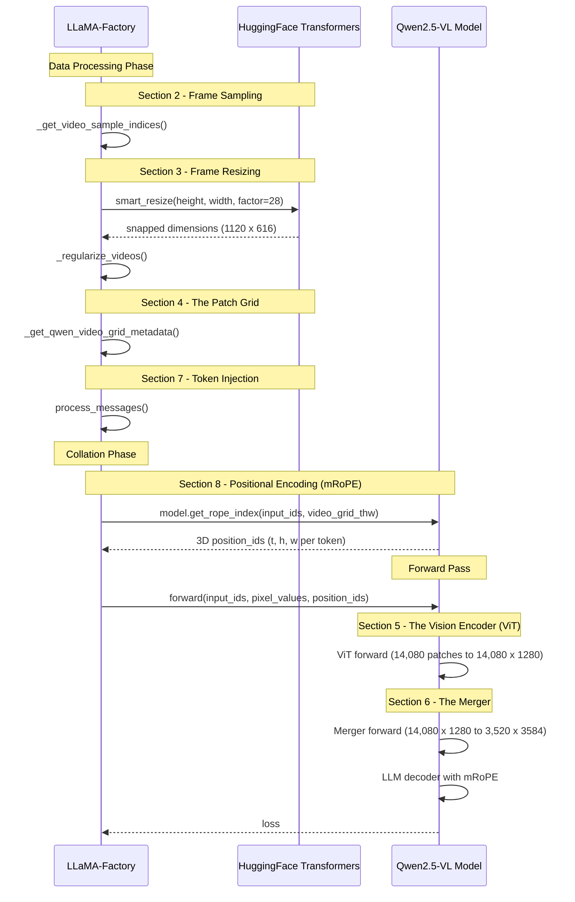

This post is the second post of the Post-Training VLM series. The [previous post (Blog 0)]() introduced VideoScore2 and its training pipeline of using Qwen2.5-VL model with frozen vision tower and full-parameter LLM training. The Qwen2.5-VL model has three-component architecture -- ViT, merger, LLM. This post covers the preprocessing steps that feed into ViT (frame sampling, resizing, patching — Sections 3-5), ViT (Section 6), merger (Section 7) and the handoff point where merged tokens enter the LLM's input sequence (Sections 8-10: token injection, mRoPE, context budget). It stops at the LLM's door. A running example is carried throughout: a 4-second video at 1280x720 native resolution encoded at 30fps.

## 1. The Compression Problem

Before examining the pipeline in detail, it is worth understanding the sheer scale of the mismatch between raw video data and a language model's capacity. This mismatch is what motivates every design choice in the sections that follow.

A 4-second video at 1280x720 resolution and 30 frames per second contains 120 frames. Each frame has 1,280 x 720 = 921,600 pixels, and each pixel carries three color values (red, green, blue). The total data volume is 120 x 921,600 x 3 = 331,776,000 numbers. Meanwhile, VideoScore2's training configuration sets the model's context window at 8,192 tokens. The video must share that budget with the text prompt (roughly 500 tokens for the system message and evaluation instructions) and the model's generated response (another 500 or so tokens for reasoning and scores). That leaves approximately 7,000 tokens for the video itself, though in practice the pipeline produces 3,520 tokens for this particular input.

Compressing 331 million numbers down to 3,520 tokens is roughly a 94,000x reduction. No single operation accomplishes this. Instead, the pipeline distributes the compression across multiple stages, each exploiting a different property of video data. Frame sampling exploits temporal redundancy (adjacent frames are nearly identical). Patching and the ViT exploit spatial redundancy (nearby pixels encode similar information). The merger performs a final spatial pooling. Each subsequent section describes one of these compression steps, in the order they are applied.

## 2. Frame Sampling

The first reduction operates along the time axis, discarding the vast majority of frames. At 30 frames per second, consecutive frames are nearly identical. The pipeline exploits this redundancy by keeping only a sparse temporal sample.

LLaMA-Factory implements this in `_get_video_sample_indices` within `mm_plugin.py`. The computation proceeds in two steps: a desired frame count is derived from video duration and a configured frames-per-second rate, then that count is capped against hard limits:

```python
sample_frames = max(1, floor(duration * video_fps))
sample_frames = min(total_frames, video_maxlen, sample_frames)
indices = np.linspace(0, total_frames - 1, sample_frames).astype(np.int32)
```

VideoScore2's training configuration sets `video_fps: 2.0` and `video_maxlen: 10`. The `video_fps` parameter is the model's desired sampling rate -- not the source video's native frame rate. The `np.linspace` call distributes sampled frames uniformly across the full frame range, ensuring temporal coverage regardless of where motion occurs.

| Video duration | Source frames | Desired = floor(dur x 2) | Actual = min(total, 10, desired) | Sampled indices                                |
| -------------- | ------------- | ------------------------ | -------------------------------- | ---------------------------------------------- |
| 2s             | 60            | 4                        | 4                                | [0, 20, 40, 59]                                |
| 4s             | 120           | 8                        | 8                                | [0, 17, 34, 51, 68, 85, 102, 119]              |
| 6s             | 180           | 12                       | 10                               | [0, 20, 40, 60, 80, 100, 120, 140, 160, 179]   |
| 10s            | 300           | 20                       | 10                               | [0, 33, 66, 100, 133, 166, 200, 233, 266, 299] |

For videos longer than 5 seconds, the `video_maxlen=10` cap becomes the binding constraint. This is the first mechanism that bounds downstream token count -- regardless of video length, the model never sees more than 10 frames.

One additional detail: the ViT's `temporal_patch_size=2` requires frames to be processed in pairs. If the sampled frame count is odd, LLaMA-Factory pads it to the next even number by duplicating the last frame. For the running example, 8 frames are already even, so no padding is needed.

## 3. Frame Resizing

Each of the 8 sampled frames must be spatially resized before entering the Vision Transformer. Two constraints must be satisfied: (a) the total pixel count must fit within a configured budget, preventing memory blowup in the ViT, and (b) both dimensions must divide evenly through the patching (Section 4) and merging (Section 6) stages that follow. The resizing algorithm applies two operations in sequence to satisfy both.

**Step 1: Pixel budget scaling.** VideoScore2's training config sets `video_max_pixels: 691200` (equivalent to 960 x 720). Any frame exceeding this budget is uniformly scaled down. For the running example:

```
source_pixels = 1280 × 720 = 921,600
budget        = 691,200

scale_factor  = sqrt(budget / source_pixels)
              = sqrt(691,200 / 921,600)
              = sqrt(0.75)
              = 0.866

new_width     = 1280 × 0.866 ≈ 1108
new_height    = 720 × 0.866  ≈ 623
```

The square root ensures uniform scaling in both dimensions, preserving the aspect ratio. The frame is now approximately 1108 x 623 pixels.

**Step 2: Grid-alignment snap.** The dimensions cannot remain at arbitrary values. The `smart_resize` function (from HuggingFace transformers' `image_processing_qwen2_vl.py`) rounds each dimension to the nearest multiple of a factor:

```
factor = patch_size × merge_size = 14 × 2 = 28
```

The factor of 28 exists because the ViT divides each frame into 14-pixel patches (Section 4), and the merger groups patches in 2x2 spatial blocks (Section 6). Both divisions must produce whole numbers with no leftover pixels at the edges.

```
snapped_width  = round(1108 / 28) × 28 = round(39.57) × 28 = 40 × 28 = 1120
snapped_height = round(623 / 28)  × 28 = round(22.25) × 28 = 22 × 28 = 616
```

Each frame is resized to **1120 × 616 pixels** (689,920 total pixels, within the 691,200 budget). The numbers 40 and 22 will reappear in Section 4 as the patch grid's column and row counts.

## 4. The Patch Grid (video_grid_thw)

After resizing, the video's spatial and temporal structure is fully determined and can be described by three integers -- T, H, W -- that form the `video_grid_thw` tensor. This tensor is the central piece of metadata that flows through the rest of the pipeline: it determines the visual token count (Section 6), controls token injection (Section 7), and provides the coordinate system for positional encoding (Section 8).

The three dimensions are:

- **T** (temporal): the number of time steps after grouping frames into pairs. The ViT's `temporal_patch_size=2` means consecutive frames are processed together as one temporal unit.
- **H** (height): the number of patch rows per frame. Each patch is 14 pixels tall, so H is the resized frame height divided by 14.
- **W** (width): the number of patch columns per frame. Each patch is 14 pixels wide, so W is the resized frame width divided by 14.

For the running example:

```
T = num_frames / temporal_patch_size = 8 / 2 = 4
H = resized_height / patch_size      = 616 / 14 = 44
W = resized_width / patch_size       = 1120 / 14 = 80
```

The resulting grid is **video_grid_thw = [4, 44, 80]**, representing 4 x 44 x 80 = 14,080 total patches that the ViT must process.

Additional examples illustrate how resolution and duration interact:

| Video         | Frames sampled | After resize | video_grid_thw | Total patches |
| ------------- | -------------- | ------------ | -------------- | ------------- |
| 2s, 720x480   | 4              | 728x476      | [2, 34, 52]    | 3,536         |
| 4s, 1280x720  | 8              | 1120x616     | [4, 44, 80]    | 14,080        |
| 6s, 1920x1080 | 10             | 1120x616     | [5, 44, 80]    | 17,600        |

For the 1920x1080 case: 1920 x 1080 = 2,073,600 pixels far exceeds 691,200, so the scale factor is sqrt(691200/2073600) = 0.577, giving approximately 1108 x 623, which snaps to the same 1120x616 as the 1280x720 case. The pixel budget effectively normalizes high-resolution videos to the same spatial grid.

## 5. The Vision Encoder (ViT)

As introduced in Blog 0, the ViT encoder transforms raw pixel patches into dense feature vectors. This section details its architecture and how it handles the variable-resolution inputs produced by Sections 2-4.

The ViT in Qwen2.5-VL-7B-Instruct has approximately 675M parameters. Its architecture consists of 32 transformer layers with hidden_size=1280 and 16 attention heads. Each patch input is a 3D volume: 2 frames x 14 pixels x 14 pixels x 3 channels, flattened and linearly projected into a 1280-dimensional embedding by the patch embedding layer.

A distinctive feature is the attention pattern: the ViT uses **windowed attention** with `window_size=112` patches for most layers, switching to **full (global) attention** at layers 7, 15, 23, and 31. This design balances efficiency (most layers attend only within local spatial neighborhoods) with global coherence (periodic full-attention layers allow information to propagate across the entire frame). Using full attention at every layer would be quadratic in the patch count -- impractical for 14,080 patches.

Rather than using absolute position embeddings (which would fix the model to a single resolution), the ViT applies 2D Rotary Position Embeddings over the spatial height and width coordinates. This is what enables Qwen2.5-VL's "dynamic resolution" capability -- the same ViT weights can process frames of any size that satisfies the patch alignment constraints from Section 3.

For the running example, the ViT processes 14,080 patches and produces **14,080 vectors of dimension 1280**. In VideoScore2's configuration, the ViT is entirely frozen (`freeze_vision_tower: true`) -- its 675M parameters remain exactly as they were after Qwen2.5-VL's original multimodal pretraining.

## 6. The Merger

The 14,080 patch vectors from the ViT would be far too many tokens for the LLM to process within its context window. As introduced in Blog 0, the merger performs 2x2 spatial pooling to reduce this count by a factor of 4.

The merger operates with `merge_size=2`: at each temporal position, it takes every 2x2 block of spatially adjacent patch embeddings (each 1280-dimensional), concatenates them into a single 5120-dimensional vector (4 x 1280), and passes this through an MLP that projects down to 3584 dimensions (the LLM's hidden size). The output is one token embedding that the LLM can directly consume.

The visual token count after merging follows a simple formula:

```
num_tokens = T x H x W / merge_size^2 = T x (H/2) x (W/2)
```

For the [4, 44, 80] grid: 4 x 22 x 40 = **3,520 tokens**. These 3,520 vectors of dimension 3584 are what ultimately enter the LLM sequence.

The merger is also frozen in VideoScore2 (`freeze_multi_modal_projector: true`). Its role is a dimensionality bridge: mapping from the ViT's 1280-dimensional representation space to the LLM's 3584-dimensional embedding space. The merger's weights were optimized during Qwen2.5-VL's original multimodal pretraining. Since both the ViT and merger are frozen, the entire vision pipeline — from raw pixels to LLM-ready tokens — behaves as a fixed feature extractor during VideoScore2 training. Only the LLM decoder's weights are updated during VideoScore2 training.

## 7. Token Injection

With visual embeddings produced by the ViT and merger, the remaining question is how they enter the LLM's input sequence alongside text tokens. This happens through a two-stage mechanism: placeholder expansion at data processing time, and embedding replacement during the forward pass.

The starting point is the `<video>` placeholder in training data. During data processing, `Qwen2VLPlugin.process_messages()` in LLaMA-Factory replaces this placeholder with a precisely-sized sequence of special tokens:

```python
merge_length = merge_size ** 2  # = 4
video_seqlen = video_grid_thw[i].prod() // merge_length
# For [4, 44, 80]: 4*44*80 // 4 = 3520

content = content.replace(
    VIDEO_PLACEHOLDER,
    f"<|vision_start|>{'<|video_pad|>' * video_seqlen}<|vision_end|>",
    1,
)
```

The result is: `<|vision_start|><|video_pad|>x3520<|vision_end|>`. The 3,520 `<|video_pad|>` tokens serve as positional placeholders in the tokenized sequence. During the forward pass, the model runs the ViT and merger to produce visual embeddings of shape [3520, 3584], then locates all `video_pad` positions in `input_ids` and replaces their embeddings with the corresponding visual vectors. From that point forward, the LLM's self-attention treats visual tokens identically to text tokens -- there is no cross-attention pathway.

The full tokenized sequence layout for a VideoScore2 training example follows the `qwen2_vl` chat template:

```
<|im_start|>system
You are a helpful assistant.<|im_end|>
<|im_start|>user
<|vision_start|><|video_pad|>x3520<|vision_end|>
You are an expert for evaluating AI videos...
<|im_end|>
<|im_start|>assistant
<think>...chain-of-thought reasoning...</think>
(1) visual quality: 4
(2) text-to-video alignment: 3
(3) physical/common-sense consistency: 5<|im_end|>
```

The model reads this left to right. By the time it generates the assistant response, it has attended to both the video tokens and the text instruction through self-attention.

## 8. Positional Encoding (mRoPE)

There is a subtle problem with inserting 3,520 video tokens into a text sequence. If the model simply numbers all tokens sequentially (position 1, 2, 3, ..., 3520, ...), it loses the video's spatial and temporal structure entirely. Consider two tokens that are sequentially adjacent in the flattened list: token 200 and token 201. They might be horizontally neighboring patches within the same frame row. But token 200 and token 1080 might represent the same spatial position viewed one time step later (since each time step contributes 22 x 40 = 880 tokens after merging). With sequential numbering, the model would treat token 200 and 201 as "close" and token 200 and 1080 as "far apart," even though the latter pair represents the same location across time and might be more semantically related for evaluating physical consistency.

Qwen2.5-VL solves this with Multimodal Rotary Position Embedding (mRoPE). Instead of assigning each token a single position number, mRoPE assigns **three position numbers**: a time coordinate, a height coordinate, and a width coordinate. These three coordinates encode each token's actual location in the three-dimensional grid described by `video_grid_thw` from Section 4.

Two tokens in the same row of the same frame share identical time and height coordinates but differ in width. The model's attention mechanism perceives them as horizontally adjacent. Two tokens at the same spatial location but in different time steps share height and width coordinates but differ in time. The model perceives them as temporally adjacent. This three-dimensional encoding preserves the spatial and temporal relationships that the pipeline worked to maintain through all preceding steps.

For text tokens, all three coordinates are set to the same incrementing value. If a text token is at sequence position 3721, its coordinates are (3721, 3721, 3721). This makes the three-dimensional system degenerate to standard one-dimensional positioning for text, since all three dimensions agree. The dual behavior -- 3D for visual tokens, 1D-equivalent for text -- emerges naturally from how coordinates are assigned rather than from separate mechanisms.

The implementation works as follows. Each attention head has dimension 128 (3584 hidden / 28 heads). These 128 dimensions are split into three groups: the first 32 dimensions (16 pairs) receive rotary embeddings based on the temporal coordinate, the next 48 dimensions (24 pairs) use the height coordinate, and the final 48 dimensions (24 pairs) use the width coordinate. Within each group, standard rotary position embedding math applies -- the only difference from regular RoPE is that three different position values feed into three different portions of the head dimension.

A critical detail for context budget reasoning is how the position counter advances after a video region. Rather than advancing by the full visual token count (3,520), `current_pos` advances by only `max(H/merge_size, W/merge_size)`. For the [4, 44, 80] grid, this is max(22, 40) = 40. This design keeps subsequent text tokens at moderate position values rather than pushing them to extremely high positions that would degrade attention patterns.

The `second_per_grid_ts` parameter provides real-time spacing between temporal patches: `temporal_patch_size / fps = 2 / 2.0 = 1.0` second per temporal grid position. This allows the model to encode actual temporal duration rather than just ordinal frame indices.

The mRoPE computation happens per-batch in the data collator, using the `video_grid_thw` values from Section 4 and `mm_token_type_ids` (which marks each token as text=0, image=1, or video=2) to determine coordinate assignment.

## 9. Context Budget

The practical constraint that ties all previous sections together is the context window. VideoScore2 sets `cutoff_len=8192`, meaning every component of the input -- system prompt, visual tokens, user query, and model response -- must fit within 8,192 tokens. Because visual tokens can dominate this budget (as the arithmetic in Sections 4 and 6 shows), understanding the budget breakdown explains why VideoScore2 uses the specific configuration values it does.

| Video         | Frames | Grid        | Visual tokens | + Instruction (~500) | + Response (~500) | Total | Headroom |
| ------------- | ------ | ----------- | ------------- | -------------------- | ----------------- | ----- | -------- |
| 2s, 720x480   | 4      | [2, 34, 52] | 884           | 1,384                | 1,884             | 1,884 | 6,308    |
| 4s, 1280x720  | 8      | [4, 44, 80] | 3,520         | 4,020                | 4,520             | 4,520 | 3,672    |
| 6s, 1920x1080 | 10     | [5, 44, 80] | 4,400         | 4,900                | 5,400             | 5,400 | 2,792    |

The visual token count formula from Section 6 -- `T x H x W / 4` -- makes it clear how the two configuration parameters `video_max_pixels=691200` and `video_maxlen=10` jointly constrain the budget. The pixel budget caps the spatial grid (preventing H and W from growing with resolution), while the frame cap limits T. Together they ensure that even the most demanding videos (long duration, high resolution) produce at most approximately 4,400 visual tokens, leaving sufficient room for text.

If a sequence still exceeds 8,192 tokens after these constraints, LLaMA-Factory's `infer_seqlen` function truncates it to `cutoff_len`. The conservative parameter choices in VideoScore2's YAML are specifically designed to make this truncation extremely rare in practice.

## 10. Summary of the Compression Journey

The table below summarizes each stage of the pipeline as applied to the running example (4-second, 1280x720, 30fps video):

| Stage                         | Input                      | Output                     | Reduction      |
| ----------------------------- | -------------------------- | -------------------------- | -------------- |
| Frame sampling (Section 2)    | 120 frames                 | 8 frames                   | 15x            |
| Resizing (Section 3)          | 921,600 pixels/frame       | 689,920 pixels/frame       | 1.3x           |
| Patching (Section 4)          | 689,920 pixels/frame       | 3,520 patches/frame        | reorganization |
| Temporal grouping (Section 4) | 8 frames                   | 4 time steps               | 2x             |
| Vision encoding (Section 5)   | 14,080 patches (588-dim)   | 14,080 vectors (1,280-dim) | transformation |
| Merging (Section 6)           | 14,080 vectors (1,280-dim) | 3,520 tokens (3,584-dim)   | 4x             |

Net result: 331,776,000 raw numbers become 3,520 tokens. After this pipeline, the LLM receives a flat sequence of 3584-dim vectors -- some from text embeddings, some from the vision pipeline -- and processes them identically through self-attention. The vision pipeline is entirely frozen; the LLM decoder alone learns to interpret these representations for the scoring task.

[Blog 2]() covers the training dataset, VideoFeedback2, that provides the target outputs the model learns to generate: chain-of-thought reasoning followed by three integer scores for visual quality, text-to-video alignment, and physical consistency.

## Appendix: Call Chain Between LLaMA-Factory and HuggingFace Transformers

The diagram below shows which library owns each processing step. LLaMA-Factory orchestrates the training loop and data pipeline, but delegates model-level operations (smart_resize, ViT forward pass, merger forward pass, mRoPE computation) to HuggingFace Transformers.



Key ownership boundaries:

| Step | Owner | Method/File |
| ---- | ----- | ----------- |
| Frame sampling | LLaMA-Factory | `Qwen2VLPlugin._get_video_sample_indices()` |
| Grid-alignment snap | HF Transformers | `image_processing_qwen2_vl.smart_resize()` |
| video_grid_thw computation | LLaMA-Factory | `Qwen2VLPlugin._get_qwen_video_grid_metadata()` |
| Placeholder expansion | LLaMA-Factory | `Qwen2VLPlugin.process_messages()` |
| mRoPE position IDs | HF Transformers | `Qwen2_5VLForConditionalGeneration.get_rope_index()` |
| ViT encoding | HF Transformers | `Qwen2_5VisionTransformerPretrainedModel.forward()` |
| Merger | HF Transformers | `Qwen2_5VLPatchMerger.forward()` |
| LLM decoder | HF Transformers | `Qwen2_5VLForConditionalGeneration.forward()` |

## References

| Resource                          | Link                                                                                             |
| --------------------------------- | ------------------------------------------------------------------------------------------------ |
| HuggingFace Transformers          | [github.com/huggingface/transformers](https://github.com/huggingface/transformers)               |
| Qwen2.5-VL-7B-Instruct model card | [huggingface.co/Qwen/Qwen2.5-VL-7B-Instruct](https://huggingface.co/Qwen/Qwen2.5-VL-7B-Instruct) |
| LLaMA-Factory                     | [github.com/hiyouga/LLaMA-Factory](https://github.com/hiyouga/LLaMA-Factory)                     |
| VideoScore2                       | [github.com/TIGER-AI-Lab/VideoScore2](https://github.com/TIGER-AI-Lab/VideoScore2)               |
