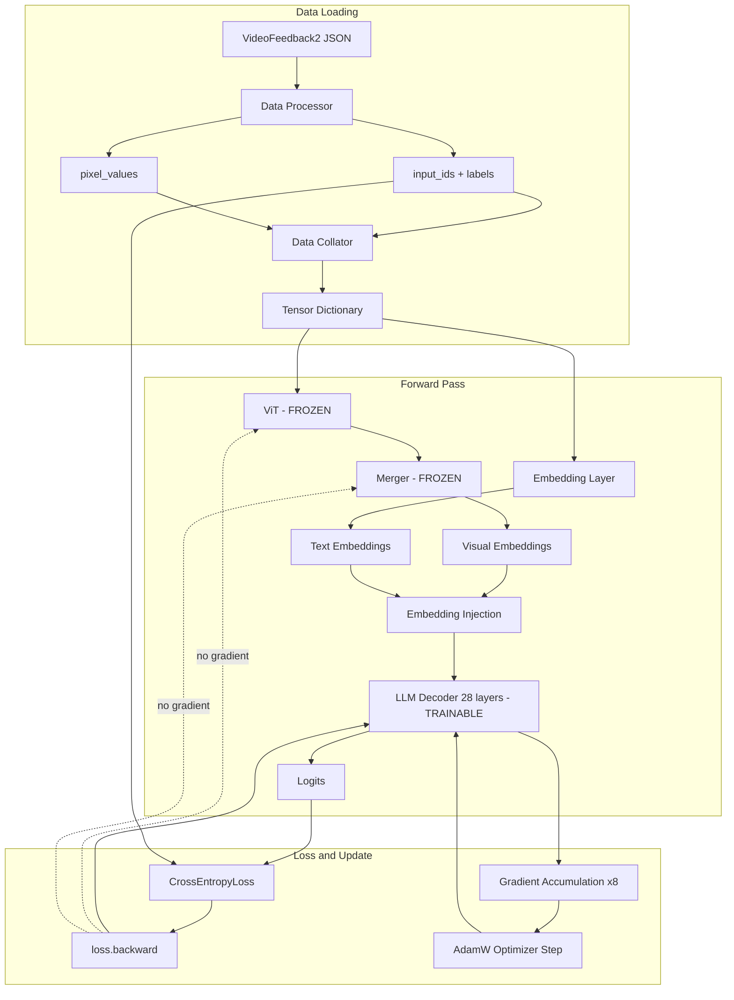
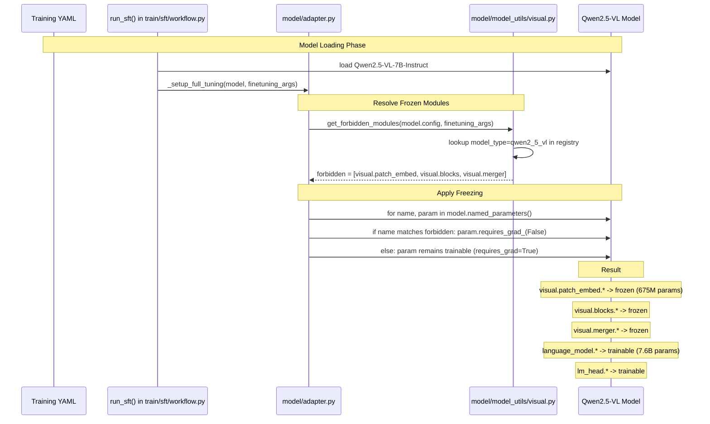

This is Blog 3 in the Post-Training VLM series. Blog 1 described the vision pipeline that converts a video into 3,520 visual tokens. Blog 2 detailed the VideoFeedback2 dataset -- 26,634 examples of chain-of-thought reasoning and scores that define the training signal. This post covers the machinery that converts that dataset into weight updates: the full SFT training loop as implemented by LLaMA-Factory, running on 8x A800 GPUs with DeepSpeed ZeRO-3.

## 1. The Training Configuration

The entire training run is specified by a single YAML file:

```yaml
### model
model_name_or_path: Qwen/Qwen2.5-VL-7B-Instruct
video_fps: 2.0
video_maxlen: 10
video_max_pixels: 691200  # 960*720

### method
stage: sft
finetuning_type: full
freeze_vision_tower: true
freeze_multi_modal_projector: true
freeze_language_model: false
deepspeed: examples/deepspeed/ds_z3_config.json

### dataset
template: qwen2_vl
cutoff_len: 8192

### train
per_device_train_batch_size: 1
gradient_accumulation_steps: 8
learning_rate: 5.0e-5
num_train_epochs: 2.0
lr_scheduler_type: cosine
warmup_ratio: 0.1
bf16: true
```

## 2. What Gets Trained

The first decision in any fine-tuning configuration is what parameters receive gradients. VideoScore2's YAML specifies three freeze flags:

```yaml
freeze_vision_tower: true
freeze_multi_modal_projector: true
freeze_language_model: false
```

The result is a clean partition. The ViT (675M parameters) and merger (a small MLP projection) are entirely frozen -- they contribute to the forward pass but receive no gradients. The LLM decoder (28 transformer layers, hidden size 3584, 28 attention heads, approximately 7.6B parameters) is the sole trainable component. Of the model's total 8.3B parameters, only the 7.6B in the decoder receive weight updates.

This partition means the vision pipeline functions as a fixed feature extractor. The visual tokens entering the LLM have the same quality and meaning they had after Qwen2.5-VL's original multimodal pretraining. What changes during VideoScore2 training is how the LLM interprets those tokens -- learning to attend to visual features that indicate quality, alignment, and physical consistency, and to generate structured reasoning followed by integer scores.

The following diagram shows the end-to-end training loop for one optimization step, indicating which components are frozen and where the loss/gradient flow:



LLaMA-Factory implements the freezing through a model registry (`model/model_utils/visual.py`) that maps `freeze_vision_tower` and `freeze_multi_modal_projector` flags to parameter name prefixes (`visual.patch_embed.*`, `visual.blocks.*`, `visual.merger.*`). The `_setup_full_tuning` function in `model/adapter.py` sets `requires_grad_(False)` on all matching parameters.

## 3. Label Construction: What the Loss Sees

The training objective is standard next-token prediction, but not every token in the sequence contributes to the loss. The data processor in `data/processor/supervised.py` (`_encode_data_example`) constructs a `labels` tensor where prompt tokens are masked with `IGNORE_INDEX = -100` and only assistant-turn tokens carry real token IDs. PyTorch's `CrossEntropyLoss` skips positions with label -100, so the loss is computed exclusively on tokens the model should learn to generate.

For the treadmill video example (from Blog 2), the full input sequence has approximately 4,643 tokens:

```
Positions 0-3:        <|im_start|>system\n          → labels: [-100, -100, -100, -100]
Positions 4-28:       You are a helpful assistant...  → labels: [-100, ..., -100]
Positions 29-3548:    <|vision_start|>...<|vision_end|>  → labels: [-100 x 3520]
Positions 3549-4019:  evaluation instruction text    → labels: [-100 x ~471]
Position 4020:        <|im_start|>assistant\n        → labels: [-100]
Positions 4021-4640:  <think>...reasoning...</think> → labels: [real IDs x ~620]
Positions 4641-4643:  score tokens (3, 3, 2)         → labels: [real IDs x 3]
```

The masking is applied at template boundaries. LLaMA-Factory's `qwen2_vl` template knows where the assistant turn begins, and everything before that boundary -- system prompt, visual placeholders, user instruction, role tags -- gets -100. Everything after the boundary gets the actual token IDs that the model should predict.

The key insight: of the ~4,643 tokens in this sequence, only ~623 participate in the loss (620 reasoning tokens + 3 score tokens). The remaining ~4,020 tokens provide context but generate zero gradient signal. This is a 7:1 ratio of context to supervision, which means each training example carries substantial "free" conditioning from the video and instruction without proportional computational cost in the backward pass.

## 4. The Model Input: Tensor Dictionary

The data collator (`MultiModalDataCollatorForSeq2Seq` in `data/collator.py`) assembles the final tensor dictionary that the model's forward pass receives. For the treadmill example, this dictionary contains:

| Tensor | Shape | Content |
| ------ | ----- | ------- |
| `input_ids` | [1, ~4643] | Token IDs for the full sequence (system prompt + visual placeholders + instruction + assistant response) |
| `labels` | [1, ~4643] | Same length as input_ids; -100 for prompt positions, real token IDs for assistant positions (Section 3) |
| `attention_mask` | [1, ~4643] | 1 for all real tokens, 0 for padding (no padding needed here since batch_size=1) |
| `position_ids` | [3, ~4643] | Three-dimensional mRoPE coordinates (temporal, height, width) per token, computed via `model.get_rope_index()` as described in Blog 1, Section 8 |
| `pixel_values` | [8, 3, 616, 1120] | Raw video frames (8 sampled frames, 3 color channels, resized to 616x1120) for the ViT to process |

These five tensors are everything the model needs. The forward pass (Section 5) consumes `pixel_values`, `input_ids`, `position_ids`, and `attention_mask` to produce logits. The loss computation (Section 6) then uses `labels` to determine which positions contribute.

## 5. The Forward Pass

The forward pass consumes the tensor dictionary from Section 4 in a specific order. Each step transforms one or more input tensors into intermediate representations, culminating in a logits tensor that feeds the loss function.

**Step 1: Vision encoding.** `pixel_values` [8, 3, 616, 1120] → ViT → merger → visual embeddings.

The ViT receives the 8 raw frames, patches them into 14,080 embeddings, and processes them through 32 transformer layers to produce 14,080 vectors of dimension 1280. The merger pools these in 2x2 spatial blocks and projects to dimension 3584, yielding 3,520 visual token embeddings. Because `requires_grad = False` on all vision parameters (Section 2), PyTorch does not build a computation graph for this step — the visual embeddings are computed but treated as constants for gradient purposes.

**Step 2: Text embedding.** `input_ids` [1, ~4643] → embedding layer → hidden states [1, ~4643, 3584].

The model's embedding layer maps every token ID to a 3584-dimensional vector. At this point, the 3,520 positions that contain the `<|video_pad|>` placeholder ID have meaningless embeddings — they are about to be replaced.

**Step 3: Embedding injection.** The 3,520 visual embeddings from Step 1 overwrite the placeholder embeddings from Step 2 at the corresponding positions. After this replacement, the sequence is a heterogeneous mix of text-derived and vision-derived vectors, all in the same 3584-dimensional space.

**Step 4: LLM decoder.** hidden states [1, ~4643, 3584] + `position_ids` [3, ~4643] + `attention_mask` [1, ~4643] → 28 transformer layers → logits [1, ~4643, 152064].

The 28 transformer layers process the full sequence with causal self-attention (each position attends only to itself and earlier positions). The `position_ids` tensor feeds into the rotary embedding computation at every layer, encoding spatial and temporal relationships via mRoPE. The `attention_mask` prevents attending to padding positions (trivial here with batch_size=1). The final linear layer (`lm_head`) projects hidden states to vocabulary size, producing a 152,064-dimensional logit vector at each position.

**Step 5: Output.** The forward pass produces logits at all ~4,643 positions. At position `t`, the logit vector represents the model's unnormalized prediction for what token comes at position `t+1`, conditioned on all tokens at positions 0 through `t`. The `labels` tensor is not used during the forward pass — it is consumed only in the loss computation (Section 6) to determine which positions contribute.

## 5. The Loss Function

The SFT loss is standard next-token-prediction cross-entropy, applied selectively to the unmasked positions from Section 4. The `SupervisedDatasetProcessor._encode_data_example` method constructs the labels:

```python
source_label = [IGNORE_INDEX] * source_len   # prompt/input: masked
target_label = target_ids                      # assistant response: supervised
```

HuggingFace's `CrossEntropyLoss(ignore_index=-100)` skips positions where labels equal -100. This means the loss is computed exclusively over the assistant response -- approximately 623 tokens per example (620 reasoning tokens + 3 score tokens).

The loss computation proceeds in two steps applied to the logits from Section 3:

**Step 1: Softmax.** At each position `t`, the logit vector is converted into a probability distribution over the vocabulary:

$$P(y \mid y_{<t}, x) = \frac{\exp(z_y)}{\sum_{j=1}^{V} \exp(z_j)}$$

where:

- $y$ — any token in the vocabulary; during loss computation we evaluate this at the correct token $y_t$ from the labels tensor
- $y_{<t}$ — all tokens before position $t$ in the sequence (visual tokens, prompt tokens, and the ground-truth reasoning tokens at positions before $t$). During training, the model always sees the correct previous tokens from the labels, not its own predictions — this is known as teacher forcing
- $x$ — the input conditioning (video frames + evaluation prompt); these are part of $y_{<t}$ but called out separately to emphasize that the model sees the video content
- $z_y$ — the logit (raw score) at the vocabulary index of token $y$. This is one element of the 152,064-dimensional vector output by `lm_head` at position $t$ (from Section 3)
- $\exp(z_y)$ — exponentiation ensures all values are positive before normalization
- $\sum_{j=1}^{V} \exp(z_j)$ — the sum of exponentiated logits across the entire vocabulary, used as the normalizing denominator so all probabilities sum to 1
- $V = 152{,}064$ — Qwen2.5-VL's vocabulary size (the number of possible next tokens)

The output is a probability distribution over all 152,064 tokens. The model's prediction for position $t$ is whichever token receives the highest probability, but during training we only care about the probability assigned to the correct token $y_t$.

**Step 2: Cross-entropy loss.** The loss indexes into this distribution at the correct token $y_t$, takes the negative log, and averages over all unmasked positions:

$$\mathcal{L} = -\frac{1}{N_{\text{target}}} \sum_{t \in \text{target}} \log P(y_t \mid y_{<t}, x)$$

where:

- $\mathcal{L}$ — the scalar loss for this single training example (one video)
- $N_{\text{target}}$ — the number of unmasked positions (where `labels[t] != -100`), approximately 623 (620 reasoning tokens + 3 score tokens)
- $t \in \text{target}$ — iteration over only the unmasked positions (the assistant turn)
- $P(y_t \mid y_{<t}, x)$ — the probability from Step 1's softmax, evaluated at the correct token $y_t$. The visual tokens, system prompt, and evaluation instructions all influence this probability through attention (they are part of the conditioning context $x$), but their own label positions are -100 so they never contribute to the loss

Why **log**: the probability $P(y_t \mid y_{<t}, x)$ is between 0 and 1. The log converts this into a range from $-\infty$ to 0. Critically, log penalizes low probabilities much more harshly than a linear function would — if the model assigns P = 0.01 to the correct token, $\log(0.01) = -4.6$, but if it assigns P = 0.1, $\log(0.1) = -2.3$. A 10x improvement in probability only halves the penalty. This creates strong gradients when the model is confidently wrong, pushing it to fix its worst predictions first.

Why **negative**: $\log P$ is always negative or zero (since $P \leq 1$). The negative sign flips this to a positive value, giving us a loss we can minimize. When P = 1 (perfect prediction), $-\log(1) = 0$ (zero loss). When P is near 0 (terrible prediction), $-\log P$ is large (high loss). Minimizing the negative log-probability is mathematically equivalent to maximizing the probability the model assigns to every correct token in the reasoning trace and scores.

In practice, PyTorch's `CrossEntropyLoss(ignore_index=-100)` fuses Steps 1 and 2 internally — it takes raw logits and labels directly, without materializing the full softmax matrix (using the log-sum-exp trick for numerical stability).

An important implication: 620/623 = 99.5% of the per-token loss comes from reasoning tokens. The 3 score tokens contribute only 0.5% of the gradient signal per example. The model is overwhelmingly trained to reason about video quality, not merely to emit scores.


## 6. Training Arithmetic

The effective batch size and optimization step count determine how much the model trains:

```
Dataset size:              26,634 examples
GPUs:                      8 (A800 80GB)
Per-device batch size:     1
Gradient accumulation:     8 steps
Effective batch size:      8 GPUs * 1 * 8 = 64 examples/step
Steps per epoch:           ceil(26,634 / 64) = 417 steps
Total epochs:              2
Total optimization steps:  ~832
Warmup steps:              0.1 * 832 = ~83 steps
Save checkpoint every:     300 steps
```

Each optimization step processes gradients accumulated from 64 examples. With ~623 target tokens per example, each step incorporates loss information from approximately 39,872 tokens. Over the full training run:

```
Total target tokens:       26,634 * 623 * 2 epochs = ~33.2M tokens
Total forward passes:      26,634 * 2 = 53,268
Total optimization steps:  ~832
```

For context, 33M tokens is modest by language model standards -- GPT-3 trained on 300B tokens. But this is targeted fine-tuning of an already-capable model on a narrow task. The 832 optimization steps are sufficient because the model starts from a strong initialization (Qwen2.5-VL-7B-Instruct) and the task requires adapting existing capabilities rather than learning them from scratch.

## 7. DeepSpeed ZeRO Stage 3

The model has 8.3B parameters. In bf16, that is 16.6 GB for parameters alone. With AdamW optimizer states (two momentum buffers per parameter), training requires ~50 GB per copy. A single A800 (80 GB) cannot hold the full training state. ZeRO-3 solves this by sharding parameters, gradients, and optimizer states across all 8 GPUs.

The DeepSpeed config:

```json
{
  "train_batch_size": "auto",
  "train_micro_batch_size_per_gpu": "auto",
  "gradient_accumulation_steps": "auto",
  "gradient_clipping": "auto",
  "bf16": { "enabled": "auto" },
  "zero_optimization": {
    "stage": 3,
    "overlap_comm": false,
    "contiguous_gradients": true,
    "sub_group_size": 1e9,
    "reduce_bucket_size": "auto",
    "stage3_prefetch_bucket_size": "auto",
    "stage3_param_persistence_threshold": "auto",
    "stage3_max_live_parameters": 1e9,
    "stage3_max_reuse_distance": 1e9,
    "stage3_gather_16bit_weights_on_model_save": true
  }
}
```

Key behaviors:

- **Parameter sharding**: Each GPU holds ~1/8 of the model's parameters at rest. During forward/backward, parameters are all-gathered on demand and discarded after use.
- **Gradient sharding**: Each GPU computes gradients for all parameters during backward, but only retains the shard it owns. Gradients are reduce-scattered across GPUs.
- **Optimizer state sharding**: AdamW's first and second moment estimates are sharded. Each GPU updates only its 1/8 of the optimizer state.
- **Frozen modules and ZeRO-3**: The 675M frozen ViT parameters are still sharded by ZeRO-3 (they exist in the model's parameter list), but they never generate gradients or optimizer states. This means ZeRO-3 gathers them during forward pass but skips them during backward. The memory saved from not storing optimizer states for frozen parameters is: 675M * 8 bytes (two fp32 moments) = ~5.4 GB total, or ~675 MB per GPU.
- **overlap_comm: false**: Communication does not overlap with computation. This simplifies debugging and avoids potential race conditions at the cost of ~10-15% throughput.

Per-GPU memory budget (approximate):

```
Sharded parameters (8.3B / 8 * 2 bytes):    ~2.1 GB
Optimizer states (7.6B / 8 * 8 bytes):       ~7.6 GB
Gathered parameters during forward:          varies (up to full layer)
Activations (1 example, 8192 tokens):        ~8-12 GB
Gradient buffers:                            ~2-4 GB
Overhead (fragmentation, CUDA context):      ~4-6 GB
Total:                                       ~24-32 GB / 80 GB available
```

The per-device batch size of 1 is dictated by activation memory, not model memory. Each example contains up to 8,192 tokens with a 3584-dimensional hidden state across 28 transformer layers -- that is the binding constraint.

## 8. Learning Rate Schedule

The learning rate follows a cosine decay schedule with linear warmup:

```
Phase 1 (steps 0-83):    Linear warmup from 0 to 5e-5
Phase 2 (steps 83-832):  Cosine decay from 5e-5 to 0
```

The choice of lr=5e-5 is relatively aggressive for full fine-tuning of a 7B model. For comparison, typical full fine-tuning of LLaMA-7B uses 1e-5 to 2e-5. The higher rate is justified by three factors:

1. **Short training duration**: 832 steps provides limited time for the model to converge. A higher learning rate ensures the parameters move far enough from initialization.
2. **Frozen vision tower**: The LLM decoder's gradients are not propagated through the vision encoder, eliminating one source of gradient instability. The gradient norms are more predictable when the input representation is fixed.
3. **Task narrowness**: Video quality assessment is a constrained output space (5^3 = 125 possible score combinations). The model needs to adapt its response distribution but not fundamentally restructure its representations.

The 10% warmup (83 steps) prevents large initial updates when the learning rate is applied to a model whose gradients may be poorly calibrated for the new task distribution. After warmup, cosine decay provides a smooth reduction that allows fine-grained convergence in later steps without the abrupt transitions of step-based schedules.

## 9. The Training Workflow

The `run_sft()` function in `train/sft/workflow.py` orchestrates the full pipeline:

```python
def run_sft(model_args, data_args, training_args, finetuning_args, ...):
    tokenizer_module = load_tokenizer(model_args)
    template = get_template_and_fix_tokenizer(tokenizer, data_args)
    dataset_module = get_dataset(template, model_args, data_args, training_args, stage="sft")
    model = load_model(tokenizer, model_args, finetuning_args, training_args.do_train)

    data_collator = SFTDataCollatorWith4DAttentionMask(
        template=template,
        model=model,
        pad_to_multiple_of=8,
        label_pad_token_id=IGNORE_INDEX,
    )

    trainer = CustomSeq2SeqTrainer(model=model, args=training_args, ...)
    train_result = trainer.train()
    trainer.save_model()
```

The execution order is:

1. **Tokenizer loading**: Loads the Qwen2.5-VL tokenizer with special tokens for `<video>` placeholders.
2. **Dataset preprocessing**: Each example is tokenized with label masking applied. Visual tokens are not embedded at this stage -- they are placeholder IDs that will be replaced by ViT outputs during forward pass.
3. **Model loading**: Loads Qwen2.5-VL-7B-Instruct weights, applies the freezing logic (Section 2), and wraps with DeepSpeed ZeRO-3.
4. **Training loop**: HuggingFace Trainer with gradient accumulation, bf16 mixed precision, and DeepSpeed handles the optimization loop.

## 10. Gradient Flow Analysis

During each forward pass, the computation graph is:

```
Video frames -> ViT (frozen) -> Merger (frozen) -> Visual tokens
                                                       |
Text prompt tokens ---------------------------------> LLM Decoder -> Loss
                                                       |
                                                   Backward pass
                                                       |
                                              Gradients to LLM only
```

Because `requires_grad=False` on all ViT and merger parameters, PyTorch's autograd does not construct gradient computation nodes for the vision pipeline. The visual tokens enter the LLM decoder as leaf tensors with no gradient history. This has two consequences:

1. **No gradient instability from vision encoder**: The 675M-parameter ViT is a deep network (32 transformer blocks). Backpropagating through it would introduce gradient scale issues and increase the risk of catastrophic forgetting of visual features. Freezing eliminates this.
2. **Reduced activation memory**: Activations in the vision encoder do not need to be retained for backward pass. Only the LLM decoder's 28 layers of activations are stored.

Within the LLM decoder, gradients flow through all 28 layers of the standard transformer architecture: self-attention (Q, K, V projections + output projection), feed-forward network (gate, up, down projections), and RMSNorm layers. With 3584 hidden dimension, 28 attention heads, and an intermediate size of 18944, each layer has approximately 270M parameters.

## 11. Loss Landscape Considerations

The training signal per example is dominated by reasoning tokens (620 out of 623). This creates a specific loss landscape:

- **Early training**: The model's reasoning tokens are initially incoherent for the video evaluation task. The per-token cross-entropy is high across all 620 reasoning positions, providing strong and relatively uniform gradients. The model rapidly learns the structural template of the think block.
- **Mid training**: Reasoning structure converges (the model learns to produce "multi-dimensional analysis:" headers and per-dimension paragraphs), but fine-grained quality judgments remain imprecise. Gradients concentrate on content words within the reasoning.
- **Late training**: Reasoning quality plateaus. The remaining gradient signal comes from subtle word choices ("adequate" vs "good" vs "excellent") and the 3 score tokens. The cosine schedule's low learning rate in this phase prevents these small gradients from causing oscillation.

The 2-epoch limit is deliberately short. With no validation set in this configuration (`val_size` is commented out), there is no early stopping mechanism. The two-epoch choice relies on prior empirical evidence that full fine-tuning of instruction-tuned models overfits rapidly on small datasets. Two epochs provides approximately 1.7 passes over the data after warmup (the first 83 steps of epoch 1 have reduced effective learning), which is a common sweet spot for SFT before diminishing returns.

## 12. What Training Does NOT Include

Several notable absences in this configuration:

- **No gradient clipping specified in YAML**: DeepSpeed's `gradient_clipping: "auto"` defers to the HuggingFace Trainer's default of 1.0. This caps the global gradient norm, preventing explosion from outlier examples.
- **No evaluation during training**: The eval configuration is commented out. The model trains blind for 832 steps. Evaluation happens post-hoc on VideoScore-Bench-v2.
- **No data packing**: Each example occupies its own sequence (batch size 1). There is no attempt to pack multiple short examples into a single 8192-token window. Given that most examples use ~4,600 tokens (3,520 visual + 500 prompt + 623 response), approximately 44% of each sequence window is padding.
- **No weight decay specified**: Defaults to 0.0 in HuggingFace Trainer. For a 2-epoch run, regularization from weight decay would have minimal effect.

## 13. From SFT Checkpoint to RL

The SFT training produces a checkpoint at `saves/vs2_qwen2_5vl_sft_27k_5e-5_2fps_960_720_8192`. This checkpoint is a complete Qwen2.5-VL-7B model with modified language model weights and unchanged vision weights. It serves as the initialization for the subsequent GRPO reinforcement learning stage, where the model generates its own reasoning (no longer supervised) and receives reward signal based solely on score accuracy.

The SFT stage's role is to establish the model's ability to produce structured video quality reasoning. The RL stage then optimizes the policy for score accuracy without constraining the reasoning format. This two-stage approach (SFT then RL) is standard in RLHF pipelines -- SFT provides the behavioral prior, RL sharpens it toward the objective.

## Appendix: Freezing Implementation Call Chain

The sequence diagram below traces the call chain from the YAML configuration through to parameters being frozen:



Key files:

| File | Role |
| ---- | ---- |
| `model/model_utils/visual.py` | Registers composite model with key prefixes: `projector_keys=["visual.merger"]`, `vision_model_keys=["visual.patch_embed", "visual.blocks"]` |
| `model/adapter.py` | `_setup_full_tuning()` iterates parameters, matches against forbidden keys, sets `requires_grad_(False)` |
| `train/sft/workflow.py` | `run_sft()` orchestrates model loading, freezing, and trainer setup |

## References

| Resource | Link |
|----------|------|
| LLaMA-Factory | [github.com/hiyouga/LLaMA-Factory](https://github.com/hiyouga/LLaMA-Factory) |
| DeepSpeed ZeRO | [deepspeed.ai/tutorials/zero](https://www.deepspeed.ai/tutorials/zero/) |
| VideoScore2 training config | [github.com/TIGER-AI-Lab/VideoScore2/training/SFT](https://github.com/TIGER-AI-Lab/VideoScore2/tree/main/training/SFT) |
| Qwen2.5-VL | [github.com/QwenLM/Qwen2.5-VL](https://github.com/QwenLM/Qwen2.5-VL) |
