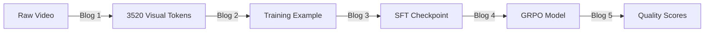

This is Blog 5 in the Post-Training VLM series. [Blog 4]() described the GRPO reinforcement learning stage that produces the final trained model. This post covers what happens after training. How does the trained model process a new video and produce quality scores? How are those scores evaluated against human judgments? The post traces the treadmill video one final time through the inference pipeline, then examines the evaluation methodology and results.

## 1. Training vs Inference

During training (Blogs 3-4), the model processes examples where the correct output is known. The forward pass sees the full sequence (video + prompt + ground-truth response) and computes loss against known labels. During inference, the model sees only the video and prompt, then generates its response token by token with no target to compare against.

| Aspect | Training (Blogs 3-4) | Inference (this post) |
| ------ | -------------------- | --------------------- |
| Input | Video + prompt + ground-truth response | Video + prompt only |
| Output | Loss (scalar) | Generated text (reasoning + scores) |
| Generation mode | Teacher forcing (sees correct previous tokens) | Autoregressive (sees its own previous tokens) |
| Visual pipeline | Same | Same (ViT + merger, still frozen) |
| LLM decoder | Same weights | Same weights |
| Decoding | Deterministic (forward pass only) | Stochastic (temperature sampling, token-by-token) |

The visual pipeline (Blog 1) operates identically in both cases. The same ViT and merger produce the same visual tokens for the same video. The difference is entirely in what the LLM decoder does with those tokens.

## 2. The Inference Pipeline

The inference code lives in `vs2_inference.py` in the VideoScore2 repository. It uses HuggingFace Transformers directly (not LLaMA-Factory, which is only needed for training orchestration).

### Step 1: Load the model

The trained model is loaded from the final checkpoint (or from the published HuggingFace model `TIGER-Lab/VideoScore2`). The model class is `AutoModelForVision2Seq` from HuggingFace Transformers, which includes the full Qwen2.5-VL architecture (ViT + merger + LLM decoder) with the GRPO-trained weights.

### Step 2: Prepare the input

The video is processed with the same parameters used during training. The inference fps is set to 2.0 (matching `video_fps: 2.0` from the SFT config in Blog 3). The prompt template is slightly different from training but serves the same purpose. It asks the model to evaluate the video on the three dimensions:

```
You are an expert for evaluating AI-generated videos from three dimensions:
(1) visual quality – clarity, smoothness, artifacts;
(2) text-to-video alignment – fidelity to the prompt;
(3) physical/common-sense consistency – naturalness and physics plausibility.

Video prompt: [the T2V prompt that generated this video]

Please output in this format:
visual quality: <v_score>;
text-to-video alignment: <t_score>,
physical/common-sense consistency: <p_score>
```

The video frames and prompt are assembled into a message, processed by the Qwen2.5-VL processor (which handles frame sampling, resizing, and tokenization as described in Blog 1), and converted into the same tensor format the model expects.

### Step 3: Generate

The model generates text autoregressively with these parameters:

```
max_new_tokens: 1024
temperature: 0.7
do_sample: True
output_scores: True
return_dict_in_generate: True
```

The `temperature=0.7` controls the randomness of generation. A temperature of 1.0 samples directly from the model's probability distribution. A temperature of 0.7 sharpens the distribution (making high-probability tokens more likely to be selected), producing more focused but not fully deterministic output. The `output_scores=True` flag saves the logit vectors at each generation step, which Section 3 uses for soft scoring.

### Step 4: Parse the output

The model produces a text response containing a `<think>` block (reasoning) followed by the three scores. A regex extracts the integer scores:

```python
pattern = r"visual quality:\s*(\d+).*?text-to-video alignment:\s*(\d+).*?physical/common-sense consistency:\s*(\d+)"
```

For the treadmill video, a typical output might be:

```
<think>
The video shows a man on a treadmill in a gym setting. Visual quality
is moderate with adequate detail but limited sharpness. The prompt asks
for jogging, speed increase, and sprint - the video shows running but
the acceleration sequence is not clearly depicted. The running motion
appears somewhat stiff and mechanical.
</think>

visual quality: 3
text-to-video alignment: 3
physical/common-sense consistency: 2
```

These integers (3, 3, 2) are the "hard scores."

## 3. Hard Scores vs Soft Scores

The hard score is simply the integer the model outputs as text (1-5). But this discards information. When the model generates the token "3" for visual quality, it also assigns probabilities to tokens "1", "2", "4", and "5". If the model is 60% confident in "3" and 30% confident in "4", the hard score reports 3 while the soft score incorporates the uncertainty.

### The soft score formula

The soft score uses the token-level probability distribution at the position where the score digit is generated:

$$\tilde{y} = \frac{\arg\max_s \, p(s) \cdot p(s)}{\sum_{j=1}^{5} p(j)}$$

Breaking this down:

- $p(s)$ is the probability the model assigns to score token $s$ (for $s \in \{1, 2, 3, 4, 5\}$). These probabilities come from the softmax over the logit vector at the score token position.
- $\arg\max_s \, p(s)$ is the score with the highest probability (same as the hard score).
- The numerator $\arg\max_s \, p(s) \cdot p(s)$ multiplies the best score by its probability. If the model is very confident (p = 0.95), the soft score is close to the hard score. If uncertain (p = 0.5), the soft score is discounted.
- The denominator $\sum_{j=1}^{5} p(j)$ normalizes by the total probability mass across the five valid score tokens (excluding all other vocabulary tokens).

### Example

For the treadmill video's visual quality score, suppose the model's probability distribution at the score position is:

```
p(1) = 0.02, p(2) = 0.15, p(3) = 0.58, p(4) = 0.20, p(5) = 0.05

hard_score = 3 (argmax)

soft_score = 3 × 0.58 / (0.02 + 0.15 + 0.58 + 0.20 + 0.05)
           = 1.74 / 1.00
           = 1.74
```

Wait. That gives 1.74, which is less than the hard score of 3. Let me re-read the code.

Looking at the actual implementation in `vs2_inference.py`:

```python
def ll_based_soft_score_normed(hard_val, token_idx, scores, tokenizer):
    logits = scores[token_idx][0]
    score_range = list(range(1, 6))
    score_probs = []
    for s in score_range:
        ids = tokenizer.encode(str(s), add_special_tokens=False)
        tid = ids[0]
        logp = torch.log_softmax(logits, dim=-1)[tid].item()
        prob = float(np.exp(logp))
        score_probs.append((s, prob))
    scores_list, probs_list = zip(*score_probs)
    total_prob = sum(probs_list)
    max_prob = max(probs_list)
    best_score = scores_list[probs_list.index(max_prob)]
    normalized_prob = max_prob / total_prob
    return round(best_score * normalized_prob, 4)
```

The computation is: `best_score × (max_prob / total_prob)`. This is the hard score multiplied by the model's normalized confidence. If the model assigns 58% of the score-token probability mass to "3", the soft score is `3 × (0.58 / 1.00) = 1.74`.

This produces values in the range [0.2, 5.0] (best case: score 5 with 100% confidence = 5.0; worst case: score 1 with 20% confidence = 0.2). The soft score is lower than the hard score when the model is uncertain, and approaches the hard score when the model is highly confident.

### Why soft scores matter

For evaluation benchmarks that use preference pairs (comparing two videos), soft scores provide finer-grained discrimination. Two videos might both receive a hard score of 3, but if one has a soft score of 2.8 and the other 1.5, the model can still express a preference. The paper reports that soft scores perform better on pairwise preference benchmarks while hard scores have slight advantages on point-score benchmarks.

## 4. Evaluation Methodology

The trained model is evaluated on five benchmarks, each testing different aspects of video evaluation capability.

### In-domain benchmark

**VideoScore-Bench-v2** (500 videos from Blog 2's test set). This measures how well the model matches human scores on videos from the same distribution as training data. The evaluation computes three metrics per dimension:

- **Accuracy**: exact match between predicted score (rounded) and human ground truth
- **Relaxed Accuracy**: prediction within ±1 of ground truth (same tolerance as the RL reward function from Blog 4)
- **PLCC** (Pearson Linear Correlation Coefficient): how linearly correlated the predicted scores are with human scores across all test videos

### Out-of-domain benchmarks

| Benchmark | Videos | Format | What it tests |
| --------- | ------ | ------ | ------------- |
| VideoGenReward-Bench | 4,691 videos, 25,234 pairs | Pairwise preference | Which of two videos is better |
| T2VQA-DB | 2,000 videos, 1,822 pairs | Pairwise preference | Quality comparison (human scores 0-100) |
| MJ-Bench-Video | 2,170 videos | Point-score (0-2) | Aspect-level quality |
| VideoPhy2-test | 3,396 videos | Point-score (1-5) | Semantic adherence + physical consistency |

For pairwise benchmarks, the model scores both videos independently and the higher-scoring video is predicted as preferred. Ties are declared when scores differ by less than 5% of the score range.

## 5. Results

### In-domain (VideoScore-Bench-v2)

| Model | Accuracy (Avg) | Relaxed Acc (Avg) | PLCC (Avg) |
| ----- | -------------- | ----------------- | ---------- |
| VideoScore2 | **44.35** | **90.78** | **60.37** |
| VideoScore1.1 | 38.41 | 86.77 | 42.30 |
| VisionReward | 36.61 | 84.57 | 43.47 |
| UnifiedReward | 25.07 | 67.93 | 52.05 |
| Claude-Sonnet-4 | 28.93 | 71.74 | 22.94 |

VideoScore2 improves over the best baseline by +5.94 accuracy, +4.01 relaxed accuracy, and +8.32 PLCC.

### Out-of-domain (average preference accuracy)

| Model | Average | VideoGenReward-Bench | T2VQA-DB | MJ-Bench-Video | VideoPhy2-test |
| ----- | ------- | -------------------- | -------- | -------------- | -------------- |
| VideoScore2 | **50.37** | 51.53 | **50.60** | **65.77** | 33.58 |
| Q-Insight | 46.05 | 54.05 | 46.65 | 52.58 | 30.90 |
| VideoReward | 44.73 | **59.69** | 36.15 | 51.75 | 31.33 |

VideoScore2 achieves the highest overall average but is not the top model on every individual benchmark. On VideoGenReward-Bench, VideoReward (59.69) outperforms VideoScore2 (51.53).

## 6. What the Results Show

### The SFT + RL pipeline works

The two-stage pipeline (832 SFT steps + 300 GRPO steps) produces a model that surpasses both general-purpose VLMs (Claude-Sonnet-4, GPT-5) and specialized video scoring models (VideoScore1.1, VisionReward) on the in-domain benchmark. The +4.7 accuracy gain from GRPO over SFT-only (from Blog 4, Section 1) translates into real evaluation improvements.

### Physical consistency is the hardest dimension

Across all benchmarks, the physical consistency dimension shows the smallest improvements over baselines (+0.20 accuracy). This aligns with the task difficulty. Visual quality is relatively straightforward (blur, artifacts, resolution are observable). Text alignment is pattern-matchable (are the described elements present?). Physical consistency requires understanding causality, motion dynamics, and real-world constraints, which is fundamentally harder for a model trained on frame-level features.

### Generalization is partial

The model generalizes well on average across out-of-domain benchmarks (50.37 vs 46.05 for the next best), consistent with the "RL generalizes" hypothesis from Blog 4. However, on specific benchmarks like VideoGenReward-Bench, specialized models outperform it. The paper acknowledges that "high benchmark scores may indicate overfitting on in-domain tests and weak generalization" as a general concern.

## 7. The Complete Pipeline

The five blogs in this series trace the full lifecycle of a single training example:



From a 4-second MP4 file to three integer scores. The visual pipeline (Blog 1) converts pixels to tokens. The dataset (Blog 2) pairs those tokens with supervision targets. SFT (Blog 3) teaches the model to produce reasoning and scores. GRPO (Blog 4) sharpens score accuracy. Inference (this post) generates scores for new, unseen videos. Each stage transforms the same underlying data into increasingly useful representations, culminating in a model that correlates with human quality judgments at state-of-the-art levels.

## References

| Resource | Link |
|----------|------|
| VideoScore2 model | [huggingface.co/TIGER-Lab/VideoScore2](https://huggingface.co/TIGER-Lab/VideoScore2) |
| VideoScore2 paper | [arxiv.org/abs/2509.22799](https://arxiv.org/abs/2509.22799) |
| VideoScore2 code | [github.com/TIGER-AI-Lab/VideoScore2](https://github.com/TIGER-AI-Lab/VideoScore2) |
| VideoScore-Bench-v2 | [huggingface.co/datasets/TIGER-Lab/VideoFeedback2](https://huggingface.co/datasets/TIGER-Lab/VideoFeedback2) |
