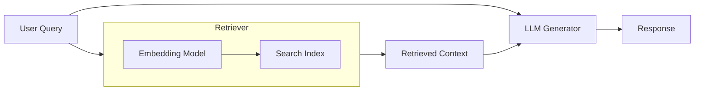
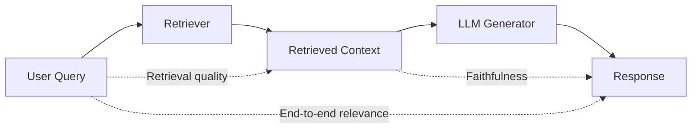

Everyone building RAG systems eventually hits the same wall: how do you know if it's working? The retrieval looks reasonable, the answers sound fluent, users aren't complaining loudly. But you have no quantitative grip on quality. You can't tell if your last change made things better or worse.

A RAG pipeline has a retriever and a generator, and quality can degrade at either stage or in the relationship between them. This creates three evaluation surfaces (Section 1). For each surface, there are metrics with different tradeoffs in annotation cost, correlation with downstream quality, and production feasibility (Sections 2-4). Most of these metrics require someone to judge relevance or faithfulness, which leads to the question of whether LLMs can replace human annotators (Section 5), and whether training dedicated judge models closes the remaining gap with humans (Section 6). Finally, even with good metrics and good judges, certain failure modes remain invisible to all current automated approaches (Sections 7-8).

---

## 1. The RAG Pipeline and Its Evaluation Surfaces

A Retrieval-Augmented Generation (RAG) system augments a language model with external knowledge at inference time. Rather than relying solely on what the model memorized during pretraining, it retrieves relevant documents from a corpus and feeds them to the generator as context. The pipeline has two core stages:

1. **Retrieval.** Given a user query, an embedding model encodes the query into a vector. A search index (dense, sparse, or hybrid) returns the top-K most similar document chunks from the corpus.
2. **Generation.** The retrieved chunks are concatenated into the LLM's context window alongside the original query. The LLM generates a response conditioned on both the query and the retrieved evidence.

This two-stage structure creates three relationships that can independently fail:

| Edge | Question | Failure Mode |
|------|----------|--------------|
| Query → Retrieved Context | Did the retriever find relevant passages? | Irrelevant or missing context |
| Retrieved Context → Response | Did the generator stay faithful to the evidence? | Hallucination, fabrication |
| Query → Response | Does the final output address the user's need? | Correct retrieval + faithful generation, but wrong question answered |

Multiple evaluation frameworks have independently operationalized these three edges. The following table maps each framework's metrics to the edge they address:

| Framework | Edge 1: Retrieval Quality | Edge 2: Faithfulness | Edge 3: End-to-End Relevance | Notes |
|---|---|---|---|---|
| **[TruLens](https://www.trulens.org/getting_started/core_concepts/rag_triad/)** (2023) | [Context Relevance](https://www.trulens.org/getting_started/core_concepts/rag_triad/#context-relevance) | [Groundedness](https://www.trulens.org/getting_started/core_concepts/rag_triad/#groundedness) | [Answer Relevance](https://www.trulens.org/getting_started/core_concepts/rag_triad/#answer-relevance) | Branded as "RAG Triad" |
| **[RAGAS](https://docs.ragas.io)** (Es et al., 2023) | [Context Precision](https://docs.ragas.io/en/stable/concepts/metrics/context_precision/), [Context Recall](https://docs.ragas.io/en/stable/concepts/metrics/context_recall/) | [Faithfulness](https://docs.ragas.io/en/stable/concepts/metrics/faithfulness/) | [Answer Relevance](https://docs.ragas.io/en/stable/concepts/metrics/answer_relevance/) | Also includes Noise Sensitivity (edge 2 diagnostic) |
| **[DeepEval](https://deepeval.com/docs)** | [Contextual Relevancy](https://deepeval.com/docs/metrics-contextual-relevancy), [Contextual Precision](https://deepeval.com/docs/metrics-contextual-precision), [Contextual Recall](https://deepeval.com/docs/metrics-contextual-recall) | [Faithfulness](https://deepeval.com/docs/metrics-faithfulness) | [Answer Relevancy](https://deepeval.com/docs/metrics-answer-relevancy) | Separates retriever vs. generator metric groups |
| **[Google Vertex AI](https://cloud.google.com/vertex-ai/generative-ai/docs/models/metrics-templates)** | — | [Groundedness](https://cloud.google.com/vertex-ai/generative-ai/docs/models/metrics-templates) | [Text Quality](https://cloud.google.com/vertex-ai/generative-ai/docs/models/metrics-templates), [Instruction Following](https://cloud.google.com/vertex-ai/generative-ai/docs/models/metrics-templates), Fluency | Adds Safety (no edge equivalent); no explicit retrieval metric |
| **[Databricks](https://www.databricks.com/blog/LLM-auto-eval-best-practices-RAG)** | — | — | [Correctness](https://docs.databricks.com/en/generative-ai/agent-evaluation/llm-judge-metrics.html) (60%), Comprehensiveness (20%), Readability (20%) | Evaluates answer only; retrieval and faithfulness not separately measured |

The convergence across frameworks is natural. It follows from the pipeline topology. The differences are in emphasis: evaluation tool vendors (TruLens, RAGAS, DeepEval) measure all three edges explicitly, while platform companies (Google, Databricks) collapse edges 1 and 2 into the answer-level evaluation and add dimensions the triad does not cover (safety, fluency, instruction-following).

The remainder of this post examines what metrics exist for each edge, their empirical validity, and where they fail.

---

## 2. Retrieval Quality Metrics

This is the most mature dimension because it borrows from decades of information retrieval research.

### 2.1 Classical Information Retrieval Metrics

These metrics predate RAG. They were developed for search engines and document retrieval systems, and apply directly to the retrieval stage of a RAG pipeline. All retrieval metrics are evaluated over a set of queries $Q$. Each metric is first computed per-query, then the final evaluation score is the mean across all queries in the set. Throughout the examples below, assume a retriever returns K=5 chunks, and the corpus contains 4 total relevant chunks for the query.

**Hit Rate@K** (also called Hit@K) measures whether *any* relevant document appears in the top-K results.

$$\text{Hit Rate@K} = \frac{1}{|Q|} \sum_{i=1}^{|Q|} \mathbb{1}[\text{at least one relevant doc in top-K for query } i]$$

Example: the retriever returns 5 chunks. At least one of them is relevant, so the hit for this query is 1. Averaged across a set of 100 evaluation queries where 85 have at least one relevant chunk in top-5:

$$\text{Hit Rate@5} = \frac{85}{100} = 0.85$$

Strength: the simplest retrieval metric. Answers the most basic question: did the retriever find *anything* useful?

Weakness: does not distinguish between retrieving 1 relevant chunk and retrieving 5. A system that returns 5 highly relevant passages scores the same as one that returns 1 relevant passage buried among 4 irrelevant ones. Also insensitive to rank position.

Annotation cost: requires only one known-relevant document per query. This can be generated synthetically (ask an LLM to produce a question from a chunk; that chunk is the relevant document).

**Precision@K** measures what fraction of the retrieved chunks are relevant.

Per-query:

$$\text{Precision@K}_i = \frac{\text{Number of relevant documents in top-K for query } i}{K}$$

Averaged across the evaluation set:

$$\text{Precision@K} = \frac{1}{|Q|} \sum_{i=1}^{|Q|} \text{Precision@K}_i$$

Example: the retriever returns 5 chunks, of which 3 are relevant.

$$\text{Precision@5} = \frac{3}{5} = 0.6$$

Strength: simple and interpretable. Directly answers "how much noise is in the retrieval?"

Weakness: treats all positions equally. A relevant chunk buried at rank 5 counts the same as one at rank 1. In RAG, this matters because LLMs attend more strongly to context at the beginning and end of the window ("lost in the middle" phenomenon), so rank position affects downstream generation quality.

Annotation cost: binary relevance labels on the K retrieved chunks only. No corpus-level annotation needed.

**Recall@K** measures what fraction of all relevant chunks were retrieved.

Per-query:

$$\text{Recall@K}_i = \frac{\text{Number of relevant documents in top-K for query } i}{\text{Total relevant documents in corpus for query } i}$$

Averaged across the evaluation set:

$$\text{Recall@K} = \frac{1}{|Q|} \sum_{i=1}^{|Q|} \text{Recall@K}_i$$

Example: same retrieval (3 relevant in top-5), but the corpus contains 4 relevant chunks total.

$$\text{Recall@5} = \frac{3}{4} = 0.75$$

Strength: ensures the retriever does not miss important information. For multi-hop questions that require evidence from multiple documents, high recall is essential because missing even one source can make the question unanswerable.

Weakness: the denominator requires knowing every relevant document in the entire corpus. This makes the metric impossible to compute exactly without exhaustive annotation.

Annotation cost: exhaustive corpus-level annotation. Every document must be labeled for relevance against each query. For a corpus of 100K chunks and 500 evaluation queries, this means 50M judgments in the worst case. In practice, pooling strategies reduce this (e.g., only label documents surfaced by any retrieval method), but the cost remains fundamentally higher than per-retrieval metrics.

**MRR (Mean Reciprocal Rank)** measures how quickly the first relevant chunk appears.

$$\text{MRR} = \frac{1}{|Q|} \sum_{i=1}^{|Q|} \frac{1}{\text{rank}_i}$$

where $\text{rank}_i$ is the position of the first relevant document for query $i$.

Example: for a single query, the first relevant chunk appears at position 2.

$$\text{RR} = \frac{1}{2} = 0.5$$

Strength: captures whether the retriever surfaces relevant material immediately. In RAG, the first relevant chunk often determines whether the LLM can begin generating a correct answer.

Weakness: only considers the first relevant document. A retriever that places one relevant chunk at rank 1 but misses the other three still scores perfectly. For questions requiring synthesis across multiple sources, MRR gives no signal about whether all necessary evidence was retrieved.

Annotation cost: minimal. Requires identifying at least one relevant document per query. An annotator can stop labeling as soon as the first relevant document is found in the ranked list.

**NDCG (Normalized Discounted Cumulative Gain)** measures whether highly relevant chunks are ranked above marginally relevant ones.

Per-query:

$$\text{DCG@K}_i = \sum_{k=1}^{K} \frac{2^{rel_k} - 1}{\log_2(k+1)}$$

$$\text{NDCG@K}_i = \frac{\text{DCG@K}_i}{\text{IDCG@K}_i}$$

where $rel_k$ is the graded relevance of the document at rank $k$ (e.g., 0=irrelevant, 1=partial, 2=highly relevant). IDCG (Ideal DCG) is the DCG computed on the ideal ranking, where all relevant documents are sorted by descending relevance at the top:

$$\text{IDCG@K}_i = \sum_{k=1}^{K} \frac{2^{rel_k^*} - 1}{\log_2(k+1)}$$

where $rel_k^*$ is the relevance of the document at rank $k$ in the ideal ordering.

Averaged across the evaluation set:

$$\text{NDCG@K} = \frac{1}{|Q|} \sum_{i=1}^{|Q|} \text{NDCG@K}_i$$

Example: retriever returns 5 chunks with relevance grades [2, 0, 1, 0, 1]:

$$\text{DCG@5} = \frac{2^2-1}{\log_2 2} + \frac{2^0-1}{\log_2 3} + \frac{2^1-1}{\log_2 4} + \frac{2^0-1}{\log_2 5} + \frac{2^1-1}{\log_2 6} = 3.0 + 0 + 0.5 + 0 + 0.39 = 3.89$$

The ideal ranking sorts all documents by descending relevance: [2, 2, 1, 1, 0].

$$\text{IDCG@5} = \frac{2^2-1}{\log_2 2} + \frac{2^2-1}{\log_2 3} + \frac{2^1-1}{\log_2 4} + \frac{2^1-1}{\log_2 5} + \frac{2^0-1}{\log_2 6} = 3.0 + 1.89 + 0.5 + 0.43 + 0 = 5.82$$

$$\text{NDCG@5} = \frac{3.89}{5.82} = 0.67$$

Strength: the most informative single metric. Respects rank position (via log discount) and relevance magnitude (via grading). A highly relevant document at rank 1 contributes far more than a marginally relevant document at rank 5. This aligns well with RAG, where the most relevant passage should appear first in the context window.

Weakness: the IDCG normalization requires knowing the ideal ranking, which means all relevant documents in the corpus must be identified and graded. Without exhaustive annotation, IDCG cannot be computed exactly, and the metric is undefined.

Annotation cost: the highest of the five metrics. Requires (1) exhaustive identification of all relevant documents in the corpus (same as Recall@K), and (2) graded relevance labels rather than binary (e.g., distinguishing "partially relevant" from "highly relevant"). This demands more annotator cognitive effort per judgment.

However, practical approximations exist that make NDCG feasible without exhaustive annotation:

- **Shallow pooling.** Instead of labeling the entire corpus, pool only the top-10 results from 2-5 candidate retrieval configurations, then judge that combined set. For NDCG@10, this works well because the top positions are well-covered by the pool. Buckley et al. (2007) showed that pooling error is less severe for NDCG@K with small K.
- **LLM-as-judge for graded relevance.** Use an LLM to assign relevance grades (0-3 scale) to pooled documents instead of human annotators. Thomas et al. (SIGIR 2024) showed LLM-based NDCG correlates with human-NDCG at Kendall's tau > 0.9. The UMBRELA benchmark (Upadhyay et al., 2024) confirmed this at scale on the TREC Deep Learning track. This is now the dominant approach for reducing evaluation cost.
- **Inferred NDCG (Yilmaz & Aslam, 2006).** Sample documents at different rank strata, judge only the sample, then statistically infer the full metric. Still used in some TREC tracks (Product Search 2023, Deep Learning document task), but the field's attention has shifted toward LLM-as-judge as the primary cost-reduction method.

The common production pattern combines the first two: pool top-10 from the current system plus a baseline, have an LLM assign graded relevance to all pooled documents, compute NDCG@10. This costs a few cents per query and produces system rankings that correlate strongly with full human evaluation.

### 2.2 Production vs. Benchmark Usage

The annotation cost of each metric largely determines where it is used in practice:

| Metric | Annotation Scope | Used in Production? | Used in Benchmarks? |
|--------|-----------------|--------------------|--------------------|
| Hit Rate@K | 1 relevant doc per query | Yes (dominant) | Rarely |
| MRR | 1 relevant doc per query | Yes (common) | Yes (BEIR, MTEB) |
| Precision@K | Binary labels on K retrieved docs | Sometimes | Yes |
| Recall@K | All relevant docs in corpus | Rarely (too expensive) | Yes (BEIR) |
| NDCG@K | Graded labels on all relevant docs | Rarely (too expensive) | Yes (primary metric in BEIR, MTEB) |

Academic benchmarks (BEIR, MTEB) can use NDCG@10 as their primary metric because they build on existing exhaustively-annotated datasets (TREC, MS MARCO) where the annotation work was done once and reused. Production teams cannot afford this for their proprietary corpora.

The common production pattern for retrieval evaluation:

1. **Offline evaluation (low annotation).** Generate synthetic question-answer pairs from the corpus using an LLM. The source chunk becomes the known-relevant document. Compute Hit Rate@K and MRR against these synthetic pairs. This requires zero human annotation and is sufficient for comparing embedding models, chunk sizes, and retrieval strategies.

2. **Online monitoring (zero annotation).** Use LLM-as-judge to score context relevance per query at inference time. TruLens, RAGAS, and DeepEval all support this. No pre-labeled dataset needed.

3. **Higher investment (small labeled set).** Create 50–100 human-labeled (query, relevant passages) pairs. Compute Precision@K or NDCG@K on this set. Calibrate an LLM judge against the human labels, then use the LLM judge to scale evaluation to thousands of queries.

### 2.3 RAGAS Context Metrics

RAGAS (Retrieval Augmented Generation Assessment; Es et al., arXiv:2309.15217) is an open-source evaluation framework designed to reduce the annotation cost of RAG evaluation. Classical IR metrics require human annotators to label relevance. RAGAS replaces human annotators with LLM judges, enabling automated evaluation that requires at most a reference answer per query rather than exhaustive corpus-level annotation.

RAGAS introduces a conceptual shift from classical IR metrics: instead of measuring relevance to **the query**, it measures relevance to **the known correct answer**. It has two retrieval metrics, Context Precision and Context Recall, to evaluate edge 1 (retrieval quality). Both require a reference (ground truth) answer as input.

#### Context Precision

Context Precision measures whether the *useful* chunks are ranked near the top of the retrieval results.

**How relevance is determined:** For each retrieved chunk at position $k$, an LLM is prompted: "Given this question, this reference answer, and this context chunk, was the chunk useful in arriving at the given answer?" The LLM returns a binary verdict $v_k \in \{0, 1\}$.

This is subtly different from classical relevance. A chunk might be topically related to the query but receive $v_k = 0$ if it was not useful for producing the specific reference answer.

**Score computation (Average Precision):**

$$\text{Context Precision@K} = \frac{\sum_{k=1}^{K} \text{Precision@k} \times v_k}{\sum_{k=1}^{K} v_k}$$

where $\text{Precision@k} = \frac{\sum_{j=1}^{k} v_j}{k}$ is the cumulative precision at position $k$.

**Example:**

Query: "Where is the Eiffel Tower?"
Reference answer: "The Eiffel Tower is located in Paris, France."
Retrieved chunks (K=3):
- Chunk 1: "The Eiffel Tower is a wrought-iron lattice tower in Paris, France." → $v_1 = 1$
- Chunk 2: "The Statue of Liberty is in New York City." → $v_2 = 0$
- Chunk 3: "Paris is the capital of France." → $v_3 = 1$

Computation:
- $k=1$: $v_1=1$, Precision@1 = 1/1 = 1.0, contributes 1.0
- $k=2$: $v_2=0$, skip (only sum where $v_k=1$)
- $k=3$: $v_3=1$, Precision@3 = 2/3 = 0.667, contributes 0.667

$$\text{Context Precision@3} = \frac{1.0 + 0.667}{2} = 0.833$$

If the irrelevant chunk were ranked first ([Chunk 2, Chunk 1, Chunk 3]):
- $k=1$: $v_1=0$, skip
- $k=2$: $v_2=1$, Precision@2 = 1/2 = 0.5, contributes 0.5
- $k=3$: $v_3=1$, Precision@3 = 2/3 = 0.667, contributes 0.667

Score = (0.5 + 0.667) / 2 = 0.583 (lower because useful chunks are ranked lower).

**Comparison with classical Precision@K:**

| | Classical Precision@K | RAGAS Context Precision |
|---|---|---|
| Who judges relevance? | Human annotators | LLM |
| Relevant to what? | The query | The reference answer |
| Position-sensitive? | No (simple ratio) | Yes (Average Precision rewards top-ranked relevant chunks) |
| Annotation required | Binary labels on K chunks | Reference answer per query |

#### Context Recall

Context Recall measures whether the retrieved context covers all the information needed to produce the ground truth answer.

**How it works:** The LLM receives all retrieved contexts (concatenated) and the reference answer. It decomposes the reference answer into **sentences** (called "claims" in RAGAS terminology), then for each sentence judges: "Can this sentence be attributed to the retrieved context?" The verdict is binary: attributed (1) or not attributed (0).

$$\text{Context Recall} = \frac{\text{Number of reference sentences attributed to context}}{\text{Total sentences in reference answer}}$$

**The "claim" concept:** In Context Recall, a claim is operationally a sentence in the reference answer. The LLM identifies sentence boundaries and evaluates each one independently. There is no sub-sentence decomposition.

**Example:**

Query: "What is the capital of France and its population?"
Reference answer: "Paris is the capital of France. It has a population of approximately 2.1 million."
Retrieved contexts: ["Paris is the capital city of France, located on the Seine river."]

LLM evaluates each sentence in the reference:
- "Paris is the capital of France." → attributed = 1 (context confirms this)
- "It has a population of approximately 2.1 million." → attributed = 0 (no population data in context)

$$\text{Context Recall} = \frac{1}{2} = 0.5$$

**Comparison with classical Recall@K:**

| | Classical Recall@K | RAGAS Context Recall |
|---|---|---|
| Denominator | Total relevant documents in corpus | Total sentences in reference answer |
| What it measures | Coverage of relevant corpus | Coverage of reference answer information |
| Requires corpus annotation? | Yes (must identify all relevant docs) | No (only needs reference answer) |
| Can detect missed documents? | Yes | No (only knows what the reference says) |
| Annotation required | Exhaustive corpus-level labels | Reference answer per query |

The denominators are fundamentally different. Classical recall measures "what fraction of all relevant documents did we retrieve?" RAGAS Context Recall measures "what fraction of the ground truth information is supported by what we retrieved?" A system can score 1.0 on RAGAS Context Recall while missing many relevant documents in the corpus, as long as the retrieved chunks happen to cover all claims in the reference answer.

**Implication for annotation cost:** Both RAGAS context metrics require a reference answer per query, which is cheaper than corpus-level annotation but more expensive than the zero-annotation approaches (Hit Rate on synthetic data, LLM-as-judge without reference). They are suitable for offline evaluation on curated test sets, not for online monitoring of production traffic.

---

## 3. Faithfulness / Groundedness Metrics

This is the hallucination check, and arguably the most critical dimension for trust. Faithfulness metrics answer: "Is the generated response supported by the retrieved context, or did the LLM fabricate information?"

Two families of approaches exist: LLM-based (prompt a general-purpose LLM to verify claims) and classifier-based (use a trained model specifically for entailment detection). They trade off flexibility against cost and determinism.

### 3.1 LLM-Based: Claim Decomposition (RAGAS)

$$\text{Faithfulness} = \frac{\text{Claims in response supported by context}}{\text{Total claims in response}}$$

Two-step process:
1. An LLM decomposes the generated answer into atomic claims. For example, "Paris is the capital of France and has 2.1 million people" becomes two claims: "Paris is the capital of France" and "Paris has 2.1 million people."
2. For each claim, the LLM judges whether it is supported by the retrieved context.

If an answer produces 5 claims and 3 are grounded in the passages, the faithfulness score is 0.6.

Strength: fine-grained. Identifies exactly which claims are unsupported. Flexible across domains because the LLM generalizes.

Weakness: expensive (multiple LLM calls per response). Non-deterministic. The claim decomposition step itself can introduce errors if the LLM splits claims poorly.

### 3.2 Classifier-Based: NLI and Trained Models

Natural Language Inference (NLI) is a classification task where a model determines the relationship between two texts: given a *premise* and a *hypothesis*, the model predicts whether the premise **entails** the hypothesis, **contradicts** it, or is **neutral**. NLI models are trained on large datasets of human-annotated text pairs (e.g., SNLI, MultiNLI).

Applied to faithfulness: the retrieved context is the premise, the generated response (or individual sentences from it) is the hypothesis. If the context entails the response, the response is grounded. If not, it may be hallucinated.

The TRUE benchmark (Honovich et al., arXiv:2204.04991) validated this approach, finding that "large-scale NLI and question generation-and-answering-based approaches achieve strong and complementary results."

Production-oriented classifiers in this category:

| Model | Type | Key Property |
|-------|------|-------------|
| **Vectara HHEM-2.1-Open** | Small binary classifier | Free, fast, deterministic. Replaces LLM-based verification for production use. |
| **Fine-tuned DeBERTa** (as in ARES) | NLI model fine-tuned on domain data | ROC-AUC improved from 0.56 to 0.85 with ~1000 task-specific training examples |

Strength: deterministic, fast, cheap (no LLM API calls). Can run on CPU or small GPU.

Weakness: less flexible than LLM-based approaches. NLI models trained on general entailment data may not transfer well to domain-specific language. Requires fine-tuning on task-specific data to achieve strong performance.

### 3.3 How Accurate Is Faithfulness Detection?

Detecting hallucination is itself an unsolved problem. Current accuracy of different approaches:

| Approach | Accuracy / Performance | Source |
|----------|----------------------|--------|
| ChatGPT (zero-shot) | 53.8–58.5% accuracy on HaluEval | HaluEval benchmark |
| Claude 2 (zero-shot) | 53.8–58.5% accuracy on HaluEval | HaluEval benchmark |
| Off-the-shelf NLI model | ROC-AUC 0.56 | TRUE benchmark |
| NLI fine-tuned on ~1000 domain examples | ROC-AUC 0.85 | TRUE benchmark follow-up |
| ChainPoll (Galileo) | AUROC 0.781 | arXiv:2310.18344 |

The gap between zero-shot LLM detection (~55% accuracy, barely above random) and fine-tuned classifiers (ROC-AUC 0.85) is striking. It suggests that faithfulness detection requires task-specific training to be reliable. General-purpose LLMs are surprisingly poor at detecting hallucinations in their own outputs without specialized prompting or fine-tuning.

### 3.4 What Faithfulness Metrics Cannot Catch

A response can be perfectly faithful (every claim supported by context) while being *wrong*, because the reasoning that connects those facts is incorrect. Faithfulness checks attribution, not inference quality.

Example: if the context says "Company X revenue was $10M in 2023" and "Company X revenue was $8M in 2022", a response stating "Company X revenue declined by 50%" is faithful (both numbers are in the context) but the arithmetic is wrong. No faithfulness metric catches this because each individual claim ("revenue was $10M", "revenue was $8M", "revenue declined") can be attributed to the context. The error is in the reasoning between claims, not in the claims themselves.

---

## 4. Answer Relevance Metrics

### 4.1 RAGAS Answer Relevancy

$$\text{Answer Relevancy} = \frac{1}{N} \sum_{i=1}^{N} \cos(E_{q_i}, E_{q_{orig}})$$

The approach generates $N$ artificial questions from the response, then computes cosine similarity between these generated questions and the original question. If the response correctly addresses a question, the original question should be reconstructable from the answer alone. Penalizes both incompleteness and verbosity.

### 4.2 Weighted Composite Scoring

Databricks published a methodology using a different decomposition: Correctness (60%), Comprehensiveness (20%), Readability (20%), scored on a 0–3 integer scale with LLM-as-judge. Their key findings:

- LLM-human exact agreement: >80%
- LLM-human within 1-score distance: >95%
- GPT-3.5 with few-shot examples: 10x cheaper, 3x faster than GPT-4
- GPT-3.5 without grading rubric: "completely unusable"
- "Evaluation results can't be transferred between use cases"

This illustrates a general pattern: answer-level evaluation benefits from task-specific decomposition rather than generic metrics.

### 4.3 The Problem with Answer Relevance as a Separate Dimension

In practice, answer relevance is hard to disentangle from correctness. An answer that is relevant but wrong (addresses the right topic, gives incorrect information) scores well on answer relevance and fails on faithfulness. Users experience it as simply "wrong." The decomposition creates a clean analytical framework that does not always map to user experience.

---

## 5. LLM-as-Judge Without Training

### 5.1 Empirical Foundation

The MT-Bench paper (Zheng et al., NeurIPS 2023) established that GPT-4 as a judge achieves >80% agreement with human preferences, matching the rate at which humans agree with each other (~80%). This finding made LLM-as-judge the dominant paradigm: if a strong LLM matches human inter-annotator agreement, evaluation can scale without proportionally scaling human annotation.

### 5.2 Documented Failure Modes

LLM judges have systematic biases. These are quantified in peer-reviewed work:

**Position bias** — "Large Language Models are not Fair Evaluators" (Wang et al., 2023):
- Vicuna-13B could "beat" ChatGPT on 66/80 queries (82.5%) by simply swapping the presentation order
- The judge's preference can be entirely determined by which response appears first

**Verbosity bias** — "Length-Controlled AlpacaEval" (Dubois et al., COLM 2024):
- Auto-annotators systematically prefer longer responses regardless of quality
- After length debiasing: Spearman correlation with Chatbot Arena improves from 0.94 to 0.98

**Self-enhancement bias** — Panickssery, Bowman, Feng (2024):
- GPT-4 and Llama 2 can distinguish their own outputs from others with non-trivial accuracy
- Linear correlation between self-recognition capability and strength of self-preference
- Bias occurs "even when human annotators consider outputs of equal quality"

**Cross-dataset variance** — JUDGE-BENCH (Bavaresco et al., ACL 2025) tested 11 LLMs as judges across 20 NLP datasets:
- "Substantial variance across models and datasets"
- Performance varies based on the property being evaluated, expertise level of reference human judges, and whether text is human-generated or model-generated
- Conclusion: "LLMs should be carefully validated against human judgments before being used as evaluators"

### 5.3 Mitigations

| Bias | Mitigation | Source |
|------|-----------|--------|
| Position | Evaluate in both orders, average | Wang et al. (2023) |
| Verbosity | Length-controlled scoring | Dubois et al. (2024) |
| Self-enhancement | Use different model family as judge vs. generator | Panickssery et al. (2024) |
| Non-determinism | Low temperature, structured output, multiple runs | MT-Bench (2023) |

### 5.4 Few-Shot Calibration

Including human-labeled examples in the judge prompt improves alignment without any model training:

- **UMBRELA** (used in TREC RAG 2024) supports few-shot prompting with human-graded examples alongside zero-shot evaluation
- **TALEC** (2024) found that "fine-tuning can be replaced by in-context learning" for teaching evaluation criteria, achieving >80% correlation with human judgments
- Thomas et al. (SIGIR 2024) found that prompt selection calibrated against gold labels significantly affects accuracy, but also that "simple paraphrases" cause unpredictable variance

Few-shot calibration is effective but fragile. It requires only 5-20 labeled examples, making it the most accessible improvement over zero-shot judging.

### 5.5 Cost Comparison

| Approach | Cost per 1000 Queries | Deterministic? |
|----------|----------------------|----------------|
| RAGAS zero-shot (4 metrics, GPT-4) | ~$30 | No |
| Few-shot LLM judge (GPT-4) | ~$150 | No |
| Few-shot LLM judge (GPT-3.5) | ~$15 | No |
| Fine-tuned DeBERTa classifier (ARES) | ~$1 (self-hosted) | Yes |
| Human annotation (pairwise) | ~$3,500 | N/A |

---

## 6. Training Better Judges

Section 5 covered using general-purpose LLMs as judges without any model training. These zero-shot and few-shot judges achieve moderate agreement with humans (Cohen's kappa 0.4–0.6 for graded relevance, compared to human-human at 0.4–0.7). This gap motivates training dedicated judge models. The approaches include statistical calibration, supervised fine-tuning, and preference optimization.

### 6.1 Statistical Calibration (ARES)

ARES (Saad-Falcon et al., NAACL 2024, arXiv:2311.09476) does not improve the judge model itself. Instead, it corrects for the judge's systematic bias using a statistical layer:

1. **Generate synthetic training data** for evaluating context relevance, answer faithfulness, and answer relevance
2. **Fine-tune lightweight classifiers** (DeBERTa-v3-large, 437M parameters) on synthetic data
3. **Apply Prediction-Powered Inference (PPI)**: use a small set (~150–300) of human annotations to produce confidence intervals that correct for systematic bias in model predictions

PPI characterizes the relationship between model predictions and human labels on the small labeled set, then debiases estimates across the full unlabeled evaluation set. The result: statistical confidence intervals for RAG quality metrics without exhaustive human annotation.

Validated on 8 knowledge-intensive tasks in KILT, SuperGLUE, and AIS. "ARES judges remain effective across domain shifts." The tradeoff: PPI confidence intervals widen when model predictions are poorly calibrated, and the ~150–300 human annotations must be representative of the query distribution.

### 6.2 Fine-Tuned Judge Models

Multiple research groups have fine-tuned LLMs specifically for evaluation tasks. These models target the gap between zero-shot performance and human agreement:

**General-purpose evaluation judges (trained on LLM output quality data):**

| Model | Scale | Training Data | Key Result | Venue |
|-------|-------|--------------|-----------|-------|
| **Prometheus** (Kim et al.) | 13B | 100K responses with GPT-4-generated feedback + 1000 custom rubrics (SFT) | Pearson 0.897 with humans (GPT-4: 0.882) | ICLR 2024 |
| **Prometheus 2** (Kim et al.) | 13B | Extended dataset for both assessment modes (SFT) | Handles direct assessment + pairwise ranking | EMNLP 2024 |
| **JudgeLM** (Zhu et al.) | 7B/13B/33B | GPT-4-generated judgments with swap augmentation (SFT) | >90% agreement with GPT-4; 7B judges 5K samples in 3 min on 8 A100s | ICLR 2025 |

These make LLM-as-judge feasible without per-query API costs. The tradeoff: they require GPU infrastructure and may not generalize to domains far from their training distribution.

**IR relevance-specific judges (trained on retrieval relevance data):**

| Paper | Venue | Approach | Key Finding |
|-------|-------|----------|-------------|
| Fitte-Rey et al. | WSDM LLM4EVAL 2025 | Fine-tune small LLMs on augmented relevance datasets | Fine-tuned small models "outperform certain closed source models" for relevance labeling |
| Wang et al. (Pinterest) | RecSys EARL 2025 | Fine-tune open-source LLMs with relevance prediction objective | Validates alignment between LLM judgments and human annotations at production scale |
| Self-Taught Evaluators (Meta) | 2024 | Iteratively train on synthetic contrastive pairs, no human annotations | Improves Llama3-70B from 75.4 to 88.3 on RewardBench, outperforming GPT-4 |

The trajectory is clear: fine-tuned small models (8B–13B) are approaching or exceeding zero-shot GPT-4 performance for evaluation tasks, at a fraction of the inference cost.

### 6.3 Preference Optimization (DPO) for Judge Consistency

**ConsJudge** (Liu et al., ACL 2025 Findings) uses Direct Preference Optimization to train more consistent judges without human annotation:

1. Prompt an LLM to generate judgments across different combinations of evaluation dimensions (e.g., relevance + faithfulness, relevance + completeness)
2. Measure judge-consistency: does the LLM arrive at the same verdict regardless of which dimension combination is used?
3. Consistent judgments become "chosen" examples, inconsistent ones become "rejected"
4. Apply DPO training on these preference pairs

The key insight: consistency across prompting variations is a proxy for correctness, eliminating the need for human preference data. Results show "judgments generated by ConsJudge have a high agreement with the superior LLM."

### 6.4 The Current State

| Approach | Human Annotation Needed | Model Training? | Typical Improvement |
|----------|------------------------|----------------|-------------------|
| Zero-shot GPT-4 (baseline) | None | No | Kappa 0.4–0.6 with humans |
| Few-shot calibration | 5–20 examples | No | Moderate (varies with prompt) |
| Statistical calibration (ARES PPI) | 150–300 labels | Classifier only | Confidence intervals, debiased estimates |
| Fine-tuned small model | 1K+ relevance labels (or synthetic) | Yes (SFT) | Matches or exceeds GPT-4 zero-shot |
| DPO judge training (ConsJudge) | None (self-supervised) | Yes (DPO) | Improved consistency and agreement |

For IR relevance assessment specifically, zero-shot GPT-4/GPT-4o remains the dominant approach in practice (Thomas et al., UMBRELA, TREC RAG 2024). But the 2025 fine-tuning results suggest a transition: teams that need high-volume, low-cost evaluation are beginning to replace API-based judges with fine-tuned open-source models.

---

## 7. Failure Modes and Metric Coverage

Sections 2-6 introduced metrics and judges for evaluating RAG systems. A natural question follows: if I deploy these metrics, what failures will I catch, and what will slip through undetected? The following table maps common RAG failure modes to the metrics that detect them and, more importantly, the ones that do not.

| Failure Mode | Description | What Catches It | What Misses It |
|---|---|---|---|
| **Irrelevant retrieval** | Retrieved chunks unrelated to query | Context Relevance, Precision@K | — |
| **Missed retrieval** | Relevant docs not retrieved | Recall@K, Context Recall | Hard without gold labels |
| **Hallucination** | LLM invents facts not in context | Faithfulness, NLI | Subtle near-misses |
| **Lost in the middle** | LLM ignores relevant info in middle of context | Positional analysis | Standard aggregate metrics |
| **Keyword failure** | Embeddings miss exact-match (IDs, codes) | Hybrid search comparison | Embedding-only eval |
| **Context distraction** | Irrelevant chunks cause hallucination | Noise Sensitivity (RAGAS), RGB benchmark | Standard faithfulness |
| **Reasoning errors** | Correct context, wrong conclusion | — | **All current metrics** |
| **Stale information** | Retrieved content is outdated | — | **All current metrics** |
| **Partial answers** | Answers one part, ignores rest | Comprehensiveness scoring | Low inter-rater agreement |
| **Confident refusal** | System capable but refuses | Completion rate | Faithfulness (passes) |
| **Cross-doc contradictions** | Sources disagree, system picks silently | — | **All current metrics** |

Reasoning errors, stale information, and cross-document contradictions are not caught by any standard automated metric. They require either human review or task-specific validation logic.

---

## 8. The Goodhart's Law Problem

Goodhart's Law (Charles Goodhart, 1975) states: "When a measure becomes a target, it ceases to be a good measure." A metric that accurately reflects quality when used for observation becomes misleading when used as an optimization objective, because systems find ways to inflate the score without improving the underlying quality.

RAG evaluation is susceptible to this:

**Faithfulness gaming.** A response that copies retrieved context verbatim achieves perfect faithfulness but poor usefulness. Optimizing faithfulness alone produces overly literal, undigested answers.

**NIAH over-optimization.** Models tuned on needle-in-a-haystack benchmarks can "treat irrelevant details and distractors as important, thus including them in the final output" (observed in RGB benchmark findings).

**Verbosity spiral.** LLM judges prefer longer responses (Dubois et al., COLM 2024). Systems optimized against LLM-judge scores produce increasingly verbose answers that score well but frustrate users.

**Comprehensiveness vs. precision.** Optimizing for coverage produces padded answers that technically address everything but bury the useful signal in noise.

The general principle: composite evaluation scores should be used as diagnostic tools (identifying *where* quality degrades) rather than optimization targets. Outcome-based metrics (task completion, user satisfaction) are harder to game because they directly measure what matters.

---

## References

| Paper | Venue/Year | Key Contribution |
|---|---|---|
| Es et al., "RAGAS" | arXiv:2309.15217, 2023 | Reference-free RAG evaluation framework |
| Zheng et al., "Judging LLM-as-a-Judge" (MT-Bench) | NeurIPS 2023 | GPT-4 judge matches human agreement at >80% |
| Saad-Falcon et al., "ARES" | NAACL 2024 | Lightweight judges + PPI with ~150 human labels |
| Kim et al., "Prometheus" | ICLR 2024 | Open-source 13B evaluator, Pearson 0.897 with humans |
| Kim et al., "Prometheus 2" | EMNLP 2024 | Direct assessment + pairwise ranking |
| Zhu et al., "JudgeLM" | ICLR 2025 | Fine-tuned 7B–33B judges, >90% GPT-4 agreement |
| Wang et al., "Large Language Models are not Fair Evaluators" | 2023 | Position bias quantification |
| Dubois et al., "Length-Controlled AlpacaEval" | COLM 2024 | Verbosity debiasing, correlation 0.94→0.98 |
| Panickssery et al., "Self-Enhancement Bias" | 2024 | LLMs recognize and favor own outputs |
| Bavaresco et al., "JUDGE-BENCH" | ACL 2025 | Variance across judge models and datasets |
| Honovich et al., "TRUE" | arXiv:2204.04991, 2022 | NLI-based faithfulness benchmark |
| Thomas et al., "LLMs can Accurately Predict Searcher Preferences" | SIGIR 2024 | LLM-based NDCG correlates with human at tau > 0.9 |
| Upadhyay et al., "UMBRELA" | 2024 | Large-scale LLM assessor benchmark for TREC |
| Liu et al., "ConsJudge" | ACL 2025 Findings | DPO-trained judge using consistency signal |
| Buckley et al., "Bias and the Limits of Pooling" | 2007 | Shallow pooling error analysis for NDCG |
