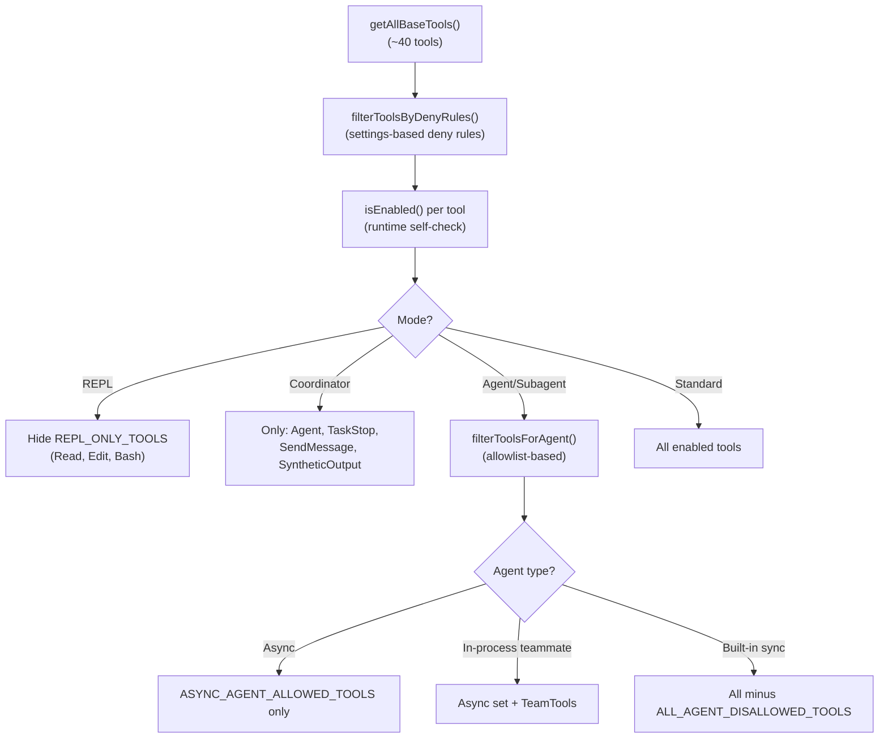
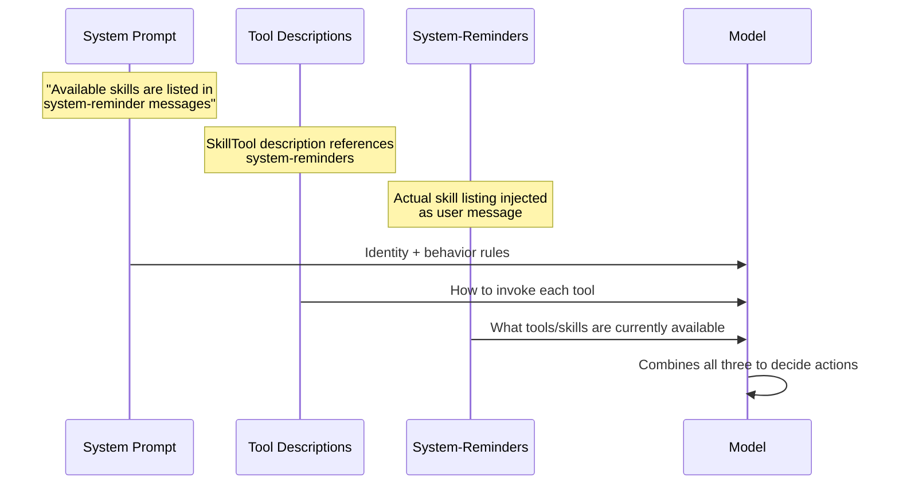

This post explores how Claude Code constructs, organizes, and delivers its system prompt to the LLM. We cover the full prompt assembly pipeline, the static/dynamic caching split, how skills and tools are "taught" to the model, the priority hierarchy when multiple prompt sources compete, and the system-reminder injection mechanism that keeps the model informed of its capabilities mid-conversation.

---

## 1. What the Model Receives

When you type a message into Claude Code, the model receives a carefully assembled package of instructions before it sees your actual words. This package tells the model who it is, what tools it has, what code conventions to follow, what environment it's running in, and what project-specific rules apply.

From the model's perspective, a single request looks like this:

```
┌──────────────────────────────────────────────────────┐
│ System Prompt (multi-block text array)               │
│   ├─ Identity & role framing                         │  ← Section 2
│   ├─ Behavioral guidelines (7 sections)              │  ← Section 2
│   ├─ ─── CACHE BOUNDARY ───                          │  ← Section 3
│   ├─ Session-specific guidance                       │  ← Section 4
│   ├─ Auto-memory (MEMORY.md + rules)                 │  ← Section 4
│   ├─ Environment info                                │  ← Section 4
│   └─ MCP/scratchpad/FRC/other                        │  ← Section 4
├──────────────────────────────────────────────────────┤
│ Tools Array (JSON schemas + descriptions)            │  ← Section 5 (filtering)
│   ├─ BashTool (full schema + description)            │  ← Section 6 (descriptions)
│   ├─ FileEditTool (full schema + description)        │
│   ├─ SkillTool (full schema + description)           │
│   ├─ AgentTool (full schema + description)           │
│   ├─ ... (20-40 tools depending on config)           │
│   └─ Deferred tools (name only, no schema)           │  ← Section 6 (deferred)
├──────────────────────────────────────────────────────┤
│ Messages                                             │  ← Section 7
│   ├─ <sr> User context (CLAUDE.md + current date)    │
│   ├─ <sr> Initial attachments (skill_listing,        │
│   │        agent_listing, deferred_tools_delta, ...)  │
│   ├─ User message #1                                 │
│   ├─ Assistant response #1 (+ tool_use blocks)       │
│   ├─ <sr> Tool results (tool_result blocks)          │
│   ├─ <sr> Turn-end attachments                       │
│   │        (edited files, task reminders, etc.)      │
│   ├─ ... (more turns)                                │
│   ├─ Assistant response #N                           │
│   ├─ <sr> Tool results                              │
│   └─ <sr> Latest attachments for this turn           │
│            (new skills, diagnostics, token usage...) │
│                                                      │
│   <sr> = <system-reminder> wrapper                   │
└──────────────────────────────────────────────────────┘
```

The system prompt itself is split into cacheable and non-cacheable sections to optimize API costs. The tools carry their own "teaching" instructions as description fields. And `<system-reminder>` tags inject context about available skills and agents as user messages — not system prompt content — so they can change between turns without breaking the prompt cache.

---

## 2. System Prompt: The Static Sections

The system prompt is built by `getSystemPrompt()` (`prompts.ts:444`), which produces an array of text blocks. The standard path assembles static sections first, then a cache boundary marker, then dynamic sections. Before reaching the API, it passes through `buildEffectiveSystemPrompt()` (which may replace it with an override, agent, or custom prompt) and `claude.ts` (which wraps it with attribution headers and cache markers). The full assembly pipeline is covered in [Calling the Model, Appendix A](#appendix-a-upstream-system-prompt-assembly).

The static sections — "Identity & role framing" and "Behavioral guidelines" in the diagram above — appear before the cache boundary marker. They are identical across all Claude Code users, which means the Anthropic API can reuse the same KV cache for these blocks across organizations.

### Section 1: Identity & Intro

```typescript
// prompts.ts:175
function getSimpleIntroSection(outputStyleConfig): string {
  return `
You are an interactive agent that helps users with software engineering tasks.
Use the instructions below and the tools available to you to assist the user.

${CYBER_RISK_INSTRUCTION}
IMPORTANT: You must NEVER generate or guess URLs for the user...`
}
```

This establishes the model's identity and purpose. If a custom Output Style is configured, the intro substitutes "with software engineering tasks" for a reference to the style section that appears later. The `CYBER_RISK_INSTRUCTION` constant teaches the model to refuse malicious security requests while permitting legitimate CTF/pentesting scenarios.

### Section 2: System Rules

```typescript
// prompts.ts:186
function getSimpleSystemSection(): string
```

A bulleted list under `# System` that covers:
- Output visibility (all non-tool text is shown to the user)
- Permission mode (tools may require approval; don't retry denied calls)
- `<system-reminder>` tags (metadata from the system, not related to the message they appear in)
- Prompt injection awareness (flag suspicious tool results)
- Hooks (shell commands configured by the user; treat hook feedback as user feedback)
- Context compression (prior messages may be summarized as context approaches limits)

### Section 3: Doing Tasks

```typescript
// prompts.ts:199
function getSimpleDoingTasksSection(): string
```

The longest static section — `# Doing tasks` — is the core "how to work" instruction. It teaches:

| Principle                | Example instruction                                                                          |
| ------------------------ | -------------------------------------------------------------------------------------------- |
| Context awareness        | "Consider requests in the context of software engineering and the current working directory" |
| Capability framing       | "You are highly capable and often allow users to complete ambitious tasks"                   |
| Code-first               | "Read code before suggesting modifications"                                                  |
| Minimal footprint        | "Don't add features, refactor, or introduce abstractions beyond what was asked"              |
| No over-engineering      | "Don't add error handling for scenarios that can't happen"                                   |
| No premature abstraction | "Three similar lines is better than a premature abstraction"                                 |
| Security-first           | "Be careful not to introduce OWASP top 10 vulnerabilities"                                   |
| Diagnosis-first          | "If an approach fails, diagnose why before switching tactics"                                |

The section conditionally includes additional strictness for Anthropic-internal builds (`USER_TYPE === 'ant'`): no-comments-by-default, verification requirements, and false-claims mitigation.

### Section 4: Executing Actions with Care

```typescript
// prompts.ts:255
function getActionsSection(): string
```

A dedicated `# Executing actions with care` section teaching risk assessment. It establishes the **reversibility principle**: freely take local, reversible actions; confirm risky ones. Examples of risky actions are enumerated explicitly:

- Destructive operations (delete, force-push, reset --hard)
- Hard-to-reverse operations (amending published commits, CI/CD changes)
- Actions visible to others (pushing code, commenting on PRs, sending messages)
- Uploading to third-party services (may be cached/indexed)

The key phrase: "measure twice, cut once."

### Section 5: Using Your Tools

```typescript
// prompts.ts:269
function getUsingYourToolsSection(enabledTools: Set<string>): string
```

Under `# Using your tools`, this section teaches tool prioritization:

```
Dedicated Tools > Bash
  Read (not cat/head/tail)
  Edit (not sed/awk)
  Write (not heredoc/echo)
  Glob (not find)      [unless embedded build]
  Grep (not grep/rg)   [unless embedded build]
```

Plus critical parallelism guidance: "If you intend to call multiple tools and there are no dependencies between them, make all independent tool calls in parallel."

### Section 6: Tone and Style

```typescript
// prompts.ts:430
function getSimpleToneAndStyleSection(): string
```

Four rules under `# Tone and style`:
1. No emojis unless explicitly requested
2. Short and concise responses
3. Reference code as `file_path:line_number`
4. No colon before tool calls ("Let me read the file." not "Let me read the file:")

### Section 7: Output Efficiency

```typescript
// prompts.ts:402
function getOutputEfficiencySection(): string
```

For external users, a concise `# Output efficiency` section: "Go straight to the point. Try the simplest approach first." For Anthropic-internal users, a longer `# Communicating with the user` section with detailed prose-writing guidance.

---

## 3. System Prompt: The Cache Boundary

The "CACHE BOUNDARY" line in the diagram separates globally-cacheable content from session-specific content. It's a conditional marker between the static and dynamic sections:

```typescript
// prompts.ts:573
...(shouldUseGlobalCacheScope() ? [SYSTEM_PROMPT_DYNAMIC_BOUNDARY] : [])
```

The marker is a literal string:

```typescript
// prompts.ts:114
export const SYSTEM_PROMPT_DYNAMIC_BOUNDARY = '__SYSTEM_PROMPT_DYNAMIC_BOUNDARY__'
```

When processed by `splitSysPromptPrefix()` in `claude.ts`, everything before this marker gets `cache_control: { scope: 'global' }` — meaning any Claude Code user's request with the same static prefix hits the same server-side KV cache entry. Everything after is session-scoped.

This is the same mechanism described in [Prompt Caching](), section 3.

---

## 4. System Prompt: The Dynamic Sections

Below the cache boundary sit the session-specific sections — "Session-specific guidance", "Auto-memory", "Environment info", and "MCP/scratchpad/FRC/other" in the diagram. These vary per user, per project, or per session, so they can't be globally cached. They are managed by a caching registry that memoizes values within a session:

```typescript
// systemPromptSections.ts:20
export function systemPromptSection(name: string, compute: ComputeFn): SystemPromptSection {
  return { name, compute, cacheBreak: false }
}

export function DANGEROUS_uncachedSystemPromptSection(
  name: string, compute: ComputeFn, _reason: string
): SystemPromptSection {
  return { name, compute, cacheBreak: true }
}
```

**Memoized sections** (`systemPromptSection`) are computed once and cached until `/clear` or `/compact`. **Volatile sections** (`DANGEROUS_uncachedSystemPromptSection`) recompute every turn and break the prompt cache — used sparingly and with a required `_reason` string to discourage casual use.

### 4.1 Session-Specific Guidance

The first dynamic section adapts based on which tools are enabled:

```typescript
// prompts.ts:352
function getSessionSpecificGuidanceSection(
  enabledTools: Set<string>,
  skillToolCommands: Command[],
): string | null
```

It conditionally includes:

| Condition                    | Guidance added                                            |
| ---------------------------- | --------------------------------------------------------- |
| AskUserQuestion tool enabled | "Use it if you don't understand why a tool was denied"    |
| Interactive session          | Suggest `! <command>` prefix for user-run commands        |
| Agent tool enabled           | Fork-mode or standard subagent guidance                   |
| Explore/Plan agents enabled  | When to use direct search vs. Explore agent               |
| Skills available             | "/<skill-name> is shorthand; use SkillTool to invoke"     |
| DiscoverSkills enabled       | Guidance on surfaced skill reminders                      |
| Verification Agent (ANT)     | Adversarial verification contract for non-trivial changes |

The key insight: these are placed after the boundary because each combination of enabled tools would fragment the global cache. Moving them here avoids 2^N cache prefix variants.

### 4.2 Auto-Memory

```typescript
systemPromptSection('memory', () => loadMemoryPrompt())
```

The auto-memory prompt (`loadMemoryPrompt()` in `src/memdir/memdir.ts:419`) injects:
1. **Behavioral instructions** — How to save memories (frontmatter format, four types: user/feedback/project/reference)
2. **What NOT to save** — Code patterns, architecture, git history (all derivable from the repo)
3. **When to access** — When relevant, or when the user explicitly asks
4. **MEMORY.md index** — The user's saved memory entries (truncated at 200 lines / 25KB)

The memory directory structure:
```
~/.claude/projects/<slug>/memory/
├── MEMORY.md           # Index loaded into context (≤200 lines)
├── user_*.md           # User preferences
├── feedback_*.md       # Behavioral corrections
├── project_*.md        # Project context
└── reference_*.md      # External system pointers
```

### 4.3 Environment Info

```typescript
systemPromptSection('env_info_simple', () =>
  computeSimpleEnvInfo(model, additionalWorkingDirectories)
)
```

A bulleted `# Environment` section containing:
- Primary working directory
- Git repository status
- Platform, shell, OS version
- Model name and ID (suppressed in "undercover" mode)
- Knowledge cutoff date
- Latest Claude model family info (for API-building guidance)
- Claude Code availability (CLI, desktop, web, IDE)

### 4.4 MCP Instructions (Cache-Breaking)

```typescript
DANGEROUS_uncachedSystemPromptSection(
  'mcp_instructions',
  () => isMcpInstructionsDeltaEnabled() ? null : getMcpInstructionsSection(mcpClients),
  'MCP servers connect/disconnect between turns',
)
```

When MCP servers are connected, their `instructions` fields are formatted as a `# MCP Server Instructions` section. This is marked as cache-breaking because servers can connect or disconnect mid-session. A newer optimization (`isMcpInstructionsDeltaEnabled()`) avoids per-turn recompute by using attachment deltas instead.

### 4.5 Other Dynamic Sections

| Section                  | Purpose                                                               |
| ------------------------ | --------------------------------------------------------------------- |
| `language`               | UI language preference for responses                                  |
| `output_style`           | Custom output formatting rules                                        |
| `scratchpad`             | Session-specific temp directory path                                  |
| `frc`                    | Function Result Clearing notice (old tool results will be removed)    |
| `summarize_tool_results` | "Write down important info from tool results before they're cleared"  |
| `numeric_length_anchors` | ANT-only: "≤25 words between tool calls, ≤100 words final"            |
| `token_budget`           | When user specifies a token target, keep working until target reached |
| `brief`                  | KAIROS/brief mode: ultra-terse communication style                    |

---

## 5. Tools Array: Mode-Based Filtering

The "Tools Array" in the diagram shows 20–40 tools depending on configuration. But which tools appear is not fixed — Claude Code filters the pool based on the current mode before building schemas. The model never sees tools that don't apply to its current context. Mutual exclusion is enforced by removing tools from the request entirely, not by instructing the model to avoid them.

### The Filtering Pipeline



### Three Layers of Exclusion

**Layer 1: `isEnabled()` — Tool self-disabling**

Each tool implements `isEnabled()` to remove itself from the pool based on runtime state:

```typescript
// EnterPlanModeTool.ts:56
isEnabled() {
  // When --channels is active, ExitPlanMode is disabled (its approval
  // dialog needs the terminal). Disable entry too so plan mode isn't a
  // trap the model can enter but never leave.
  if ((feature('KAIROS') || feature('KAIROS_CHANNELS')) && getAllowedChannels().length > 0) {
    return false
  }
  return true
}
```

EnterPlanMode and ExitPlanMode disable themselves together when no terminal is available — preventing the model from entering a mode it can't exit.

**Layer 2: Explicit allowlists/denylists per context**

```typescript
// constants/tools.ts
export const ALL_AGENT_DISALLOWED_TOOLS = new Set([
  TASK_OUTPUT_TOOL_NAME,
  EXIT_PLAN_MODE_V2_TOOL_NAME,
  ENTER_PLAN_MODE_TOOL_NAME,
  ASK_USER_QUESTION_TOOL_NAME,
  TASK_STOP_TOOL_NAME,
  // ...
])

export const COORDINATOR_MODE_ALLOWED_TOOLS = new Set([
  AGENT_TOOL_NAME,
  TASK_STOP_TOOL_NAME,
  SEND_MESSAGE_TOOL_NAME,
  SYNTHETIC_OUTPUT_TOOL_NAME,
])
```

Coordinator mode uses an allowlist (only 4 tools visible). Agents use a denylist with an additional allowlist for async agents. The sets are statically defined — no runtime computation needed.

**Layer 3: `validateInput()` — Runtime rejection**

Even if a tool passes filtering (e.g., because the deferred-tool listing still announces it), validation rejects invalid calls:

```typescript
// ExitPlanModeV2Tool.ts:195
async validateInput(_input, { getAppState }) {
  const mode = getAppState().toolPermissionContext.mode
  if (mode !== 'plan') {
    return {
      result: false,
      message: 'You are not in plan mode. This tool is only for exiting plan mode...',
    }
  }
  return { result: true }
}
```

### Mode Transition and Permission Changes

When modes change mid-session, the permission context is transformed:

| Transition     | What Happens                                                                                                     |
| -------------- | ---------------------------------------------------------------------------------------------------------------- |
| Default → Plan | `prepareContextForPlanMode()`: stores `prePlanMode`, optionally activates auto-mode classifier                   |
| Plan → Default | Restores `prePlanMode`, re-enables stripped dangerous permissions                                                |
| Default → Auto | `stripDangerousPermissionsForAutoMode()`: removes broad allow rules (Bash(*), Agent(*)) so classifier gates them |
| Auto → Plan    | Can optionally keep auto-mode active in plan (`shouldPlanUseAutoMode()`)                                         |

The special case: `ExitPlanMode` is normally in `ALL_AGENT_DISALLOWED_TOOLS`, but `filterToolsForAgent()` makes an exception when `permissionMode === 'plan'`:

```typescript
// agentToolUtils.ts:88
if (toolMatchesName(tool, EXIT_PLAN_MODE_V2_TOOL_NAME) && permissionMode === 'plan') {
  return true  // bypass the denylist
}
```

This ensures in-process teammates in plan mode can exit it — without this exception, they'd be stuck.

### Mutual Exclusion Summary

| Mode               | Tools Hidden                                                                   | Tools Added/Kept                                      |
| ------------------ | ------------------------------------------------------------------------------ | ----------------------------------------------------- |
| Plan mode          | Action tools still visible but model instructed not to use them (prompt-level) | ExitPlanMode becomes available                        |
| Coordinator        | Everything except 4 coordination tools                                         | Agent, TaskStop, SendMessage, SyntheticOutput         |
| Async agents       | ~30 tools removed                                                              | Read, Write, Edit, Bash, Grep, Glob, Skill, WebSearch |
| REPL mode          | Read, Edit, Bash, Write (accessible inside REPL VM)                            | REPL tool replaces them                               |
| Channels active    | EnterPlanMode, ExitPlanMode                                                    | —                                                     |
| CLAUDE_CODE_SIMPLE | Everything except Bash, Read, Edit                                             | —                                                     |

---

## 6. Tools Array: Descriptions and Deferred Loading

Once the tool pool is filtered (section 5), each tool needs a description for the model to know how to use it. The "full schema + description" entries in the diagram carry these descriptions — each one is a carefully crafted prompt generated by the tool's async `prompt()` method. For deferred tools (the "name only, no schema" line), only the name is sent; the model must discover the full schema on demand.

```typescript
// api.ts:169
base = {
  name: tool.name,
  description: await tool.prompt({
    getToolPermissionContext,
    tools,
    agents,
    allowedAgentTypes,
  }),
  input_schema, // Zod → JSON Schema
}
```

### The SkillTool Prompt

The SkillTool's description teaches the model how to invoke skills:

```
Execute a skill within the main conversation

When users ask you to perform tasks, check if any of the available skills match.
Skills provide specialized capabilities and domain knowledge.

When users reference a "slash command" or "/<something>", they are referring to a skill.
Use this tool to invoke it.

How to invoke:
- Set `skill` to the exact name of an available skill (no leading slash)
- Set `args` to pass optional arguments

Important:
- Available skills are listed in system-reminder messages in the conversation
- When a skill matches the user's request, this is a BLOCKING REQUIREMENT:
  invoke the relevant Skill tool BEFORE generating any other response
- NEVER mention a skill without actually calling this tool
- If you see a <command-name> tag, the skill has ALREADY been loaded
```

### The AgentTool Prompt

The AgentTool's description is ~287 lines and adapts between fork-semantics and standard subagent modes. Its most interesting pedagogical element is the "Writing the prompt" section:

```
Brief the agent like a smart colleague who just walked into the room — 
it hasn't seen this conversation, doesn't know what you've tried, 
doesn't understand why this task matters.
```

### Deferred Tools: Teaching Without Loading

When many tools are available (especially MCP tools), sending all schemas every turn wastes tokens and cache space. The **deferred tool** mechanism sends only tool names, with full schemas loaded on demand:

```typescript
// api.ts
if (options.deferLoading) {
  schema.defer_loading = true
}
```

The model sees deferred tools announced in a system-reminder:

```
<system-reminder>
The following deferred tools are now available via ToolSearch.
Their schemas are NOT loaded — calling them directly will fail.
Use ToolSearch with query "select:<name>" to load tool schemas before calling them:
- MCPTool1
- MCPTool2
...
</system-reminder>
```

When the model needs a deferred tool, it calls `ToolSearchTool` to fetch the full schema, which then becomes callable for the rest of the conversation.

### Budget-Aware Tool Description Caching

Tool schemas are cached by `name:inputJSONSchema` to prevent per-turn recomputation. The descriptions are regenerated only when the schema structure changes — not when feature flags flip — avoiding unnecessary prompt cache busting.

---

## 7. Messages: Per-Turn Context via `<system-reminder>`

The system prompt and tool descriptions are fixed for the duration of a request. But the messages array changes every turn — and not just from user/assistant conversation. Claude Code injects additional context into the messages array using `<system-reminder>` wrapped user messages. This is how the model learns about newly connected MCP servers, file changes, available skills, and task status without rebuilding the system prompt.

### The Universal Wrapper

`<system-reminder>` is the single tag used for **all** attachment messages — there is no separate tag taxonomy for different attachment types. Every attachment, regardless of whether it's a file read, a skill listing, or a task reminder, is wrapped identically:

```typescript
// messages.ts:3097
export function wrapInSystemReminder(content: string): string {
  return `<system-reminder>\n${content}\n</system-reminder>`
}
```

The system prompt teaches the model what this tag means (from `getSimpleSystemSection()`):

> "Tool results and user messages may include `<system-reminder>` or other tags. Tags contain information from the system. They bear no direct relation to the specific tool results or user messages in which they appear."

This framing lets the system inject metadata anywhere in the conversation without the model treating it as user speech.

### CLAUDE.md: Project Instructions

The first `<system-reminder>` message in every request carries CLAUDE.md content — project-specific instructions written by humans and checked into the repo. These are loaded via `getMemoryFiles()` in `src/utils/claudemd.ts` and injected through `prependUserContext()`.

Priority order (lowest to highest):

| Level   | Source                       | Example Path                                           |
| ------- | ---------------------------- | ------------------------------------------------------ |
| Managed | Global system policy         | `/etc/claude-code/CLAUDE.md`                           |
| User    | User's global instructions   | `~/.claude/CLAUDE.md`                                  |
| Project | Checked-in codebase          | `CLAUDE.md`, `.claude/CLAUDE.md`, `.claude/rules/*.md` |
| Local   | User's private project rules | `CLAUDE.local.md`                                      |

Files closer to the current working directory override those further away. The discovery walks upward from CWD to the filesystem root. CLAUDE.md lives in messages rather than the system prompt because its content varies per user/project and would fragment the global cache.

### Two Shapes of Attachment Content

While the wrapping is uniform, attachments take two shapes inside the `<system-reminder>`:

1. **Plain user messages** — informational text injected as a user message:
   ```
   <system-reminder>
   The following skills are available for use with the Skill tool:
   - commit: Create a git commit with a generated message
   - review: Review a pull request
   </system-reminder>
   ```

2. **Synthetic tool_use + tool_result pairs** — made to look like the model already called a tool (e.g., file attachments appear as if `Read` was called):
   ```
   <system-reminder>
   [tool_use: Read, {file_path: "src/main.ts"}]
   [tool_result: "1  import { app } from './app'\n2  ..."]
   </system-reminder>
   ```

### What Gets Injected

The attachment system (`src/utils/attachments.ts`) builds per-turn context normalized into system-reminder messages. Key categories:

| Category             | Attachment Types                                                                  | Content Shape                  |
| -------------------- | --------------------------------------------------------------------------------- | ------------------------------ |
| Tool/skill discovery | `skill_listing`, `agent_listing_delta`, `deferred_tools_delta`, `skill_discovery` | Plain user message             |
| File content         | `file`, `directory`, `edited_text_file`, `pdf_reference`                          | Synthetic tool_use/result pair |
| Memory               | `nested_memory`, `relevant_memories`, `current_session_memory`                    | Plain user message             |
| Mode context         | `plan_mode`, `plan_file_reference`, `auto_mode`, `plan_mode_reentry`              | Plain user message             |
| Task tracking        | `todo_reminder`, `task_reminder`, `task_status`                                   | Plain user message             |
| MCP                  | `mcp_instructions_delta`, `mcp_resource`                                          | Plain user message             |
| IDE integration      | `selected_lines_in_ide`, `opened_file_in_ide`                                     | Plain user message             |
| Team coordination    | `team_context`, `teammate_mailbox`                                                | Plain user message             |
| Resource tracking    | `token_usage`, `budget_usd`, `output_token_usage`                                 | Plain user message             |
| Session events       | `date_change`, `compaction_reminder`, `max_turns_reached`                         | Plain user message             |

### Skill Listing Budget

Skill listings respect a **1% of context token budget** to avoid overwhelming the model:

```typescript
// SkillTool/prompt.ts
const SKILL_BUDGET_CONTEXT_PERCENT = 1
const MAX_LISTING_DESC_CHARS = 250
```

Bundled skills (Anthropic-curated) are never truncated. Other skills have descriptions proportionally shortened. If the budget is too tight, only skill names are shown.

### The Teaching Chain



The system prompt says "skills exist." The SkillTool description says "here's how to call them; their names are in system-reminders." The system-reminders provide the actual list. This three-layer architecture separates stable teaching (cacheable) from volatile listings (per-turn).

---

## 8. Design Principles

The three-part structure in the diagram — system prompt, tools array, messages — is not arbitrary. Each channel has different caching, stability, and update characteristics that drove the design.

### Why a Static/Dynamic Split?

Prompt caching saves ~97% of prefill compute for long conversations. But caching requires byte-identical prefixes. By separating content that changes per-session (environment, memory, MCP servers) from content that's identical fleet-wide (behavioral rules, safety guidelines), Claude Code can cache ~5000 tokens of static instructions across all users globally.

### Why System-Reminders Instead of System Prompt?

Available skills and agent types change mid-session (MCP servers connect, plugins reload). Putting this in the system prompt would bust the cache every time. System-reminders are user messages — they don't affect the system prompt prefix cache. They're also positionally flexible: new reminders can be injected between any messages without invalidating earlier cached content.

### Why Tool Descriptions as Prompts?

Tool descriptions are the model's primary reference for "how to use X." By making `prompt()` async and context-aware, each tool can adapt its instructions to the current session (permission context, available agents, enabled features) without modifying the system prompt. The model reads the tool description at invocation time, not at session start.

### Why Budget-Aware Skill Listing?

Skill listings could theoretically fill the entire context window (hundreds of MCP tools, dozens of plugins). The 1% budget prevents skill metadata from crowding out actual conversation content. Bundled skills (which Anthropic controls and are most commonly needed) are exempt — ensuring core functionality is always visible regardless of how many third-party skills are installed.

---

## Appendix: Key Source Files

| File                                    | Role                                                        |
| --------------------------------------- | ----------------------------------------------------------- |
| `src/constants/prompts.ts`              | Main system prompt assembly (~910 lines)                    |
| `src/constants/systemPromptSections.ts` | Section caching infrastructure (70 lines)                   |
| `src/utils/systemPrompt.ts`             | Priority hierarchy / effective prompt (125 lines)           |
| `src/constants/system.ts`               | Identity prefix strings and attribution (97 lines)          |
| `src/tools/SkillTool/prompt.ts`         | Skill tool description + budget formatting (243 lines)      |
| `src/tools/AgentTool/prompt.ts`         | Agent tool description with fork/standard modes (287 lines) |
| `src/utils/attachments.ts`              | Attachment building and formatting (1400+ lines)            |
| `src/utils/messages.ts`                 | Attachment → system-reminder conversion (400+ lines)        |
| `src/memdir/memdir.ts`                  | Auto-memory prompt generation and MEMORY.md loading         |
| `src/utils/claudemd.ts`                 | CLAUDE.md file discovery and priority resolution            |
| `src/services/api/claude.ts`            | Final API request construction with cache markers           |
