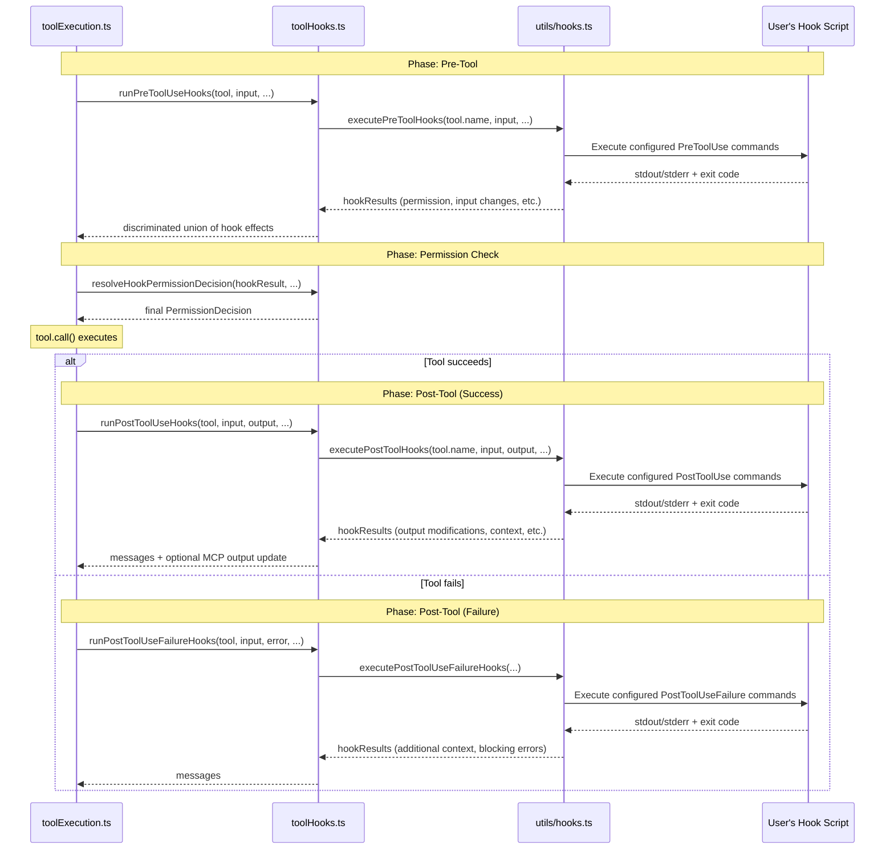

This post details how Claude Code executes the tool calls that the model requests. When the model's response contains `tool_use` blocks, the system must look up each tool, validate its input, check permissions, run hooks, execute the tool, map the result, and feed it back as a `UserMessage` for the next iteration. We trace the full lifecycle from the moment a `tool_use` block arrives to the moment its `tool_result` is ready for the API.

This is the deep dive into Step 9 (TOOL EXECUTION) of the message pipeline described in [Managing Message Context](). For how the model's response is streamed and how tool_use blocks are collected, see [Calling the Model](). For the permission system's interactive UI path, see [Human-in-the-Loop]().

---

## 1. The Big Picture

After Step 8 (API CALL) completes, `query.ts` holds two key collections: `toolUseBlocks[]` containing every `tool_use` block the model emitted, and `assistantMessages[]` containing the model's responses. If `toolUseBlocks` is non-empty, `needsFollowUp` is `true` and execution enters Step 9.

The system has two dispatchers that can execute tools. Which one runs depends on a feature gate:

```
query.ts:1380-1382

const toolUpdates = streamingToolExecutor
  ? streamingToolExecutor.getRemainingResults()
  : runTools(toolUseBlocks, assistantMessages, canUseTool, toolUseContext)
```

Both dispatchers ultimately call the same function for each individual tool — `runToolUse()` in `toolExecution.ts`. The difference is how they manage concurrency and timing:

| Dispatcher | File | When it runs | How it starts tools |
|---|---|---|---|
| `StreamingToolExecutor` | `StreamingToolExecutor.ts` | When `streamingToolExecution` gate is on | Starts tools as they stream in during Step 8; Step 9 drains remaining results |
| `runTools()` | `toolOrchestration.ts` | When gate is off (fallback) | Waits until all tool_use blocks are collected, then runs in batches |

Regardless of which dispatcher runs, each tool produces a `UserMessage` containing a `tool_result` block. These are collected into `toolResults[]` and yielded to `QueryEngine` for persistence. Tools may also produce `AttachmentMessage`s — hook results, structured outputs, or continuation signals.

```
query.ts Step 9

for await (const update of toolUpdates) {
  if (update.message) {
    yield update.message                              // → QueryEngine for persistence

    if (update.message.type === 'attachment' &&
        update.message.attachment.type === 'hook_stopped_continuation') {
      shouldPreventContinuation = true                // → exit after Step 9
    }

    toolResults.push(
      ...normalizeMessagesForAPI([update.message], tools)
        .filter(_ => _.type === 'user'),              // → only UserMessages enter toolResults
    )
  }
  if (update.newContext) {
    updatedToolUseContext = { ...update.newContext }   // → tools can modify context
  }
}
```

After the loop, two exit checks run:

- If `abortController.signal.aborted`: the user pressed Ctrl+C during tool execution. The loop returns `{ reason: 'aborted_tools' }`.
- If `shouldPreventContinuation`: a hook signalled that the agentic loop should stop. The loop returns `{ reason: 'hook_stopped' }`.

Otherwise, execution continues to Step 10 (Attachments) and Step 11 (State Merge).

---

## 2. The Two Dispatchers

### 2A. StreamingToolExecutor (query.ts:562, StreamingToolExecutor.ts)

When the `streamingToolExecution` gate is enabled, tools begin executing while the model is still streaming its response. The rationale is latency hiding. Consider what happens without it (the `runTools` batch path):

```
model streams: [thinking... text... tool_use(Read)... more text...]
               |←─────────── wait for full response ──────────────→|
                                                                    |← Read executes →|
```

The user waits for the entire model response to finish, then waits for tool execution. These are purely sequential.

With `StreamingToolExecutor`:

```
model streams: [thinking... text... tool_use(Read)... more text...]
                                         |← Read executes →|
               |←─────────── model still streaming ────────→|
                                                   Read already done ─→ result yielded immediately
```

The Read tool starts the moment its input finishes streaming — while the model is still generating subsequent text or tool_use blocks. If the tool finishes before the stream ends, its result is yielded during Step 8 and the tool execution cost is fully hidden.

The concrete win scales with two factors:

1. **Slow tools + long model output**: If the model emits a Bash tool early and then writes a paragraph of explanation, the subprocess runs in parallel with the remaining streaming. A 3-second `npm test` that starts mid-stream costs 0 additional seconds if the stream takes longer than 3 seconds to finish.
2. **Permission dialogs**: The permission prompt appears while the model is still streaming. The user can read and approve the Bash command before the response is even done — turning user think time into "free" overlap too.

The cost is significant implementation complexity (a four-state-per-tool machine, a three-level abort hierarchy, ordered result yielding, discard-on-fallback). That's why `runTools()` exists as the simpler fallback behind the gate. For the full streaming mechanism — how the Anthropic streaming protocol enables per-block tool dispatch, the interleaving in the query.ts streaming loop, concurrency control, error cascading, result ordering, and the discard protocol — see [Appendix C](#appendix-c-streaming-tool-execution-internals).

### 2B. runTools (toolOrchestration.ts:19)

When the streaming gate is off, `runTools()` receives all `toolUseBlocks` at once and partitions them into batches:

```typescript
// toolOrchestration.ts:91-116
function partitionToolCalls(toolUseMessages, toolUseContext): Batch[] {
  return toolUseMessages.reduce((acc, toolUse) => {
    const tool = findToolByName(toolUseContext.options.tools, toolUse.name)
    const parsedInput = tool?.inputSchema.safeParse(toolUse.input)
    const isConcurrencySafe = parsedInput?.success
      ? tool?.isConcurrencySafe(parsedInput.data) : false
    if (isConcurrencySafe && acc[acc.length - 1]?.isConcurrencySafe) {
      acc[acc.length - 1].blocks.push(toolUse)     // extend current concurrent batch
    } else {
      acc.push({ isConcurrencySafe, blocks: [toolUse] })  // start new batch
    }
    return acc
  }, [])
}
```

This produces an array of batches where each batch is either a group of consecutive concurrent-safe tools or a single non-concurrent tool. For example, if the model calls `[Read, Read, Edit, Read, Read]`, partitioning produces:

```
Batch 1: { concurrent: true,  blocks: [Read, Read] }
Batch 2: { concurrent: false, blocks: [Edit] }
Batch 3: { concurrent: true,  blocks: [Read, Read] }
```

Concurrent batches run via `runToolsConcurrently()`, which uses the `all()` utility to execute up to `CLAUDE_CODE_MAX_TOOL_USE_CONCURRENCY` (default 10) tools in parallel. Non-concurrent batches run via `runToolsSerially()`, which executes each tool one at a time and applies context modifiers between tools.

Context modifiers from concurrent tools are queued and applied in batch order after all tools in the batch complete (toolOrchestration.ts:54-63). This ensures that a tool's context modification doesn't race with other concurrent tools.

---

## 3. The Single-Tool Pipeline

Both dispatchers call `runToolUse()` (toolExecution.ts:337) for each individual tool. This is an async generator that yields `MessageUpdateLazy` objects — each containing a `Message` and an optional `contextModifier`.

```
runToolUse(toolUse, assistantMessage, canUseTool, toolUseContext)
    |
    +-- 1. LOOKUP           findToolByName() with alias fallback
    +-- 2. ABORT CHECK      signal.aborted → CANCEL_MESSAGE
    +-- 3. streamedCheckPermissionsAndCallTool()
          |
          +-- 4. INPUT VALIDATION    Zod schema parse + tool.validateInput()
          +-- 5. PRE-TOOL HOOKS     runPreToolUseHooks()
          +-- 6. PERMISSION CHECK   resolveHookPermissionDecision()
          +-- 7. TOOL EXECUTION     tool.call()
          +-- 8. RESULT MAPPING     tool.mapToolResultToToolResultBlockParam()
          +-- 9. POST-TOOL HOOKS    runPostToolUseHooks()
          +-- 10. RESULT ASSEMBLY   addToolResult()
```

### Phase 1: Tool Lookup (toolExecution.ts:345-411)

The function first searches the model's available tool set, then falls back to the full registry for deprecated aliases:

```typescript
let tool = findToolByName(toolUseContext.options.tools, toolName)
if (!tool) {
  const fallbackTool = findToolByName(getAllBaseTools(), toolName)
  if (fallbackTool && fallbackTool.aliases?.includes(toolName)) {
    tool = fallbackTool
  }
}
```

If the tool is not found at all, the function yields a `tool_result` error message and returns immediately. The error is wrapped in `<tool_use_error>` tags so the model can distinguish tool errors from normal output.

### Phase 2: Abort Check (toolExecution.ts:415-453)

Before any work begins, the function checks whether the abort signal has already fired (e.g., the user pressed Ctrl+C during streaming). If aborted, it yields a `CANCEL_MESSAGE` result and returns.

### Phase 3: Streaming Wrapper (toolExecution.ts:492-570)

`streamedCheckPermissionsAndCallTool()` is a thin adapter that converts the promise-based `checkPermissionsAndCallTool()` into a `Stream<MessageUpdateLazy>`. This allows progress events and final results to flow through a single async iterable. The progress callback wraps each progress event as a `ProgressMessage` and enqueues it into the stream.

### Phase 4: Input Validation (toolExecution.ts:615-733)

Input validation happens in two stages:

**Zod schema parse** — Every tool has an `inputSchema` (a Zod schema) that validates the model's JSON input. If parsing fails, the function returns an `InputValidationError` tool_result. For deferred tools that weren't in the discovered-tool set, a hint is appended telling the model to call `ToolSearch` first:

```
This tool's schema was not sent to the API — it was not in the
discovered-tool set derived from message history. Without the schema
in your prompt, typed parameters (arrays, numbers, booleans) get
emitted as strings and the client-side parser rejects them. Load the
tool first: call ToolSearch with query "select:ToolName", then retry.
```

**Tool-specific validation** — After schema parsing succeeds, `tool.validateInput()` runs semantic checks. For example, `FileEditTool` validates that the old_string exists in the file and is unique. If validation fails, the error message is tool-specific and actionable.

Between these two stages, the function performs two input transformations:

- **Security strip**: removes `_simulatedSedEdit` from Bash inputs. This internal-only field must only be injected by the permission system after user approval — if the model supplies it, it's stripped as defense-in-depth (toolExecution.ts:761-773).
- **Backfill observable fields**: calls `tool.backfillObservableInput()` to expand relative paths (e.g., `./src/foo.ts` → `/absolute/path/src/foo.ts`) on a shallow clone. Hooks and permissions see the expanded paths, but `tool.call()` receives the original model-emitted paths to keep transcript hashes stable (toolExecution.ts:784-793).

### Phase 5: Pre-Tool Hooks (toolExecution.ts:800-891)

`runPreToolUseHooks()` (toolHooks.ts:435) executes all configured `PreToolUse` hooks in parallel. Hooks can:

- **Modify input** — return `updatedInput` to change what the tool receives
- **Make a permission decision** — return `permissionBehavior: 'allow' | 'deny' | 'ask'` to short-circuit or force the permission check
- **Prevent continuation** — signal that the agentic loop should stop after this tool completes
- **Inject additional context** — add attachment messages visible to the model
- **Block execution** — return a blocking error that denies the tool entirely
- **Stop immediately** — abort due to cancellation

The hook results are yielded as a discriminated union, and `checkPermissionsAndCallTool()` collects them into local variables (`hookPermissionResult`, `shouldPreventContinuation`, `stopReason`, etc.) before proceeding to the permission phase.

If hooks take more than 500ms (wall-clock time), an inline timing summary is emitted as a system message (toolExecution.ts:874-891).

### Phase 6: Permission Check (toolExecution.ts:909-1104)

This is where the system decides whether the tool is allowed to execute. The function calls `resolveHookPermissionDecision()` (toolHooks.ts:332), which implements a layered decision protocol:

```
resolveHookPermissionDecision(hookResult, tool, input, context, canUseTool, ...)
    |
    +-- hookResult.behavior === 'allow'?
    |     +-- requiresUserInteraction && !interactionSatisfied?
    |     |     → canUseTool() (must still show dialog)
    |     +-- checkRuleBasedPermissions() returns deny?
    |     |     → deny (settings.json rules override hook approval)
    |     +-- checkRuleBasedPermissions() returns ask?
    |     |     → canUseTool() (dialog required despite hook approval)
    |     +-- no rule conflict?
    |           → allow (hook approval stands)
    |
    +-- hookResult.behavior === 'deny'?
    |     → deny
    |
    +-- hookResult.behavior === 'ask' or no hook result?
          → canUseTool() (normal permission flow)
```

The key invariant is that **hook 'allow' does NOT bypass settings.json deny/ask rules**. A hook can approve a tool, but if the user has a deny rule configured for that tool in their settings, the deny rule wins. This prevents hooks from silently escalating privileges.

For Bash tools, a speculative classifier check is started earlier (toolExecution.ts:740-752) so it runs in parallel with hooks and permission setup. The classifier result is consumed by the permission dialog if one is shown.

If permission is denied, the function creates a `tool_result` error message, runs `PermissionDenied` hooks (which can signal `{retry: true}` to tell the model it may try again), and returns. If permission is granted with `updatedInput`, the tool receives the updated input.

### Phase 7: Tool Execution (toolExecution.ts:1206-1222)

With validation passed and permission granted, the tool is called:

```typescript
const result = await tool.call(
  callInput,
  { ...toolUseContext, toolUseId: toolUseID, userModified: permissionDecision.userModified ?? false },
  canUseTool,
  assistantMessage,
  progress => onToolProgress({ toolUseID: progress.toolUseID, data: progress.data }),
)
```

The `tool.call()` method is async and returns a `ToolResult<Output>`:

```typescript
type ToolResult<T> = {
  data: T                                                    // the tool's output
  newMessages?: Message[]                                    // additional messages to inject
  contextModifier?: (context: ToolUseContext) => ToolUseContext  // modify context for subsequent tools
  mcpMeta?: object                                           // MCP-specific metadata
}
```

Each tool's `call()` implementation is tool-specific. `BashTool` spawns a subprocess and collects stdout/stderr. `FileReadTool` reads a file from disk. `FileEditTool` applies a diff. `AgentTool` spawns a subagent. The `progress` callback allows long-running tools (like Bash) to stream intermediate updates to the UI while execution continues.

The `callInput` variable deserves special attention. If hooks or permission modified the input, `callInput` converges on the modified version. But if only the backfill clone was mutated (Phase 4's `backfillObservableInput`), `callInput` remains the model's original input — this keeps transcript hashes and VCR fixture hashes stable (toolExecution.ts:1189-1205).

### Phase 8: Result Mapping (toolExecution.ts:1292-1296)

After execution succeeds, the raw tool output is converted to API format:

```typescript
const mappedToolResultBlock = tool.mapToolResultToToolResultBlockParam(
  result.data, toolUseID,
)
```

This produces a `ToolResultBlockParam` — the `{ type: 'tool_result', content: ..., tool_use_id: ... }` structure the Anthropic API expects. The mapped content is measured for telemetry (`toolResultSizeBytes`) and passed to `addToolResult()` for final assembly.

Large results are handled by `processPreMappedToolResultBlock()` (toolResultStorage.ts), which applies per-tool size limits. Tools can set `maxResultSizeChars` to control their own limits — for example, `Read` sets `Infinity` because it has separate size controls, while most other tools use the default.

### Phase 9: Post-Tool Hooks (toolExecution.ts:1483-1563)

`runPostToolUseHooks()` (toolHooks.ts:39) executes all configured `PostToolUse` hooks in parallel after tool execution succeeds. Hooks can:

- **Modify MCP tool output** — return `updatedMCPToolOutput` (only for MCP tools, which are added to `toolResults` after hooks run rather than before)
- **Inject additional context** — add attachment messages
- **Prevent continuation** — signal the loop to stop
- **Report blocking errors** — surface errors from linters, formatters, etc.

The ordering difference between MCP and built-in tools is notable: built-in tool results are added to `resultingMessages` **before** PostToolUse hooks run (toolExecution.ts:1477-1479), while MCP tool results are added **after** (toolExecution.ts:1540-1542). This allows PostToolUse hooks to modify MCP output before it reaches the model.

If tool execution fails (throws an error), `runPostToolUseFailureHooks()` runs instead — it receives the error string and an `isInterrupt` flag so hooks can distinguish crash errors from user cancellations.

### Phase 10: Result Assembly (toolExecution.ts:1403-1474)

The `addToolResult()` closure builds the final `UserMessage` that carries the tool result back to the model:

```typescript
async function addToolResult(toolUseResult, preMappedBlock?) {
  const toolResultBlock = preMappedBlock
    ? await processPreMappedToolResultBlock(preMappedBlock, tool.name, tool.maxResultSizeChars)
    : await processToolResultBlock(tool, toolUseResult, toolUseID)

  const contentBlocks: ContentBlockParam[] = [toolResultBlock]

  // Append user feedback from permission approval
  if (permissionDecision.acceptFeedback) {
    contentBlocks.push({ type: 'text', text: permissionDecision.acceptFeedback })
  }

  // Append pasted images from permission approval
  if (allowContentBlocks?.length) {
    contentBlocks.push(...allowContentBlocks)
  }

  resultingMessages.push({
    message: createUserMessage({
      content: contentBlocks,
      toolUseResult: ...,
      sourceToolAssistantUUID: assistantMessage.uuid,
    }),
    contextModifier: toolContextModifier ? { toolUseID, modifyContext: toolContextModifier } : undefined,
  })
}
```

The resulting `UserMessage` may contain more than just the tool result — if the user provided feedback or pasted images when approving the tool call, those are appended as additional content blocks in the same message.

---

## 4. Error Handling

Errors are handled at multiple layers, each producing a `tool_result` with `is_error: true` wrapped in `<tool_use_error>` tags. The model sees these errors and can decide to retry, adjust its approach, or report the issue to the user.

| Phase | Error | Result |
|---|---|---|
| Lookup | Tool not found | `No such tool available: {name}` |
| Abort | Signal already fired | `CANCEL_MESSAGE` |
| Validation (Zod) | Schema parse failure | `InputValidationError: {zodError}` + optional ToolSearch hint |
| Validation (tool) | Semantic check failure | Tool-specific message (e.g., "old_string not found in file") |
| Permission | Denied | `{denialMessage}` + optional hook retry prompt |
| Execution | `tool.call()` throws | `{formattedError}` + PostToolUseFailure hooks run |
| Execution | `McpAuthError` | Error result + MCP client status set to `needs-auth` |
| Execution | `AbortError` | Error result (user cancellation) |
| Sibling cascade | Bash error in parallel tool | `Cancelled: parallel tool call {desc} errored` |
| Streaming fallback | Connection dropped | `Streaming fallback - tool execution discarded` |

The `classifyToolError()` function (toolExecution.ts:150) converts errors to telemetry-safe strings, extracting errno codes (ENOENT, EACCES), stable `.name` properties, or `telemetryMessage` from `TelemetrySafeError` instances — avoiding mangled identifiers from minified builds.

---

## 5. Concurrency Semantics

### What Makes a Tool Concurrent-Safe

Each tool declares concurrency safety via `tool.isConcurrencySafe(parsedInput)`. The decision is per-invocation — the same tool may be concurrent-safe for one input and not for another. For example, `BashTool` returns `true` for read-only commands (grep, git log) but `false` for state-modifying commands (git commit, rm).

The `buildTool()` default (Tool.ts) returns `false` — tools must opt in to concurrency. The commonly concurrent-safe tools are `FileReadTool`, `GlobTool`, `GrepTool`, `WebFetchTool`, and `WebSearchTool`.

### The Sibling Abort Protocol

The `StreamingToolExecutor` manages a three-level abort hierarchy:

```
toolUseContext.abortController          (query loop — user Ctrl+C)
    |
    +-- siblingAbortController          (sibling cascade — Bash error)
          |
          +-- toolAbortController       (per-tool — permission reject, individual cancel)
```

When a Bash tool errors, `siblingAbortController.abort('sibling_error')` fires. This cascades to all per-tool controllers, causing their subprocesses to terminate. But it does NOT cascade to the query loop controller — the turn continues with error results.

When a permission dialog is rejected, the per-tool `toolAbortController` aborts, and an `abort` event listener (StreamingToolExecutor.ts:304-318) bubbles it up to the query loop controller — so the entire turn ends. This is necessary for operations like ExitPlanMode's "clear context + auto" which need to abort the turn, not just the individual tool.

---

## 6. Interrupt Behavior

Each tool declares an `interruptBehavior()` that determines how it responds to user interruption:

- **`cancel`** — Tool can safely stop mid-execution (e.g., Bash subprocesses, sleep).
- **`block`** (default) — Tool must run to completion; partial execution is worse than finishing (e.g., file writes).

When multiple tools are executing concurrently, what happens on interruption depends on how the user interrupts and the mix of tools running.

### Hard Cancel (Ctrl+C / Escape)

The abort signal fires unconditionally. Every executing tool is cancelled regardless of its `interruptBehavior` — `getAbortReason()` (StreamingToolExecutor.ts:210) returns `'user_interrupted'` for all of them. Each receives a synthetic error result. Tools still in the queue (status `'queued'`) never start — when `processQueue()` calls `executeTool()`, the `getAbortReason()` check at the top of `collectResults()` (StreamingToolExecutor.ts:278) fires immediately, producing a synthetic error without calling `runToolUse()`. The turn ends with `{ reason: 'aborted_tools' }`.

### Soft Interrupt (User Submits a New Message)

When the user types a new message while tools are running, the system checks `hasInterruptibleToolInProgress` (handlePromptSubmit.ts:321) before deciding whether to abort. `updateInterruptibleState()` (StreamingToolExecutor.ts:254) sets this flag to `true` only when **all** currently executing tools have `interruptBehavior: 'cancel'`. If even one executing tool is `'block'` (e.g., a file write running alongside reads), the abort does not fire. The new message is enqueued into the message queue instead.

After all tools complete normally, Step 10 (Attachments) runs `getAttachmentMessages()` (query.ts:1580), which drains the message queue via `getQueuedCommandAttachments()`. The enqueued message becomes a `queued_command` attachment — injected into `toolResults[]` alongside tool outputs, so the model sees it as mid-turn context when it generates its next response. From the model's perspective, it's as if the user spoke up between tool execution and the next API call.

If all executing tools are cancellable and the abort fires, the behavior matches hard cancel: `getAbortReason()` evaluates each tool individually, returning `'user_interrupted'` for `'cancel'` tools and `null` for `'block'` tools. In practice all tools are `'cancel'` at this point (since that was the precondition for firing the abort), so they all receive synthetic errors. The queued message then drives the next turn.

---

## 7. The Tool Hook Lifecycle

Hooks are user-configured shell commands that execute at key points in the tool lifecycle. They run via the functions in `toolHooks.ts`, which delegate to the core hook execution machinery in `utils/hooks.ts`.



### Hook Timing

All hooks within a phase run in parallel (they are shell commands launched concurrently). The wall-clock time is measured, not the sum of individual durations. If hooks take more than 2000ms (`SLOW_PHASE_LOG_THRESHOLD_MS`), a debug warning is logged. If they take more than 500ms (`HOOK_TIMING_DISPLAY_THRESHOLD_MS`), an inline timing summary appears in the UI.

### Hook-Permission Interaction

The most nuanced interaction is between PreToolUse hooks and the permission system. The `resolveHookPermissionDecision()` function (toolHooks.ts:332) enforces a critical invariant: **hook approvals do not bypass deny/ask rules from settings.json**.

The decision matrix:

| Hook says | Rule says | Result | Reason |
|---|---|---|---|
| allow | (no rule) | allow | Hook approval stands |
| allow | deny | deny | Settings override hook |
| allow | ask | show dialog | User must confirm despite hook |
| deny | (any) | deny | Hook denial is final |
| ask | (any) | show dialog | Hook forces a prompt |
| (none) | (any) | normal flow | Standard permission check |

This prevents a scenario where a hook from one configuration scope (e.g., a project-level CI hook) silently grants access to tools that the user has explicitly restricted in their personal settings.

---

## 8. Context Modifiers

Some tools need to modify the `ToolUseContext` for tools that execute after them in the same turn. For example, `ExitPlanModeTool` changes the permission mode; `EnterWorktreeTool` changes the working directory. These modifications are returned as `contextModifier` functions in the `ToolResult`:

```typescript
// Inside a tool's call() method:
return {
  data: result,
  contextModifier: (context) => ({
    ...context,
    // modify relevant fields
  }),
}
```

The dispatchers apply these modifiers at different granularities:

- **`runToolsSerially()`** applies modifiers immediately after each tool (toolOrchestration.ts:141), so subsequent tools in the batch see the change.
- **`runToolsConcurrently()`** queues modifiers and applies them after the batch completes (toolOrchestration.ts:54-63), since concurrent tools shouldn't see each other's modifications.
- **`StreamingToolExecutor`** applies modifiers only for non-concurrent tools (StreamingToolExecutor.ts:391-395). Concurrent tool context modifiers are not currently supported — none are actively used, and supporting them would require resolving race conditions.

---

## 9. Tool Result Storage

When a tool produces a large result, `processToolResultBlock()` (toolResultStorage.ts) may persist it to disk and replace it with a preview. This is separate from the conversation-level budget in Step 2 (Managing Message Context) — it's a per-tool-invocation limit enforced at execution time.

Each tool can set `maxResultSizeChars` to control its own limit. Tools like `Read` set `Infinity` because they have separate internal size controls (line limits, page ranges). Most tools use the default limit, which ensures individual results don't dominate the context window.

The persisted output format matches what Step 2 produces:

```
<persisted-output>
Output too large (350 KB). Full output saved to: /path/to/.tool-results/abc123.txt

Preview (first 2 KB):
[first 2000 bytes of the original output]
...
</persisted-output>
```

---

## 10. The Tool Registry

The full set of available tools is assembled by `assembleToolPool()` in `tools.ts`. It combines built-in tools from `getTools()` with MCP tools from connected servers, deduplicates (built-in wins), and sorts both partitions by name for prompt cache stability.

### Built-in Tools

`getAllBaseTools()` returns the complete registry. Some tools are always present:

- `BashTool`, `FileReadTool`, `FileEditTool`, `FileWriteTool` — core filesystem and shell tools
- `AgentTool`, `AskUserQuestionTool`, `SkillTool` — orchestration and interaction tools
- `WebFetchTool`, `WebSearchTool` — network tools
- `NotebookEditTool` — Jupyter notebook editing
- `TaskCreateTool`, `TaskUpdateTool`, etc. — task management (behind `TODO_V2` gate)

Other tools are gated behind feature flags:

- `GlobTool`, `GrepTool` — unless embedded search tools are available
- `ToolSearchTool` — when deferred tool loading is enabled
- `EnterWorktreeTool`, `ExitWorktreeTool` — when worktree mode is active
- `TeamCreateTool`, `TeamDeleteTool` — when agent swarms are enabled
- `CronCreateTool`, `CronDeleteTool`, `CronListTool` — when agent triggers are enabled

### Tool Filtering

Before reaching the model, tools are filtered by:

1. **Deny rules** — `filterToolsByDenyRules()` removes tools with blanket-deny rules from settings.json.
2. **`isEnabled()`** — each tool can disable itself based on environment (e.g., `AskUserQuestionTool` disables in non-interactive sessions).
3. **REPL mode** — in REPL mode, primitive tools are hidden and replaced with `REPLTool`.
4. **Simple mode** — `CLAUDE_CODE_SIMPLE` restricts the tool set to `[Bash, Read, Edit]`.

---

## 11. The Tool Interface

Every tool implements the `Tool<Input, Output, P>` interface (Tool.ts). The interface is large — 35+ methods — but most are optional with sensible defaults provided by `buildTool()`. The methods that matter for execution:

| Method | Purpose | When called |
|---|---|---|
| `inputSchema` | Zod schema for input validation | Phase 4 |
| `validateInput(input, context)` | Semantic validation beyond schema | Phase 4 |
| `isConcurrencySafe(input)` | Whether this invocation can run in parallel | Dispatcher partitioning |
| `checkPermissions(input, context)` | Determine if permission prompt is needed | Phase 6 |
| `requiresUserInteraction()` | Whether tool needs interactive UI (AskUserQuestion, ExitPlanMode) | Phase 6 |
| `interruptBehavior()` | `cancel` or `block` on user interrupt | Abort handling |
| `call(input, context, canUseTool, msg, progress)` | Execute the tool | Phase 7 |
| `mapToolResultToToolResultBlockParam(data, id)` | Convert output to API format | Phase 8 |
| `backfillObservableInput(input)` | Expand paths for hooks/permissions | Phase 4 |
| `isReadOnly(input)` | Whether tool modifies state | UI indicators |
| `isDestructive(input)` | Whether tool is irreversible | Permission escalation |

---

## Appendix A: Telemetry and Tracing

Tool execution is heavily instrumented. The system emits events at each phase:

```
startToolSpan(tool.name, attributes)              -- Phase 6 (after validation)
  startToolBlockedOnUserSpan()                    -- Phase 6 (permission check start)
  endToolBlockedOnUserSpan(decision, source)      -- Phase 6 (permission check end)
  startToolExecutionSpan()                        -- Phase 7 (execution start)
  endToolExecutionSpan({ success, error })        -- Phase 7 (execution end)
  addToolContentEvent('tool.output', attributes)  -- Phase 7 (output capture)
endToolSpan(toolResultStr)                        -- Phase 8 (after result mapping)
```

Analytics events track:
- `tengu_tool_use_success` — tool name, duration, result size, file extension, MCP metadata
- `tengu_tool_use_error` — error classification, tool name, MCP metadata
- `tengu_tool_use_cancelled` — abort before execution
- `tengu_tool_use_can_use_tool_allowed` / `_rejected` — permission decisions
- `tengu_tool_use_progress` — progress events during execution

OTel events emit `tool_decision` (accept/reject with source) and `tool_result` (success/failure with duration, parameters, and decision context).

For Bash tools that run `git commit`, the system extracts the commit ID from stdout and adds it to tool parameters — enabling tracing from tool execution to specific git commits.

---

## Appendix B: MCP Tool Differences

MCP (Model Context Protocol) tools follow the same pipeline but with key differences:

1. **Result ordering** — Built-in tool results are added to `resultingMessages` before PostToolUse hooks; MCP results are added after. This allows hooks to modify MCP output before the model sees it (toolExecution.ts:1477-1542).

2. **Output modification** — PostToolUse hooks can return `updatedMCPToolOutput` to replace the MCP tool's output entirely. This is not available for built-in tools.

3. **Auth errors** — `McpAuthError` is caught specifically and updates the MCP client status to `needs-auth`, so the `/mcp` display shows the server needs re-authorization (toolExecution.ts:1601-1629).

4. **Transport metadata** — MCP tools carry `mcpServerType` (stdio, sse, http, ws, sdk, etc.) and `mcpServerBaseUrl` through the entire pipeline for telemetry.

5. **Tool lookup** — MCP tool names are prefixed with `mcp__` and the server name is normalized (e.g., `mcp__claude_ai_Slack__send_message`). The `findMcpServerConnection()` function (toolExecution.ts:283) reverse-maps tool names to server connections.

---

## Appendix C: Streaming Tool Execution Internals

This appendix details the full mechanism behind the `StreamingToolExecutor` summarized in [Section 2A](#2a-streamingtoolexecutor-queryts562-streamingtoolexecutorts).

### How tool_use Blocks Arrive

The Anthropic Messages API streams the model's response as a sequence of Server-Sent Events (SSE). Each content block in the model's output goes through three event phases:

```
message_start                     ← message begins
  content_block_start  (index 0)  ← announces block type, name, ID
  content_block_delta  (index 0)  ← incremental data (text chars or JSON fragments), repeated
  content_block_stop   (index 0)  ← block is fully streamed
  content_block_start  (index 1)  ← next block begins
  content_block_delta  (index 1)  ← ...
  content_block_stop   (index 1)  ← next block done
  message_delta                   ← final usage stats, stop_reason
message_stop                      ← entire message is done
```

`claude.ts` yields a separate `AssistantMessage` at every `content_block_stop` event (claude.ts:2192-2210), not at `message_stop`. Each yielded message wraps a single finalized content block. So if the model emits `[thinking, text, tool_use_A, tool_use_B]`, claude.ts yields four `AssistantMessage`s sequentially — one after each block's input finishes streaming.

This per-block yielding is what makes streaming tool execution possible. A `tool_use` block is available to execute as soon as its JSON input finishes streaming, even if the model is still generating subsequent blocks.

### The Interleaving in query.ts

The executor is created at the start of each iteration (query.ts:562). Inside Step 8's `for await` streaming loop (query.ts:659-863), each yielded `AssistantMessage` is processed immediately through three actions:

**Action 1: Collect tool_use blocks (query.ts:829-835)**

```typescript
const msgToolUseBlocks = message.message.content.filter(
  content => content.type === 'tool_use',
) as ToolUseBlock[]
if (msgToolUseBlocks.length > 0) {
  toolUseBlocks.push(...msgToolUseBlocks)
  needsFollowUp = true
}
```

**Action 2: Feed tools to the executor (query.ts:837-844)**

```typescript
if (streamingToolExecutor && !abortController.signal.aborted) {
  for (const toolBlock of msgToolUseBlocks) {
    streamingToolExecutor.addTool(toolBlock, message)
  }
}
```

`addTool()` queues the tool and calls `processQueue()`, which starts execution immediately if concurrency conditions allow.

**Action 3: Poll for completed results (query.ts:847-862)**

```typescript
if (streamingToolExecutor && !abortController.signal.aborted) {
  for (const result of streamingToolExecutor.getCompletedResults()) {
    if (result.message) {
      yield result.message
      toolResults.push(
        ...normalizeMessagesForAPI([result.message], tools)
          .filter(_ => _.type === 'user'),
      )
    }
  }
}
```

On every iteration of the streaming loop — not just when a `tool_use` arrives — `getCompletedResults()` is polled. This is a synchronous generator that yields any tools that have already finished executing.

### The Timeline

```
API stream:     thinking ──> text ──> tool_use A (stop) ──> tool_use B (stop) ──> message_stop
                                           |                     |
query.ts:                            addTool(A)            addTool(B)
                                     poll: (nothing)       poll: (nothing)
                                           |                     |
Executor:                            start A (async)       start B (if concurrent-safe)
                                           |                     |
                                      A completes?          B completes?
                                           |
                                     poll: yield A result (if done before stream ends)
```

By the time Step 8's streaming loop exits and Step 9 begins, some tools may have already completed and their results yielded during streaming. Step 9 calls `getRemainingResults()` to drain whatever hasn't finished yet.

### TrackedTool State Machine

The executor tracks each tool through a state machine:

```
queued → executing → completed → yielded
```

Each tool is stored as a `TrackedTool` with its status, results buffer, pending progress messages, and context modifiers:

```typescript
type TrackedTool = {
  id: string
  block: ToolUseBlock
  assistantMessage: AssistantMessage
  status: 'queued' | 'executing' | 'completed' | 'yielded'
  isConcurrencySafe: boolean
  promise?: Promise<void>
  results?: Message[]
  pendingProgress: Message[]
  contextModifiers?: Array<(context: ToolUseContext) => ToolUseContext>
}
```

### Concurrency Control

When a tool is added via `addTool()`, the executor parses its input and checks `tool.isConcurrencySafe(parsedInput)` to determine whether it can run in parallel. The scheduling rule in `canExecuteTool()` is:

```typescript
// StreamingToolExecutor.ts:129-135
private canExecuteTool(isConcurrencySafe: boolean): boolean {
  const executingTools = this.tools.filter(t => t.status === 'executing')
  return (
    executingTools.length === 0 ||
    (isConcurrencySafe && executingTools.every(t => t.isConcurrencySafe))
  )
}
```

A tool can start if either nothing is running, or both the new tool and all currently executing tools are concurrent-safe. A non-concurrent tool waits for all executing tools to finish before starting, and blocks any tools behind it in the queue.

### Error Cascading

When a Bash tool produces an error result, it aborts all sibling tools:

```typescript
// StreamingToolExecutor.ts:359-363
if (tool.block.name === BASH_TOOL_NAME) {
  this.hasErrored = true
  this.erroredToolDescription = this.getToolDescription(tool)
  this.siblingAbortController.abort('sibling_error')
}
```

Only Bash errors trigger this cascade. Read, WebFetch, and other tools fail independently — one failure shouldn't cancel unrelated parallel work. The rationale is that Bash commands often have implicit dependency chains (e.g., `mkdir` fails, so subsequent commands are pointless), while Read operations are inherently independent.

The `siblingAbortController` is a child of the main `toolUseContext.abortController`. Aborting it kills sibling tools' subprocesses without aborting the query loop itself — the turn continues with the error results.

### Result Ordering

`getCompletedResults()` yields results in the order tools were received, not the order they completed. It walks the `tools` array and yields each completed tool's results, but stops at the first executing non-concurrent tool:

```typescript
// StreamingToolExecutor.ts:412-440
*getCompletedResults(): Generator<MessageUpdate, void> {
  for (const tool of this.tools) {
    // Always yield pending progress messages immediately
    while (tool.pendingProgress.length > 0) {
      yield { message: tool.pendingProgress.shift()! }
    }
    if (tool.status === 'yielded') continue
    if (tool.status === 'completed' && tool.results) {
      tool.status = 'yielded'
      for (const message of tool.results) {
        yield { message, newContext: this.toolUseContext }
      }
    } else if (tool.status === 'executing' && !tool.isConcurrencySafe) {
      break  // can't skip past a non-concurrent tool
    }
  }
}
```

Progress messages bypass this ordering — they are yielded immediately regardless of the tool's position in the queue, since progress is time-sensitive information for the UI.

### Discard on Streaming Fallback

When a streaming connection fails and `claude.ts` falls back to a non-streaming request (see [Calling the Model]()), the executor is discarded and recreated:

```
query.ts:912-919

streamingToolExecutor.discard()
streamingToolExecutor = new StreamingToolExecutor(
  toolUseContext.options.tools, canUseTool, toolUseContext,
)
```

`discard()` sets a flag that prevents queued tools from starting and causes in-progress tools to receive synthetic `streaming_fallback` error results. This prevents orphan `tool_result` blocks (with `tool_use_id`s from the failed streaming attempt) from leaking into the retry.
