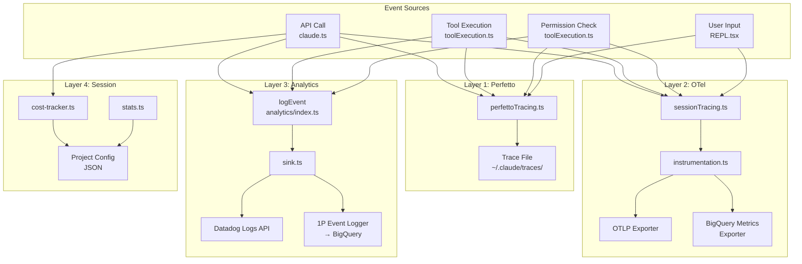
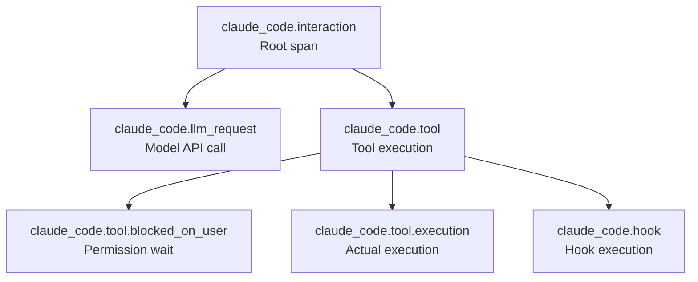
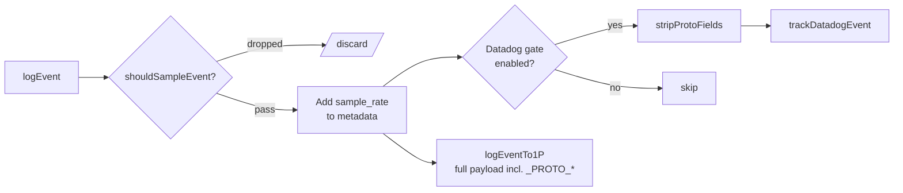
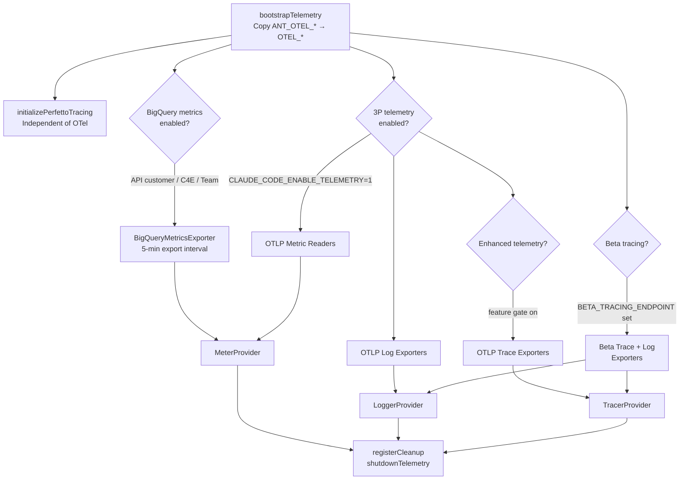
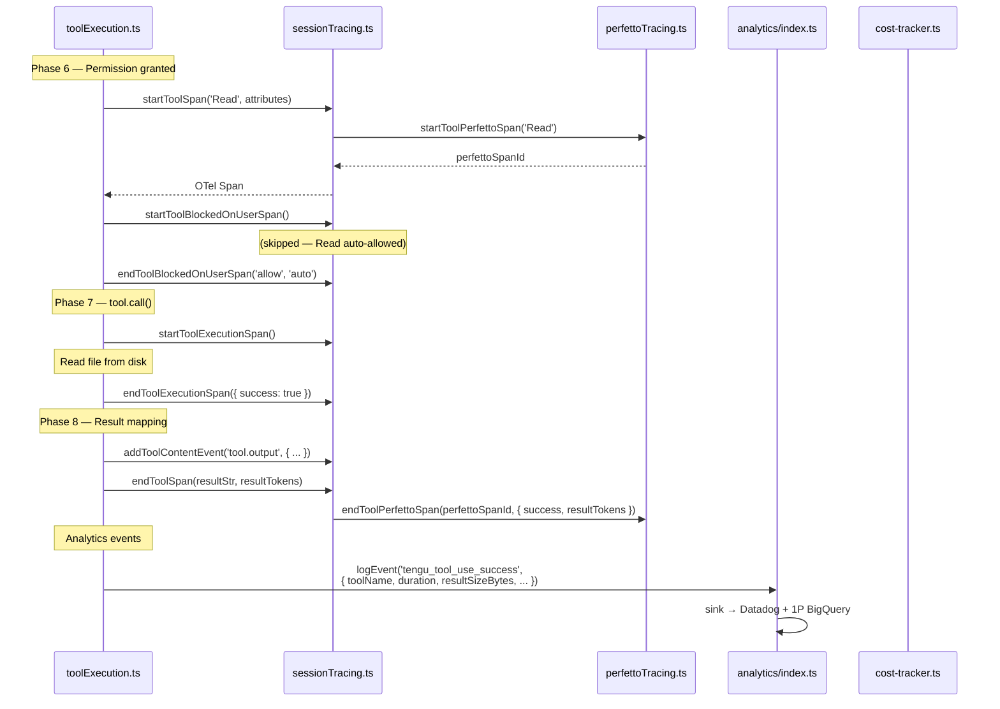

This post details how Claude Code tracks performance through its metrics and telemetry infrastructure. The system operates across four layers: local tracing (Perfetto), distributed tracing (OpenTelemetry), analytics event logging (Datadog + first-party BigQuery), and session-level aggregation (stats and cost tracking). We trace how a single user interaction — an API call, a tool execution, a permission dialog — becomes a measurable event across all four layers, and how those measurements flow from client to backend.

This post complements the execution pipeline described in [Tool Execution]() and the API call lifecycle in [Calling the Model](). Those posts reference telemetry events at specific phases; this post explains the systems that produce them.

---

## 1. The Four Layers

Claude Code does not have a single metrics pipeline. It has four, each designed for a different audience and latency tolerance:

| Layer | Primary File(s) | Format | Destination | Audience |
|---|---|---|---|---|
| **Perfetto Tracing** | `perfettoTracing.ts` | Chrome Trace Event JSON | Local file (`~/.claude/traces/`) | Developer debugging |
| **OpenTelemetry (OTel)** | `sessionTracing.ts`, `instrumentation.ts` | OTel Spans + Logs | OTLP endpoint / Console | Ops teams, enterprise admins |
| **Analytics Events** | `analytics/index.ts`, `sink.ts`, `datadog.ts` | Structured logs | Datadog Logs API + 1P BigQuery | Product analytics |
| **Session Stats** | `stats.ts`, `cost-tracker.ts` | Aggregated JSONL | Local disk + project config | End user (`/cost` display) |

These layers are independent — a tool execution simultaneously emits a Perfetto span, an OTel span, a Datadog event, and increments cost counters. No layer depends on another's output.



---

## 2. Layer 1: Perfetto Tracing

### 2.1 Purpose and Scope

Perfetto tracing generates Chrome Trace Event format files viewable in [ui.perfetto.dev](https://ui.perfetto.dev). It is **ant-only** — the entire module is eliminated from external builds via `feature('PERFETTO_TRACING')` dead-code elimination (perfettoTracing.ts:260). Its purpose is developer-facing performance debugging: seeing exactly where time goes in an interaction.

Enable it with:

```bash
CLAUDE_CODE_PERFETTO_TRACE=1 claude       # writes to ~/.claude/traces/trace-<sessionId>.json
CLAUDE_CODE_PERFETTO_TRACE=/tmp/trace.json # writes to explicit path
```

### 2.2 What Gets Traced

The tracer emits five span types and two event types:

| Span/Event | Start Function | End Function | Category |
|---|---|---|---|
| **Interaction** | `startInteractionPerfettoSpan()` | `endInteractionPerfettoSpan()` | Full user request cycle |
| **API Call** | `startLLMRequestPerfettoSpan()` | `endLLMRequestPerfettoSpan()` | Model request with sub-spans |
| **Tool** | `startToolPerfettoSpan()` | `endToolPerfettoSpan()` | Tool execution duration |
| **User Input** | `startUserInputPerfettoSpan()` | `endUserInputPerfettoSpan()` | Permission dialog waiting |
| **Instant** | `emitPerfettoInstant()` | — | Point-in-time markers |
| **Counter** | `emitPerfettoCounter()` | — | Metric values over time |

### 2.3 API Call Sub-Spans

The richest trace entry is the API Call. When `endLLMRequestPerfettoSpan()` fires, it computes derived metrics and emits nested sub-spans that decompose the request into phases:

```
API Call (total duration)
├── Request Setup (client creation, retries before success)
│   ├── Attempt 1 (retry)
│   └── Attempt 2 (retry)
├── First Token (TTFT: prompt processing)
└── Sampling (output generation)
```

The derived metrics computed at span close (perfettoTracing.ts:503-518):

```typescript
// ITPS: input tokens per second (prompt processing speed)
const itps = promptTokens / (ttftMs / 1000)

// OTPS: output tokens per second (sampling speed)
const samplingMs = ttltMs - ttftMs
const otps = outputTokens / (samplingMs / 1000)

// Cache hit rate: percentage of prompt tokens from cache
const cacheHitRate = (cacheReadTokens / promptTokens) * 100
```

These appear as `args` on the trace events, making them filterable in the Perfetto UI.

### 2.4 Memory Management

Long-running sessions (especially cron-driven) need bounded memory. The tracer enforces three limits:

1. **Event cap** — `MAX_EVENTS = 100,000`. When hit, `evictOldestEvents()` splices the oldest half and inserts a `trace_truncated` marker (perfettoTracing.ts:232-247). This is amortized O(1) — eviction runs from the cleanup interval, not on every push.

2. **Stale span TTL** — Spans open longer than 30 minutes are force-closed with `evicted: true` in their args (perfettoTracing.ts:187-209). This prevents memory leaks from unclosed spans (e.g., aborted streams).

3. **Metadata separation** — Process/thread name events (`ph: 'M'`) are stored in a separate `metadataEvents[]` array that survives eviction. Perfetto UI needs these to label tracks; losing them would make the trace unreadable.

### 2.5 Agent Hierarchy

For multi-agent sessions (spawned agents, swarms), each agent gets a unique numeric process ID. The main session is always `pid: 1`:

```typescript
// perfettoTracing.ts:147-167
function getCurrentAgentInfo(): AgentInfo {
  const agentId = getAgentId() ?? getSessionId()
  const agentName = getAgentName() ?? 'main'
  return {
    agentId,
    agentName,
    processId: agentId === getSessionId() ? 1 : getProcessIdForAgent(agentId),
    threadId: stringToNumericHash(agentName),
  }
}
```

In Perfetto, each agent appears as a separate "process" track with its own timeline — API calls and tool executions from different agents are visually separated, with parent-child relationships encoded in metadata events.

### 2.6 Write Strategy

The trace is written in three layers of fallback to maximize the chance of surviving process exit:

1. **Periodic write** — If `CLAUDE_CODE_PERFETTO_WRITE_INTERVAL_S` is set, writes full snapshots on a timer (perfettoTracing.ts:289-298).
2. **Async cleanup** — `registerCleanup()` writes the final trace asynchronously (perfettoTracing.ts:308-311).
3. **Sync exit** — `process.on('exit')` writes synchronously with `writeFileSync` as a last resort (perfettoTracing.ts:321-329).

---

## 3. Layer 2: OpenTelemetry Distributed Tracing

### 3.1 The Session Tracing API

`sessionTracing.ts` provides a high-level API that wraps OpenTelemetry spans with Claude Code-specific semantics. Unlike Perfetto (which writes a local file), OTel spans can be exported to any OTLP-compatible backend for centralized analysis.

The span hierarchy mirrors the interaction structure:



### 3.2 Dual Dispatch

Every `start*` function in `sessionTracing.ts` dispatches to **both** OTel and Perfetto:

```typescript
// sessionTracing.ts:176-234 (simplified)
export function startInteractionSpan(userPrompt: string): Span {
  // Perfetto span — always, if Perfetto is enabled
  const perfettoSpanId = isPerfettoTracingEnabled()
    ? startInteractionPerfettoSpan(userPrompt) : undefined

  // OTel span — only if enhanced telemetry or beta tracing is enabled
  if (!isAnyTracingEnabled()) { ... return dummySpan }

  const span = tracer.startSpan('claude_code.interaction', { attributes })
  // Store Perfetto span ID on the OTel context for paired end calls
  const spanContextObj = { span, startTime: Date.now(), attributes, perfettoSpanId }
  ...
}
```

This design means Perfetto and OTel are always in sync — the same start/end calls produce traces in both systems simultaneously.

### 3.3 Context Propagation

OTel requires parent-child relationships between spans. `sessionTracing.ts` uses `AsyncLocalStorage` to maintain two context stacks:

```typescript
// sessionTracing.ts:69-70
const interactionContext = new AsyncLocalStorage<SpanContext | undefined>()
const toolContext = new AsyncLocalStorage<SpanContext | undefined>()
```

When a tool span starts, it reads the interaction context to set its parent:

```typescript
const parentSpanCtx = interactionContext.getStore()
const ctx = parentSpanCtx
  ? trace.setSpan(otelContext.active(), parentSpanCtx.span)
  : otelContext.active()
const span = tracer.startSpan('claude_code.tool', { attributes }, ctx)
```

This ensures that even across async boundaries (tool execution is async), the span tree is correctly nested.

### 3.4 Span Lifecycle Management

Spans can leak if their `end*` function is never called (aborted streams, uncaught exceptions). The module defends against this with:

- **WeakRef tracking** — Active spans are stored as `WeakRef<SpanContext>` in `activeSpans` (sessionTracing.ts:71). When no strong reference exists, GC can collect them.
- **Strong reference pinning** — Spans not stored in AsyncLocalStorage (LLM request, blocked-on-user, tool execution, hook) are additionally stored in `strongSpans` (sessionTracing.ts:75) to prevent premature GC.
- **TTL cleanup** — A 60-second interval evicts spans older than 30 minutes (sessionTracing.ts:100-120). `unref()` on the interval prevents it from keeping the process alive.

### 3.5 Enhanced Telemetry Gating

OTel tracing is gated behind `isEnhancedTelemetryEnabled()` (sessionTracing.ts:126-143), which checks three sources in priority order:

```
1. Env var override:  CLAUDE_CODE_ENHANCED_TELEMETRY_BETA / ENABLE_ENHANCED_TELEMETRY_BETA
2. Build-time flag:   USER_TYPE === 'ant' (always enabled for internal users)
3. Feature gate:      enhanced_telemetry_beta (GrowthBook, cached)
```

### 3.6 Beta Tracing

A separate tracing tier (`betaSessionTracing.ts`) adds richer attributes for debugging — system prompt content, model output, thinking output, tool input/output. It has its own enablement check (`isBetaTracingEnabled()`) requiring both `ENABLE_BETA_TRACING_DETAILED=1` and `BETA_TRACING_ENDPOINT`.

Key features of beta tracing:

- **Hash-based deduplication** — System prompts are hashed; the full content is logged once per unique hash per session (betaSessionTracing.ts:266-282). Subsequent requests only log the hash.
- **Incremental context** — Instead of logging the full conversation on each LLM request, `lastReportedMessageHash` tracks what was already reported per agent, and only the delta (new messages) is logged (betaSessionTracing.ts:334-399).
- **Visibility rules** — Thinking output is ant-only. System prompts, model output, and tool content are visible to all users with beta tracing enabled (betaSessionTracing.ts:13-20).

---

## 4. Layer 3: Analytics Event Logging

### 4.1 The Event Pipeline

Analytics events follow a queue-then-route pattern. The public API (`analytics/index.ts`) accepts events immediately — even before the backend is initialized — by buffering them in an in-memory queue:

```
logEvent(name, metadata)
    |
    +-- sink attached?
    |     Yes → sink.logEvent(name, metadata)
    |     No  → eventQueue.push({ name, metadata })
    |
    +-- When attachAnalyticsSink() is called:
          Drain queue via queueMicrotask()
          → each queued event → sink.logEvent()
```

The `queueMicrotask()` drain (analytics/index.ts:113) is deliberate — it avoids adding latency to the startup path. Events logged before the sink attaches are processed asynchronously after initialization completes.

### 4.2 The Sink Router

`sink.ts` routes events to two backends:



The critical PII invariant: `_PROTO_*` keys in the metadata contain unredacted PII-tagged values destined for privileged BigQuery columns. `stripProtoFields()` removes these before Datadog fanout (sink.ts:66-67). The first-party exporter receives the full payload and routes `_PROTO_*` keys to their designated proto fields.

### 4.3 Event Sampling

Not all events are logged at full rate. `shouldSampleEvent()` (firstPartyEventLogger.ts:57-85) checks a GrowthBook dynamic config (`tengu_event_sampling_config`) that maps event names to sample rates:

```typescript
// Example config from GrowthBook:
{ "tengu_tool_use_success": { "sample_rate": 0.1 } }  // 10% sampling
```

When an event is sampled, `sample_rate` is appended to the metadata so downstream consumers can weight the data correctly. Events without a config entry are logged at 100%.

### 4.4 Datadog Integration

Datadog receives events as structured logs via the Logs API (datadog.ts). The implementation optimizes for three concerns:

**Batching** — Events are buffered in `logBatch[]` and flushed either when the batch hits 100 events or after 15 seconds (datadog.ts:121-128):

```typescript
const DEFAULT_FLUSH_INTERVAL_MS = 15000
const MAX_BATCH_SIZE = 100
```

**Event allowlisting** — Only 64 specific event names are sent to Datadog (datadog.ts:19-64). This is a hard-coded allowlist, not a denylist — unknown events are silently dropped. This prevents cardinality explosions from new event types.

**Cardinality reduction** — Four transformations reduce Datadog tag cardinality:

| Transformation | Example | Why |
|---|---|---|
| MCP tool name normalization | `mcp__slack__send` → `mcp` | User-specific server names are PII |
| Model name normalization | `claude-sonnet-4-6-20250514` → `sonnet-4-6` | Exact model IDs create unbounded tags |
| Version truncation | `2.0.53-dev.20251124.t173302.sha526cc6a` → `2.0.53-dev.20251124` | Timestamp+sha are unique per build |
| User bucketing | User ID → bucket 0-29 | Hash-based bucket for unique-user estimates without high-cardinality user IDs |

The user bucketing (datadog.ts:295-299) deserves special attention:

```typescript
const NUM_USER_BUCKETS = 30
const getUserBucket = memoize((): number => {
  const userId = getOrCreateUserID()
  const hash = createHash('sha256').update(userId).digest('hex')
  return parseInt(hash.slice(0, 8), 16) % NUM_USER_BUCKETS
})
```

This allows alerting on "how many user-buckets are affected" — a proxy for unique user count that doesn't require storing user IDs in Datadog.

### 4.5 First-Party Event Logging

The 1P path exports events to BigQuery via a custom OTel `LogRecordExporter` (firstPartyEventLoggingExporter.ts). Events are enriched with full metadata at emit time:

```typescript
// firstPartyEventLogger.ts:161-178 (simplified)
const coreMetadata = await getEventMetadata({ model, betas })
const attributes = {
  event_name: eventName,
  event_id: randomUUID(),
  core_metadata: coreMetadata,    // model, session, env, agent context
  user_metadata: getCoreUserData(),
  event_metadata: metadata,       // event-specific payload
}
firstPartyEventLogger.emit({ body: eventName, attributes })
```

The `getEventMetadata()` function (metadata.ts:693-743) is the richest metadata source in the system. It collects:

- Platform info (arch, OS, terminal, WSL version, Linux distro)
- Subscription context (type, Claude.ai vs API customer)
- Agent context (teammate vs subagent vs standalone, team name, parent session)
- VCS info (repo remote hash for joining with server-side data)
- Process metrics (RSS, heap, CPU%, uptime — computed per-event)
- CI context (GitHub Actions runner, SWE-bench identifiers)

### 4.6 Metadata PII Controls

The analytics system enforces PII boundaries through TypeScript marker types:

```typescript
// analytics/index.ts:19
export type AnalyticsMetadata_I_VERIFIED_THIS_IS_NOT_CODE_OR_FILEPATHS = never
export type AnalyticsMetadata_I_VERIFIED_THIS_IS_PII_TAGGED = never
```

The `logEvent()` function signature only accepts `{ [key: string]: boolean | number | undefined }` — **no raw strings**. Any string value must be explicitly cast through one of the marker types, forcing the developer to verify it doesn't contain code, file paths, or other sensitive data. This is a compile-time guardrail, not a runtime check.

For MCP tool names (which encode user-specific server configurations), `sanitizeToolNameForAnalytics()` (metadata.ts:70-77) normalizes to `'mcp_tool'` by default. Detailed names are only logged when the tool comes from a known-safe source: official MCP registry URLs, claude.ai-proxied connectors, or built-in MCP servers.

---

## 5. Layer 4: Session Stats and Cost Tracking

### 5.1 Real-Time Cost Tracking

`cost-tracker.ts` maintains running totals for the current session: total cost in USD, API duration, tool duration, lines changed, and per-model token usage. These are the numbers displayed when the user types `/cost`.

The `addToTotalSessionCost()` function (cost-tracker.ts:278-323) is called after every API response. It does three things:

1. **Updates in-memory state** — Adds cost, token counts, and model usage to the global counters in `bootstrap/state.ts`.
2. **Pushes to OTel meters** — If a `costCounter` or `tokenCounter` is registered, it calls `.add()` with model and speed attributes. These flow to BigQuery via the `BigQueryMetricsExporter`.
3. **Handles advisor usage** — If the response includes advisor (sub-model) usage, it recursively calls itself for each advisor to ensure their costs are tracked separately.

```typescript
// cost-tracker.ts:290-301
getCostCounter()?.add(cost, attrs)
getTokenCounter()?.add(usage.input_tokens, { ...attrs, type: 'input' })
getTokenCounter()?.add(usage.output_tokens, { ...attrs, type: 'output' })
getTokenCounter()?.add(usage.cache_read_input_tokens ?? 0, { ...attrs, type: 'cacheRead' })
getTokenCounter()?.add(usage.cache_creation_input_tokens ?? 0, { ...attrs, type: 'cacheCreation' })
```

### 5.2 Session Persistence

When a session ends or is switched, `saveCurrentSessionCosts()` (cost-tracker.ts:143-175) persists the accumulated state to the project config. This enables session resumption — `restoreCostStateForSession()` reads it back when a session is resumed, but only if the session ID matches.

The persisted state includes FPS metrics from the `FpsTracker` (fpsTracker.ts), which measures rendering performance:

```typescript
// cost-tracker.ts:143-175 (simplified)
export function saveCurrentSessionCosts(fpsMetrics?: FpsMetrics): void {
  saveCurrentProjectConfig(current => ({
    ...current,
    lastCost: getTotalCostUSD(),
    lastAPIDuration: getTotalAPIDuration(),
    lastFpsAverage: fpsMetrics?.averageFps,
    lastFpsLow1Pct: fpsMetrics?.low1PctFps,
    lastModelUsage: /* per-model breakdown */,
    lastSessionId: getSessionId(),
  }))
}
```

### 5.3 Historical Aggregation

`stats.ts` processes JSONL session transcript files to compute historical usage statistics. The `aggregateClaudeCodeStats()` function produces a `ClaudeCodeStats` object with:

- Activity overview: total sessions, messages, active days
- Streak tracking: current and longest usage streaks
- Daily activity heatmap data
- Per-model token usage over time
- Peak activity times (day and hour)
- Speculation time saved (speculative execution latency wins)
- Shot distribution (ant-only): how many turns per interaction, one-shot rate

Performance is critical here — users may have thousands of session files. The implementation uses several optimizations:

- **Disk cache** (`statsCache.ts`) — Previously processed sessions are cached with a version-based schema migration. Only new/modified sessions are reprocessed.
- **Date-range filtering** — `readSessionStartDate()` peeks the first 4KB of each file to extract the session start date, allowing pre-filtering without reading entire files.
- **Batch parallelism** — Session files are processed in batches of 20 via `Promise.all()` (stats.ts:139-141).

---

## 6. Telemetry Bootstrap and Infrastructure

### 6.1 Initialization Sequence

`initializeTelemetry()` (instrumentation.ts:421) runs during app startup. It configures three OTel signals (traces, metrics, logs) with independent exporter chains:



### 6.2 Exporter Protocol Selection

OTLP exporters are **dynamically imported** based on the protocol configured in environment variables. This avoids loading all protocol variants (~1.2MB total) on every startup:

```typescript
// instrumentation.ts:165-193 (simplified)
switch (protocol) {
  case 'grpc':
    const { OTLPMetricExporter } = await import('@opentelemetry/exporter-metrics-otlp-grpc')
    break
  case 'http/json':
    const { OTLPMetricExporter } = await import('@opentelemetry/exporter-metrics-otlp-http')
    break
  case 'http/protobuf':
    const { OTLPMetricExporter } = await import('@opentelemetry/exporter-metrics-otlp-proto')
    break
}
```

### 6.3 BigQuery Metrics Exporter

The `BigQueryMetricsExporter` (bigqueryExporter.ts) is a custom `PushMetricExporter` that sends OTel metrics to `https://api.anthropic.com/api/claude_code/metrics`. It is enabled for API customers, Claude for Enterprise, and Claude for Teams users (instrumentation.ts:336-347).

Two important guards run before each export:

1. **Trust dialog check** — In interactive mode, metrics are suppressed until the user has accepted the trust dialog. This prevents triggering the API key helper before the user has seen the prompt (bigqueryExporter.ts:95-99).
2. **Organization opt-out** — `checkMetricsEnabled()` queries the organization-level metrics opt-out setting (bigqueryExporter.ts:105-109).

The exporter uses **delta temporality** exclusively (bigqueryExporter.ts:246-251). This is a hard requirement — the comment warns "DO NOT CHANGE THIS TO CUMULATIVE" because it would corrupt the CC Productivity metrics dashboard aggregation.

### 6.4 Telemetry Attributes

`telemetryAttributes.ts` provides the base attributes attached to all OTel spans and metrics:

| Attribute | Source | Cardinality Control |
|---|---|---|
| `user.id` | Local config | Always included |
| `session.id` | Bootstrap state | `OTEL_METRICS_INCLUDE_SESSION_ID` (default: on) |
| `app.version` | Build macro | `OTEL_METRICS_INCLUDE_VERSION` (default: off) |
| `organization.id` | OAuth account | Only with OAuth auth |
| `user.email` | OAuth account | Only with OAuth auth |
| `user.account_uuid` | OAuth account | `OTEL_METRICS_INCLUDE_ACCOUNT_UUID` (default: on) |
| `terminal.type` | Environment | Only if available |

The cardinality controls are exposed as environment variables so enterprise deployments can tune the attribute set for their OTel backend's cardinality limits.

### 6.5 Graceful Shutdown

Shutdown is time-bounded to prevent blocking process exit on slow OTLP backends:

```typescript
// instrumentation.ts:654-694 (simplified)
const shutdownTelemetry = async () => {
  const timeoutMs = parseInt(process.env.CLAUDE_CODE_OTEL_SHUTDOWN_TIMEOUT_MS || '2000')
  endInteractionSpan()
  await Promise.race([
    Promise.all([meterProvider.shutdown(), loggerProvider?.shutdown(), tracerProvider?.shutdown()]),
    telemetryTimeout(timeoutMs, 'OpenTelemetry shutdown timeout'),
  ])
}
registerCleanup(shutdownTelemetry)
```

Each provider's shutdown is independent — a slow logger flush doesn't delay meter or tracer shutdown. The default timeout is 2 seconds, tunable via `CLAUDE_CODE_OTEL_SHUTDOWN_TIMEOUT_MS`.

---

## 7. Web Performance Metrics

The web client (`web/lib/performance/`) tracks a separate set of browser-focused metrics:

### 7.1 Core Web Vitals

`metrics.ts` uses `PerformanceObserver` to capture standard web vitals with rating thresholds:

| Metric | Good | Needs Improvement | Poor |
|---|---|---|---|
| LCP (Largest Contentful Paint) | ≤ 2,500ms | ≤ 4,000ms | > 4,000ms |
| FID (First Input Delay) | ≤ 100ms | ≤ 300ms | > 300ms |
| CLS (Cumulative Layout Shift) | ≤ 0.1 | ≤ 0.25 | > 0.25 |
| INP (Interaction to Next Paint) | ≤ 200ms | ≤ 500ms | > 500ms |
| TTFB (Time to First Byte) | ≤ 800ms | ≤ 1,800ms | > 1,800ms |

### 7.2 Custom Chat Metrics

Three chat-specific metrics complement the web vitals:

- **`time_to_interactive`** — Time from page load until the chat input becomes usable.
- **`first_message_render`** — Time until the first message bubble finishes rendering.
- **`streaming_token_latency_ms`** — Time from server chunk arrival to DOM update. Measured per-chunk via `startStreamingLatencyMeasurement()`.

### 7.3 Scroll FPS Monitoring

`monitorScrollFps()` (metrics.ts:147-176) measures rendering frame rate during scrolling — a critical UX metric for long conversations. It reports `scroll_fps` with ratings: good (≥ 55fps), needs improvement (≥ 30fps), or poor (< 30fps).

### 7.4 Streaming Optimizer

The `StreamingOptimizer` (streaming-optimizer.ts) prevents per-token re-renders from degrading frame rate during streaming. It batches incoming tokens via `requestAnimationFrame`:

```typescript
push(chunk: string): void {
  this.buffer += chunk
  if (this.rafId !== null) return  // rAF already scheduled

  const timeSinceLast = performance.now() - this.lastFlushTime
  if (timeSinceLast >= this.maxDelay) {
    this.flush()  // overdue — flush synchronously
  } else {
    this.rafId = requestAnimationFrame(() => { this.flush() })
  }
}
```

The `maxDelay` (default 50ms) ensures that even if `requestAnimationFrame` is delayed (background tab, heavy GC), accumulated text is flushed before the user perceives a stall.

### 7.5 CLI FPS Tracking

On the CLI side, `FpsTracker` (fpsTracker.ts) records frame durations during rendering and computes two metrics:

- **`averageFps`** — Total frames divided by elapsed time.
- **`low1PctFps`** — 1/p99 frame duration. This captures worst-case stutter — if the 99th percentile frame takes 100ms, `low1PctFps` is 10fps even if the average is 60fps.

These metrics are persisted with session costs (`saveCurrentSessionCosts`) for post-session analysis.

---

## 8. How a Tool Execution Becomes Measurable

To make the four layers concrete, here is the complete telemetry path for a single tool execution (a `Read` tool call):



The tool produces:
- **Perfetto**: One `Tool: Read` span with duration and result tokens
- **OTel**: Three nested spans (tool → blocked_on_user → execution) + a tool content event
- **Datadog**: One `tengu_tool_use_success` log entry with tool name, duration, result size, file extension
- **Cost tracker**: No direct cost (tool execution is free), but the subsequent API call that consumes the tool result does

---

## 9. Environment Variables Reference

| Variable | Layer | Purpose |
|---|---|---|
| `CLAUDE_CODE_PERFETTO_TRACE` | Perfetto | Enable trace file output (`1` or path) |
| `CLAUDE_CODE_PERFETTO_WRITE_INTERVAL_S` | Perfetto | Periodic write interval in seconds |
| `CLAUDE_CODE_ENABLE_TELEMETRY` | OTel | Enable 3P OTLP export |
| `CLAUDE_CODE_ENHANCED_TELEMETRY_BETA` | OTel | Override enhanced telemetry gate |
| `ENABLE_BETA_TRACING_DETAILED` | Beta Tracing | Enable beta tracing |
| `BETA_TRACING_ENDPOINT` | Beta Tracing | OTLP endpoint for beta traces |
| `OTEL_TRACES_EXPORTER` | OTel | Trace exporter type (console, otlp) |
| `OTEL_METRICS_EXPORTER` | OTel | Metric exporter type (console, otlp) |
| `OTEL_LOGS_EXPORTER` | OTel | Log exporter type (console, otlp) |
| `OTEL_EXPORTER_OTLP_PROTOCOL` | OTel | OTLP protocol (grpc, http/json, http/protobuf) |
| `OTEL_EXPORTER_OTLP_ENDPOINT` | OTel | OTLP collector endpoint |
| `OTEL_LOG_USER_PROMPTS` | OTel | Log user prompts (default: redacted) |
| `OTEL_LOG_TOOL_CONTENT` | OTel | Log tool content in spans |
| `OTEL_LOG_TOOL_DETAILS` | OTel | Log MCP server/tool names |
| `OTEL_METRICS_INCLUDE_SESSION_ID` | OTel | Include session ID in metrics (default: true) |
| `OTEL_METRICS_INCLUDE_VERSION` | OTel | Include app version in metrics (default: false) |
| `OTEL_METRICS_INCLUDE_ACCOUNT_UUID` | OTel | Include account UUID in metrics (default: true) |
| `CLAUDE_CODE_OTEL_SHUTDOWN_TIMEOUT_MS` | OTel | Shutdown flush timeout (default: 2000ms) |
| `CLAUDE_CODE_DATADOG_FLUSH_INTERVAL_MS` | Analytics | Datadog flush interval override (testing) |

---

## Appendix A: Key Source Files

| File | Responsibility |
|---|---|
| `src/utils/telemetry/perfettoTracing.ts` | Chrome Trace format generation, agent hierarchy, event capping |
| `src/utils/telemetry/sessionTracing.ts` | OTel span API, dual dispatch to Perfetto, AsyncLocalStorage context |
| `src/utils/telemetry/betaSessionTracing.ts` | Extended tracing attributes (system prompt, model output, tool content) |
| `src/utils/telemetry/instrumentation.ts` | OTel SDK bootstrap, exporter configuration, shutdown |
| `src/utils/telemetry/bigqueryExporter.ts` | Custom `PushMetricExporter` for BigQuery via Anthropic API |
| `src/utils/telemetry/events.ts` | OTel event emission with attributes and redaction |
| `src/utils/telemetry/logger.ts` | OTel diagnostic logger (`ClaudeCodeDiagLogger`) |
| `src/utils/telemetryAttributes.ts` | Base attributes for all OTel signals, cardinality controls |
| `src/services/analytics/index.ts` | Public analytics API, event queue, PII marker types |
| `src/services/analytics/sink.ts` | Event router: sampling → Datadog + 1P, PII stripping |
| `src/services/analytics/datadog.ts` | Datadog Logs API client, batching, cardinality reduction |
| `src/services/analytics/firstPartyEventLogger.ts` | 1P BigQuery event export via OTel LogRecordExporter |
| `src/services/analytics/metadata.ts` | Event metadata enrichment, PII sanitization, tool input truncation |
| `src/services/analytics/growthbook.ts` | Feature gates and dynamic config (sampling, Datadog gate) |
| `src/services/analytics/sinkKillswitch.ts` | Emergency sink shutdown |
| `src/cost-tracker.ts` | Session cost aggregation, OTel meter integration, session persistence |
| `src/utils/stats.ts` | Historical stats aggregation from JSONL transcripts |
| `src/utils/statsCache.ts` | Disk-cached stats with lock-based concurrency |
| `src/utils/fpsTracker.ts` | CLI rendering FPS measurement (average + p99) |
| `web/lib/performance/metrics.ts` | Core Web Vitals + custom chat metrics |
| `web/lib/performance/streaming-optimizer.ts` | rAF-batched streaming token updates |
