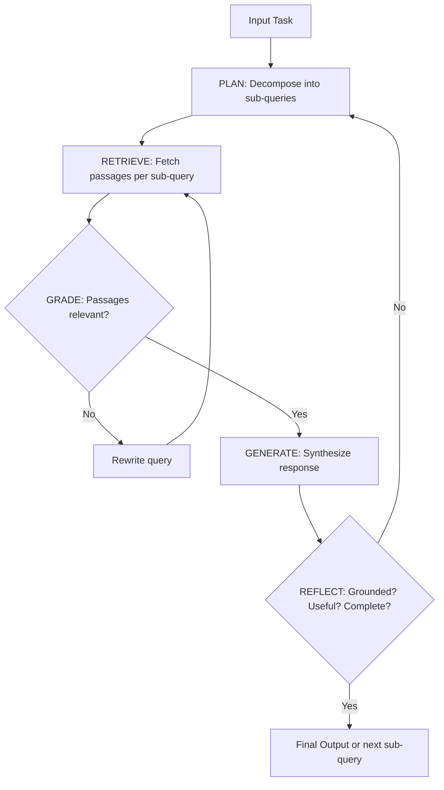
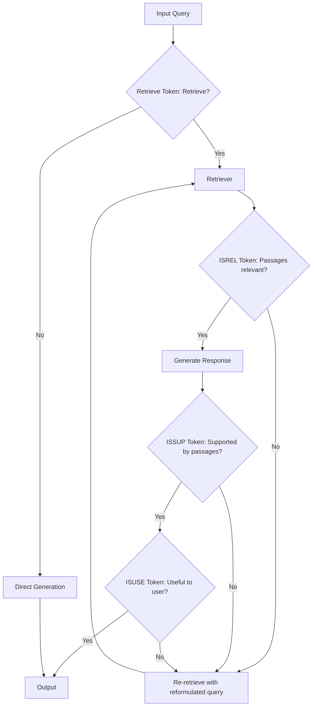
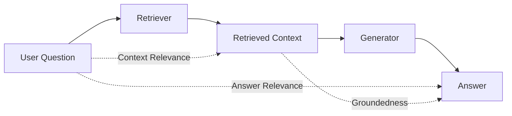
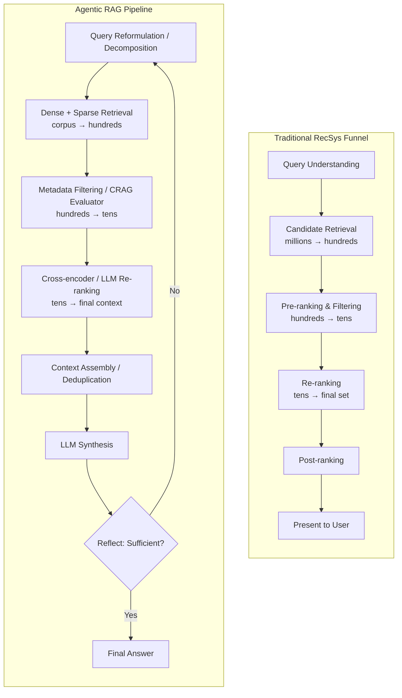

RAG has outgrown its original "retrieve-then-read" design. What started as a way to ground LLM answers in external documents has become a full agentic architecture — one that plans, retrieves iteratively, reflects on its own outputs, and self-corrects across multiple conversation turns. This post surveys where the field stands in mid-2025: the architectures driving multi-turn RAG, how to evaluate them rigorously, and a structural comparison with the traditional recommendation system funnel that reveals surprising parallels and instructive differences.

## Part 1: The Evolution of RAG Architectures

### Three Paradigms

RAG has progressed through three distinct eras:

| Era | Paradigm | Characteristics |
|-----|----------|-----------------|
| 2020-2022 | **Naive RAG** | Static retrieve-then-read. Single query, single retrieval pass, single generation. No feedback. |
| 2022-2023 | **Advanced RAG** | Pre-retrieval optimization (query rewriting, expansion) and post-retrieval processing (re-ranking, compression). Quality improvements within a fixed pipeline. |
| 2024-present | **Modular / Agentic RAG** | Reconfigurable modules with routing, scheduling, branching, and looping. Agents decide when, what, and how to retrieve — across multiple steps and turns. |

The shift to agentic RAG is not incremental. It changes the fundamental computational pattern from a pipeline to a control loop.

### Key Architectures for Multi-Turn and Long-Horizon Tasks

**Self-RAG** (Asai et al., 2023) trains a single language model to emit special reflection tokens — `Retrieve`, `ISREL`, `ISSUP`, `ISUSE` — that control retrieval decisions and self-assess output quality at each generation step. No external critique components are needed; the model internalizes the entire retrieval-and-validation loop.

**CRAG — Corrective RAG** (Yan et al., 2024) inserts a lightweight retrieval evaluator between the retriever and generator. It classifies retrieval quality as Correct, Ambiguous, or Incorrect. When confidence is low, CRAG triggers web search as a fallback and applies decompose-then-recompose filtering to strip irrelevant content before generation.

**Adaptive-RAG** (Jeong et al., NAACL 2024) routes queries by complexity: simple factual questions skip retrieval entirely (parametric knowledge suffices), moderate questions get single-step retrieval, and multi-hop questions trigger iterative retrieval chains. A trained classifier makes the routing decision, balancing efficiency against accuracy.

**FLARE — Forward-Looking Active Retrieval** (Jiang et al., EMNLP 2023) generates text iteratively and monitors token-level confidence. When the model predicts the next sentence with low confidence, it uses that tentative sentence as a retrieval query, fetches relevant passages, and regenerates. Retrieval is triggered only when the model is uncertain — active, not scheduled.

**IRCoT** (Trivedi et al., ACL 2023) interleaves retrieval with each chain-of-thought reasoning step. Each reasoning step informs what to retrieve next, and retrieved documents improve subsequent reasoning. This mutual reinforcement yields up to 21-point improvement in retrieval quality on multi-hop datasets like HotpotQA and MuSiQue.

**CoRAG — Chain-of-Retrieval** (Wang et al., 2025) trains models to retrieve and reason step-by-step before generating final answers, analogous to how o1-style models scale reasoning at test time. Uses rejection sampling to automatically generate intermediate retrieval chains. Achieves 10+ point EM improvement on multi-hop QA and sets a new state of the art on the KILT benchmark.

**DeepRAG** (Guan et al., 2025) models the retrieval decision as a Markov Decision Process. At each step, the system dynamically decides whether to retrieve externally or rely on parametric reasoning, optimizing a policy that avoids redundant retrieval (which introduces noise) while preventing hallucination from insufficient context.

### The Plan-Retrieve-Generate Loop

The core pattern of agentic RAG replaces the static pipeline with an iterative control loop:

This pattern, implemented in frameworks like LangGraph (state machines with explicit nodes and edges) and DSPy (declarative modules with compiler-optimized prompting), enables:

- **Reflection**: Evaluating and iteratively improving outputs
- **Planning**: Decomposing complex tasks into manageable retrieval steps
- **Tool selection**: Routing to vector stores, web search, APIs, or calculators based on query type
- **Multi-agent collaboration**: Specialized agents for retrieval, reasoning, and validation

### Self-RAG Architecture Detail

### Multi-Turn Specific Challenges

As RAG moves from single-turn QA to sustained multi-turn interaction, several problems sharpen:

**Query reformulation across turns.** Each turn's query depends on prior conversation context. Pronouns reference earlier entities, topics shift gradually, and the user's information need evolves. The Rewrite-Retrieve-Read framework (Ma et al., EMNLP 2023) addresses this by training a small rewriter model via reinforcement learning, using the downstream reader's performance as the reward signal.

**Context accumulation and memory management.** As conversations progress, accumulated context grows. The system must decide what to keep, compress, or discard — a tension between long-term retention and computational cost that has no established best practice. MemWalker (Chen et al., 2023) processes long contexts into a tree of summary nodes and navigates this tree interactively.

**When to retrieve vs. use cached context.** Over-retrieval adds noise and latency; under-retrieval leads to hallucination. Self-RAG uses learned tokens, FLARE uses confidence heuristics, DeepRAG uses RL-trained policies — but optimal strategies remain task-dependent.

**Context window saturation.** Even with retrieval, context windows fill up in long conversations. Strategies for compression, summarization, and selective retention represent an active research frontier.

### Frameworks Enabling Multi-Turn RAG

**LangGraph** implements RAG as state machines with explicit nodes and edges. Three levels of sophistication: Chains (linear) → Routing → State Machines (with loops). The state machine pattern enables document grading, query transformation, generation validation, and loop re-initiation — combining Self-RAG and CRAG patterns in one auditable graph.

**DSPy** (Khattab et al., 2023) replaces brittle prompt templates with declarative, composable modules that a compiler automatically optimizes. Multi-hop retrieval pipelines in a few lines of code, with automatic optimization outperforming expert-crafted prompts.

**FlashRAG** (Jin et al., 2024) provides an open-source toolkit implementing 16 advanced RAG methods with 38 benchmark datasets, enabling rapid prototyping and fair comparison.

---

## Part 2: Evaluating RAG Systems

Evaluation is where RAG maturity lags furthest behind deployment ambition. The field has converged on three core dimensions — context relevance, groundedness, and answer relevance — but measuring them reliably, especially in multi-turn settings, remains an open challenge.

### The RAG Triad

### Dimension 1: Context Relevance (Is the Retrieval Good?)

Context relevance measures whether the retrieved passages actually contain the information needed to answer the query.

**Traditional IR metrics** provide the foundation:

| Metric | Definition | Strength |
|--------|-----------|----------|
| Precision@K | Fraction of top-K docs that are relevant | Simple, interpretable |
| Recall@K | Fraction of all relevant docs in top-K | Ensures coverage |
| NDCG | Rank-aware relevance (higher positions weighted more) | Respects ordering |
| MRR | Reciprocal rank of first relevant document | Speed-to-first-hit |

**RAGAS Context Precision** adds nuance:

$$\text{Context Precision@K} = \frac{\sum_{k=1}^{K} \text{Precision@k} \times v_k}{\text{Total relevant items in top K}}$$

where $v_k$ is a binary relevance indicator at rank $k$. This measures whether relevant chunks cluster at the top of the retrieval list.

**RAGAS Context Recall** decomposes the reference answer into claims and checks whether each claim is attributable to the retrieved context:

$$\text{Context Recall} = \frac{\text{Claims in reference supported by context}}{\text{Total claims in reference}}$$

A score of 1.0 means the retrieval covers everything needed.

**eRAG** (2024) takes a novel approach: each retrieved document is individually processed by the LLM, and the output is evaluated against ground truth. This achieves 0.168–0.494 improvement in Kendall's tau correlation with downstream task performance while using 50x less GPU memory than end-to-end evaluation.

### Dimension 2: Groundedness / Faithfulness (Is the Answer Supported?)

Groundedness measures whether the generated response is actually supported by the retrieved context — the hallucination check.

**RAGAS Faithfulness** uses a two-step process: decompose the answer into atomic claims, then verify each claim against the retrieved context.

$$\text{Faithfulness} = \frac{\text{Claims in response supported by context}}{\text{Total claims in response}}$$

If an answer makes 5 claims and only 3 are grounded in the passages, the faithfulness score is 0.6.

**NLI-based approaches** (TRUE benchmark) treat the retrieved context as a premise and the generated text as a hypothesis, applying natural language inference to determine entailment. Combined with QA-based methods, this provides the strongest non-LLM-judge approach to faithfulness.

**ChainPoll** (Galileo) introduces "Adherence" — a metric achieving AUROC 0.781 that surpasses alternatives by 11% and industry standards by 23%.

**Citation accuracy** is a related but distinct dimension. The ALCE benchmark (2023) found that even the best models "lack complete citation support 50% of the time" — a sobering finding for systems that claim to provide verifiable answers.

**Vectara HHEM-2.1-Open** offers a free, lightweight classifier model that replaces expensive LLM-based faithfulness verification — useful for cost-effective production hallucination detection.

### Dimension 3: Answer Relevance (Does It Answer the Question?)

Answer relevance checks whether the final response actually addresses what the user asked — independent of whether it's faithful or well-grounded.

**RAGAS Answer Relevancy** uses a clever inversion: generate $N$ artificial questions from the response, then compute cosine similarity between these generated questions and the original question:

$$\text{Answer Relevancy} = \frac{1}{N} \sum_{i=1}^{N} \cos(E_{q_i}, E_{q_{orig}})$$

If the response correctly addresses a question, the original question should be reconstructable from the answer. This penalizes both incomplete and overly verbose answers.

**Databricks' production framework** uses a weighted composite: Correctness (60%) + Comprehensiveness (20%) + Readability (20%). Their LLM judges matched human scores exactly in over 80% of judgments and within 1-score distance over 95% of the time.

### Evaluation Frameworks

The tooling landscape has matured rapidly:

| Framework | Distinguishing Strength | Reference-Free? |
|-----------|------------------------|-----------------|
| **RAGAS** | Comprehensive research-backed metrics; harmonic mean composite score | Yes (except Context Recall) |
| **TruLens** | Clean RAG Triad abstraction with multi-provider judge support | Yes |
| **DeepEval** | Production-ready with async, 0-1 scores, and `reason` field | Yes |
| **ARES** (NAACL 2024) | Lightweight LM judges + Prediction-Powered Inference; needs only ~100s human labels | Mostly |
| **LangSmith** | Component-level eval + offline/online workflow | Both |
| **Galileo** | ChainPoll metrics + automated rollback triggers | Both |

### LLM-as-Judge: The Dominant Paradigm

The MT-Bench paper (NeurIPS 2023) established that GPT-4 as a judge achieves >80% agreement with human preferences — matching inter-annotator agreement rates. This finding launched the LLM-as-judge paradigm that now dominates RAG evaluation.

**Known failure modes**: position bias (preferring the first response), verbosity bias (preferring longer answers), and self-enhancement bias (preferring its own outputs).

**Practical wisdom from production** (Hamel Husain, across 30+ AI implementations):
- Use binary pass/fail with detailed critiques rather than arbitrary 1-5 scales
- Have a domain expert (not the developer) set the standard
- Build judges iteratively with few-shot examples from expert critiques
- Honeycomb achieved >90% agreement between LLM judge and human experts in 3 iterations

**Cost optimization** (Databricks): GPT-3.5 with few-shot examples reduces evaluation cost 10x and improves speed 3x versus GPT-4 — but GPT-3.5 without examples is "completely unusable." Use integer scales with chain-of-thought reasoning before scoring, at low temperature (0.1) for reproducibility.

### Multi-Turn Evaluation: The Frontier

Evaluating multi-turn agentic RAG remains largely unsolved. The most notable work:

**tau-bench** (2024) evaluates language agents on tool-agent-user interaction over dynamic conversations. It introduces the pass^k metric (reliability across $k$ independent trials). The findings are humbling: even GPT-4o succeeds on fewer than 50% of tasks, and pass^8 drops below 25% in the retail domain. Agents are "quite inconsistent."

RAGAS has introduced dedicated agent metrics — Topic Adherence, Tool Call Accuracy, Tool Call F1, Agent Goal Accuracy — but these remain early-stage.

The unsolved problems: evaluating context accumulation quality across turns, detecting topic drift, measuring coherence beyond single Q&A pairs, and assessing whether the system retrieves the right information at the right turn.

### Production Evaluation Patterns

From companies running RAG at scale, a consistent pattern emerges:

**Offline evaluation**: Start with 5-10 manually curated test examples. Score each pipeline component independently (retrieval precision, generation faithfulness). Run regression tests after every prompt or model change. Use synthetic data generation for cold-start scenarios.

**Online evaluation**: Apply reference-free LLM-as-judge on live traces. Collect user feedback signals (thumbs up/down, explicit corrections, task completion). Set automated quality alerts with rollback triggers.

**The data flywheel**: Online evaluations surface production failures → failed examples become offline test cases → offline improvements deploy to production → cycle repeats.

**Key industry finding** (Anyscale): The #1 model on the MTEB leaderboard was not the best performer for their specific use case. Evaluation must be task-specific; benchmarks don't transfer.

---

## Part 3: RAG Meets the Recommendation Funnel

### The Structural Parallel

The traditional recommendation system funnel and the RAG pipeline share a remarkably similar multi-stage architecture. Both evolved this structure independently to solve the same fundamental problem: efficiently narrowing a vast candidate space to a small, high-quality output set.

### Stage-by-Stage Mapping

The same infrastructure powers both: FAISS, ScaNN, and HNSW indices for approximate nearest neighbor search; bi-encoder (two-tower) models for candidate generation; cross-encoder models for expensive but accurate re-ranking.

### Stage-by-Stage Comparison

**Query Understanding / Query Reformulation.** In RecSys, query understanding parses user intent ("something to watch tonight" implies entertainment, recent, casual mood). In RAG, the analogous stage involves query rewriting, decomposition for multi-hop questions, and intent classification for routing. Adaptive-RAG's complexity classifier is directly analogous to how RecSys routes exploratory versus specific queries to different pipelines.

**Candidate Retrieval.** YouTube's two-stage recommendation (Covington et al., RecSys 2016) uses deep neural network embeddings to narrow 800M+ videos to hundreds of candidates. Facebook's embedding-based retrieval (Huang et al., KDD 2020) transitioned from Boolean matching to learned dense embeddings with ANN search. In RAG, the identical bi-encoder architecture produces query and document embeddings for vector retrieval. The pattern is the same: embed entities into a shared latent space, use ANN for sub-linear search.

**Pre-ranking & Filtering.** RecSys applies lightweight scoring plus hard business rules (geographic availability, age restrictions, freshness). RAG applies metadata filters (date ranges, source type, access permissions), relevance score thresholds, and chunk deduplication. CRAG's lightweight retrieval evaluator — classifying documents as relevant, ambiguous, or irrelevant before generation — parallels RecSys quality gates.

**Re-ranking.** Cross-encoder models take query-document pairs and produce relevance scores through full transformer attention — dramatically more accurate than bi-encoder similarity but computationally prohibitive at scale (50+ hours to score 40M documents vs. <100ms for ANN search). Both domains use the same solution: cheap models score millions, expensive models score only the surviving hundreds.

**Post-ranking.** RecSys applies diversity constraints (don't show 5 action movies in a row), freshness boosts, and business objectives. RAG applies context window management, passage deduplication, and perspective diversity. Both optimize for the downstream consumer — the user in RecSys, the LLM in RAG.

### Where They Diverge

| Dimension | Recommendation System | RAG System |
|-----------|----------------------|------------|
| **Optimization target** | Engagement (CTR, watch time, conversion) | Answer quality (accuracy, faithfulness) |
| **Feedback signal** | Billions of implicit signals (clicks, purchases) | Sparse; ground truth requires human judgment |
| **User modeling** | Rich profiles; collaborative filtering across users | Conversation history; no cross-user signal |
| **Content understanding** | Can succeed from behavior alone (collaborative) | Must understand semantics; no "collaborative" shortcut |
| **Scale** | Hundreds of millions to billions of items | Thousands to millions of document chunks |
| **Latency model** | Pre-compute offline, serve <100ms | Predominantly online; unpredictable queries |
| **Error cost** | Suboptimal rec → mild disengagement | Wrong retrieval → hallucination → trust loss |

The feedback gap deserves emphasis. RecSys teams train on billions of labeled examples (every interaction is implicit feedback). RAG teams struggle to obtain even hundreds of relevance judgments. This asymmetry explains why RecSys evaluation methodology is far more mature.

### What RAG Should Learn from RecSys

**Calibrate stage widths.** RecSys retrieves 1000 candidates → pre-ranks to 200 → re-ranks to 50 → post-ranks to 10. Each stage narrows by ~5x. RAG systems often retrieve top-k=5 directly, leaving massive recall on the table. Widening the retrieval stage and adding proper re-ranking is one of the highest-impact improvements available.

**Optimize each stage for the next stage's recall.** In a cascade, earlier stages should maximize recall of items that later stages would rank highly — not optimize for final relevance directly. This principle is well-understood in RecSys but often violated in RAG.

**Hard negative mining.** Training embeddings with carefully selected hard negatives (superficially similar but irrelevant candidates) dramatically improves retrieval quality. Standard in RecSys, underutilized in RAG.

**Online evaluation infrastructure.** RecSys teams routinely run A/B tests, interleaving experiments, and counterfactual evaluation. RAG teams should adopt the same rigor rather than relying solely on offline benchmarks.

**Multi-task embedding training.** Combining relevance, freshness, and diversity objectives into training — standard in RecSys — could help RAG embeddings capture richer notions of utility.

### Agentic RAG: Beyond Both Paradigms

The critical innovation of agentic RAG is transforming the static pipeline into a control loop. Neither traditional RecSys nor basic RAG does this.

| Property | Traditional RecSys | Basic RAG | Agentic RAG |
|----------|-------------------|-----------|-------------|
| Computational flow | Single pass through funnel | Single pass pipeline | Iterative loop with reflection |
| Within-session adaptation | None (profile updates are slow) | None | Dynamic per-step reformulation |
| Tool selection | Fixed pipeline stages | Fixed retrieval source | Agent selects among multiple tools |
| Planning | Implicit in ranking features | None | Explicit sub-goal decomposition |
| Self-correction | Serve and log; improve offline | None | Validates and re-retrieves if needed |
| Failure handling | Show something; learn from feedback | Show potentially wrong answer | Detect failure; try alternative |

The looping pattern — retrieve, reason about sufficiency, reformulate if needed, re-retrieve — has no clean RecSys analogue. RecSys serves results immediately. It cannot "realize it retrieved poorly and try again" within a single user interaction.

### The Convergence

Despite their differences, these fields are converging because they solve variants of the same problem: **given a context, find the most relevant items from a large corpus, subject to quality and diversity constraints, within a latency budget.**

The flow of innovations is bidirectional:

- **RecSys → RAG**: Multi-stage cascade efficiency, online evaluation, embedding optimization, personalization, feedback loops
- **RAG → RecSys**: Semantic understanding, explainability, reasoning over items, natural language interfaces, generative outputs

Meta's trajectory illustrates this: the same team that built Dense Passage Retrieval for Facebook Search (a RecSys problem) created the original RAG paper (Lewis et al., NeurIPS 2020). Google's two-tower architecture underlies both YouTube recommendations and neural search.

The generative RecSys frontier (Hua et al., SIGIR-AP 2023) points toward a future where LLMs directly generate item recommendations, "simplifying the pipeline from multi-stage filtering to single-stage filtering." When that happens, the distinction between RAG and RecSys may dissolve entirely.

---

## Conclusion: Where the Field Is Heading

Three directions define the near-term trajectory:

**Test-time retrieval scaling.** CoRAG demonstrates that retrieval chains can be scaled at inference time, analogous to how o1-style models scale reasoning. The intersection of reasoning scaling and retrieval scaling — models that think longer AND retrieve more when problems are hard — is the next frontier.

**Evaluation for multi-turn agents.** tau-bench reveals that current agents are "quite inconsistent" even on relatively simple multi-step tasks. Building reliable evaluation for sustained multi-turn RAG — where quality depends not just on individual retrievals but on the trajectory of decisions across turns — remains the field's most urgent unsolved problem.

**The cascade meets the loop.** The most effective production systems will likely combine RecSys-style cascade efficiency (fast approximate retrieval → expensive precise re-ranking) with agentic loop robustness (reflect, reformulate, retry). The pipeline handles efficiency; the loop handles correctness.

RAG is no longer a technique. It's an architectural pattern for connecting language models to the world's information — and the systems that master multi-turn, self-correcting, efficiently-evaluated retrieval will define the next generation of AI applications.

---

## Key References

| Paper | Year | Venue | Key Contribution |
|-------|------|-------|-----------------|
| Lewis et al., "Retrieval-Augmented Generation" | 2020 | NeurIPS | Original RAG architecture |
| Asai et al., "Self-RAG" | 2023 | arXiv:2310.11511 | Reflection tokens for adaptive retrieval/critique |
| Jiang et al., "FLARE" | 2023 | EMNLP | Forward-looking active retrieval on low confidence |
| Trivedi et al., "IRCoT" | 2023 | ACL | Interleaved retrieval + chain-of-thought |
| Khattab et al., "DSPy" | 2023 | arXiv:2310.03714 | Declarative compilation of RAG pipelines |
| Ma et al., "Rewrite-Retrieve-Read" | 2023 | EMNLP | RL-trained query rewriter |
| Yan et al., "CRAG" | 2024 | arXiv:2401.15884 | Retrieval quality evaluation + corrective web search |
| Jeong et al., "Adaptive-RAG" | 2024 | NAACL | Complexity-based routing |
| Edge et al., "GraphRAG" | 2024 | — | Knowledge graphs + community summaries for global queries |
| Gao et al., "Modular RAG" | 2024 | — | Reconfigurable RAG with flow patterns |
| Es et al., "RAGAS" | 2023 | arXiv:2309.15217 | Reference-free RAG evaluation framework |
| Saad-Falcon et al., "ARES" | 2024 | NAACL | Lightweight judges + PPI calibration |
| Wang et al., "CoRAG" | 2025 | — | Chain-of-retrieval with test-time compute scaling |
| Guan et al., "DeepRAG" | 2025 | arXiv:2502.01142 | Retrieval as MDP |
| Singh et al., "Agentic RAG Survey" | 2025 | arXiv:2501.09136 | Taxonomy of agentic RAG systems |
| Covington et al., "YouTube Recommendations" | 2016 | RecSys | Two-stage deep NN recommendation |
| Huang et al., "EBR in Facebook Search" | 2020 | KDD | Embedding-based retrieval at scale |
