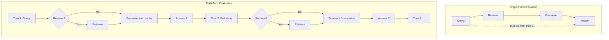

The [previous post]() covered how to evaluate a single RAG interaction: retrieval quality metrics, faithfulness detection, answer relevance, and LLM-as-judge methodology. All of those metrics assume a single turn: one query, one retrieval, one generation. This post addresses what happens when RAG systems operate over multiple turns, make autonomous decisions about when and what to retrieve, and must maintain coherence across an extended interaction.

Multi-turn RAG evaluation is largely unsolved. The metrics from Part 1 do not extend cleanly to trajectories. This post surveys what benchmarks exist, what they reveal about current system capabilities, and what evaluation gaps remain open.

---

## 1. Why Single-Turn Metrics Break Down

Single-turn evaluation decomposes neatly into the three edges described in Part 1: retrieval quality, faithfulness, and answer relevance. Each edge is evaluated independently for one query-response pair.

Multi-turn and agentic RAG systems make this decomposition insufficient for three reasons:

**Decisions compound across turns.** A poor retrieval in turn 2 may not matter if turn 3 reformulates the query and retrieves correctly. Conversely, a good retrieval in turn 1 may become stale by turn 5 if the conversation shifts topic. Evaluating each turn independently misses these dependencies.

**The system decides when to retrieve.** In agentic RAG (Self-RAG, FLARE, Adaptive-RAG), the system chooses whether to retrieve at each step or rely on cached context. This retrieval decision is itself a dimension that needs evaluation, and no single-turn metric captures it.

**Coherence is a trajectory-level property.** The system may answer each individual turn correctly while contradicting itself across turns, or retrieving conflicting documents at different points without acknowledging the conflict.

The evaluation question shifts from "Was this retrieval good?" to "Across a trajectory of decisions (when to retrieve, what to retrieve, how to reformulate, when to stop), did the system behave well?"

---

## 2. Existing Benchmarks for Multi-Turn and Agentic RAG

### 2.1 tau-bench (Yao, Shinn, Razavi, Narasimhan; 2024)

The most rigorous attempt at agentic evaluation to date. tau-bench emulates dynamic user-agent conversations with domain-specific API tools and policy guidelines.

**Setup:** An agent interacts with a simulated user over multiple turns, using tools (APIs) to accomplish tasks while following domain policies. The domains are airline customer service and retail customer service.

**Evaluation approach:** Compares the database state at conversation end with an annotated goal state. This is outcome-based evaluation. It does not score individual turns or retrieval decisions. It only asks: "Did the agent achieve the correct final result?"

**Novel metric, pass^k:** Measures reliability across $k$ independent trials. If you run the same conversation $k$ times, what fraction of the time does the agent succeed?

$$\text{pass}^k = \frac{\text{Number of successful trials}}{k}$$

The motivation: a system that succeeds 50% of the time on a single run is unreliable for production deployment. pass^k quantifies this inconsistency.

**Results:**

| Model | pass^1 (Airline) | pass^1 (Retail) |
|-------|------------------|-----------------|
| GPT-4o | ~50% | ~50% |
| GPT-4o (pass^8) | — | <25% |
| Claude 3.5 Sonnet | ~45% | ~45% |

Even frontier models succeed less than half the time on individual tasks. With the pass^8 metric (must succeed on all 8 independent runs of the same task), reliability drops below 25%. The paper's conclusion: agents are "quite inconsistent."

**What tau-bench evaluates well:**
- End-to-end task completion
- Policy adherence (does the agent follow domain rules?)
- Reliability across repeated runs

**What tau-bench does not evaluate:**
- Which specific turn caused a failure
- Whether retrieval decisions were optimal
- Whether the agent's reasoning trajectory was efficient
- Partial credit for nearly-correct outcomes

### 2.2 FRAMES (Krishna et al., NAACL 2025)

Factuality, Retrieval, And reasoning MEasurement Set. FRAMES tests multi-hop questions that require integrating information across multiple retrieval sources.

**Setup:** Each question requires evidence from multiple documents. A system must retrieve the right set of documents and synthesize information across them.

**Results:**
- 0.40 accuracy with no retrieval (LLM parametric knowledge alone)
- Multi-step retrieval pipeline achieves 0.66 (65% relative improvement)

**What FRAMES contributes:** It demonstrates that multi-step retrieval pipelines significantly outperform single-pass retrieval for complex questions. It evaluates the factuality of the final answer jointly with retrieval quality.

**Limitation:** FRAMES tests multi-hop reasoning but not multi-turn interaction. The system receives one question and must retrieve multiple times to answer it. There is no simulated user providing follow-up queries or changing requirements mid-conversation.

### 2.3 SummHay (Laban et al., 2024)

Tests RAG on query-based summarization with citation across document "haystacks" (large collections where relevant information is sparse).

**Results:**
- Human performance estimated at 56% (joint coverage + citation score)
- Without a retriever, GPT-4o and Claude 3 Opus score below 20%
- Oracle retrieval systems (perfect retrieval) still lag human performance by 10+ points

**What SummHay reveals:** Even with perfect retrieval, current LLMs struggle to produce well-cited summaries from large document collections. The generation step is a bottleneck independent of retrieval quality. It also demonstrates position bias in long-context retrieval: relevant documents placed in the middle of a long context are more likely to be ignored.

### 2.4 RAGAS Agent Metrics

RAGAS has introduced metrics specifically for agentic systems:

| Metric | What It Measures |
|--------|-----------------|
| Topic Adherence | Does the agent stay on task across turns? |
| Tool Call Accuracy | Are tool invocations correct (right tool, right parameters)? |
| Tool Call F1 | Precision and recall of tool calls vs. expected tool calls |
| Agent Goal Accuracy | Does the agent achieve its intended goal? |

These are early-stage and have not been validated against human judgment at scale. They represent a direction rather than an established methodology.

---

## 3. What No Benchmark Evaluates

The existing benchmarks leave significant gaps. The following evaluation dimensions have no established methodology:

### 3.1 Retrieval Timing

Was the agent's decision to retrieve (vs. use cached context) optimal at each turn?

In agentic RAG systems (Self-RAG, FLARE, DeepRAG), the agent decides at each step whether to trigger retrieval or rely on what it already knows. Over-retrieval adds noise and latency. Under-retrieval causes hallucination. The optimal policy depends on the query complexity, the freshness of cached context, and the agent's confidence.

No benchmark measures this. tau-bench evaluates outcomes but cannot distinguish "retrieved too often" from "retrieved optimally." A system that retrieves at every turn and a system that retrieves only when needed score identically if they both reach the correct final state.

### 3.2 Trajectory Efficiency

Was the sequence of queries, reformulations, and tool calls efficient, or did it waste turns?

Two systems might both succeed at a task, but one takes 3 turns while the other takes 12. In production, efficiency matters: more turns means more latency, more token cost, and more user waiting time. No benchmark penalizes inefficient trajectories that nonetheless arrive at the correct outcome.

### 3.3 Graceful Degradation

When the system cannot answer, does it fail transparently or hallucinate confidently?

The RGB benchmark (Chen et al., AAAI 2024) showed that LLMs "still struggle significantly" with negative rejection. When no relevant context is retrieved, systems generate plausible-sounding but fabricated answers rather than acknowledging uncertainty. In a multi-turn setting, this failure compounds: a confident wrong answer in turn 2 may cause the user to build on incorrect information in turns 3-5.

### 3.4 Cross-Turn Coherence

Does information retrieved in turn 3 remain consistent with what was established in turn 1?

A multi-turn system may retrieve different documents at different turns that contain contradictory information. If the user asks a follow-up question, the system might give an answer inconsistent with its previous response because it now has different context. No metric evaluates whether the system maintains a coherent worldview across turns or acknowledges when new evidence contradicts earlier statements.

### 3.5 Context Accumulation Quality

As the conversation progresses, the context window fills with prior turns, retrieved documents, and generated responses. The system must decide what to keep, compress, or discard. Poor context management leads to:
- Relevant early information being pushed out of the window
- Irrelevant retrieved passages from earlier turns polluting the context
- The LLM attending to stale information when newer information is available

No benchmark evaluates the quality of context accumulation decisions over a long conversation.

---

## 4. Outcome-Based vs. Process-Based Evaluation

The benchmarks in Section 2 reveal a fundamental design choice in multi-turn evaluation:

**Outcome-based evaluation** (tau-bench): Judge only the final result. Did the agent achieve the goal?

**Process-based evaluation**: Judge the trajectory. Were individual decisions (retrieval timing, query reformulation, tool selection) good?

| Approach | Strength | Weakness |
|----------|----------|----------|
| Outcome-based | Simple to define. Aligns with user experience. Does not require annotating intermediate steps. | Cannot diagnose where failures occur. Two very different trajectories (efficient vs. wasteful) score identically if both succeed. |
| Process-based | Enables debugging. Can reward partial progress. Identifies which component failed. | Requires annotating "correct" intermediate decisions, which is expensive and often ambiguous. Multiple valid trajectories may exist for the same task. |

tau-bench chose outcome-based evaluation because it avoids the annotation problem: there is no need to define what the "correct" retrieval at turn 3 should have been. The tradeoff is that it cannot explain *why* an agent failed or distinguish efficient from inefficient success.

A hybrid approach would evaluate outcomes for pass/fail determination and process for diagnostic purposes. This is analogous to how software testing uses integration tests (outcome) alongside unit tests (process).

---

## 5. The Consistency Problem

tau-bench's pass^k metric reveals a problem that single-turn metrics do not capture: **non-determinism in agent behavior.**

A single-turn RAG system with temperature=0 produces the same output for the same input. But multi-turn agents face compounding non-determinism:
- Each turn's generation is stochastic
- Retrieval results may vary (index updates, embedding model non-determinism)
- The agent's decision at turn $t$ depends on all previous turns, so small variations cascade

pass^8 below 25% means that even if a system succeeds on any single attempt, you cannot rely on it to succeed consistently. For production deployment, this has direct implications: you need retry mechanisms, fallback strategies, or human-in-the-loop escalation for low-confidence interactions.

No current framework measures *why* the agent fails differently across runs. Is it retrieval non-determinism? Generation sampling? Different user simulator responses? Decomposing the sources of inconsistency remains an open research problem.

---

## 6. What Remains Unsolved

### 6.1 Reasoning Evaluation

A system can retrieve the right passages, cite them faithfully, and still draw a wrong conclusion. No automated metric catches logical errors reliably.

The faithfulness metrics from Part 1 (Section 3) verify that claims are *attributed* to context. They do not verify that the *inference* connecting claims is valid. Example: context says "revenue was $10M in 2023" and "revenue was $8M in 2022." A response stating "revenue grew by 50%" is faithful (both numbers are attributed) but arithmetically wrong.

In multi-turn settings, reasoning errors compound. An incorrect inference in turn 2 may become the premise for turn 3's reasoning, leading to a cascade of plausible-sounding but wrong conclusions.

### 6.2 Temporal Validity

Retrieved content may be factually correct per the source document but outdated. No standard metric checks freshness against the question's temporal requirements.

Example: "What is the current population of Austin, Texas?" retrieves a 2020 Census document. The answer is grounded and faithful to that document, but wrong because the question asks about current state, and the population has changed significantly.

In multi-turn settings, this problem intensifies when different turns retrieve documents from different time periods. The system may present 2020 data in turn 1 and 2024 data in turn 3 without acknowledging the discrepancy.

### 6.3 The Hallucination Floor

"Evaluating Verifiability in Generative Search Engines" (Liu, Zhang, Liang; EMNLP 2023) found only 51.5% of generated sentences in production systems like Perplexity and Bing Chat were fully supported by their citations. The long tail of subtle factual errors appears resistant to current mitigation techniques.

This finding applies to single-turn systems. For multi-turn systems, the problem is worse: errors from earlier turns may propagate and amplify through subsequent interactions, and there is no established methodology for measuring hallucination rates across trajectories.

### 6.4 Evaluation Cost at Scale

LLM-as-judge on every production query is expensive. Fine-tuned classifiers (Section 6 of Part 1) are cheap but require upfront investment. For multi-turn systems, the cost multiplies: evaluating a 10-turn conversation requires scoring 10 retrievals and 10 generations, plus trajectory-level assessments.

The economics of continuous multi-turn evaluation remain challenging. Sampling strategies (evaluate a random subset of conversations) introduce statistical uncertainty. Exhaustive evaluation is prohibitively expensive for high-traffic systems.

### 6.5 No Ground Truth for Trajectories

For single-turn RAG, a reference answer provides ground truth: the system should produce something semantically equivalent to the reference. For multi-turn interactions, there is no equivalent concept. The same goal can be achieved through many valid trajectories. Annotating "the correct sequence of retrievals and responses" is both expensive and underdetermined.

tau-bench sidesteps this by only checking the final database state. But this means it cannot provide learning signal for intermediate decisions. Training better multi-turn agents requires trajectory-level feedback that does not yet have a scalable annotation methodology.

---

## 7. Directions for Future Work

Based on the gaps identified above, several research directions appear promising:

**Trajectory-level reward models.** Rather than scoring individual turns, train a model to score entire conversation trajectories. This could enable RL training of agentic RAG systems with trajectory-level feedback, analogous to how RLHF trains single-turn models with response-level feedback.

**Decomposed consistency testing.** Run the same conversation $k$ times (as tau-bench does) but log detailed intermediate states. Compare retrievals, decisions, and intermediate outputs across runs to identify the primary sources of inconsistency.

**Temporal grounding evaluation.** Augment retrieval corpora with publication dates. Evaluate whether the system retrieves temporally appropriate documents given the question's time reference, and whether it acknowledges temporal limitations.

**Efficiency-aware evaluation.** Extend outcome-based benchmarks with cost metrics: number of retrieval calls, total tokens consumed, number of turns to resolution. Define efficiency frontiers (Pareto curves of accuracy vs. cost) rather than optimizing accuracy alone.

**Process supervision for RAG.** Analogous to process reward models in mathematical reasoning (PRM800K), develop annotations of "correct intermediate retrieval decisions" for multi-turn RAG tasks. This would enable process-based training and evaluation but requires solving the annotation methodology problem.

---

## References

| Paper | Venue/Year | Key Contribution |
|---|---|---|
| Yao et al., "tau-bench" | 2024 | Agentic evaluation with pass^k reliability metric |
| Krishna et al., "FRAMES" | NAACL 2025 | Multi-hop factuality + retrieval + reasoning |
| Laban et al., "SummHay" | 2024 | Query-based summarization with citation in document haystacks |
| Chen et al., "RGB" | AAAI 2024 | Noise robustness, negative rejection, counterfactual robustness |
| Liu, Zhang, Liang, "Evaluating Verifiability in Generative Search Engines" | EMNLP 2023 | Only 51.5% of sentences fully citation-supported |
| Asai et al., "Self-RAG" | 2023 | Reflection tokens for adaptive retrieval decisions |
| Jiang et al., "FLARE" | EMNLP 2023 | Forward-looking active retrieval on low confidence |
| Guan et al., "DeepRAG" | 2025 | Retrieval decision modeled as MDP |
