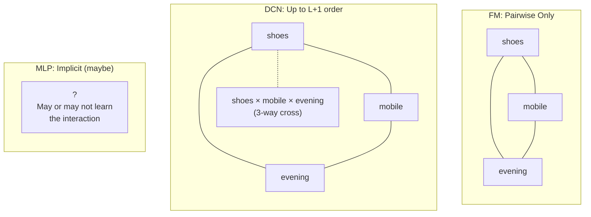
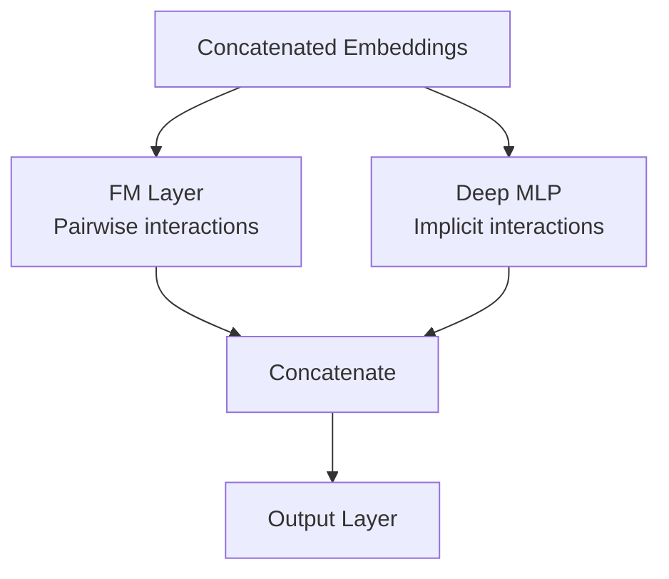
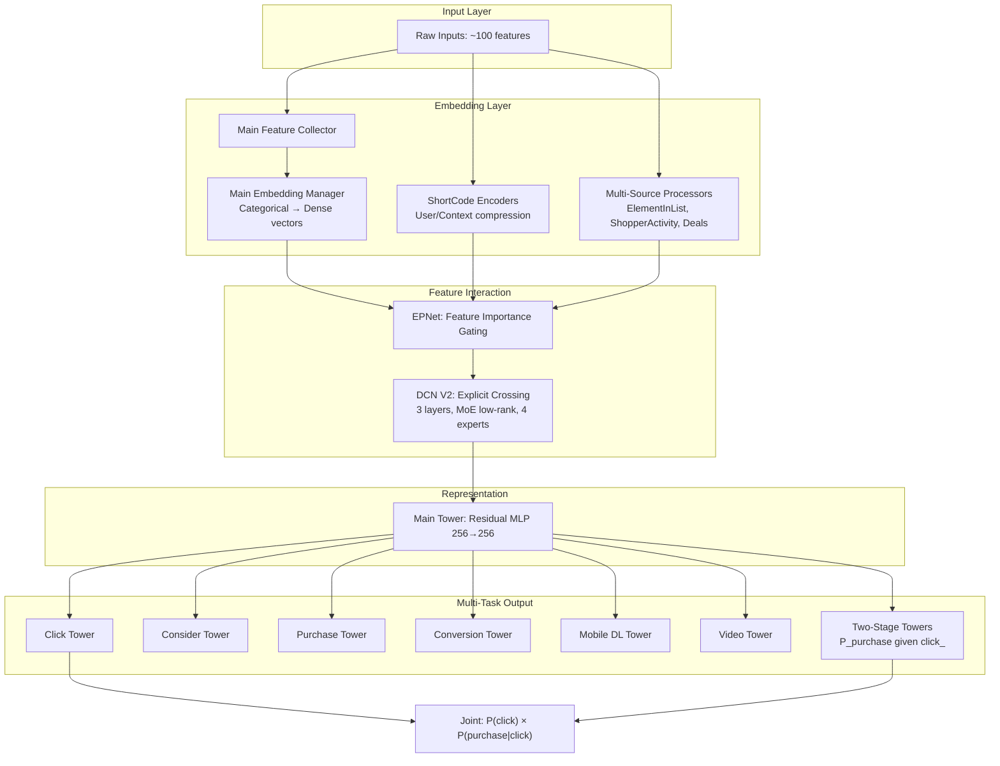
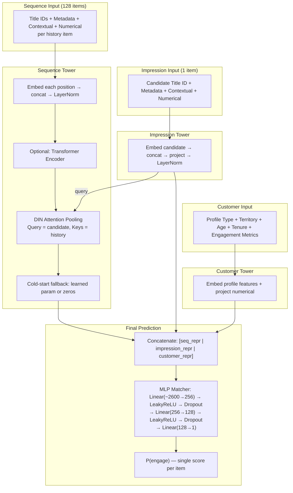
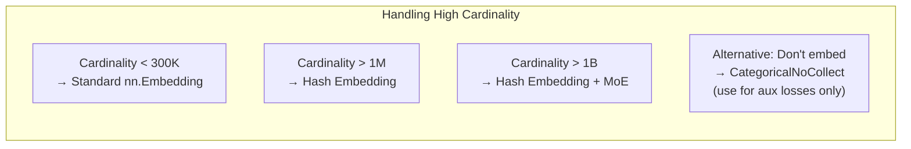

Ranking models sit at the heart of every recommendation system, ad platform, and search engine. Given a user, a set of candidate items, and some context, the model's job is to predict how likely the user is to engage with each item — then sort by that score. This post presents a taxonomy of deep learning components used in production ranking systems, mapping each concept to the problem it solves, the alternatives available, and the tradeoffs involved.

The material draws on three sources: a textbook treatment of ad click prediction (ML system design), a production ad click prediction system using multi-task DCN architecture, and a production video recommendation system using DIN architecture with attention over viewing history. Together they span the full spectrum from conceptual foundations to production design patterns.

## The Core Pipeline

Every ranking model follows the same high-level data flow:


Each stage transforms data into a progressively more useful form:

**Raw Features → Input Representation.** The system receives heterogeneous raw data about the user, the candidate item, and the current context — things like user IDs, item categories, device type, time of day, and behavioral histories. This stage converts each raw feature into a fixed-size numeric vector. Categorical features (like `genre=action`) become dense embeddings; numerical features get normalized or projected; variable-length sequences (like viewing history) get encoded into fixed-size representations. The output is a collection of dense vectors, one per feature or feature group.

**Input Representation → Feature Interaction.** Individual feature vectors are informative but limited — the real predictive signal often lives in *combinations* of features. This stage models how features relate to and combine with each other. It might compute explicit polynomial crosses (DCN), learn pairwise interactions through latent factors (FM), or use attention to dynamically weight sequence elements based on the candidate item (DIN). The output is an enriched vector where feature combinations have been made explicit.

**Feature Interaction → Representation Learning.** The enriched feature vector passes through one or more layers of nonlinear transformation (typically residual MLPs) that compress and distill the signal into a compact, task-relevant representation. In multi-tower architectures, different feature groups may be processed by separate towers before being concatenated. The output is a single dense vector (e.g., 256 dimensions) that summarizes everything the model knows about this user-item-context triple.

**Representation Learning → Output / Prediction.** The compact representation is mapped to the final prediction — typically a probability between 0 and 1 indicating how likely the user is to engage. In single-task systems, this is one linear layer plus a sigmoid activation. In multi-task systems, the shared representation fans out into multiple task-specific towers, each producing its own probability (click, purchase, conversion, etc.).

**Output / Prediction → Loss & Optimization.** During training, predicted probabilities are compared against actual outcomes (did the user click or not?) using a loss function — most commonly binary cross-entropy. The loss quantifies how wrong the prediction was, and gradient-based optimization adjusts all learnable parameters across every prior stage simultaneously to reduce this error. This end-to-end training is what distinguishes deep learning from traditional pipelines where each stage is optimized independently. See Part 6 for details on exactly what gets updated at each stage.

The research debate — and where architectures diverge — is overwhelmingly concentrated at the **Feature Interaction** stage. Everything else (embeddings, MLPs, BCE loss, AdamW) is relatively settled. The innovations from 2016 to 2024 are different answers to one question: *how should features talk to each other before we make a prediction?*

---

## Part 1: Input Representation

A single ad impression or video recommendation request carries dozens to hundreds of signals: the advertiser's identity, the user's device, the product category, the price, the time of day, and the user's entire click or viewing history from the past week. These signals arrive in fundamentally different forms — some are discrete labels with no numeric meaning, some are continuous measurements at wildly different scales, and some are variable-length sequences of past events. The input representation stage converts all of them into a uniform format the model can process: fixed-size dense vectors of floating-point numbers.

This stage is where the model's "vocabulary" is defined. Every categorical value the system has ever seen gets an entry in an embedding table. Every numerical feature gets a scaling rule. Every sequence gets a length limit and an aggregation strategy. The quality of these representations sets a ceiling on everything downstream — a poorly encoded feature cannot be rescued by a brilliant interaction module later.

### 1.1 Categorical Encoding

**The problem:** Features like `genre=action` or `advertiser_id=38271` are discrete symbols with no inherent numeric meaning. A neural network operates entirely through arithmetic — addition, multiplication, comparison of numbers. A discrete label like "action" or "advertiser #38271" has no numeric form the network can compute with. Before the model can process these features at all, they must be converted into numbers — and the choice of *how* to convert them has major consequences for what the model can learn.

**The abandoned approach — One-Hot Encoding:**

For a feature with vocabulary size $V$, one-hot produces a binary vector of length $V$ with a single 1 at the feature's index. For example, if there are 20,000 unique advertisers in the system:

$$\text{one\_hot}(\text{advertiser\_id}=7823) = [0, 0, \ldots, \underbrace{1}_{\text{index 7823}}, \ldots, 0] \in \mathbb{R}^{20000}$$

With 100 such features, the input vector reaches millions of dimensions, almost entirely zeros. The first layer would need millions of parameters, most learning nothing because their corresponding input is permanently zero.

**The standard approach — Learned Embeddings:**

Replace the sparse lookup with a dense one. Store a trainable matrix $E \in \mathbb{R}^{V \times d}$ where $d \ll V$. The forward pass is a simple index operation:

$$\text{embed}(\text{advertiser\_id}=7823) = E[7823] \in \mathbb{R}^{12}$$

This is mathematically equivalent to one-hot times a weight matrix — selecting row 7823 — but without constructing the sparse vector or performing the multiply-by-zero.

```python
# Integer in → dense vector out
embedding = nn.Embedding(num_embeddings=20001, embedding_dim=12)
output = embedding(torch.tensor([7823]))  # → tensor of shape [12]
```

**Why embeddings are powerful beyond efficiency:**

1. **Semantic similarity emerges.** "Nike" and "Adidas" learn similar vectors because they appear in similar contexts. One-hot treats them as maximally distant.
2. **Generalization to rare IDs.** A rare advertiser sharing context with common ones benefits from the shared representation structure.
3. **Composability.** Dense vectors can be concatenated, added, attended over, or crossed — enabling the entire downstream architecture.

**Embedding dimension selection** follows a logarithmic heuristic:

| Vocabulary Size | Embedding Dim | Rationale |
|----------------|---------------|-----------|
| $\leq 10$ | 8 | Very few values, minimal information content |
| $\leq 50$ | 16 | Small set, moderate capacity needed |
| $\leq 1000$ | 32 | Standard categorical features |
| $\leq 20000$ | 64 | Medium-cardinality features |
| $> 20000$ | 128-256 | High-cardinality (title IDs, product IDs) |

Production systems make different choices based on their total feature count. A system with 100+ categorical features (ad prediction) uses small dimensions (4-16) to keep the concatenated vector manageable, relying on feature interaction modules (FM, DCN) to build expressiveness from combinations. A system with fewer features (video recommendation, ~65 categorical) can afford larger dimensions (up to 256) for richer individual representations.

**Examples from production systems:**

| Role | Feature | Cardinality | Embedding Dim | System |
|------|---------|-------------|---------------|--------|
| Item | `ad_id` | 300,000 | 8 | Ad prediction |
| Item | `title_id` (content ID) | ~2,000,000 | 256 | Video recommendation |
| Item | `genre` | ~500 | 32 | Video recommendation |
| Advertiser | `advertiser_id` | 20,000 | 12 | Ad prediction |
| Advertiser | `campaign_id` | 100,000 | 12 | Ad prediction |
| User | `profile_type` | ~10 | 16 | Video recommendation |
| User | `territory_code` | ~5,000 | 64 | Video recommendation |
| Context | `device_type` | 11 | 4 | Ad prediction |
| Context | `day_of_week` | 7 | 8 | Video recommendation |
| Context | `slot_position` | 11 | 8 | Ad prediction |

The ad prediction system uses 85+ categorical features with small embeddings (4-16 dims); the video recommendation system uses 34 with larger embeddings (8-256 dims). These examples illustrate the range of cardinalities and dimension choices across different feature roles.

**Handling billion-scale cardinality:**

When vocabulary reaches billions (e.g., `customer_id` with 1 billion unique values), a standard embedding table of shape `(1B, 64)` requires ~256 GB of memory — far beyond a single GPU. This is a fundamental infrastructure problem that affects both training (the table must be updated by gradients) and inference (the table must be queried for each request). The industry has developed several approaches:

**Approach 1: Hash Embeddings (compress onto a single machine)**

Use $K$ hash functions to map each ID into a small set of tables, then combine the results through a learned MLP:

$$\text{hash\_embed}(id) = \text{MLP}\left(\text{concat}\left[T_1[h_1(id)],\ T_2[h_2(id)],\ T_3[h_3(id)]\right]\right)$$

Here $h_1, h_2, h_3$ are three different hash functions (each with different random seeds), and $T_1, T_2, T_3$ are three separate small embedding tables (each 10,000 rows × 16 dims). The process for a single ID:

```
ID = 500,000,000

Step 1: Hash the ID three ways into table indices (0 to 9,999):
  h_1(ID) = (a_1 × ID + b_1) mod prime mod 10000 = 7,231
  h_2(ID) = (a_2 × ID + b_2) mod prime mod 10000 = 3,894
  h_3(ID) = (a_3 × ID + b_3) mod prime mod 10000 = 9,102

Step 2: Look up each index in its corresponding table:
  T_1[7231] = [0.02, -0.14, ..., 0.08]   (16 dims)
  T_2[3894] = [0.11,  0.03, ..., -0.05]  (16 dims)
  T_3[9102] = [-0.07, 0.21, ..., 0.01]   (16 dims)

Step 3: Concatenate the three vectors:
  → [0.02, -0.14, ..., 0.08, 0.11, 0.03, ..., -0.05, -0.07, 0.21, ..., 0.01]  (48 dims)

Step 4: MLP projects to final output:
  MLP(48 → 64) → final embedding (64 dims)
```

The tables $T_1, T_2, T_3$ are standard `nn.Embedding` layers — initialized with small random values and **trained from scratch** alongside the rest of the model. They're not pretrained or provided externally. The only difference from a normal embedding is how you index into them: instead of using the original ID directly (which would require a 1B-row table), you use the hashed index (which only needs a 10K-row table). During training, gradients flow back through the lookup and update whichever row was accessed. The MLP is also trained from scratch. The entire hash embedding module learns end-to-end with the rest of the model.

This compresses 1B IDs into ~480K parameters (3 tables × 10K entries × 16 dims) versus 256 GB for a direct lookup. The ad prediction system uses this approach for two billion-scale features:

| Feature | Cardinality | Hash functions | Table size | Embedding dim | MLP → Target dim |
|---------|-------------|---------------|------------|---------------|-----------------|
| `customer_id` | 1,000,000,000 | 3 | 10,000 | 16 | 1-layer MLP → 64 |
| `page_asin` (product being viewed) | 1,000,000,000 | 3 | 10,000 | 16 | 1-layer MLP → 64 |

Each ID is hashed 3 ways, each hash indexes into a 10K-row table to retrieve a 16-dim vector, the three vectors are concatenated (48 dims), and an MLP projects to the final 64-dim output. Total parameters per feature: 3 × 10,000 × 16 + MLP weights ≈ 483K — allowing the full model to train on a single machine without distributed parameter server infrastructure.

The tradeoff is **hash collisions**: different IDs may map to the same table entries, forcing them to partially share representations. The MLP learns to disambiguate to some extent, but inherently loses per-ID precision compared to a dedicated row.

Variants include:
- **Bloom Embedding** — sum the $K$ lookups instead of concat + MLP (faster but less expressive)
- **Quotient-Remainder (QR) Embedding** (Meta, 2019) — decompose ID into quotient and remainder, look up two smaller tables, element-wise multiply. Memory: $2 \times \sqrt{V}$ instead of $V$.

The ad prediction system also experiments with QR embedding applied broadly across features:

| Feature | Cardinality | QR table size ($\approx\sqrt{V}$) | Embedding Dim |
|---------|-------------|----------------------------------|---------------|
| `ad_id` | 3,000,001 | ~1,732 per table | 8 |
| `campaign_id` | 1,000,001 | ~1,000 per table | 12 |
| `site_name` | 1,000,001 | ~1,000 per table | 8 |
| `brand_name` | 1,500,001 | ~1,225 per table | 16 |
| `page_asin_parent` | 10,000,001 | ~3,162 per table | 16 |

Unlike the hash embedding approach (reserved for billion-scale features), this experiment applies QR compression to *all* categorical features — even small ones — as a uniform memory reduction strategy.

**Approach 2: Distributed Embedding Tables (shard across many machines)**

Keep the full 1B-row table but partition it across dozens or hundreds of machines. Each machine holds a slice (e.g., rows 0-10M on machine 1, rows 10M-20M on machine 2). When a training batch needs the embedding for customer #500M, it fetches that row over the network from whichever shard holds it.

This is the approach used by Meta (in their DLRM system), Google, and TikTok for their largest recommendation models. It avoids hash collisions entirely — every ID gets its own dedicated embedding row — but requires:
- A **parameter server** infrastructure to coordinate reads/writes across shards
- High-bandwidth **network communication** during both training and inference
- Significantly more machines and operational complexity

Note: neither production system studied here uses distributed sharding — both fit on single training machines. This approach is documented from public papers (Meta's DLRM, Google's recommendations) as an industry alternative for organizations with the infrastructure to support it.

**Approach 3: Don't embed at all**

For some billion-scale features, the system may decide the per-ID signal isn't worth the cost of a full embedding. This is a deliberate design choice across the industry, not a compromise — it recognizes that for some features, a full embedding table doesn't justify its cost in memory, parameters, and training signal dilution.

This pattern appears in several forms:

- **Exclude from embedding entirely.** The ad prediction system marks certain features as `CategoricalNoCollect` — they never get embedded into the main trunk and are only used as inputs to lightweight processors or auxiliary modules:

  | Feature | Cardinality | How it's consumed instead |
  |---------|-------------|--------------------------|
  | `customer_id` | 1,000,000,000 | Fed to hash embedding module for shortcode generation |
  | `page_asin` | 1,000,000,000 | Fed to hash embedding module for shortcode generation |
  | `ad_asin` | 250,001 | Used by `ElementInList` membership checks |
  | `clicked_asins` (sequence) | 250,001 | Used by `ElementInList` ("is ad in click history?") |
  | `purchased_asins` (sequence) | 250,001 | Used by `ElementInList` ("is ad in purchase history?") |
- **Wide & Deep (Google, 2016).** Splits features into a "wide" path where sparse IDs are used for memorization via simple logistic regression (no learned dense embedding) and a "deep" path where features are embedded. The wide path captures specific ID-level patterns through cross-product features without ever learning a dense representation.
- **Frequency-based cutoffs.** Only embed IDs that appear more than $N$ times in training data. Everything below the threshold maps to a shared "rare" embedding or is excluded entirely. This avoids wasting parameters on IDs with too little training signal to learn meaningful representations.
- **Feature hashing to small buckets without learned embeddings.** Hash 1B IDs into 10K buckets and feed the bucket index directly to a linear layer as a sparse feature — a crude signal without the expressiveness of a learned embedding, but nearly free in memory and computation.

**When to use which:**

| Approach | Best when | Tradeoff |
|----------|-----------|----------|
| Hash embedding | Model must fit on a single machine; some collision noise is acceptable | Loses per-ID precision |
| Distributed sharding | Infrastructure budget available; per-ID precision matters (e.g., user personalization) | Network latency, operational complexity |
| Don't embed | Feature has too many values with too few observations each; not worth the cost | Loses direct representation entirely |
| Quotient-Remainder | Middle ground — moderate compression with less collision than hashing | Less expressive than full table, more than hash |

### 1.2 Numerical Encoding

**The problem:** Numbers like `price=29.99` or `watch_time=3600s` already are numbers — unlike categorical features, they don't need an embedding to become numeric. But they have a different problem: wildly different scales and distributions. If one feature ranges from 0 to 10 and another from 0 to 1,000,000, the model's optimization will be dominated by the larger-scale feature. More subtly, many numerical features in recommendation systems (view counts, stream volumes, revenue) follow power-law distributions where most values are small but rare outliers are enormous — raw values would give extreme outliers disproportionate influence on training.

#### Approach 1: Direct input with normalization

The simplest approach: apply a mathematical transformation to bring the feature into a well-behaved range, then pass the single float directly to the model.

For count-based and volume-based features, the most common approach combines two steps: a **log transform** to compress the power-law distribution, followed by **z-score normalization** to center at zero with unit variance:

```
Raw stream_volume_7d values:      [0, 3, 12, 47, 1580, 892341]
Step 1 — log(x + 1):             [0, 1.4, 2.6, 3.9, 7.4, 13.7]
Step 2 — z-score normalize:      [-0.9, -0.6, -0.4, -0.1, 0.7, 2.2]
```

The `+1` inside the log handles zero values (log(0) is undefined). Step 1 compresses the long tail so that 892,341 and 1,580 are no longer 500x apart. Step 2 brings the result into a standard range so it's comparable to other features. The video recommendation system applies both steps to all its popularity and engagement metrics — `title_stream_volume_log_7d_normalized` encodes exactly this two-step process.

Log transform is the right choice for power-law features, but not every numerical feature follows a power law. Production systems support a toolkit of transformations, applied in up to two steps:

**Step 1 (optional): Compress the distribution**

| Transform | Formula | When to apply |
|-----------|---------|---------------|
| Log | $\log(x + 1)$ | Power-law features (counts, volumes) — compresses long tail |
| Log10 | $\log_{10}(x + 1)$ | Same purpose, base-10 for interpretability |
| None | $x$ | Features without extreme skew |

**Step 2: Normalize the scale**

| Normalization | Formula | When to apply |
|---------------|---------|---------------|
| Z-score (standard) | $(x - \mu) / \sigma$ | Default — centers at 0, unit variance |
| Min-max | $(x - x_{min}) / (x_{max} - x_{min})$ | Bounded features where output in [0, 1] is desired |
| Robust | $(x - \text{median}) / \text{IQR}$ | Features with extreme outliers where mean/std are unreliable (viral content) |
| Scale factor | $x \times c$ | Manual rescaling by a domain-specific constant |

The most common combination in practice is **log then z-score** — that's what a feature name like `title_stream_volume_log_7d_normalized` encodes. But the two steps are independent: the ad prediction system applies log transform *inside the model* at forward time without a subsequent z-score normalization, while the video recommendation system applies both steps in *preprocessing* before data reaches the model.

The output is a single float per feature per sample: shape `[B, 1]`.

#### Approach 2: Bucketing → Embedding

Sometimes the relationship between a number and the prediction isn't smooth. A product priced at \$25 vs \$30 might behave similarly, but the jump from \$30 to \$200 changes user behavior entirely. Similarly, an item that's been live for 3 days vs 7 days is "new" either way, but the jump from 7 days to 365 days crosses a meaningful boundary from "new release" to "catalog title."

Bucketing discretizes the continuous value into a small number of bins, then embeds the bin index exactly like a categorical feature:

```
Raw price:        $29.99
Bucket boundaries: [0, 10, 25, 50, 100, 200, 500, 1000+]
Bucket index:     3  (the $25-50 range)
Embedding:        table[3] → dense vector [B, 8]
```

The ad prediction system uses `BucketedNumerical` for features where these nonlinear thresholds matter. The embedding for bucket 3 (\\$25-50) can learn a completely different representation from bucket 5 (\\$100-200), without assuming any smooth relationship between them.

The tradeoff: bucketing loses precision within each bin (\$26 and \$49 become identical) and requires choosing boundaries in advance. But it gives the model freedom to learn arbitrary nonlinear effects at each price tier.

#### Approach 3: Linear projection (grouped)

When you have many related numerical features — say, 23 different title popularity metrics across multiple time windows — passing each as an independent float creates a wide, sparse input where each individual number carries limited signal. A linear projection compresses the group into a learned dense representation:

```
Input: [stream_vol_1d, stream_vol_7d, stream_vol_28d, ..., runtime, days_live]
       → 23 floats, shape [B, 23]

Linear(23 → 32):
       → 32 floats, shape [B, 32]
```

The video recommendation system projects its 23 title numerical features into a 32-dim vector, and its 25 customer numerical features into another 32-dim vector. The projection layer learns which combinations of time-windowed metrics are informative — for example, it might learn that "high 7-day volume but low 365-day volume" (a recently trending title) is a useful signal worth encoding as a distinct direction in the 32-dim output.

This is more expressive than passing raw floats independently, because the linear layer can compute weighted combinations across the group. But it's simpler than bucketing each feature individually — it assumes the cross-feature relationships are roughly linear, which is reasonable for groups of metrics measuring the same underlying phenomenon at different time scales.

#### Approach 4: Per-feature MLP (nonlinear expansion)

The opposite problem from grouped projection: instead of compressing many related numbers into fewer dimensions, you want to *expand* a single important number into a richer representation that captures its nonlinear effects.

The ad prediction system gives each important numerical feature its own small residual MLP:

```python
ad_asin_glance_views = Numerical(
    in_dim=1,              # single raw number (product page view count)
    layers=[8, 8, 8],     # 3-layer residual MLP, width 8
    log_transform=True,    # log(x+1) applied first
    residual_layer=True,   # skip connections between layers
)
```

This takes a single float (e.g., "47,000 page views"), applies log transform, then passes it through a 3-layer residual MLP, outputting an 8-dimensional learned representation. Features like product price, review count, ordered units, and number of offers each get their own per-feature MLP with similar structure.

**Why expand 1 dimension into 8?** At first glance it seems paradoxical — how can you get more information out than you put in? The MLP isn't creating information from nothing. It's learning a **nonlinear basis expansion**: converting one number into multiple dimensions that each represent a different "region" or "aspect" of that number's meaning.

Here's what happens step by step:

```
Input x = log(47000 + 1) = 10.76  (single float)

Projection: Linear(1 → 8)
  = W × 10.76 + b      (W is 8 weights, b is 8 biases)
  → 8 different linear functions of the input
  → e.g., [3.2, -1.4, 0.8, 2.1, -0.3, 1.7, -2.5, 0.4]

ResidualLayer[0]: h = h + ReLU(BatchNorm(Linear(h)))
ResidualLayer[1]: h = h + ReLU(BatchNorm(Linear(h)))
ResidualLayer[2]: h = h + ReLU(BatchNorm(Linear(h)))
  → Each layer adds nonlinear transformations on top
  → After 3 layers, each of the 8 output dims is a different
    nonlinear function of the original number
```

The projection layer creates 8 *linear* functions of the input (8 different slopes and intercepts). Each residual layer then adds nonlinear transformations, mixing the 8 dimensions together. After 3 layers, the 8 output dimensions can encode different nonlinear responses to the original number — effectively learning a multi-dimensional response curve.

Why is this better than passing a single normalized float? With one float, the downstream layers can only multiply it by one weight per neuron — a single linear relationship. With 8 dimensions, the feature can simultaneously express that "the difference between 100 and 1,000 views matters a lot" (one dimension responds steeply in that range) while "the difference between 100,000 and 101,000 barely matters" (all dimensions are flat there). It's similar to bucketing (Approach 2), but instead of hand-designed bin boundaries, the MLP learns how to partition the number's meaning — and it does so smoothly, without the hard cutoffs that bucketing introduces.

The tradeoff is more parameters per feature (a 3-layer `[8,8,8]` MLP has ~200 parameters), which is why the ad system reserves this treatment for important product-level metrics rather than applying it to every numerical feature.

**Comparing Approach 3 and 4:**

| | Approach 3: Grouped projection | Approach 4: Per-feature MLP |
|---|---|---|
| Input | Many related features (23 floats) | One feature (1 float) |
| Operation | Single linear layer | Multi-layer residual MLP |
| Direction | Compression (23→32) | Expansion (1→8) |
| Learns | Cross-feature linear combinations | Per-feature nonlinear response |
| System | Video recommendation | Ad prediction |

**Examples from production systems, organized by approach:**

*Approach 1 — Direct input with transform + normalization (video recommendation system):*

| Feature | Transform | Normalization | Output | Notes |
|---------|-----------|---------------|--------|-------|
| `stream_volume_7d` | Log | Z-score | [B, 1] | Power-law count → compressed & centered |
| `cid_volume_365d` | Log | Z-score | [B, 1] | Long-term popularity signal |
| `completion_rate_365d` | None | Z-score | [B, 1] | Already bounded [0,1], no log needed |
| `runtime_for_completion` | Log | Z-score | [B, 1] | Episode length in seconds (skewed) |
| `days_live_on_platform` | Log | Z-score | [B, 1] | Freshness signal (heavy right tail) |

The video recommendation system uses 23 title numerical features and 25 customer numerical features, nearly all with log + z-score. These are individually passed as single floats — no MLP, no expansion. They are later grouped and projected together (Approach 3).

Notably, the ad prediction system has *no* Approach 1 features — every numerical feature goes through a per-feature MLP (Approach 4). This reflects a design philosophy: since categorical embeddings are 4-16 dimensions wide, numerical features are expanded to similar widths so they have comparable representational capacity in the concatenated vector.

*Approach 2 — Bucketing → Embedding (ad prediction system):*

| Feature | Raw value | Bucket boundaries | Embedding Dim | Notes |
|---------|-----------|-------------------|---------------|-------|
| `hour_of_day` | Unix epoch time | [0,1,2,...,23] (modulo 24) | 4 | Time is cyclical, not linear — embedding can learn "evening" as a concept |
| `day_of_week` | Unix epoch time | [0,24,48,...,144] (modulo 168) | 10 | Same raw input as hour, different modulo & buckets |
| `cart_since_activity` | Hours since last cart add | [1,2,4,8,12,24,48,72,168,336,720,1440,2160,4320,8760] | 8 | Logarithmically spaced — "1 hour ago" vs "1 year ago" are different bins |
| `purchase_since_activity` | Hours since last purchase | Same as above | 8 | Recency matters nonlinearly |
| `view_since_activity` | Hours since last page view | Same as above | 8 | Same pattern for different event types |

Note how `hour_of_day` and `day_of_week` are derived from the *same raw input* (epoch time) but bucketed differently. The logarithmic bucket spacing for recency features (1, 2, 4, 8, 12, 24, 48, ... hours) reflects that the difference between "1 hour ago" and "2 hours ago" matters more than "30 days ago" vs "31 days ago."

The video recommendation system uses Approach 1 + 3 for all its numerical features instead. Bucketing is primarily an ad prediction pattern, where discrete decision thresholds (time since last activity, hour of day) are more important than smooth popularity curves.

*Approach 3 — Linear projection, grouped (video recommendation system):*

| Feature group | Input features | Input dim | Output dim | What the group captures |
|---------------|---------------|-----------|------------|------------------------|
| Title numerical | stream volumes, cid volumes, popularity metrics, runtime, days_live | 23 | 32 | Compressed title popularity/freshness signal |
| Customer numerical | session counts, impression counts, playtime, playback counts (across 1d/7d/28d) | 25 | 32 | Compressed user engagement level |
| Cross numerical | per-user-title playback counts, completion rates, impressions (across time windows) | 26 | 32 | Compressed user-title affinity signal |

*Approach 4 — Per-feature MLP (ad prediction system):*

| Feature | in_dim | layers | log | Output dim | What it represents |
|---------|--------|--------|-----|-----------|-------------------|
*Expansion (1→N): single number → richer representation:*

| Feature | in_dim | layers | log | Output dim | What it represents |
|---------|--------|--------|-----|-----------|-------------------|
| `glance_views` (product page views) | 1 | [8,8,8] | Yes | 8 | Product traffic level |
| `ordered_units` | 1 | [8,8,8] | Yes | 8 | Purchase velocity |
| `best_price` | 1 | [8,8,8] | Yes | 8 | Price point |
| `avg_review` | 1 | [8,8,8] | No | 8 | Review quality (already bounded ~1-5) |
| `customer_review_count` | 1 | [4,4] | Yes | 4 | Review volume (less important, smaller MLP) |
| `num_offers` | 1 | [4] | No | 4 | Seller competition (single layer suffices) |
| `customer_total_clicks` | 1 | [8,8] | No | 8 | User click history volume |
| `cart_past_day` | 1 | [10,10] | No | 10 | Recent cart activity intensity |

Notice the design choices: features with log transforms are count-based with long tails (page views, ordered units, review counts). Features without log are already bounded or pre-normalized — e.g., `avg_review` is a 1-5 star rating that doesn't need compression. MLP depth scales with feature importance — 3 layers for key product metrics, 1-2 layers for secondary signals.

Note: some numerical features in the ad prediction system (like `gl_affinity_scores` at 21 dims and `view_embedding` at 64 dims) are pre-computed vectors from upstream models rather than raw measurements. These use same-size MLPs (21→21, 64→64) to adapt rather than expand. They are covered in Section 1.3 (Pretrained Representations) since their purpose is reusing an upstream model's output, not encoding a raw numerical signal.

### 1.3 Pretrained Representations

**The problem:** Training representations from scratch requires large amounts of task-specific data for each feature value. For high-cardinality features like product IDs or user IDs, the ranking model may only see each value a handful of times — not enough to learn a good embedding. But a separate, larger model (a product graph embedding, a user representation model, or a content understanding system) may have already trained high-quality representations for these same entities using a different objective and far more data. Throwing away that knowledge and starting from scratch wastes signal.

The solution is to reuse the upstream model's output as a starting point, while attaching a trainable MLP on top that adapts it for the ranking task. This pattern appears in two forms — one for categorical features (where the upstream representation is stored as a frozen embedding table indexed by ID) and one for numerical features (where the upstream representation arrives directly as a pre-computed float vector). Both follow the same principle: freeze the upstream signal, learn an adaptation layer.

#### Categorical pretrained: frozen lookup + projection

For categorical features like product IDs, a frozen embedding table stores the upstream model's representations. The ranking model looks up the ID, gets a fixed vector, and projects it through a trainable MLP:

$$\text{output} = \text{MLP}(\text{frozen\_embedding}[id])$$

The frozen table stays fixed during training (no gradient flows into it) while the projection MLP adjusts freely. At serving time, since the frozen embedding never changes, you can precompute `MLP(embedding[id])` for every ID in the vocabulary and store the result as a new, smaller embedding table — collapsing the two-step operation into a single direct lookup.

#### Numerical pretrained: pre-computed vector + transformation

For numerical features where an upstream model has already produced a dense vector (e.g., a 64-dim product view embedding or a 21-dim category affinity score vector), the vector arrives directly as a float tensor. A same-size residual MLP transforms it without changing dimensionality:

```python
view_embedding = Numerical(
    in_dim=64,              # pre-computed 64-dim vector from upstream model
    layers=[64, 64, 64],   # 3-layer residual MLP, same width
    residual_layer=True,    # skip connections preserve original signal
)
```

The residual connections are important here: they ensure the original upstream representation is preserved (through the skip path) while the MLP layers learn task-specific adjustments on top. Without residual connections, the MLP might destructively overwrite useful information from the upstream model.

**Examples from the ad prediction system:**

| Feature | Type | Frozen input dim | Trainable adaptation | Output dim | Upstream source |
|---------|------|-----------------|---------------------|-----------|----------------|
| Product ID | Categorical pretrained | 128 (frozen table lookup) | Down-projection MLP 128→16 | 16 | Product graph model |
| `view_embedding` | Numerical pretrained | 64 (pre-computed vector) | Residual MLP [64,64,64] | 64 | Product view co-occurrence model |
| `gl_affinity_scores` | Numerical pretrained | 21 (pre-computed vector) | Residual MLP [21,21] | 21 | Category affinity model |

**Why residual vs. non-residual adaptation?** The choice depends on whether the output dimension matches the input:

- **Same-size transformation (64→64):** The upstream model already produced a good representation. The goal is to *refine* it for the ranking task, not replace it. A residual path (`x + F(x)`) guarantees the original upstream signal is preserved — the MLP layers can only add adjustments on top. If the adaptation layers learn nothing useful, the output defaults to the original embedding unchanged. This is conservative by design: don't destroy good upstream signal.

- **Dimension reduction (128→16):** The goal is to *compress* — keeping only the aspects most useful for ranking while discarding the rest. There's no meaningful way to preserve the original when the output is 8x smaller. Residual connections are mechanically impossible here (you can't add a 128-dim vector to a 16-dim vector), but even conceptually, lossy compression is the intent.

Both patterns are used in the ad prediction system for features where a large upstream model has already learned high-quality representations. Rather than training from scratch with limited click data, the system reuses those vectors and learns only an adaptation layer on top.

The video recommendation system does not use pretrained representations in its current production model — all embeddings are trained from scratch end-to-end. It addresses the sparse-data problem through incremental training instead (loading the previous model checkpoint and continuing on fresh data). See Part 9.1 for a detailed comparison of these two approaches.

### 1.4 Multi-Source Computed Features

Consider the question: "Is the product in this ad something the user has clicked before?" Answering this requires looking at two separate raw inputs simultaneously — the ad's product ID and the user's click history sequence. Neither input alone carries the signal; it only emerges from their *combination*. Similarly, "How many times did this user click on anything in the last 60 minutes?" requires comparing a sequence of click timestamps against the current time — a temporal computation that spans two input fields.

These cross-input signals are too valuable to ignore, but too complex to express as a single raw feature in the input data. The ad prediction system handles them with **multi-source processors**: small learned modules that sit inside the model, consume multiple raw tensors, apply domain-specific logic (set membership, temporal windowing, time-gated masking), and output a dense vector that joins the rest of the features in the main pipeline.

Each processor follows a two-phase pattern: (1) domain logic computes a simple intermediate value from the raw inputs, then (2) a trainable `nn.Embedding` or MLP maps that value to a learned dense vector of the configured output dimension.

**Membership features (`ElementInList`):** "Is this ad's product in the user's recently-clicked products list?" The domain logic compares a single categorical ID against a sequence of IDs and produces a three-way integer: 0 (list is missing/empty), 1 (not in list), or 2 (in list). This integer then indexes into a trainable `nn.Embedding(3, 12)` — a tiny 3-row table that maps each membership status to a learned 12-dim vector. The model learns what "in list" *means* for prediction, rather than receiving a raw binary flag.

```
Inputs: ad_asin = 7823, clicked_asins = [42, 7823, 103, ...]
Domain logic: 7823 is in the list → integer 2
  (0 = history missing, 1 = not in list, 2 = in list)

Embedding table nn.Embedding(3, 12):
  row 0 (missing):     [0.01, -0.03, ..., 0.02]   ← used when history data unavailable
  row 1 (not in list): [0.15, -0.22, ..., 0.08]   ← used when product wasn't clicked before
  row 2 (in list):     [-0.31, 0.47, ..., -0.12]  ← used when product WAS clicked before

Lookup: index 2 → row 2 → [-0.31, 0.47, ..., -0.12]  (12 dims)
Output shape: [B, 12]
```

**Temporal activity features (`ShopperActivityEstimator`):** "How active was this user in the last 60 minutes?" The domain logic takes a sequence of click timestamps and the current bid timestamp, computes the time difference for each, and counts how many fall within the configured window (e.g., 60 minutes). This produces a single float (e.g., 7.0 — "7 clicks in the last hour"). That float is passed through a `NumericalEmbeddingModule(in_dim=1, layers=[5, 5])` — the same per-feature residual MLP described in Section 1.2 Approach 4 — producing a learned 5-dim vector.

```
Inputs: click_timestamps = [t1, t2, ..., t25], bid_time = now
Domain logic: count(now - t_i < 60 min) → 7.0
MLP: NumericalEmbeddingModule(1 → [5,5]) → learned 5-dim vector
Output shape: [B, 5]
```

**Time-gated attribute features (`DealsFeature`):** "What is the deal type for the currently active deal?" The domain logic takes deal start/end dates, the current time, and a sequence of deal attributes. It applies temporal masking (only deals where `start ≤ now ≤ end` are eligible), selects the first active deal, and extracts its attribute as an integer (e.g., deal_type=3). If no deal is active, the value is 0. This integer indexes into a trainable `nn.Embedding(max_values, 4)`, producing a learned 4-dim vector.

```
Inputs: deal_starts = [...], deal_ends = [...], now = current_time, deal_types = [2, 3, 1, ...]
Domain logic: find first deal where start ≤ now ≤ end → deal_type = 3

Embedding table nn.Embedding(7, 4):  (7 possible deal types, 4-dim output)
  row 0 (no active deal): [0.02, -0.01, 0.05, 0.03]
  row 1 (deal type 1):    [0.14, -0.08, 0.22, -0.11]
  row 2 (deal type 2):    [-0.06, 0.19, 0.01, 0.15]
  row 3 (deal type 3):    [0.31, -0.27, 0.09, 0.18]  ← this row is selected
  ...

Lookup: pass integer 3 into the table → returns row 3 → [0.31, -0.27, 0.09, 0.18]
Output shape: [B, 4]
```

In all three cases, the multi-source part is the domain logic (membership check, temporal counting, time-gated selection). The output dimension comes from the trainable layer at the end — an embedding table or MLP whose parameters are trained end-to-end with the rest of the model.

**Summary of multi-source processors in the ad prediction system:**

| Processor | Inputs | Output Dim | Instances | What each instance encodes |
|-----------|--------|-----------|-----------|---------------------------|
| `ElementInList` | 1 item ID + 1 ID sequence | 12 | 4 | One per combination: product×clicked, product×purchased, brand×clicked, brand×purchased |
| `ShopperActivityEstimator` | Timestamp sequence + current time | 5 | 3 | One per time window: 15 min, 60 min, 24 hours |
| `DealsFeature` | Deal start/end dates + current time + deal attributes | 4 | 5 | One per deal attribute: deal type, Prime access, discount, state, is featured |

These multi-source processors share a common pattern: they encode **domain-specific logic** (temporal windows, set membership, time-gating) that would be difficult for the main network to learn from raw features alone, especially from sparse training signal. They produce fixed-size dense vectors that are then concatenated alongside standard embeddings and fed into the feature interaction stage. The video recommendation system does not use multi-source processors — its equivalent signals (user-item affinity, temporal patterns) are captured through the DIN attention mechanism over rich sequences instead.

### 1.5 Multi-Value and Sequence Encoding

Users are not static profiles — they have histories. A video user might have watched 200 titles over the past year. An ad user might have clicked on 25 products this week. These behavioral histories are often the strongest predictor of future behavior: what you watched yesterday says more about what you'll watch tonight than your demographic profile or the current time of day.

These histories arrive as **lists of items** — variable-length (one user has 5 items, another has 200) and potentially ordered (watching A then B may mean something different from B then A). The model, however, requires a fixed-size vector as input to its downstream layers. So the list must somehow be compressed into a single dense representation — and the choice of *how* determines whether ordering, recency, and per-item relevance are preserved or lost. The design question is: **how much structure from the list do you want to preserve?**

The answer exists on a spectrum, from preserving nothing (treat as an unordered set) to preserving everything (full positional order + per-item relevance):

| Level | Approach | Preserves order? | Involves candidate? | Pipeline stage |
|-------|----------|-----------------|--------------------:|----------------|
| 1 | Set membership | No | **Yes** — checks if candidate is in history | Feature Interaction (Section 1.4) |
| 2 | Mean pooling | No | No — averages all items regardless | Input Representation |
| 3 | DIN attention | Partially (via temporal features per position) | **Yes** — candidate queries history | Feature Interaction (Part 2.3) |
| 4a | Transformer encoder | **Yes** — positional encoding + self-attention | No — history items attend to each other only | Input Representation |
| 4b | DIN attention (on enriched history) | **Yes** (inherits from 4a) | **Yes** — candidate queries enriched history | Feature Interaction (Part 2.3) |

Each step down costs more computation and parameters, but captures richer behavioral signal. Note that Levels 1, 3, and 4b involve the candidate item — they are technically **Feature Interaction** operations that also happen to produce a fixed-size vector from a list. Levels 2 and 4a are pure **Input Representation** — they process the history without any knowledge of what's being scored.

The two production systems sit at opposite ends: the ad prediction system uses Levels 1 and 2; the video recommendation system uses Level 4a+4b (or 3 alone when Transformer is disabled).

#### Level 1: Set Membership (candidate × history)

The cheapest approach: check whether the current candidate appears in the history list. This is what the ad prediction system's `ElementInList` does — fully covered in Section 1.4. The list is treated as an unordered set; its length, ordering, and other items are all ignored. Only the presence or absence of the candidate matters.

#### Level 2: Mean Pooling (history only, no candidate)

Embed each item in the list, then average all embeddings into a single vector. This captures *what kinds of items* are in the list (the average "flavor" of the user's history) but loses ordering entirely — `[A, B, C]` and `[C, A, B]` produce the same output. The candidate is not involved; the same pooled vector is produced regardless of what's being scored.

| Feature | Length | Content | Output |
|---------|--------|---------|--------|
| `user_behavior_segments` | 50 | Behavioral segment IDs | Embed each → average → 12-dim vector |
| `ad_sourcing_algos` | 50 | Which algorithms sourced past ads | Embed each → average → 12-dim vector |

The ad prediction system uses this for features where the *composition* of the set matters (what segments does this user belong to?) but the *order* does not.

#### Level 3: DIN Attention (candidate × history)

Embed each item in the list, then weight each by its **relevance to the current candidate** before summing. This captures which specific history items matter for *this particular prediction* — unlike mean pooling where all items contribute equally regardless of what's being scored.

This is the video recommendation system's primary approach. The candidate title's embedding serves as a "query" that scores each history position. Crime thrillers in the history get high weight when scoring a new detective series; cooking shows get high weight when scoring a food documentary. The same user gets a different representation for each candidate.

DIN attention alone does not capture **positional order** — it doesn't inherently know whether an item was watched yesterday or six months ago. The video system compensates by including temporal context features (like `hour_type` and `day_of_week`) per position, giving the attention mechanism indirect access to recency information.

The mechanics of DIN attention (scoring function, softmax, weighted sum) are covered in detail in Part 2, Section 2.3.

#### Level 4: Transformer Encoder → then DIN Attention (full sequential structure)

Two separate steps chained together, each doing a different job:

**Step 4a: Transformer encoder (history only — no candidate involved).** Each history position attends to every other position, enriching its representation with context from surrounding items. This captures sequential patterns that DIN alone cannot: "users who watch A then B behave differently than those who watch B then A," or "a burst of similar titles followed by a genre switch signals exploration." Positional encoding gives the model explicit awareness of where each item sits in the sequence. The output has the same shape as the input: `[B, 128, D]` — one enriched vector per position. The candidate is not involved.

**Step 4b: DIN attention (candidate × enriched history).** The same Level 3 operation, applied to the Transformer-enriched positions. The candidate scores each enriched position by relevance, and the weighted sum produces the final fixed-size vector.

```
History [B, 128, D] → Step 4a: Transformer (self-attention, no candidate)
                     → Enriched history [B, 128, D]
                     → Step 4b: DIN Attention (candidate queries history)
                     → Single vector [B, D]
```

The video recommendation system supports Transformer encoding as an optional configuration (`use_transformer: true`), stacking it before DIN attention for maximum expressiveness at the cost of significantly more computation.

#### Per-Position Richness: Simple IDs vs. Full Feature Vectors

Orthogonal to the aggregation strategy is how much information each position carries. The two production systems take opposite extremes on this dimension.

**Simple ID sequences (ad prediction system):** Each position is a single integer — one product ID, one segment ID, or one attribute value. There are no additional features per position. All sequence features in the ad prediction system follow this pattern:

*Consumed via set membership (Level 1 — fed to `ElementInList` in Section 1.4):*

| Feature | Length | Cardinality | Content |
|---------|--------|-------------|---------|
| `clicked_asins` | 25 | 250,001 | Product IDs the user recently clicked |
| `purchased_asins` | 25 | 250,001 | Product IDs the user recently purchased |
| `clicked_brands` | 25 | 150,001 | Brand IDs the user recently clicked |
| `purchased_brands` | 25 | 150,001 | Brand IDs the user recently purchased |

*Consumed via embed + mean pool (Level 2):*

| Feature | Length | Cardinality | Embedding Dim | Content |
|---------|--------|-------------|---------------|---------|
| `user_behavior_segments` | 50 | 20,001 | 12 | Behavioral segment IDs |
| `ad_sourcing_algos` | 50 | 100,001 | 12 | Which algorithms sourced past ads |
| `browse_node_ids` (ad product) | 8 | 50,001 | 16 | Product category hierarchy nodes |
| `browse_node_ids` (page product) | 8 | 50,001 | 16 | Page product's category hierarchy nodes |

*Consumed via temporal masking by `DealsFeature` processors (Section 1.4):*

| Feature | Length | Cardinality | Embedding Dim | Content |
|---------|--------|-------------|---------------|---------|
| `deal_type` | 50 | 7 | 8 | Deal types for multiple concurrent deals |
| `prime_access_type` | 50 | 7 | 8 | Prime access categories per deal |
| `deal_state` | 50 | 9 | 8 | State of each deal (active, upcoming, etc.) |
| `is_featured` | 50 | 5 | 8 | Whether each deal is featured |

Every sequence in the ad prediction system carries exactly one value per position — no metadata, no contextual features, no numerical attributes alongside it.

**Rich multi-feature sequences (video recommendation system):** The user's viewing history is stored as a sequence of up to 128 positions, where each position represents one title the user watched (position 1 = most recent, position 128 = oldest). Unlike the ad system's simple ID lists, each position carries ~52 features describing both the title and the context of viewing:

```
Position 47 in history:
  title_id = "The Grand Tour S3"
  genre = "automotive"
  language = "English"
  maturity_rating = "16+"
  stream_volume_7d = 4.2  (log-normalized popularity)
  device = "FireTV"
  hour_type = "evening"
  ... (~52 features total)
```

Each position gets its categorical features embedded and its numerical features projected (reusing the same techniques and embedding tables from Sections 1.1 and 1.2), then all are concatenated into a single per-position vector:

```
Per position: [title_id_emb(256) | genre_emb(32) | language_emb(32) | ... | num_proj(32)]
  → shape [B, 128, ~1200] (128 positions × ~1200 dims each)
```

**What each position carries in the video recommendation system:**

Each of the 128 positions in the user's history describes one viewing event with ~52 features. Think of it as a row in a table — every row has the same columns, but different values depending on what was watched:

| Column group | Count | What it describes | Examples of columns | How encoded per position |
|---|---|---|---|---|
| Title metadata (categorical) | 21 | What the user watched | title_id, genre_1, genre_2, genre_3, language, maturity_rating, country_of_origin, entity_type | Each column → embedding lookup (Section 1.1) |
| Viewing context (categorical) | 8 | When/where/how they watched it | geo_continent, device_class, hour_type, day_of_week, offer_group, audio_language | Each column → embedding lookup (Section 1.1) |
| Title popularity (numerical) | 23 | How popular the title was at viewing time | stream_volume_1d/7d/28d/91d/365d, cid_volume (×5 windows), runtime, days_live | All 23 → grouped linear projection (Section 1.2 Approach 3) |

All embeddings and projections for one position are concatenated into a single vector (~1200 dims), and this is repeated identically for all 128 positions, producing the final shape `[B, 128, ~1200]`.

This richness is what makes the higher-level aggregation strategies (DIN attention, Transformer) so expressive — when scoring "how relevant is history position #47 to the current candidate?", the model can compare across genre, language, popularity tier, device context, and time-of-day pattern simultaneously. A simple ID-only sequence could only compare title identity.

---

### From Individual Vectors to a Combined Input

At the end of Part 1, each feature has become a dense float vector — but they're still separate: the advertiser embedding is one vector, the region embedding is another, the user activity signal is a third. Before (or during) feature interaction, these must come together. How and *when* they come together is itself a design choice with real consequences:

**Concatenate first, then interact.** The ad click prediction system flattens all feature embeddings into a single vector (roughly 800-1200 dimensions) and then applies DCN and MLP on top. At this point, feature identity is lost — the model doesn't "know" that positions 0-11 came from an advertiser embedding and positions 12-19 from a region embedding. The interaction layers must discover useful relationships from position alone.

**Interact first, then concatenate.** The video recommendation system keeps features grouped into separate towers (sequence, impression, customer). DIN attention operates *between* the sequence tower and the impression tower while they are still distinct — the candidate item explicitly queries the history items, using their known roles. Only after attention produces a pooled sequence representation are the three tower outputs concatenated and fed into the final MLP.

This difference has direct implications for what kinds of interaction are possible. Structured interaction (attention, FM with per-field embeddings) requires features to retain their identity. Unstructured interaction (DCN on a flat vector, MLP) works after identity is lost but must rediscover structure from the data.

---

## Part 2: Feature Interaction — The Core Debate

This is where ranking model architectures diverge. The question: *how do you combine features so the model captures signal that lives in combinations rather than individual features?*

Consider: "mobile users browsing shoes in the evening" convert at a higher rate than any single feature predicts. The interaction between device, category, and time carries signal that none of them carry alone.

### 2.1 Implicit Interaction: Deep Networks

**The problem:** We don't know which interactions matter a priori.

**The goal:** Let the network discover useful combinations automatically through learned nonlinear transformations.

**Multi-Layer Perceptron (MLP):**

$$h_1 = \sigma(W_1 x + b_1), \quad h_2 = \sigma(W_2 h_1 + b_2), \quad \ldots$$

A universal approximator: given enough width and depth, it can represent any function. But it's inefficient at combinatorial patterns — it needs to "rediscover" feature crosses through training rather than computing them structurally.

**Residual MLP:**

$$h_{l+1} = h_l + F(h_l)$$

Same expressiveness, better optimization. The skip connection ensures gradients flow directly to early layers, making deep networks trainable. This is the workhorse of both production systems studied here.

**Weakness of implicit-only approaches:** MLPs may never learn certain sparse but important interactions, especially with limited data. A 3-way cross that's critical for 0.1% of traffic gets negligible gradient signal in a sea of other patterns.

### 2.2 Explicit Interaction: Structured Feature Crossing

**The problem:** Some interactions (pairwise products, higher-order polynomials) are known to be important in ranking systems, but MLPs learn them slowly if at all.

**The goal:** Force the model to compute specific types of feature combinations directly, then let the MLP learn what to do with them.

#### Factorization Machine (FM)

**Problem:** Computing all $\binom{n}{2}$ pairwise interactions explicitly requires $O(n^2)$ parameters and overfits with sparse data.

**Solution:** Give each feature a latent vector $v_i \in \mathbb{R}^k$. The interaction between features $i$ and $j$ is approximated by their dot product:

$$\hat{y}_{FM} = w_0 + \sum_{i=1}^{n} w_i x_i + \sum_{i=1}^{n} \sum_{j=i+1}^{n} \langle v_i, v_j \rangle x_i x_j$$

The key insight: the pairwise interaction matrix is factorized into low-rank form. Similar features get similar latent vectors, so their interactions generalize even with sparse observations.

**Complexity:** $O(nk)$ — linear in feature count, not quadratic.

**Limitation:** Only 2nd-order interactions. "mobile + shoes" is captured, but "mobile + shoes + evening" (3rd-order) is not.

#### Deep & Cross Network (DCN)

**Problem:** FM only captures 2nd-order interactions. We want higher-order crosses (3-way, 4-way) without exponential cost.

**Solution:** A "cross layer" that multiplies by the original input at every step, adding one degree of interaction per layer:

$$x_{l+1} = x_0 \odot f(x_l) + x_l$$

The element-wise multiply by $x_0$ is the key operation. After $L$ layers, the network has computed feature interactions up to degree $L+1$.

**DCN V1 (2017):** $f(x_l) = x_l^T w_l$ — a rank-1 projection (scalar gating):

```python
def forward(self, x0):
    x = x0
    for i in range(self.num_layers):
        xw = torch.matmul(x, self.weights[i])  # [batch, 1] — dot product
        x = x0 * xw + self.biases[i] + x       # cross + residual
    return x
```

Each layer: the dot product between current state and a learned weight produces a scalar, which gates the element-wise product with the original input. Simple, efficient, but limited expressiveness.

**DCN V2 (2021):** $f(x_l) = W_l \cdot x_l$ — a full $d \times d$ matrix (or low-rank MoE decomposition):

$$x_{l+1} = x_0 \odot (W_l x_l + b_l) + x_l$$

With Mixture-of-Experts low-rank decomposition, $W_l$ is factored as:

$$W_l = \sum_{e=1}^{E} g_e(x) \cdot U_e C_e V_e^T$$

where $g_e(x)$ is a learned gating function, and $U_e, C_e, V_e$ are low-rank expert matrices. This gives:
- **Low-rank:** Reduces parameters from $O(d^2)$ to $O(d \times r)$ per layer
- **MoE:** Different experts specialize in different interaction patterns
- **Nonlinearity:** $\tanh$ activations in the low-rank space add expressiveness

```python
# DCN V2 MoE forward pass
for l in range(self.num_layers):
    gate = softmax(self.gates[l](x))                  # [batch, E] — expert routing
    vx = tanh(einsum("bd,edr->ber", x, V_l))         # project to low-rank
    cx = tanh(einsum("ber,err->ber", vx, C_l))       # transform in low-rank space
    ux = einsum("ber,edr->bed", cx, U_l)             # project back
    mixture = (gate.unsqueeze(-1) * ux).sum(dim=1)   # weighted expert mixture
    x = x0 * (mixture + self.bias[l]) + x            # cross with original
```

#### Intuitive Comparison



#### DeepFM: FM + MLP in Parallel

The "best of both worlds" approach: FM handles explicit 2nd-order interactions while a parallel MLP captures implicit higher-order patterns:



### 2.3 Attention-Based Interaction

**The problem:** For sequence features, we need a *personalized, per-sample* interaction — not a global pattern applied to all users uniformly. Which items in THIS user's history are relevant to THIS candidate?

**The goal:** Learn position-specific weights that depend on both the history item and the current candidate.

#### DIN (Deep Interest Network)

The core idea: use the candidate item as a **query** against the user's history sequence. Items in the history that are similar to the candidate get high attention weights; dissimilar ones are effectively ignored.

**Scoring function (LocalActivationUnit):**

For each history item $h_t$ and candidate $c$:

$$\text{score}_t = \text{MLP}\left(\left[h_t;\ c;\ h_t \odot c;\ h_t - c;\ |h_t - c|\right]\right)$$

The input to the MLP contains five signals:
1. The history item itself
2. The candidate itself
3. Element-wise product (similarity in each dimension)
4. Difference (how they diverge)
5. Absolute difference (magnitude of divergence)

After computing scores across all positions:

$$\alpha = \text{softmax}(\text{scores}) \in \mathbb{R}^T$$

$$\text{user\_repr} = \sum_{t=1}^{T} \alpha_t \cdot h_t$$

The user representation is a weighted combination of their history, where the weights depend on what they're currently being shown.

**Why this is fundamentally different from FM/DCN:**

| | FM / DCN | DIN Attention |
|--|----------|---------------|
| Operates on | All features uniformly | Sequence positions selectively |
| Interaction pattern | Same for all samples | Per-sample, per-position |
| Captures | "Category X and time Y interact globally" | "THIS user's past action on similar items predicts engagement" |
| Computational pattern | Static polynomial | Dynamic, data-dependent |

---

## Part 3: Production Architectures

### Architecture A: Ad Click Prediction System



**Key design choices:**
- **100+ features with small embeddings (4-16 dim):** Parameter budget distributed across many features; expressiveness comes from DCN crossing.
- **Multi-task with 10 objectives:** Shared representation learns general patterns; task-specific towers specialize.
- **ShortCodes for serving efficiency:** Pre-compute user representation offline; only run main tower + output towers at inference time.
- **Two-stage conditional probabilities:** Models the purchase funnel explicitly: $P(\text{purchase}) = P(\text{click}) \times P(\text{purchase}|\text{click})$.

### Architecture B: Video Recommendation System



**Key design choices:**
- **Fewer features (65 categorical) with large embeddings (up to 256 dim):** Rich individual representations feed the attention mechanism.
- **Three separate towers:** Each feature group gets its own processing before combination. User history needs attention; candidate item doesn't.
- **DIN attention as the interaction mechanism:** Instead of DCN/FM operating on all features uniformly, attention creates per-sample, personalized feature interaction.
- **Single-task:** One probability per item. Simpler output, but the attention mechanism provides the richness.
- **Cold-start handling:** Learned fallback vector for new users with empty history.

### Side-by-Side Comparison

| Dimension | Ad Click Prediction System | Video Recommendation System |
|-----------|--------------------|--------------------|
| Architecture family | DCN + Multi-task | DIN + Three-tower |
| Number of features | ~100+ categorical | ~65 categorical |
| Embedding dims | Small (4-16) | Large (up to 256) |
| Feature interaction | DCN V2 (explicit polynomial) | DIN Attention (per-sample, data-dependent) |
| Sequence handling | Binary membership ("is item in history?") | Full attention over 128 items |
| Output | 10 probabilities (multi-task) | 1 probability (single-task) |
| Batch size | 65,536 | 1,024 |
| Training regime | 10 epochs on static data | 1 epoch incremental (continuous) |
| Serving optimization | ShortCode pre-computation | Incremental checkpoint loading |

---

## Part 4: The Complete Taxonomy

### Hierarchical Map

```
RANKING MODEL
├── 1. INPUT REPRESENTATION
│   ├── 1a. Categorical → Embedding (standard), Hash Embedding (billions), Pretrained
│   ├── 1b. Numerical → Direct, Bucketed, Projected
│   └── 1c. Sequence → Mean Pool, Attention Pool (DIN), Transformer, Binary Membership
│
├── 2. FEATURE INTERACTION ← where architectures diverge
│   ├── 2a. Implicit (MLP, Residual MLP)
│   ├── 2b. Explicit (FM: 2nd-order, DCN: higher-order, DeepFM: FM+MLP)
│   └── 2c. Attention-based (DIN: per-sample weighting, Self-Attention, Multi-Head)
│
├── 3. REPRESENTATION LEARNING
│   ├── 3a. Single shared tower (all features → one MLP)
│   ├── 3b. Multi-tower (separate processing per feature group)
│   └── 3c. Compression/ShortCode (pre-compute for serving)
│
├── 4. OUTPUT / PREDICTION
│   ├── 4a. Single-task (one probability)
│   └── 4b. Multi-task (shared repr → task-specific towers → multiple probabilities)
│       └── Two-stage: P(A∩B) = P(A) × P(B|A)
│
├── 5. LOSS FUNCTION
│   ├── 5a. Base: Binary Cross-Entropy
│   ├── 5b. Multi-task balancing: manual weights, uncertainty weighting, DWA
│   └── 5c. Sample weighting: class imbalance, value-weighted
│
└── 6. OPTIMIZATION
    ├── 6a. Optimizer: SGD, Adam, AdamW
    ├── 6b. LR Schedule: reduce-on-plateau, OneCycleLR (cosine)
    └── 6c. Regularization: Dropout, Weight Decay, Gradient Clipping
```

### Decision Framework

When encountering a new term, locate it in the taxonomy by asking:

1. **Which level?** (Input → Interaction → Representation → Output → Loss → Optimization)
2. **What problem does it solve at that level?**
3. **What are its siblings (alternatives solving the same problem)?**
4. **What is it trading off?**

| Term | Level | Problem | Alternatives | Tradeoff |
|------|-------|---------|--------------|----------|
| Embedding | 1a | Encode discrete symbols as dense vectors | One-hot, Hash embedding | Memory vs. expressiveness |
| FM | 2b | Learn pairwise feature interactions efficiently | DCN, DeepFM, MLP-only | Only 2nd-order, but parameter-efficient |
| DCN V2 | 2b | Explicit higher-order polynomial crosses | FM (2nd only), MLP (implicit) | More parameters than FM, but richer interactions |
| DIN | 2c | Personalized weighting of user history | Mean pooling, Transformer | More expensive than pooling, but per-sample adaptive |
| Multi-task towers | 4b | Predict multiple outcomes jointly | Single-task | Shared learning helps, but task conflicts possible |
| Residual MLP | 2a/3 | Deep implicit feature learning | Plain MLP | Skip connections add no cost but enable deeper networks |

---

## Part 5: The High-Cardinality Sparse Feature Problem

All three systems face the same fundamental challenge. Ranking models deal with features that have enormous vocabularies:

| Feature | System | Cardinality |
|---------|--------|-------------|
| `customer_id` | Ad Prediction | 1,000,000,000 |
| `ad_id` | Ad Prediction | 300,000 |
| `campaign_id` | Ad Prediction | 100,000 |
| `title_id` | Video Recommendation | ~2,000,000 |
| `site_name` | Ad Prediction | 100,000 |

The sparsity manifests in three ways:

**Observation sparsity (long tail):** Most IDs appear rarely. The distribution follows a power law — a small fraction of items account for most interactions. Tail items have poorly-learned embeddings due to insufficient gradient signal.

**Interaction sparsity:** The combination space of user $\times$ item $\times$ context is astronomically large. Any specific triple is almost never observed twice. This is precisely why feature interaction modules exist — to generalize from individual feature patterns to unseen combinations.

**Solution spectrum:**



---

## Part 6: Loss Functions and Multi-Task Training

### What Gets Updated: End-to-End Training

When the loss function measures how wrong the prediction was, gradient-based optimization sends an error signal backward through every stage of the pipeline. Each stage has learnable parameters that get adjusted:

| Pipeline Stage | Learnable Parameters | What the gradient adjusts |
|---------------|---------------------|--------------------------|
| **Input Representation** | Embedding table rows, numerical projection weights, Transformer encoder weights | Which dense vectors represent each category; how numerical features get compressed; how history items contextualize each other |
| **Feature Interaction** | DCN cross-layer matrices and biases, FM latent vectors, DIN attention MLP weights, gating parameters | How features combine: which crosses matter, which history items are relevant to which candidates |
| **Representation Learning** | Main tower MLP weights, layer norm parameters, residual layer weights | How the combined signal gets compressed into a task-relevant representation |
| **Output / Prediction** | Output tower weights, final linear layer, calibration parameters | How the representation maps to each task's probability |

All of these update simultaneously from the same loss. The embedding for "Nike" adjusts because of how the output tower ultimately used it — the error signal flows backward through the main tower, through DCN crossing, all the way back to the embedding table. This means embeddings don't just encode "what is Nike" in isolation; they learn representations that are optimized for the downstream prediction task end-to-end.

The only things **not** adjusted during training are frozen pretrained embeddings (explicitly locked) and architectural hyperparameters (layer sizes, number of layers, dropout rate — these are fixed choices made before training begins).

### Binary Cross-Entropy: The Foundation

For a single binary prediction (clicked or not):

$$\mathcal{L} = -\left[y \cdot \log(\sigma(z)) + (1-y) \cdot \log(1 - \sigma(z))\right]$$

where $z$ is the raw logit and $\sigma$ is the sigmoid function. This penalizes confident wrong predictions exponentially more than uncertain ones.

### Multi-Task Loss Balancing

When predicting 10 objectives simultaneously, naive summation lets the easiest or highest-loss task dominate gradients:

$$\mathcal{L}_{total} = \sum_{t=1}^{T} w_t \cdot \mathcal{L}_t$$

**Manual weights** (production default): Set by humans based on business importance and task difficulty. Example: `loss_weight_click=10.0, loss_weight_purchases=8.5`.

**Uncertainty weighting:** Learn task weights as homoscedastic uncertainty:

$$\mathcal{L}_{total} = \sum_{t=1}^{T} \frac{1}{2\sigma_t^2} \mathcal{L}_t + \log \sigma_t$$

The model learns to downweight noisy tasks and upweight clean, informative ones.

**Dynamic Weight Averaging (DWA):** Adjust weights based on each task's rate of improvement. Tasks that are learning quickly get lower weight; stuck tasks get more gradient.

### Two-Stage Modeling

For funnel events (click → purchase), model the conditional:

$$P(\text{purchase}) = P(\text{click}) \times P(\text{purchase}|\text{click})$$

Each factor has its own tower. The click tower trains on all impressions; the purchase-given-click tower trains only on clicked impressions. This decomposition captures the funnel structure that a single flat probability cannot.

---

## Part 7: Evaluation Metrics

### Offline Metrics

| Metric | What it measures | When to use |
|--------|------------------|-------------|
| **AUC** | Ranking quality — can the model separate positives from negatives? | Default evaluation metric for ranking |
| **Normalized Entropy (NE)** | How much better than predicting the base rate? | Standard in ad prediction (lower is better) |
| **Log Loss** | Probabilistic accuracy of predictions | When calibration matters |
| **ECE (Expected Calibration Error)** | Are predicted probabilities well-calibrated? | When P(click)=0.05 should mean 5% actually click |

### Online Metrics

| Metric | Formula | Measures |
|--------|---------|----------|
| **CTR** | clicks / impressions | User engagement rate |
| **Conversion Rate** | conversions / clicks | Post-click value |
| **Revenue per impression** | total revenue / impressions | Business outcome |
| **Hide Rate** | hides / impressions | Negative signal (lower is better) |

The gap between offline and online metrics is the hardest problem in production recommendation systems. A model with better AUC can still hurt online metrics due to position bias, exploration effects, or ecosystem dynamics.

---

## Part 8: Serving Considerations That Shape Architecture

Production constraints feed back into model design:

**Latency budget:** Ranking models must score thousands of candidates per request in under 10ms. This drives:
- **ONNX export** for framework-independent optimized inference
- **ShortCode pre-computation** — encode slow-changing user features offline, only compute the fast-changing interaction at serve time
- **Small embedding dimensions** in high-feature systems (4-16 dims keeps the concatenated vector small)

**Freshness requirements:**
- **Incremental training** (1 epoch on fresh data, load previous checkpoint) for continuously evolving catalogs
- **Expandable vocabularies** — new items get new embedding rows without full retraining

**Cold-start handling:**
- **Learned fallback vectors** for users with no history
- **Feature-based towers** (customer profile) that work even without behavioral sequences

---

## Part 9: Design Tradeoffs Across the Pipeline

Every architectural choice in a ranking model involves a tradeoff. This section collects the key decision points, comparing how the two production systems made different choices driven by their different constraints.

### 9.1 Pretrained Representations vs. Incremental Training

When embeddings for rare features lack sufficient training signal, there are two strategies:

| | Pretrained (ad prediction) | Incremental (video recommendation) |
|---|---|---|
| **Cold-start** | New items get meaningful embeddings immediately from upstream model | New items start near-random, improve over successive training cycles |
| **Signal source** | Upstream model may leverage billions of signals the ranking model never sees (search queries, browse patterns, product relationships) | Only learns from ranking-task data, but accumulates over time |
| **End-to-end optimization** | Frozen embedding wasn't optimized for ranking — adaptation MLP bridges the gap imperfectly | Embeddings are always directly optimized for the prediction task |
| **Infrastructure** | Depends on upstream model's pipeline, output format, and update cadence | Self-contained — no external model dependency |
| **Architecture changes** | Can swap upstream embeddings independently of ranking model | Checkpoint loading requires architecture compatibility |

The choice depends on data sparsity. The ad prediction system *needs* pretrained embeddings because it must bid on products with very sparse click history — a new product might get only a handful of impressions, far too few to learn a meaningful embedding from scratch. The video recommendation system can afford incremental training because most titles in the catalog accumulate substantial viewing data over time, making the cold-start window shorter and less costly.

### 9.2 In-Model Computed Features vs. Pre-Computed Pipeline Features

Both systems need cross-entity signals (e.g., "how has this user interacted with this item before?"). They compute them at different stages:

The ad prediction system computes these **inside the model** at forward time through learned modules (`ElementInList`, `ShopperActivityEstimator`, `DealsFeature`). The video recommendation system **pre-computes** them in the data pipeline as plain numerical features (e.g., `num_playbacks_cross_feat_cid_gti_7d = 3`).

**Why compute inside the model?**

The ad system's `ElementInList` module doesn't just output "yes/no" — it produces a *learned embedding* with trainable parameters. The module can learn nuances that a pre-computed binary flag cannot: that being the 2nd item in click history differs from being the 25th (recency), or that membership in the purchase list means something different from membership in the click list. Similarly, `ShopperActivityEstimator` passes temporal counts through an MLP that learns *how* the raw count translates into a behaviorally meaningful signal. These representations are trained end-to-end with the prediction task — if you pre-computed them in a pipeline, you'd have to decide the output representation (binary? count? bucket?) before training, losing the ability to learn the most useful encoding.

**Why pre-compute in the pipeline?**

The video system's cross features are straightforward aggregations — count events in a time window. There's no ambiguity about what the "right" computation is (it's just a count), and a log-normalized count is a perfectly adequate representation. Making this computation learned inside the model would add parameters and latency for minimal benefit. Furthermore, the video system already has DIN attention operating over the full 128-item viewing history. The attention mechanism can *implicitly* learn "this user has watched this title 3 times recently" by seeing the same title_id appear at multiple positions with recent contextual timestamps. The pre-computed cross feature is a convenience shortcut — an explicit count — rather than the only way to access that signal.

**When to use which:**

| Compute inside the model when... | Pre-compute in pipeline when... |
|---|---|
| The "right" encoding isn't obvious and should be learned end-to-end | The computation is a simple aggregation with an obvious representation |
| The signal benefits from gradient-optimized representation | A normalized count or ratio is sufficient |
| Temporal logic (masking, windowing) interacts with model behavior | The model already captures the signal through other mechanisms (e.g., attention) |
| The in-model computation is cheap relative to the quality gain | Latency is extremely tight and offline pre-computation is cheaper |

---

## Conclusion: One Mental Model

Every ranking model is doing the same thing at a high level:

$$\text{Raw features} \xrightarrow{\text{Encode}} \text{Dense vectors} \xrightarrow{\text{Combine}} \text{Rich representation} \xrightarrow{\text{Predict}} \text{Score}$$

The encoding is settled (embeddings work). The prediction is settled (MLP + sigmoid + BCE). The entire research frontier is the **Combine** step — inventing better ways for features to interact before the final prediction:

- **2016: FM** — "pairwise dot products are enough"
- **2017: DCN** — "we need higher-order polynomial crosses too"
- **2017: DeepFM** — "do FM + MLP in parallel"
- **2018: DIN** — "for sequences, use attention to personalize it"
- **2021: DCN V2** — "use mixture of experts for richer crosses"

Each is a different answer to: *how should features talk to each other?*

When you encounter a new architecture paper or production system, the first question to ask is: what is its answer to that question? Everything else is plumbing.

---

## Appendix: What is an MLP?

A Multi-Layer Perceptron (MLP) is the most fundamental building block in deep learning. It's a stack of linear transformations with nonlinear activations in between. Each layer takes a vector of numbers, multiplies by a weight matrix (mixing all dimensions into new combinations), adds a bias, and applies a nonlinear function (e.g., ReLU, which zeroes out negative values). Stacking multiple layers gives the network the capacity to learn complex, nonlinear mappings from any input vector to any output vector:

$$\text{MLP}(x) = W_3 \cdot \sigma(W_2 \cdot \sigma(W_1 \cdot x + b_1) + b_2) + b_3$$

Think of an MLP as a universal connector: whenever a system needs to learn an arbitrary mapping from one vector to another, an MLP is the default tool. This is why it appears throughout the ranking model pipeline in different roles:

| Where it appears | What it does |
|-----------------|-------------|
| Main Tower (Representation Learning) | Compresses concatenated features into a compact representation |
| Output Towers (Prediction) | Maps shared representation → task-specific probability |
| Numerical projection (Input Representation) | Projects raw numerical features into a learned dense space |
| Hash embedding combiner (Input Representation) | Merges multiple hash lookups into a single vector |
| DIN scoring function (Feature Interaction) | Computes relevance score between a history item and the candidate |
| DCN expert gating (Feature Interaction) | Routes input to different interaction experts |
| ShortCode encoder/decoder (Serving) | Compresses user features into a compact cached code |

The MLP is not a "technique" in the same way that DCN or DIN is — it's more like the brick that every technique is built from. The distinction in the taxonomy is about *what role* the MLP plays: when it's the primary mechanism for combining features (Section 2.1, implicit interaction), versus when it's a utility component inside another module.

## Appendix: Attention, Transformers, and the Terminology

**Is attention a "network"?**

Not exactly. Attention is a *mechanism* — a specific mathematical operation that computes relevance-weighted combinations of vectors. It's called "Deep Interest Network" in the DIN paper because that's the name the authors gave their full model (which includes embeddings, attention, and MLPs together). But the attention operation itself is just one component. It's more accurate to think of attention as a **layer type** (like a linear layer or a convolution), not a standalone network. You compose it with other layer types to build a full model.

The core attention operation is:

$$\text{Attention}(Q, K, V) = \text{softmax}\left(\frac{QK^T}{\sqrt{d}}\right) V$$

It takes three inputs — a Query (what am I looking for?), Keys (what's available?), and Values (what do I return?) — and outputs a weighted combination of the Values where the weights are determined by how well each Key matches the Query.

**What is a Transformer?**

A Transformer is a *model architecture* built entirely from attention layers and MLPs — no recurrence, no convolutions. Introduced in the 2017 paper "Attention Is All You Need," it stacks multiple blocks of:

1. Multi-head self-attention (each position attends to all other positions)
2. Feed-forward MLP (applied independently to each position)
3. Layer normalization and residual connections around each sub-layer

The Transformer is the architecture behind GPT, BERT, and modern LLMs. In the ranking model taxonomy, it belongs to the same conceptual level as "MLP" — it's a **building block** that can be used in different pipeline stages depending on what it's applied to.

**Where does the Transformer sit in the taxonomy?**

Like attention, it depends on the application:

| Usage | Pipeline Stage | Example |
|-------|---------------|---------|
| Encode user history (self-attention across sequence positions) | Input Representation (1c) | Enrich history embeddings before DIN pooling |
| Replace DCN/FM for all-feature interaction (features attend to each other) | Feature Interaction (2) | Each feature "slot" attends to all others |
| Final representation compression | Representation Learning (3) | Less common, but possible |

In the video recommendation system studied here, the Transformer encoder is an optional **Input Representation** component — it processes the 128-item viewing history with self-attention so each position's embedding incorporates context from surrounding items. This enriched sequence then goes into DIN attention pooling (Feature Interaction stage) where the candidate item selects what's relevant.

**The relationship between attention and Transformers:**

```
Attention (mechanism)
  └── used inside → Transformer (architecture)
                      └── used inside → Ranking Model (full system)
```

Attention is to Transformers what multiplication is to MLPs — the core operation that the larger structure is built around. You can use attention without a full Transformer (DIN does this), and you can use Transformers in various pipeline stages depending on what you need them to process.

## Appendix: Hash Embedding Source Code Walk-Through

The following is the production PyTorch implementation of hash embedding, annotated to show how each line corresponds to the conceptual steps described in Section 1.1.

```python
class HashEmbedding(nn.Module):
    def __init__(self, config: HashEmbeddingConfig):
        super().__init__()

        # ─── Fixed hash function coefficients (NOT trained) ───
        # These random numbers define the hash functions. They're registered
        # as "buffers" — saved with the model but never updated by gradients.
        gen = torch.Generator().manual_seed(config.hash_seed)
        a = torch.randint(1, config.hash_prime, (config.num_hash_functions,), generator=gen)
        b = torch.randint(0, config.hash_prime, (config.num_hash_functions,), generator=gen)
        self.register_buffer("hash_a", a)   # e.g., [742391, 318207, 591843]
        self.register_buffer("hash_b", b)   # e.g., [103847, 876512, 445629]
        self.register_buffer("hash_prime", torch.tensor(config.hash_prime))   # 999983
        self.register_buffer("table_size", torch.tensor(config.table_size))   # 10000

        # ─── Trainable embedding table ───
        # Instead of 3 separate tables, store one big table with 3 slices.
        # Shape: (3 × 10,000) rows × 16 dims = 30,000 rows total.
        # This IS trained — gradients update the rows that get looked up.
        self.embedding = nn.Embedding(
            config.num_hash_functions * config.table_size,  # 30,000
            config.embedding_dim                            # 16
        )

        # Offsets to address each hash function's slice of the table:
        # [0, 10000, 20000] — hash_1 uses rows 0-9999, hash_2 uses 10000-19999, etc.
        self.register_buffer(
            "offsets",
            torch.arange(config.num_hash_functions).unsqueeze(0) * config.table_size
        )

        # ─── Trainable MLP ───
        # Concatenated embeddings (3 × 16 = 48 dims) → target_dim (64 dims).
        # This IS trained — learns how to combine the 3 hash lookups.
        mlp_in = config.num_hash_functions * config.embedding_dim  # 48
        layers = []
        in_dim = mlp_in
        for _ in range(config.mlp_layers):
            layers.append(nn.Linear(in_dim, config.mlp_hidden_dim))
            layers.append(nn.PReLU(num_parameters=config.mlp_hidden_dim))
            in_dim = config.mlp_hidden_dim
        layers.append(nn.Linear(in_dim, config.target_dim))        # → 64
        self.mlp = nn.Sequential(*layers)

    def forward(self, ids: torch.Tensor) -> torch.Tensor:
        """
        ids: [batch_size] — raw IDs (e.g., customer_id = 500,000,000)
        returns: [batch_size, 64] — learned embedding for each ID
        """
        # Safety: wrap IDs to valid range
        ids = ids % self.cardinality                      # [B]

        # ─── Step 1: Hash the ID three ways into table indices ───
        ids_expanded = ids.unsqueeze(1)                   # [B, 1]
        indices = (
            (self.hash_a * ids_expanded + self.hash_b)    # universal hash: a*id + b
            % self.hash_prime                             # mod prime (reduces collisions)
        ) % self.table_size                               # mod 10,000 (fits in table)
        # Result: [B, 3] — three indices per sample, each in range [0, 9999]

        # ─── Step 2: Look up embeddings from table slices ───
        # Add offsets so hash_1 looks up rows 0-9999, hash_2 rows 10000-19999, etc.
        embeddings = self.embedding(indices + self.offsets)  # [B, 3, 16]

        # ─── Step 3: Concatenate the three vectors ───
        concatenated = embeddings.view(embeddings.size(0), -1)  # [B, 48]

        # ─── Step 4: MLP projects to final output ───
        return self.mlp(concatenated)                     # [B, 64]
```

**What's trainable vs. fixed:**

| Component | Trainable? | Shape | Purpose |
|-----------|-----------|-------|---------|
| `hash_a`, `hash_b` | No (buffer) | [3] each | Define the hash functions — fixed random numbers |
| `hash_prime`, `table_size` | No (buffer) | scalar | Hash function constants |
| `self.embedding` | **Yes** (parameter) | [30000, 16] | The actual learned representations — updated by gradients |
| `self.mlp` | **Yes** (parameter) | 48→64→64 | Learns how to combine the 3 hash lookups |
| `offsets` | No (buffer) | [1, 3] | Routing indices to correct table slices |

**Why one big table instead of three separate ones?** A single `nn.Embedding(30000, 16)` is more memory-efficient than three `nn.Embedding(10000, 16)` objects — fewer Python objects, one contiguous memory allocation, and simpler gradient accumulation. The `offsets` buffer handles the routing: hash function $k$ accesses rows $[k \times 10000, (k+1) \times 10000)$.
