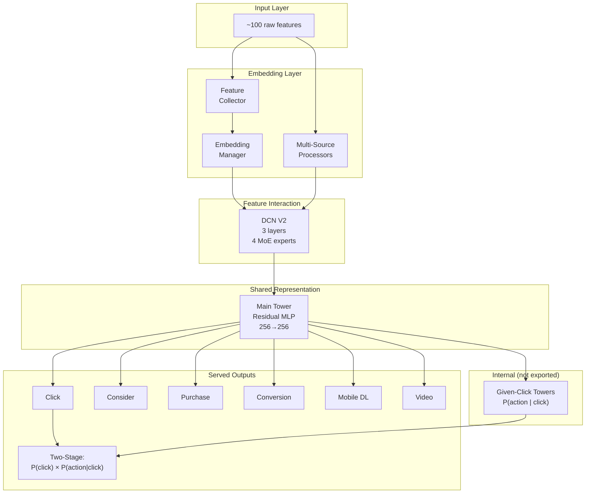
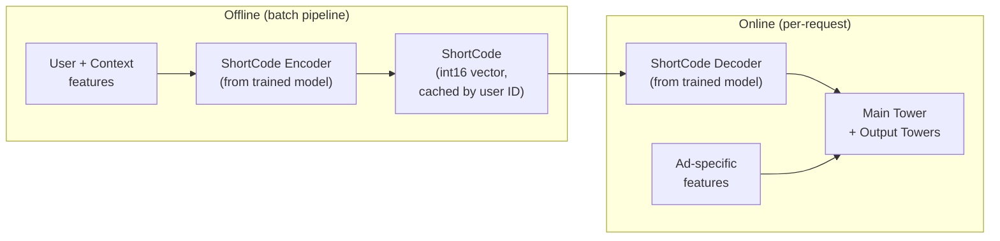

This is Part 4 of a series on deep learning for ranking models. [Part 1 (the overview)](/posts/ranking-models-overview) presents the full pipeline and taxonomy. Parts 2a and 2b covered [encoding individual features](/posts/ranking-models-input-representation-part1) and [sequences/assembly](/posts/ranking-models-input-representation-part2). [Part 3](/posts/ranking-models-feature-interaction) covered feature interaction. This post walks through one complete production system end-to-end: an ad prediction model that predicts 10 objectives simultaneously from a shared representation.

---

## The Full Architecture

When an ad auction request arrives, the system must predict 10 probabilities simultaneously: how likely is this user to click, add to cart, purchase, download the app, and so on. All 10 predictions share the same model, flowing through a single pipeline from raw features to a shared representation, then branching into task-specific towers. The system processes ~100 raw features (user, ad, context) through embeddings, applies DCN V2 for explicit polynomial crosses, compresses into a shared 256-dimensional representation, then fans out to 10 task-specific output towers. Each tower produces a probability for one business objective.



The earlier posts covered input representation (how raw features become embeddings) and feature interaction (how DCN combines them). This post focuses on what comes after: the shared representation, multi-task output, two-stage modeling, loss balancing, and serving optimizations.

---

## 1. Shared Representation: The Multi-Task Bottleneck

After DCN V2 produces an enriched feature vector, a shared main tower compresses it into a compact 256-dimensional representation:

```python
# Forward pass
main_features = self.dcn(all_features_concat)        # DCN output, same dimension (~800-1200)
features_dict["main"] = self.main(main_features)     # Residual MLP → 256 dims
return self.output_towers(features_dict)             # fans out to 10+ towers
```

The main tower is a residual MLP (256→256 with 2 residual layers). Its role is to distill the large interaction vector into a compact form that's useful across all downstream tasks.

This stage exists *because* the system is multi-task. If only predicting clicks, the model could go directly from DCN output to a single output layer. But with 10 tasks sharing the same model, a shared bottleneck serves two purposes:

1. **Parameter efficiency.** Without the bottleneck, each output tower would need to independently process the full ~1000-dim interaction vector. The shared tower does this compression once.
2. **Regularization.** The representation must be useful for all 10 tasks simultaneously. This prevents overfitting to any single objective. A representation that only predicts clicks well but ignores purchase signal would be penalized by the purchase tower's loss flowing back through this shared layer.

---

## 2. Multi-Task Output: 10 Towers from One Representation

The shared 256-dim representation fans out to task-specific output towers. Each tower is a small independent MLP that specializes in one prediction:

| Tower | What it predicts | Architecture |
|-------|-----------------|--------------|
| Clicks | P(user clicks the ad) | Residual MLP [256, 256] → sigmoid |
| Considerations | P(user adds to cart) | MLP [256] → sigmoid |
| Purchases | P(user purchases) | MLP [256] → sigmoid |
| Conversions | P(user converts) | MLP [256] → sigmoid |
| Mobile App Downloads | P(user downloads app) | MLP [256] → sigmoid |
| Video Completions | P(user watches video ad) | MLP [256] → sigmoid |
| Considerations Given Click | P(cart \| click) | Residual MLP [256, 256] → sigmoid |
| Purchases Given Click | P(purchase \| click) | Residual MLP [256, 256] → sigmoid |
| Conversions Given Click | P(conversion \| click) | Residual MLP [256, 256] → sigmoid |

The towers fall into two groups. The first six (Clicks through Video Completions) are **direct towers** that predict unconditional probabilities and train on all impressions. The last three (Considerations Given Click, Purchases Given Click, Conversions Given Click) are **"given click" towers** that predict conditional probabilities and train only on the subset of samples where the user actually clicked. This distinction matters for two-stage modeling (Section 3).

The architecture choice per tower reflects task importance. The click tower and "given click" towers use deeper architectures (2 residual layers) because they are the most critical: clicks are the primary auction signal, and the "given click" towers feed into two-stage predictions (explained below). Simpler tasks (considerations, conversions) use a single-layer MLP since the shared representation already carries most of the signal they need.

```python
class OutputTower(nn.Module):
    def __init__(self, in_dims, layers, act, residual_layer, ...):
        self.module = nn.Sequential()
        if residual_layer:
            for i, out_layer in enumerate(layers):
                self.module.add_module(
                    f"residual_layer_{i}", ResidualLayer(out_layer, dropout=dropout))
        self.module.add_module("full_layer_final", nn.Linear(in_layer, 1))
        self.module.add_module("act", act)  # Sigmoid64 for probabilities

    def forward(self, features_dict, output):
        inp = features_dict[self.in_feature_name]  # shared 256-dim representation
        return self.module(inp)
```

Each tower takes the same 256-dim input and produces a single scalar output. The sigmoid activation converts it to a probability in [0, 1]. The towers are independent: they don't see each other's outputs during the forward pass (except for two-stage towers, which combine logits from other towers).

---

## 3. Two-Stage Output

Some outcomes form a natural funnel: you can't purchase without clicking first. Modeling P(purchase) directly is difficult because it's a very small number (perhaps 0.001), which means the positive class is extremely rare and gradient signal is weak.

The system decomposes the problem:

$$P(\text{purchase}) = P(\text{click}) \times P(\text{purchase}|\text{click})$$

This produces two more learnable quantities. P(click) might be 0.05 (5% of impressions get clicked), and P(purchase|click) might be 0.02 (2% of clicks convert to purchase). Both have much stronger positive-class signal than the joint probability of 0.001.

### How it works in practice

The click tower and the purchase-given-click tower are independent towers with independent parameters, trained with independent losses on different data subsets:

- **Click tower:** trains on ALL impressions (the full dataset)
- **Purchase-given-click tower:** trains only on the subset where the user actually clicked

The two-stage output then combines their logits:

```python
class TwoStageSigmoid64:
    def __init__(self, logit_names):
        # logit_names = ("logit-PurchasesGivenClick", "logit-Clicks")
        self.logit_names = logit_names

    def forward(self, output):
        logit_conditional = output[self.logit_names[0]]
        logit_base = output[self.logit_names[1]]
        prob = sigmoid(logit_conditional) * sigmoid(logit_base)
        return prob
```

The system produces three two-stage outputs:
- P(click) × P(consideration\|click) = P(add to cart)
- P(click) × P(purchase\|click) = P(purchase)
- P(click) × P(conversion\|click) = P(conversion)

At serving time, the exported prediction outputs are: the direct towers (Click, Considerations, Purchases, Conversions, Mobile DL, Video) and the combined two-stage probabilities (ClickConsiderations, ClickPurchases, ClickConversions). The "given click" towers have `ignore_export: True` because their individual conditional probabilities are not served separately. They participate in the forward pass only to produce the combined two-stage outputs. They exist as a training-time decomposition that makes learning easier, not as independent serving outputs.

---

## 4. Task-Weighted Loss

Training a model that predicts 10 objectives simultaneously from imbalanced data requires solving two problems at once. Within each task, positive events are extremely rare (purchases might be 0.1% of impressions), so the model would barely learn from them without correction. Across tasks, different objectives have different loss magnitudes and business importance, so they compete for the shared representation's gradient budget. The loss function addresses both:

$$\mathcal{L}_{total} = \sum_{t=1}^{T} w_t \cdot \frac{\sum_{i=1}^{N} \text{BCE}_t(y_i, \hat{y}_i) \cdot s_i}{\sum_{i=1}^{N} s_i}$$

Reading this formula from outside in:

**Outer layer: task-weighted sum.**

$$\sum_{t=1}^{T} w_t \cdot (\text{...per-task loss...})$$

The total loss sums over all $T = 9$ probability tasks (6 direct + 3 given-click), each multiplied by a task weight $w_t$. The weights control how tasks compete for the shared representation's gradient budget. Without them, the task with the largest loss magnitude would dominate gradient updates, starving rare-event tasks of useful signal.

**Middle layer: sample-weighted average within one task.**

$$\frac{\sum_{i=1}^{N} \text{BCE}_t(y_i, \hat{y}_i) \cdot s_i}{\sum_{i=1}^{N} s_i}$$

For a single task $t$, the loss computes a weighted average of per-sample BCE values. The per-sample weight $s_i$ is a single scalar synthesized from multiple corrections (downsampling, stratification, recency), detailed in the Per-Sample Weighting subsection below. Dividing by $\sum s_i$ normalizes the result so the magnitude doesn't depend on the absolute scale of the weights.

**Inner layer: binary cross-entropy for one sample on one task.**

$$\text{BCE}_t(y_i, \hat{y}_i) = -\left[y_i \cdot \log(\sigma(z_i)) + (1-y_i) \cdot \log(1 - \sigma(z_i))\right]$$

The raw prediction error for sample $i$ on task $t$. Penalizes confident wrong predictions exponentially more than uncertain ones. If the model predicts P(click) = 0.99 but the user didn't click, the loss is very large. If it predicts P(click) = 0.55 and the user didn't click, the loss is small.

**Definitions of each element:**

- $T = 9$ is the number of probability tasks (6 direct towers + 3 given-click towers)

- $N$ is the number of samples in the batch (up to 65,536)

- $\text{BCE}_t(y_i, \hat{y}_i)$ is the binary cross-entropy loss for sample $i$ on task $t$, measuring prediction error

- $w_t$ is the task weight for task $t$, manually tuned to reflect business importance and task difficulty

- $s_i = \frac{1}{p_{\text{sampling},i}} \cdot w_{\text{recency},i}$ is the per-sample weight, combining two corrections:
  - $1/p_{\text{sampling},i}$ is the inverse sampling probability. A negative sample kept with 1% probability gets weight 100, restoring the unbiased gradient estimate as if it hadn't been downsampled.
  - $w_{\text{recency},i}$ is the recency weight. With a half-life of 7 days and max weight of 5.0, yesterday's impressions get ~5x the weight of week-old data.

- $y_i \in \{0, 1\}$ is the ground-truth binary label for sample $i$ (did the user click/purchase/convert or not)

- $\hat{y}_i = \sigma(z_i)$ is the predicted probability for sample $i$, where $\sigma$ is the sigmoid function and $z_i$ is the raw logit output from the tower

- $p_{\text{sampling},i}$ is the probability at which sample $i$ was kept during negative downsampling (1.0 for positives, much smaller for negatives)

- $w_{\text{recency},i}$ is the recency weight for sample $i$, computed as $\min(5.0,\ 2^{-\text{days\_age}/7} / w_{\text{min}})$

### Per-Sample Weighting: How $s_i$ Is Computed

The per-sample weight $s_i$ is determined by a data pipeline (a Spark job) that runs before training begins. It applies three operations:

**Negative downsampling.** The pipeline keeps all positive samples but randomly drops negatives at a configurable rate. If `negativeSampleRate = 0.01`, only 1% of negative impressions survive into the training set. All positives are kept. The sampling is deterministic (hash-based on request ID) so the same decision is made across reruns. Each surviving sample carries a `sampling_probability` field recording the rate at which it was kept.

**Stratified sampling.** Different ad programs have vastly different volumes. Without stratification, high-volume programs (standard display) would drown out rare ones (video ads, app installs). The pipeline stratifies by ad program and applies per-stratum sampling rates, ensuring balanced representation across ad types. Multiple strategies are available (equal positive ratios, power-law scaling, impression-driven bounds) depending on the distribution.

**Recency weighting.** After sampling, each sample receives a weight based on how recent it is. With a half-life of 7 days and a max weight of 5.0, yesterday's impressions get ~5x the weight of week-old data. This makes the model prioritize recent behavioral patterns without discarding historical data entirely.

### Task Weights: How $w_t$ Is Set

The system uses manually-tuned weights that encode domain knowledge about business importance and task difficulty. Three principles govern the weight assignments:

1. **Primary business signal gets the highest weight.** Clicks are the auction's core optimization target, so the click task dominates.
2. **Low-volume tasks get low weight.** Tasks that apply to only a fraction of traffic (e.g., video completions for video-only ads) are downweighted to avoid noisy gradients from small sample sizes distorting the shared representation.
3. **Conditional towers get very low weight.** The "given click" towers train on only ~5% of data (the clicked subset). Their gradients are inherently noisier; high weights would amplify that noise and destabilize the shared layers.

These weights aren't set once and forgotten. The production system defines a hyperparameter search space per weight and runs automated experiments to sweep combinations, searching for the set that improves offline metrics across all tasks without degrading any individual task.

---

## 5. ShortCode: From Training Artifact to Serving Optimization

The architecture diagram above shows the model during training, where all components participate in a single forward pass. ShortCodes are additional components trained alongside the rest of the model, but their purpose only becomes clear at serving time: they allow the system to split the trained model into two deployment artifacts for latency optimization.

### During training: encoder and decoder train jointly

The encoder and decoder are regular `nn.Module` components inside the model, receiving gradients from the same task-weighted loss (Section 4) as every other component. During training, user/context features flow through the encoder, get quantized to int16, then the decoder reconstructs them back into a dense vector that feeds the main tower. The model learns to compress information through the quantization bottleneck while preserving what the downstream towers need for accurate prediction.

```python
class ShortCodeEncoder(nn.Module):
    def forward(self, x):
        # Residual MLP → project down → clamp to int16 range
        return torch.clamp(self.model(x) * SHORT_FACTOR, -32000, 32000)

class ShortCodeDecoder(nn.Module):
    def forward(self, x):
        # Up-project from int16 back to dense → Residual MLP
        return self.model(x.float() / SHORT_FACTOR)
```

The clamping is the key design element: it forces the encoder to produce representations that survive quantization to integers. This is a learned compression, not a post-hoc optimization. The encoder, decoder, DCN, main tower, and output towers all train together, end-to-end, from the same loss signal.

### After training: split for serving

The ad prediction system must score thousands of candidate ads per request within milliseconds. But most of the model's computation (embedding 100+ features, DCN crossing) depends on user/context features that don't change between candidates in the same request. Only the ad-specific features change per candidate.

After training completes, the model is split into two deployment paths:



**Offline path:** The encoder runs periodically in a batch pipeline, computing ShortCodes for users as their features change. The resulting int16 vectors are cached in a key-value store indexed by user ID.

**Online path:** When an ad auction request arrives, the system loads the pre-computed ShortCode for the user, decodes it, and runs only the decoder + main tower + output towers with the ad-specific features. This skips the expensive embedding and DCN computation for the ~100 user/context features entirely.

The result: per-request latency drops dramatically because the heaviest computation (encoding slow-changing features) has been moved offline.

---

## 6. Training Configuration

| Setting | Value |
|---------|-------|
| Optimizer | AdamW |
| Weight decay | Yes |
| LR schedule | ReduceOnPlateau |
| Batch size | 65,536 |
| Epochs | 10 on static data |
| Gradient clipping | Yes |

The large batch size (65,536) is practical because per-sample computation is relatively cheap: small embeddings (4-16 dims) and DCN V2 crossing is parameter-efficient. Large batches average out noise in the gradient estimate, which is important when predicting rare events (purchases might be 0.1% of samples, so a batch of 65K contains ~65 positive examples).

The system trains for 10 epochs on a static dataset (typically one week of logged impressions and outcomes). Multiple passes over the same data let the model extract maximum signal from rare events. This is in contrast to incremental single-epoch training, which trades off re-use for freshness.

---

## 7. Evaluation: Why Calibration Matters

The ad prediction system evaluates with **Normalized Entropy (NE)** and **Expected Calibration Error (ECE)** per task, not AUC:

```python
metrics = {
    "clickNE": NormalizedEntropy(output_name="probability-Clicks", label_name="click"),
    "clickECE": ExpectedCalibrationError(output_name="probability-Clicks", label_name="click"),
    "purchaseNE": NormalizedEntropy(output_name="probability-Purchases", label_name="purchase"),
    "purchaseECE": ExpectedCalibrationError(output_name="probability-Purchases", label_name="purchase"),
    # ... per task
}
```

The reason is that ad auctions multiply the predicted probability by the advertiser's bid value to determine auction rank and pricing. If the model predicts P(click) = 0.05, that number directly enters a monetary calculation. If 5% of impressions with that prediction don't actually click, the marketplace loses money on overpriced inventory, or advertisers overpay.

**Normalized Entropy** measures how much better the model is than predicting the base rate. A perfect model has NE = 0; predicting the average click rate for all samples gives NE = 1. Lower is better.

**Expected Calibration Error** bins predictions into groups (e.g., all predictions between 0.04-0.06) and measures the gap between predicted probability and observed frequency within each bin. A well-calibrated model has ECE close to 0.

AUC (ranking quality) still matters but is secondary. A model that perfectly ranks items but assigns P(click) = 0.9 to everything would have perfect AUC but terrible calibration, and the auction would dramatically overpay for impressions.

The system computes NE and ECE for every task (click, purchase, conversion, etc.) and for the two-stage combined outputs (clickPurchases, clickConsiderations). An experiment that improves click NE but degrades purchase ECE requires careful analysis before shipping.

---

## 8. Serving: Throughput Under Extreme Latency

The system must score thousands of candidate ads per request in under 10ms. Three architectural decisions serve this constraint:

**ShortCode pre-computation** (covered in Section 5) caches user/context features as compact integer vectors, eliminating the need to recompute embeddings and DCN for slow-changing features on every request.

**ONNX export** converts the model to a framework-independent format optimized for inference. The `ignore_export: True` flag on "given click" towers means they exist only during training (for decomposing losses) and are excluded from the deployed model. Only the towers whose outputs are actually served get exported.

**Small embedding dimensions** (4-16 per feature) keep the concatenated vector small (~800-1200 dims) even with 100+ features. This is a deliberate tradeoff: individual feature representations are less rich, but DCN V2 compensates by explicitly modeling their interactions. The total model footprint stays small enough for millisecond inference.

---

## Summary

The ad prediction system's complexity lives in the *output* side of the pipeline:

| Design Choice | Why |
|--------------|-----|
| Shared 256-dim bottleneck | Multi-task regularization + parameter efficiency |
| 10 independent output towers | Each business objective gets specialized prediction |
| Two-stage decomposition | Decomposes rare funnel events into more learnable parts |
| Manual loss weights + sweeps | Balances competing objectives without any one dominating |
| ShortCode pre-computation | Meets millisecond latency by caching slow-changing features |

The next post covers the video recommendation system, which invests its complexity in the *input* side (rich attention over 128-item sequences) and keeps the output simple (single task, single MLP).
