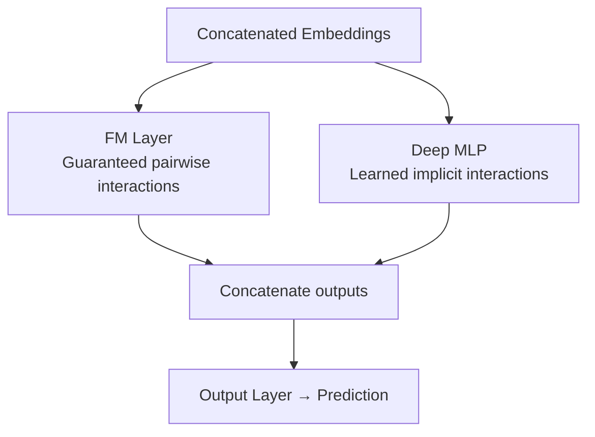
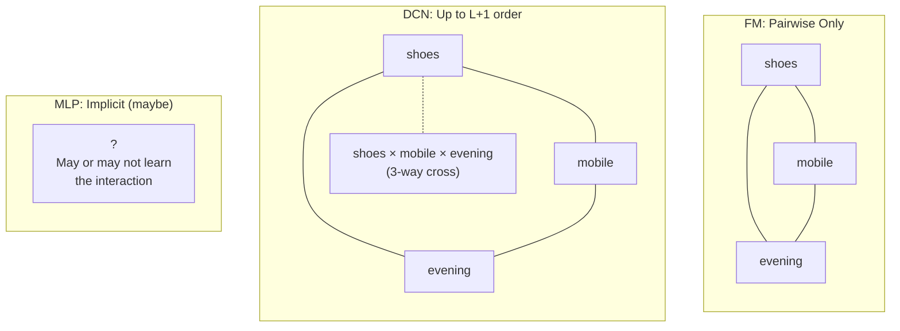

This is Part 3 of a series on deep learning for ranking models. [Part 1 (the overview)](/posts/ranking-models-overview) presents the full pipeline and taxonomy. Parts 2a and 2b covered [encoding individual features](/posts/ranking-models-input-representation-part1) and [sequences/assembly](/posts/ranking-models-input-representation-part2). This post covers what happens next: how features combine to produce the signal that drives prediction.

---

## Why Feature Interaction Matters

After input representation, every feature is a dense vector. A user's device type is an 4-dim embedding. The product's category is a 32-dim embedding. The time of day is an 8-dim vector. Individually, each carries some predictive signal: mobile users behave differently from desktop users, shoe shoppers differ from electronics shoppers, evening browsers differ from morning browsers.

But the real signal often lives in *combinations* that no single feature captures. "Mobile users browsing shoes in the evening" might convert at 3x the rate predicted by any individual feature, perhaps because they're commuters doing casual shopping on their phones during wind-down time. This three-way interaction between device, category, and time carries crucial signal, yet a model looking at features independently will miss it entirely.

The challenge is that with hundreds of features, the space of possible interactions is astronomical. There are $\binom{100}{2} = 4{,}950$ pairwise combinations, $\binom{100}{3} = 161{,}700$ three-way combinations, and the numbers explode from there. You cannot enumerate and manually engineer all useful crosses. The model must discover them. But how?

This question is the central design decision in ranking model architecture. Every major architecture proposed since 2010 is a different answer to: *how should features talk to each other before we make a prediction?*

---

## 1. Implicit Interaction: Deep Networks

**The problem:** We don't know which interactions matter a priori. The useful combinations are buried in the data, and they may differ across user segments, time periods, or product categories.

**The approach:** Concatenate all feature embeddings into one vector and pass it through stacked layers of learned linear transformations with nonlinear activations. The network discovers useful combinations automatically through training.

### Multi-Layer Perceptron (MLP)

The simplest approach: stack linear layers with nonlinear activations.

$$h_1 = \sigma(W_1 x + b_1), \quad h_2 = \sigma(W_2 h_1 + b_2), \quad \ldots$$

Each layer takes the current vector, multiplies by a weight matrix (mixing all dimensions into new combinations), adds a bias, and applies a nonlinear activation function (like ReLU, which zeroes out negative values). In theory, an MLP with sufficient width and depth can approximate any function, including one that captures three-way feature interactions.

### Residual MLP

$$h_{l+1} = h_l + F(h_l)$$

The same idea with one structural change: each layer's output is *added to* its input rather than replacing it. This "skip connection" doesn't change what the network can represent, but it makes training much easier. Without skip connections, gradients (the signal that tells each weight how to update) can vanish as they propagate backward through many layers. With skip connections, gradients flow directly through the shortcut path, keeping the training signal strong even in deep architectures.

Both production systems use residual MLPs as their core "deep" component. The ad prediction system uses them for its main tower (256→256 with residual layers), and the video recommendation system uses them for its final MLP matcher (2600→256→128→1).

### The weakness of implicit-only approaches

In practice, MLPs learn smooth, continuous transformations, but feature interactions are more like sharp conditional rules ("if mobile AND shoes AND evening, then boost"). The MLP can eventually approximate these, but a 3-way cross that's critical for 0.1% of traffic gets negligible gradient signal in a sea of other patterns. The network has no structural guarantee that it will discover "mobile × shoes × evening." It can only hope that enough examples of that combination exist in training data for the signal to emerge.

Residual connections help gradients flow but don't change this fundamental limitation. They solve a training stability problem, not an interaction discovery problem. Both plain and residual MLPs still rely on the data to surface combinatorial patterns through gradient descent.

This is precisely why explicit interaction methods were invented.

---

## 2. Explicit Interaction: Structured Feature Crossing

**The problem:** Some interactions (pairwise products, higher-order polynomials) are known to be important in ranking systems, but MLPs learn them slowly if at all.

**The approach:** Structurally force the model to compute specific types of feature combinations, rather than hoping it discovers them. Then let the MLP learn what to do with the explicitly computed crosses.

### [Factorization Machine (FM)](https://www.csie.ntu.edu.tw/~b97053/paper/Rendle2010FM.pdf)

**The problem FM solves:** We want to capture all pairwise feature interactions, but computing them directly requires $\binom{n}{2}$ parameters (one weight per pair). With 100 features, that's 4,950 pair-specific weights, and with sparse data most of these pairs are rarely observed together, making the weights poorly trained.

**The solution:** Give each feature not just a scalar weight but a small latent vector $v_i \in \mathbb{R}^k$ (typically $k$ = 8-16). The interaction between features $i$ and $j$ is defined as the dot product of their latent vectors:

$$\hat{y}_{FM} = w_0 + \sum_{i=1}^{n} w_i x_i + \sum_{i=1}^{n} \sum_{j=i+1}^{n} \langle v_i, v_j \rangle x_i x_j$$

The first term is a bias. The second is logistic regression (individual feature weights). The third captures all pairwise interactions, but parametrized through latent vectors rather than individual weights per pair.

**Why this works with sparse data:** Features that interact similarly with others develop similar latent vectors. If "mobile" interacts positively with both "shoes" and "sportswear" (because mobile shoppers browse apparel), the latent vector for "mobile" will align with a direction that both product categories also share. This means the model can predict the interaction between "mobile" and a *new* sportswear product it hasn't seen paired with mobile before. It generalizes from the latent structure.

**Complexity:** The naive double sum is $O(n^2 k)$, but it can be reformulated to $O(nk)$ using the identity "sum of all pairwise products = (square of the sum − sum of the squares) / 2":

$$\sum_{i=1}^{n} \sum_{j=i+1}^{n} \langle v_i, v_j \rangle x_i x_j = \frac{1}{2} \sum_{f=1}^{k} \left[ \left(\sum_{i=1}^n v_{i,f} x_i\right)^2 - \sum_{i=1}^n v_{i,f}^2 x_i^2 \right]$$

Each inner sum is $O(n)$, repeated for $k$ dimensions, giving a total of $O(nk)$, linear in feature count.

**Limitation:** Only 2nd-order interactions. The FM captures "mobile + shoes" but not "mobile + shoes + evening" (3rd-order). There's no mechanism for higher-order combinations.

### Deep & Cross Network ([DCN](https://arxiv.org/abs/2008.13535))

**The problem DCN solves:** FM is limited to 2nd-order interactions. We want higher-order crosses (3-way, 4-way, ...) without exponential parameter cost.

**The key insight:** A "cross layer" that multiplies the current state by the original input at every step, adding one degree of interaction per layer:

$$x_{l+1} = x_0 \odot f(x_l) + x_l$$

Here $x_0$ is the original concatenated embedding vector, $x_l$ is the output of the previous layer, and $\odot$ is element-wise multiplication. After $L$ layers, the network has computed feature interactions up to degree $L+1$. The element-wise multiply by $x_0$ at every layer is what creates progressively higher-order crosses.

DCN V1 and V2 share this template. They differ only in how they define $f$:

#### DCN V1 (2017)

In V1, $f$ is a rank-1 projection: $f(x_l) = x_l^T w_l$. The dot product between the current state and a learned weight vector produces a single scalar, which then gates the element-wise product with the original input. This makes V1 extremely efficient since each cross layer adds only $d$ parameters (one weight vector).

```python
def forward(self, x0):
    x = x0
    for i in range(self.num_layers):
        xw = torch.matmul(x, self.weights[i])  # [batch, 1] — dot product
        x = x0 * xw + self.biases[i] + x       # cross + residual
    return x
```

However, the rank-1 constraint limits expressiveness. Each layer can only scale the original input by a single learned scalar, meaning all dimensions of $x_0$ are amplified or suppressed together. The network cannot, for instance, amplify category-related dimensions while suppressing device-related dimensions in the same cross layer.

#### DCN V2 (2021)

V2 addresses V1's expressiveness limitation by replacing the scalar projection with a full matrix: $f(x_l) = W_l x_l + b_l$. Now each dimension of $x_0$ receives its own scaling factor, so the cross layer can amplify category-related dimensions while suppressing device-related dimensions in the same step:

$$x_{l+1} = x_0 \odot (W_l x_l + b_l) + x_l$$

The problem is that a full $d \times d$ matrix is expensive. With $d = 1000$ (a typical concatenated embedding size), each layer adds 1 million parameters. V2 solves this through Mixture-of-Experts (MoE) low-rank decomposition, which factors the large matrix into several smaller specialist matrices:

$$W_l = \sum_{e=1}^{E} g_e(x) \cdot U_e C_e V_e^T$$

Each "expert" ($U_e C_e V_e^T$) is a low-rank matrix that specializes in a different type of interaction pattern. A learned gating function $g_e(x)$ decides how much each expert contributes for a given input. One expert might learn to capture brand×category interactions while another focuses on device×time interactions. The gating function routes each sample toward the experts most relevant to its feature combination.

```python
# DCN V2 MoE forward pass
for l in range(self.num_layers):
    gate = softmax(self.gates[l](x))                  # [batch, E] — expert routing
    vx = tanh(einsum("bd,edr->ber", x, V_l))         # project to low-rank
    cx = tanh(einsum("ber,err->ber", vx, C_l))       # transform in low-rank space
    ux = einsum("ber,edr->bed", cx, U_l)             # project back
    mixture = (gate.unsqueeze(-1) * ux).sum(dim=1)   # weighted expert mixture
    x = x0 * (mixture + self.bias[l]) + x            # cross with original
```

The low-rank factorization reduces parameters from $O(d^2)$ to $O(d \times r)$ per layer, making the full-matrix approach practical at scale. The $\tanh$ activations in the low-rank space add nonlinearity within each expert, allowing them to learn more complex transformations than a pure linear decomposition would permit.

The ad prediction system uses DCN V2 with 3 cross layers and 4 experts, applied to the concatenated feature vector (~800-1200 dims) after embedding.

### [DeepFM](https://arxiv.org/abs/1703.04247): FM + MLP in Parallel

A pragmatic architecture: why choose between explicit and implicit interaction when you can have both? Run an FM layer (for guaranteed pairwise crosses) and a deep MLP (for learned higher-order patterns) in parallel, concatenating their outputs:



The FM branch ensures that every pairwise interaction is computed regardless of data sparsity. The MLP branch can potentially discover higher-order patterns or nonlinear combinations that FM misses. The two branches provide complementary coverage.

### Intuitive comparison

These three methods sit on a spectrum of coverage versus guarantee. FM guarantees that every pairwise interaction is explicitly computed, but it stops at 2nd-order and cannot capture "mobile × shoes × evening." DCN extends to higher-order crosses (3-way, 4-way, etc.) with guaranteed polynomial computation, but applies the same fixed pattern to every sample regardless of context. MLP makes no guarantees at all. It might learn any interaction of any order, or it might miss critical ones entirely depending on data distribution. The tradeoff is structural certainty versus flexibility: the more structure you impose, the more you guarantee coverage of specific interaction types, but the less room the model has to discover unexpected patterns on its own.



---

## 3. Attention-Based Interaction

**The problem:** Both FM and DCN apply the *same* interaction pattern to every example. The cross network computes the same polynomial combinations regardless of which user or item is being scored. But in recommendation systems, different users' behaviors are relevant in different ways depending on what's being recommended *right now*.

Consider a user who has watched both crime thrillers and cooking shows. If the system is deciding whether to recommend a new detective series, the crime thrillers in their history are highly relevant but the cooking shows are noise. If instead the candidate is a food documentary, the relevance flips completely. A fixed interaction pattern cannot capture this. The model needs to *dynamically adjust* which parts of the user's history matter based on the current candidate.

**The approach:** Use the candidate item as a "query" against the user's history sequence. Each historical item receives a relevance score based on how similar it is to the current candidate. The final user representation is a weighted combination of history items, weighted by relevance to what's currently being evaluated.

### [DIN (Deep Interest Network)](https://arxiv.org/abs/1706.06978)

The core mechanism: for each history item $h_t$ and the candidate $c$, compute a relevance score:

$$\text{score}_t = \text{MLP}\left(\left[h_t;\ c;\ h_t \odot c;\ h_t - c;\ \lvert h_t - c \rvert\right]\right)$$

The input to the scoring MLP contains five different views of the history-candidate relationship:
1. **The history item itself** ($h_t$): what was in the history
2. **The candidate itself** ($c$): what's being scored
3. **Element-wise product** ($h_t \odot c$): similarity in each dimension
4. **Difference** ($h_t - c$): how they diverge
5. **Absolute difference** ($\lvert h_t - c \rvert$): magnitude of divergence

These five signals give the scoring MLP rich information to determine relevance. After scoring all positions, softmax converts scores into weights that sum to 1:

$$\alpha = \text{softmax}(\text{scores}) \in \mathbb{R}^T$$

$$\text{user}\_\text{repr} = \sum_{t=1}^{T} \alpha_t \cdot h_t$$

The result is a user representation that is *different for every candidate item*. When scoring a crime thriller, the user representation emphasizes past thriller-watching. When scoring a cooking show, it emphasizes cooking content. This per-candidate personalization is what makes attention fundamentally different from the fixed patterns of FM and DCN.

### Why this is fundamentally different from FM/DCN

| | FM / DCN | DIN Attention |
|--|----------|---------------|
| Operates on | All features uniformly | Sequence positions selectively |
| Interaction pattern | Same for all samples in a batch | Per-sample, per-position; changes based on what's being scored |
| Captures | "Category X and time Y interact globally" | "THIS user's past action on similar items predicts engagement" |
| Computational pattern | Static polynomial, computed once for a given feature vector | Dynamic, data-dependent, recomputed for each candidate |
| Where it applies | After concatenation, on the flat feature vector | Before concatenation, between the sequence tower and the candidate tower |

### Cold-start handling

Attention introduces an inference-time problem that FM and DCN never face: what happens for a user with no viewing history? The softmax over an empty sequence produces NaN values (dividing zero by zero), which would propagate through the rest of the network and corrupt all gradients.

The video recommendation system handles this in its forward pass, which executes during both training and inference, with three steps:

**Step 1: Safe softmax.** Before attention weights are computed, padded positions are filled with $-\infty$ so they receive zero weight after softmax. A `safe_softmax` function detects rows where *all* positions are $-\infty$ (fully empty sequences) and replaces the resulting NaN with zeros, preventing numerical corruption.

**Step 2: Detect empty sequences.** After attention pooling, the system checks which samples have at least one valid history item:

```python
has_hist = mask_bool.any(dim=1)  # [batch] — True if user has any history
```

**Step 3: Substitute a learned fallback.** For samples with no history, a learnable cold-start vector replaces the (now-zeroed) attention output:

```python
self.cold_start_param = nn.Parameter(torch.zeros(in_dim))  # initialized to zeros, updated by gradients during training
pooled = torch.where(has_hist.unsqueeze(1), pooled, self.cold_start_param)  # at inference, cold_start_param holds learned values, not zeros
```

This substitution happens during both training and inference, but serves a different purpose in each:

**During training**, cold users exist in historical data. When such a sample passes through this path, the model makes a prediction using the cold-start vector, computes loss against that user's actual outcome, and backpropagates gradients into the vector. Over many such samples, the vector moves away from its initial zeros and learns to be a "generic user" representation, encoding population-level priors like "new users tend to engage with popular content."

**During inference**, the cold-start vector is no longer zeros. It holds the learned values from training and serves as a meaningful default for any new user with no history. This is more expressive than simply using a zero vector (which is also available as a configuration option) because the trained vector already encodes what cold users tend to engage with.

---

## Combining Approaches

The three interaction methods aren't mutually exclusive. The most advanced ad prediction experiments stack all of them sequentially, with each step's output becoming the next step's input:

```
features_dict (individual embeddings)
    │
    ▼
[DIN Attention] — queries sequences with candidate, output added back to features_dict
    │
    ▼
[Concatenate] — all features (including attention output) into one flat vector
    │
    ▼
[DCN V2] — polynomial crosses over the concatenated vector (same dimension in and out)
    │
    ▼
[Residual MLP] — nonlinear compression into final representation
    │
    ▼
[Output towers] — task-specific predictions
```

The stacking order is intentional. Attention runs first, while features still have their identity as separate tensors, because DIN needs to know which tensor is the candidate and which is the history. The attention output (a history-aware vector personalized to the current candidate) is then added back to the feature pool as just another feature. Next, all features get concatenated into a single flat vector. DCN operates on this flat vector, computing polynomial crosses between all dimensions, including the attention-derived ones. This means DCN can cross "history-weighted-interest × time-of-day" without knowing those came from different sources. Finally, the residual MLP learns whatever implicit patterns remain in the DCN-enriched vector.

Each layer adds a different kind of signal that the previous one could not provide. Attention adds per-candidate personalization from sequences. DCN adds guaranteed polynomial crosses across the full feature space. MLP adds implicit higher-order patterns. They compose because each step produces richer information than its input. The cost is model complexity and training time, but for high-QPS systems where a fraction-of-a-percent improvement in CTR translates to significant revenue, the investment pays off.

The video recommendation system takes a simpler but different bet: invest heavily in attention (DIN over rich 128-item sequences with ~52 features per position) and skip DCN entirely. Its philosophy is that the per-sample, data-dependent interaction through attention is expressive enough when the sequence is rich. The model doesn't need explicit polynomial crosses, because the attention mechanism can implicitly learn to weight the relevant feature combinations per candidate.

---

## Summary

| Approach | Best when | Weakest when |
|----------|-----------|-------------|
| MLP only | Features are dense, training data is abundant, no known interaction structure | Data is sparse, critical interactions involve rare combinations |
| FM | Many sparse categorical features with important pairwise interactions | Higher-order interactions matter, or features are all dense |
| DCN | Many features, known importance of higher-order polynomial crosses, same pattern for all users | Per-sample personalization matters more than global crosses |
| DIN attention | Rich behavioral sequences, candidate-dependent relevance, per-user personalization | No sequence data, or latency budget doesn't allow per-candidate computation |
| DCN + DIN + MLP | Maximum quality matters, sufficient infrastructure, high QPS with tight latency budget justifying complexity | Simple system, limited engineering resources |

For how these choices connect to the broader architectural decision between the two production systems, see [Two Production Philosophies](/posts/ranking-models-overview#two-production-philosophies) in the overview.

