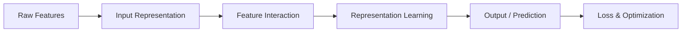

Ranking models sit at the heart of every recommendation system, ad platform, and search engine. Given a user, a set of candidate items, and some context, the model's job is to predict how likely the user is to engage with each item — then sort by that score. This series presents a taxonomy of deep learning components used in production ranking systems, mapping each concept to the problem it solves, the alternatives available, and the tradeoffs involved.

The material draws on two production systems: an ad click prediction system using multi-task DCN architecture, and a video recommendation system using DIN architecture with attention over viewing history. Together they illustrate how the same conceptual framework manifests in different production design patterns.

This post is the map — the conceptual framework for understanding how all the pieces fit together. Each subsequent post in the series is a deep-dive into one stage, with detailed examples from production systems, source code walk-throughs, and design tradeoff discussions.

## The Core Pipeline

Every ranking model follows the same high-level data flow:



Each stage transforms data into a progressively more useful form:

**Raw Features → Input Representation.** The system receives heterogeneous raw data about the user, the candidate item, and the current context — things like user IDs, item categories, device type, time of day, and behavioral histories. This stage converts each raw feature into a fixed-size numeric vector. Categorical features (like `genre=action`) become dense embeddings; numerical features get normalized or projected; variable-length sequences (like viewing history) get encoded into fixed-size representations. The output is a collection of dense vectors, one per feature or feature group.

**Input Representation → Feature Interaction.** Individual feature vectors are informative but limited — the real predictive signal often lives in *combinations* of features. This stage models how features relate to and combine with each other. It might compute explicit polynomial crosses (DCN), learn pairwise interactions through latent factors (FM), or use attention to dynamically weight sequence elements based on the candidate item (DIN). The output is an enriched vector where feature combinations have been made explicit.

**Feature Interaction → Representation Learning.** The enriched feature vector passes through one or more layers of nonlinear transformation (typically residual MLPs) that compress and distill the signal into a compact, task-relevant representation. In multi-tower architectures, different feature groups may be processed by separate towers before being concatenated. The output is a single dense vector (e.g., 256 dimensions) that summarizes everything the model knows about this user-item-context triple.

**Representation Learning → Output / Prediction.** The compact representation is mapped to the final prediction — typically a probability between 0 and 1 indicating how likely the user is to engage. In single-task systems, this is one linear layer plus a sigmoid activation. In multi-task systems, the shared representation fans out into multiple task-specific towers, each producing its own probability (click, purchase, conversion, etc.).

**Output / Prediction → Loss & Optimization.** During training, predicted probabilities are compared against actual outcomes (did the user click or not?) using a loss function — most commonly binary cross-entropy. The loss quantifies how wrong the prediction was, and gradient-based optimization adjusts all learnable parameters across every prior stage simultaneously to reduce this error. This end-to-end training is what distinguishes deep learning from traditional pipelines where each stage is optimized independently.

**A note on attention and transformers:** These don't belong to a single stage — their role depends on *what is attending to what*. A transformer encoder applied to user history (self-attention: history items attend to each other) is an input representation step. DIN-style attention where the candidate item queries the history (cross-attention) is a feature interaction step. Production systems often stack both.

In short, every ranking model reduces to the same formula:

$$\text{Raw features} \xrightarrow{\text{Encode}} \text{Dense vectors} \xrightarrow{\text{Combine}} \text{Rich representation} \xrightarrow{\text{Predict}} \text{Score}$$

The encoding is settled (embeddings work). The prediction is settled (MLP + sigmoid + BCE). The entire research frontier is the **Combine** step — inventing better ways for features to interact before the final prediction.

---

## Two Production Philosophies

The two production systems make fundamentally different bets on the same question: *how should features combine before making a prediction?* This is the central design decision in ranking models — the stage where architectures diverge.

The ad prediction system **concatenates first, then interacts**: it flattens all feature embeddings into a single vector (~800-1200 dimensions) and applies [DCN](https://arxiv.org/abs/2008.13535) — fixed polynomial crosses that treat all users identically. Feature identity is lost at concatenation; the interaction layers must discover useful relationships from position alone.

The video recommendation system **interacts first, then concatenates**: it keeps features grouped into separate towers (sequence, impression, customer) and applies [DIN](https://arxiv.org/abs/1706.06978) attention between them while they are still distinct — dynamically weighting each user's history based on the specific item being scored. Only after attention produces a pooled representation are the tower outputs concatenated for the final MLP.

This isn't just a technical difference — it reflects different business constraints:

| Dimension | Ad Click Prediction System | Video Recommendation System |
|-----------|--------------------|--------------------|
| Architecture family | DCN + Multi-task | DIN + Three-tower |
| Number of features | ~100+ categorical | ~65 categorical |
| Embedding dims | Small (4-16) | Large (up to 256) |
| Feature interaction | DCN V2: explicit polynomial crosses, same for all users | DIN Attention: dynamic per-sample weighting |
| Sequence handling | Set membership + mean pooling (no order captured) | Full attention over 128 rich-feature positions |
| Output | 10 probabilities (multi-task) | 1 probability (single-task) |
| Batch size | 65,536 | 1,024 |
| Training regime | 10 epochs on static data | 1 epoch incremental (continuous) |
| Serving optimization | ShortCode pre-computation | Incremental checkpoint loading |

These differences aren't arbitrary — they reflect the underlying business problems. The ad system must respond to billions of real-time auction requests with predictions for multiple objectives, so it optimizes for throughput. The video system has more latency budget per request and invests it in richer per-candidate personalization through attention.

---

## The Complete Taxonomy

```
RANKING MODEL
├── 1. INPUT REPRESENTATION
│   ├── 1a. Categorical → Embedding (standard), Hash Embedding (billions), Pretrained
│   ├── 1b. Numerical → Direct, Bucketed, Per-feature MLP, Grouped projection
│   ├── 1c. Pretrained Representations → Frozen embedding/vector + trainable MLP
│   ├── 1d. Multi-Source Computed → Domain logic + learned encoding
│   └── 1e. Multi-Value & Sequence → Set membership, Mean pool, DIN attention, Transformer
│
├── 2. FEATURE INTERACTION ← where architectures diverge
│   ├── 2a. Implicit (MLP, Residual MLP)
│   ├── 2b. Explicit (FM: 2nd-order, DCN: higher-order, DeepFM: FM+MLP)
│   └── 2c. Attention-based (DIN: per-sample weighting, Self-Attention, Multi-Head)
│
├── 3. REPRESENTATION LEARNING
│   ├── 3a. Single shared tower (all features → one MLP)
│   ├── 3b. Multi-tower (separate processing per feature group)
│   └── 3c. Compression/ShortCode (pre-compute for serving)
│
├── 4. OUTPUT / PREDICTION
│   ├── 4a. Single-task (one probability)
│   └── 4b. Multi-task (shared repr → task-specific towers → multiple probabilities)
│       └── Two-stage: P(A∩B) = P(A) × P(B|A)
│
├── 5. LOSS FUNCTION
│   ├── 5a. Base: Binary Cross-Entropy
│   ├── 5b. Multi-task balancing: manual weights, uncertainty weighting, DWA
│   └── 5c. Sample weighting: class imbalance, value-weighted
│
└── 6. OPTIMIZATION
    ├── 6a. Optimizer: SGD, Adam, AdamW
    ├── 6b. LR Schedule: reduce-on-plateau, OneCycleLR (cosine)
    └── 6c. Regularization: Dropout, Weight Decay, Gradient Clipping
```

---

## Series Index

This post is Part 1 of a series. Each subsequent post deep-dives into one stage with production examples, source code, and design tradeoffs:

1. **A Taxonomy of Deep Learning for Ranking Models** — this post (the map)
2. **[Input Representation](/posts/ranking-models-input-representation)** — how raw features become dense vectors: embeddings, numerical encoding, pretrained representations, multi-source computed features, and sequence encoding
3. **Feature Interaction** — how features combine: MLP, FM, DCN, DIN attention *(coming soon)*
4. **Production Architectures** — two full systems compared end-to-end *(coming soon)*
5. **Training & Evaluation** — loss functions, multi-task balancing, and metrics *(coming soon)*
6. **Serving & Design Tradeoffs** — latency constraints, cold-start, and architectural choices *(coming soon)*

