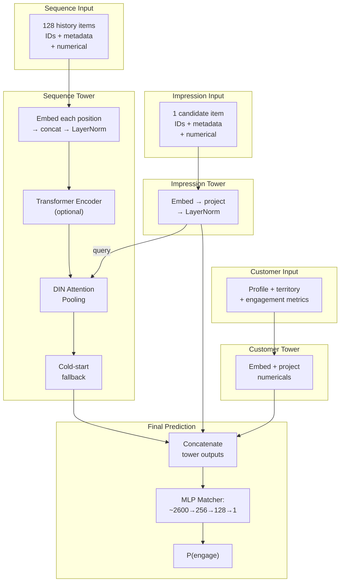

This is Part 5 of a series on deep learning for ranking models. [Part 1 (the overview)](/posts/ranking-models-overview) presents the full pipeline and taxonomy. Parts 2a and 2b covered [encoding individual features](/posts/ranking-models-input-representation-part1) and [sequences/assembly](/posts/ranking-models-input-representation-part2). [Part 3](/posts/ranking-models-feature-interaction) covered feature interaction. [Part 4](/posts/ranking-models-prediction-training) walked through the ad prediction system. This post walks through the other production system: a video recommendation model that invests its complexity in attention over rich behavioral sequences.

---

## The Full Architecture



Where the ad prediction system distributes complexity across DCN, multi-task towers, two-stage decomposition, and ShortCode serving, this system makes a different bet: invest heavily in a single, rich attention mechanism over user history, and keep everything else simple. One task, one MLP, no explicit feature crossing. The attention mechanism carries the load.

---

## 1. Three-Tower Architecture: Late Fusion by Design

The model processes three distinct feature groups in separate towers before combining them:

```python
def forward(self, ...):
    seq_emb = self._process_sequence_emb(...)      # Sequence tower
    impression_repr = self._process_impression_emb(...)  # Impression tower
    customer_repr = self._process_customer(...)     # Customer tower

    # Optional: Transformer enrichment
    if self.use_transformer:
        seq_emb = self.positional_encoding(seq_emb)
        seq_encoded = self.transformer_encoder(seq_emb, src_key_padding_mask=...)
    else:
        seq_encoded = seq_emb

    # DIN: candidate queries the history
    seq_repr, attn, _scores = self.din_attention(seq_encoded, impression_repr, mask)

    # Late fusion: concatenate all tower outputs
    final_input = torch.cat([seq_repr, impression_repr, customer_repr], dim=-1)
    return self.mlp_matcher(final_input).squeeze(-1)
```

### Why three towers instead of concatenating everything?

The feature groups require fundamentally different processing:

- **Sequence tower** (~800-1200 dims output): handles 128 variable-length history items with per-position embedding, optional Transformer self-attention, and DIN cross-attention. This is where 80% of the model's computation lives.
- **Impression tower** (~600 dims output): encodes the single candidate item. Must produce a vector in the same space as sequence positions so it can serve as the DIN query.
- **Customer tower** (~800 dims output): encodes static profile features (territory, account age, engagement metrics). No sequence processing needed.

The late-fusion design enables DIN attention to operate while the candidate and history are still separate tensors. DIN needs to know "this is the query" and "these are the keys." If everything were concatenated into a flat vector first (like the ad system does), this structured operation would be impossible.

---

## 2. Rich Sequence Representation

Each of the 128 history positions carries ~52 features:

| Feature Group | Examples | Encoding |
|---------------|----------|----------|
| Title ID | The specific title watched | Embedding (up to 256 dims) |
| Title metadata | Genre, content type, maturity rating | Categorical embeddings |
| Contextual | Day of week, hour, device at watch time | Categorical embeddings |
| Numerical | Watch duration, completion %, days since watch | Grouped MLP projection |
| Cross features | User × title interaction counts | Log-normalized numericals |

All features for one position are embedded independently, concatenated, and passed through LayerNorm to produce a single per-position vector. The sequence tower's output is a tensor of shape `[batch, 128, seq_embedding_dim]`.

This is far richer than the ad system's sequence handling (which uses binary set membership and mean pooling). Each history position is not just "which title" but "which title, watched on what device, for how long, how many days ago, during what time of day." The attention mechanism can use all of this when deciding relevance.

### Optional Transformer enrichment

Before DIN attention pools the sequence, an optional Transformer encoder applies self-attention across the 128 positions:

```python
self.transformer_encoder = nn.TransformerEncoder(
    nn.TransformerEncoderLayer(
        d_model=self.sequence_embedding_dim,
        nhead=nhead,
        dim_feedforward=transformer_hidden_dim,
        dropout=dropout,
        batch_first=True,
    ),
    num_layers=num_transformer_layers,
)
```

Self-attention lets each position incorporate context from other positions. A crime thriller watched right after three other crime thrillers carries different signal than the same title watched in isolation between comedies. The Transformer captures these inter-item relationships before DIN attention decides which positions are relevant to the current candidate.

---

## 3. DIN Attention: The Core Mechanism

The candidate item queries the enriched sequence to produce a user representation that is personalized to what's being scored right now:

```python
self.din_attention = AttentionPooling(
    in_dim=self.sequence_embedding_dim,
    hidden_dims=[64, 32],
    dropout=dropout,
    attn_unit="mlp",
    fallback="learned",
    temperature=1.0,
)
```

For each history position, the attention module computes a relevance score by examining multiple views of the history-candidate relationship (the item itself, the candidate itself, their element-wise product, their difference, their absolute difference). Softmax converts scores to weights, and the weighted sum of history positions becomes the sequence representation.

The result: when scoring a crime thriller, the user representation emphasizes past thriller-watching. When scoring a cooking show for the same user, the representation shifts to emphasize cooking content. This per-candidate personalization is the system's primary mechanism for feature interaction, replacing the static polynomial crosses (DCN) that the ad system uses.

### Cold-start handling

For users with no viewing history, the attention mechanism would produce NaN (softmax over an empty sequence). The system handles this in its forward pass with three steps:

1. **Safe softmax** fills padded positions with $-\infty$ and catches all-padding rows
2. **Empty detection** checks which samples have any valid history
3. **Learned fallback** substitutes a trainable vector for empty-history users

The fallback vector trains alongside the model. During training, cold users' samples backpropagate through this vector, teaching it to be a reasonable "generic user" default. At inference, the same trained vector serves users with no history.

---

## 4. Single-Task Output: MLP Matcher

After the three tower outputs are concatenated (~2600 dimensions), a single MLP compresses and predicts:

```python
self.mlp_matcher = MLP(
    input_dim=self.mlp_input_dim,   # ~2600
    output_dim=1,
    hidden_dims=[256, 128],
    activation="leaky_relu",
)
```

The MLP takes 2600 dimensions → 256 → 128 → 1. There is no separate "representation learning" stage and no shared bottleneck, because there is only one task. Compression and prediction happen in a single pass.

The output is a single engagement probability per candidate item. The simplicity is deliberate: with one task, there's no need for multi-task balancing, no competing gradients, no tower-specific architectures. The model's capacity is concentrated in the attention mechanism rather than the output structure.

---

## 5. Training Regime

| Setting | Value |
|---------|-------|
| Optimizer | Adam |
| Weight decay | No |
| LR schedule | OneCycleLR (cosine) |
| Batch size | 1,024 |
| Epochs | 1 (incremental) |
| Gradient clipping | Yes |
| Loss | Binary cross-entropy |

### Small batch size

The batch size (1,024) is 64x smaller than the ad system's (65,536). This is driven by memory: each sample carries 128 history positions with ~52 features per position. A single sample's sequence tensor is orders of magnitude larger than an ad system sample. The GPU runs out of memory long before reaching large batch sizes.

### Incremental training

Instead of training for 10 epochs on static data, the system trains for 1 epoch on the latest day's data, starting from the previous day's checkpoint. This keeps the model fresh with evolving user preferences and new content. A title that trended yesterday immediately influences today's predictions.

The tradeoff: the model never revisits old examples. It might forget patterns from 2 weeks ago if they don't appear in recent data. In practice, this is acceptable because video engagement patterns shift quickly (trending content, seasonal effects, new releases), and the model needs to track these shifts more than it needs to memorize historical patterns.

### Expandable vocabularies

Incremental training enables a specific capability: new titles (released today) get embedding rows added to the model without retraining from scratch. The checkpoint loads, new rows are initialized, and one epoch of fresh data starts training them. Within one training cycle, a new title has a functional (if imperfect) embedding.

---

## 6. Evaluation: Why Ranking Matters

The video recommendation system evaluates with **AUC-ROC**, **AUC-PR**, and **NDCG** as guardrail metrics:

```yaml
metric_evaluators:
  - name: AUC
    role: guardrail
    thresholds:
      AUC_ROC: 0.4
      AUC_PR: 0.01
  - name: NDCG
    role: guardrail
    thresholds:
      NDCG: 0.0
  - name: brier_score
    role: informational
    extra_args:
      agg_dimensions: ["OFFER_TYPE", "CONTENT_TYPE"]
```

The choice of metrics reflects a different business context from the ad system. Video recommendation needs to *rank* candidates correctly (is title A better than title B for this user?), not produce calibrated probabilities. There's no monetary auction where P(engage) = 0.3 needs to literally mean 30% of users engage. The system only needs to sort candidates by relevance.

**AUC-ROC** measures whether the model separates positive (engaged) from negative (didn't engage) samples. A threshold of 0.4 is a guardrail, not a target. Below that, something is fundamentally broken.

**NDCG** (Normalized Discounted Cumulative Gain) measures ranking quality with position-weighted scoring: getting the top-ranked items right matters more than correctly ordering items at position 50.

**Brier score** (informational, not a guardrail) measures calibration quality, sliced by content type and offer type. It's tracked for monitoring but doesn't block deployment. The system cares about calibration for analytics and debugging, but it doesn't gate model launches on it.

The guardrail pattern is notable: if AUC or NDCG fall below threshold, the automated pipeline blocks the model from reaching production. This is critical for incremental training, where a bad data day could produce a degraded checkpoint. The guardrails catch this automatically.

---

## 7. Serving: Freshness Over Throughput

The video system faces a different serving challenge than the ad system. It has fewer candidates per request and more latency budget, but needs to stay fresh with rapidly changing content and user preferences.

**Incremental checkpoint loading** is the primary serving optimization. Rather than pre-computing and caching features (like ShortCodes), the system deploys a new model checkpoint daily. Each checkpoint incorporates the latest viewing data, so new content and shifting preferences are reflected within 24 hours.

**No caching opportunity.** Unlike the ad system where user features are reusable across candidates, DIN attention produces a *different* user representation for every candidate. The attention output for "should we recommend title A?" is fundamentally different from "should we recommend title B?" because the weights over history change. This means the expensive computation (attention over 128 items) must run for every candidate, with no shortcut.

**Expandable vocabularies** at checkpoint load allow new titles to enter the model without retraining from scratch. The embedding table grows, new rows are initialized, and one epoch of fresh data begins training them. This is critical for a content catalog where new titles release daily.

**Standard PyTorch inference** (no ONNX export). The model runs on GPU-backed endpoints with PyTorch directly. The relative simplicity of the output path (one MLP, no multi-tower fan-out) means framework-level optimization provides less marginal benefit than it does for the ad system's complex graph.

---

## Design Philosophy: Where Complexity Lives

The two production systems in this series make opposite bets:

| Dimension | Ad Prediction (Part 4) | Video Recommendation (this post) |
|-----------|----------------------|--------------------------------|
| Complexity concentrated in | Output side (multi-task, two-stage, loss balancing) | Input side (rich attention over sequences) |
| Feature interaction | DCN V2 (static polynomial, same for all users) | DIN attention (dynamic, per-candidate) |
| What enables personalization | Many task-specific towers each learning different signals | One attention mechanism dynamically reweighting history |
| Sequence representation | Binary membership + mean pooling | 128 items × 52 features, full attention |
| Output | 10 probabilities | 1 probability |
| Serving optimization | ShortCode pre-computation | Incremental checkpoint loading |
| Training | 10 epochs, static data, large batch | 1 epoch, daily refresh, small batch |

This isn't arbitrary. The video system can afford to invest in attention because it has fewer candidates per request and more latency budget. The ad system must score thousands of ads per request in milliseconds, so it pre-computes and uses cheaper interaction patterns.

---

## 7. Improvement Areas

The system's architecture is well-suited to its current constraints, but several proven directions could extend it further:

### Tier 1: High-confidence, high-impact

**Multi-task output.** The single P(engage) conflates very different outcomes: a user who skips after 10 seconds looks the same as one who watches the full title. Separating into multiple predictions (P(click), P(complete), P(re-watch), P(skip)) would let the serving layer tune the ranking policy in real-time without retraining. Every major video platform (YouTube, TikTok, Kuaishou) has shipped this. The investment is large (label pipeline, tower design, weight tuning) but unlocks a capability the system currently lacks.

**Longer history via two-stage retrieval ([SIM](https://arxiv.org/abs/2006.05639)).** The 128-item cap discards 75%+ of an active user's viewing history. Seasonal interests (holiday movies from 6 months ago) and dormant interests (a sci-fi fan who hasn't watched sci-fi recently) are invisible. SIM solves this by first retrieving the top-K relevant items from a 10K+ history pool using a cheap index (category match or embedding similarity), then applying expensive DIN attention only to the retrieved subset. Industry reports consistently show +3-5% engagement metrics from this extension.

### Tier 2: Quick wins

**DCN V2 post-concatenation.** After the three towers concatenate into ~2600 dims, the MLP matcher must discover cross-tower interactions (e.g., "sequence interest diversity × customer tenure") purely implicitly. Adding 2-3 DCN V2 cross layers between concatenation and MLP is ~50 lines of code, requires no pipeline changes, and reliably produces +0.1-0.3% AUC lift across settings. Lowest-risk experiment on this list.

**Time-delta positional encoding.** The optional Transformer encoder uses standard sinusoidal positional encoding, which treats "position 5" the same whether it represents "5 days ago" or "3 months ago." Replacing this with real time-delta-based positions (e.g., log-scaled time since each view) lets the attention mechanism natively understand recency without relying on contextual timestamp features to carry that signal separately.

### Tier 3: Conditional on diagnosis

**Position debiasing.** If items shown in position 1 on the UI get significantly higher engagement regardless of relevance, the model is partially learning "where was this shown" rather than "how relevant is this match." Diagnosing this requires a randomized position experiment on a small traffic slice. If position strongly influences labels, propensity-weighted training or position-aware learning would close the offline-online metric gap.

**Multi-interest extraction ([MIND](https://arxiv.org/abs/1904.08030)).** DIN collapses a diverse 128-item history into one vector per candidate. For users with sharply distinct taste clusters (crime thrillers AND cooking shows AND documentaries), the attention averages across clusters rather than cleanly selecting one. MIND extracts K interest vectors via capsule routing and matches the candidate against the most relevant one. Impact depends on how diverse user tastes actually are in the catalog.

**Interest evolution ([DIEN](https://arxiv.org/abs/1809.03672)).** DIN treats history positions without modeling temporal dynamics. It cannot distinguish "user was into horror but shifted to comedy this week" from "user likes both equally." DIEN adds a GRU layer that models interest state transitions. Impact depends on whether users exhibit strong, rapid interest shifts, or if incremental daily training already handles drift.

### Recommended execution order

1. **DCN V2 post-concat** (1-2 weeks). Validate the easy win, build confidence.
2. **Multi-task** (2-3 months). The strategic capability investment.
3. **SIM longer history** (1-2 months). The biggest single metric mover.
4. Diagnose position bias → decide on debiasing.

The first gives a quick signal with minimal risk. The second unlocks policy flexibility the system currently lacks. The third is the most reliably impactful architectural change for attention-based models.
